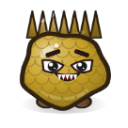

# 成就（804 项）

**中文** · [English](en/ACHIEVEMENTS.md)

[README](../README.md) · [角色](CHARACTERS.md) · [技能](SKILLS.md) · [武器](WEAPONS.md) · [道具](ITEMS.md) · [怪物](MONSTERS.md) · [关卡](CHAPTERS.md) · **成就** · [设计文档](GDD.md) · [数值表](DATA_TABLES.md) · [更新日志](CHANGELOG.md)

> 由 `npm run docs` 从 `src/data/*.ts` 自动生成，请勿手改。

成就分为多个等级（🥉 铜 → 🥈 银 → 🥇 金 → 💎 钻石，单级成就直接为金牌），每达成一级获得成就点，全部成就点共 28007 点。

成就点用于在选角界面购买[角色](CHARACTERS.md)；部分角色需要先达成指定成就才能购买。解锁时屏幕顶部会弹出提示，主菜单「成就」可查看全部进度。

## 目录

- [角色价格](#prices)
- [战斗](#cat-combat)
- [怪物](#cat-monster)
- [进度](#cat-progress)
- [章节](#cat-chapter)
- [挑战](#cat-challenge)
- [构筑](#cat-build)
- [武器](#cat-arsenal)
- [收藏](#cat-collection)
- [技能](#cat-skill)
- [经济](#cat-economy)
- [图鉴](#cat-codex)
- [Boss](#cat-slayer)
- [角色](#cat-character)

## 角色价格

| 角色 | 解锁方式 |
| --- | --- |
|  [番茄妹](CHARACTERS.md#char-tomato) | 默认解锁 |
|  [胡萝卜骑士](CHARACTERS.md#char-carrot) | 默认解锁 |
|  [辣椒姐](CHARACTERS.md#char-chili) | 默认解锁 |
|  [玉米枪手](CHARACTERS.md#char-corn) | 默认解锁 |
|  [蘑菇巫医](CHARACTERS.md#char-mushroom) | 320 成就点 |
|  [西瓜胖墩](CHARACTERS.md#char-watermelon) | 365 成就点 |
|  [柠檬刺客](CHARACTERS.md#char-lemon) | 365 成就点 |
|  [茄子法师](CHARACTERS.md#char-eggplant) | 365 成就点 |
|  [菠萝船长](CHARACTERS.md#char-pineapple) | 365 成就点 |
|  [椰子拳师](CHARACTERS.md#char-coconut) | 365 成就点 |
|  [樱桃双枪](CHARACTERS.md#char-cherry) | 365 成就点 |
|  [红薯厨神](CHARACTERS.md#char-sweetpotato) | 365 成就点 |
|  [葡萄魔术师](CHARACTERS.md#char-grape) | 640 成就点 |
|  [豌豆士兵](CHARACTERS.md#char-pea) | 640 成就点 |
|  [猕猴桃侦探](CHARACTERS.md#char-kiwi) | 640 成就点 |
|  [大蒜伯爵](CHARACTERS.md#char-garlic) | 780 成就点 |
|  [蓝莓双子](CHARACTERS.md#char-blueberry) | 780 成就点 |
|  [草莓偶像](CHARACTERS.md#char-strawberry) | 780 成就点 |
|  [蜜桃天使](CHARACTERS.md#char-peach) | 780 成就点 |
|  [甜菜狂战士](CHARACTERS.md#char-beet) | 780 成就点 |
|  [芦笋弓手](CHARACTERS.md#char-asparagus) | 780 成就点 |
|  [豆芽学徒](CHARACTERS.md#char-sprout) | 780 成就点 |
|  [南瓜幽灵](CHARACTERS.md#char-pumpkin) | 805 成就点，需先达成 [菜园守护者](#ach-clear_2) |
|  [生姜忍者](CHARACTERS.md#char-ginger) | 805 成就点，需先达成 [番茄酱风暴（银）](#ach-kills) |
|  [火龙果龙骑](CHARACTERS.md#char-dragonfruit) | 805 成就点，需先达成 [菜园守护者](#ach-clear_2) |
|  [荔枝公主](CHARACTERS.md#char-lychee) | 805 成就点，需先达成 [菜园守护者](#ach-clear_2) |
|  [苦瓜冰法](CHARACTERS.md#char-bittermelon) | 805 成就点，需先达成 [菜园守护者](#ach-clear_2) |
|  [牛油果博士](CHARACTERS.md#char-avocado) | 870 成就点，需先达成 [破冰者](#ach-clear_3) |
|  [榴莲霸王](CHARACTERS.md#char-durian) | 870 成就点，需先达成 [破冰者](#ach-clear_3) |
|  [青椒机甲](CHARACTERS.md#char-bellpepper) | 870 成就点，需先达成 [破冰者](#ach-clear_3) |
|  [冬瓜和尚](CHARACTERS.md#char-wintermelon) | 870 成就点，需先达成 [Boss 终结者（铜）](#ach-bosses) |
|  [洋葱大叔](CHARACTERS.md#char-onion) | 915 成就点，需先达成 [垃圾场之王](#ach-clear_4) |
|  [山葵爆破手](CHARACTERS.md#char-wasabi) | 915 成就点，需先达成 [垃圾场之王](#ach-clear_4) |

## 战斗

| 成就 | 条件 | 等级目标与奖励 |
| --- | --- | --- |
| 🔪 番茄酱风暴 | 累计击败 N 只怪物 | 🥉 100（+2 点） 🥈 1,000（+6 点） 🥇 10,000（+20 点） 💎 50,000（+60 点） |
| 🌪️ 割草机 | 单局击败 N 只怪物 | 🥉 300（+3 点） 🥈 800（+10 点） 🥇 1,500（+30 点） |
| 🛡️ 毫发无伤 | 累计 N 次无伤完成波次 | 🥉 1（+2 点） 🥈 10（+8 点） 🥇 50（+25 点） 💎 200（+60 点） |
| 🔥 凤凰涅槃 | 在战斗中复活 1 次 | 🥇 1（+5 点） |
| 💥 会心一击 | 累计造成 N 次暴击 | 🥉 100（+1 点） 🥈 5,000（+5 点） 🥇 100,000（+20 点） |
| 🔨 一击必杀 | 单次造成 N 点伤害 | 🥉 500（+2 点） 🥈 5,000（+8 点） 🥇 50,000（+25 点） 💎 500,000（+60 点） |
| ✨ 精英怪克星 | 累计击败 N 只词缀精英怪 | 🥉 1（+1 点） 🥈 50（+5 点） 🥇 500（+20 点） |
| 🌊 波涛不息 | 累计完成 N 个波次 | 🥉 10（+2 点） 🥈 100（+10 点） 🥇 1,000（+40 点） |
| 🌟 大招成瘾 | 累计释放 N 次技能 | 🥉 1（+1 点） 🥈 100（+4 点） 🥇 1,000（+15 点） |
| 🍎 水果补给 | 累计吃到 N 个果实 | 🥉 1（+1 点） 🥈 50（+4 点） 🥇 500（+15 点） |

## 怪物

| 成就 | 条件 | 等级目标与奖励 |
| --- | --- | --- |
| 👾 霉菌团克星 | 击败 N 只霉菌团 | 🥉 10（+1 点） 🥈 100（+3 点） 🥇 1,000（+10 点） |
| 👾 果蝇克星 | 击败 N 只果蝇 | 🥉 10（+1 点） 🥈 100（+3 点） 🥇 1,000（+10 点） |
| 👾 蛆虫克星 | 击败 N 只蛆虫 | 🥉 10（+1 点） 🥈 100（+3 点） 🥇 1,000（+10 点） |
| 👾 烂苹果克星 | 击败 N 只烂苹果 | 🥉 10（+1 点） 🥈 100（+3 点） 🥇 1,000（+10 点） |
| 👾 蟑螂克星 | 击败 N 只蟑螂 | 🥉 10（+1 点） 🥈 100（+3 点） 🥇 1,000（+10 点） |
| 👾 行军蚁克星 | 击败 N 只行军蚁 | 🥉 10（+1 点） 🥈 100（+3 点） 🥇 1,000（+10 点） |
| 👾 炸弹甲虫克星 | 击败 N 只炸弹甲虫 | 🥉 10（+1 点） 🥈 100（+3 点） 🥇 1,000（+10 点） |
| 👾 鼻涕蜗牛克星 | 击败 N 只鼻涕蜗牛 | 🥉 10（+1 点） 🥈 100（+3 点） 🥇 1,000（+10 点） |
| 👾 毒蜘蛛克星 | 击败 N 只毒蜘蛛 | 🥉 10（+1 点） 🥈 100（+3 点） 🥇 1,000（+10 点） |
| 👾 分裂霉菌克星 | 击败 N 只分裂霉菌 | 🥉 10（+1 点） 🥈 100（+3 点） 🥇 1,000（+10 点） |
| 👾 毒蘑菇克星 | 击败 N 只毒蘑菇 | 🥉 10（+1 点） 🥈 100（+3 点） 🥇 1,000（+10 点） |
| 👾 虫母克星 | 击败 N 只虫母 | 🥉 10（+1 点） 🥈 100（+3 点） 🥇 1,000（+10 点） |
| 👾 下水道老鼠克星 | 击败 N 只下水道老鼠 | 🥉 10（+1 点） 🥈 100（+3 点） 🥇 1,000（+10 点） |
| 👾 冰块怪克星 | 击败 N 只冰块怪 | 🥉 10（+1 点） 🥈 100（+3 点） 🥇 1,000（+10 点） |
| 👾 垃圾袋怪克星 | 击败 N 只垃圾袋怪 | 🥉 10（+1 点） 🥈 100（+3 点） 🥇 1,000（+10 点） |
| 👾 罐头机器人克星 | 击败 N 只罐头机器人 | 🥉 10（+1 点） 🥈 100（+3 点） 🥇 1,000（+10 点） |
| 👾 毒蜂克星 | 击败 N 只毒蜂 | 🥉 10（+1 点） 🥈 100（+3 点） 🥇 1,000（+10 点） |
| 👾 泥蚯蚓克星 | 击败 N 只泥蚯蚓 | 🥉 10（+1 点） 🥈 100（+3 点） 🥇 1,000（+10 点） |
| 👾 冰蚊克星 | 击败 N 只冰蚊 | 🥉 10（+1 点） 🥈 100（+3 点） 🥇 1,000（+10 点） |
| 👾 冻虾兵克星 | 击败 N 只冻虾兵 | 🥉 10（+1 点） 🥈 100（+3 点） 🥇 1,000（+10 点） |
| 👾 易拉罐蟹克星 | 击败 N 只易拉罐蟹 | 🥉 10（+1 点） 🥈 100（+3 点） 🥇 1,000（+10 点） |
| 👾 抹布幽灵克星 | 击败 N 只抹布幽灵 | 🥉 10（+1 点） 🥈 100（+3 点） 🥇 1,000（+10 点） |
| 👾 油污怪克星 | 击败 N 只油污怪 | 🥉 10（+1 点） 🥈 100（+3 点） 🥇 1,000（+10 点） |
| 👾 齿轮虫克星 | 击败 N 只齿轮虫 | 🥉 10（+1 点） 🥈 100（+3 点） 🥇 1,000（+10 点） |
| 👾 诅咒娃娃克星 | 击败 N 只诅咒娃娃 | 🥉 10（+1 点） 🥈 100（+3 点） 🥇 1,000（+10 点） |
| 👾 焦吐司克星 | 击败 N 只焦吐司 | 🥉 10（+1 点） 🥈 100（+3 点） 🥇 1,000（+10 点） |
| 👾 油滴精克星 | 击败 N 只油滴精 | 🥉 10（+1 点） 🥈 100（+3 点） 🥇 1,000（+10 点） |
| 👾 灰尘团克星 | 击败 N 只灰尘团 | 🥉 10（+1 点） 🥈 100（+3 点） 🥇 1,000（+10 点） |
| 👾 酸奶盒克星 | 击败 N 只酸奶盒 | 🥉 10（+1 点） 🥈 100（+3 点） 🥇 1,000（+10 点） |
| 👾 面包屑螨克星 | 击败 N 只面包屑螨 | 🥉 10（+1 点） 🥈 100（+3 点） 🥇 1,000（+10 点） |
| 👾 发霉面包克星 | 击败 N 只发霉面包 | 🥉 10（+1 点） 🥈 100（+3 点） 🥇 1,000（+10 点） |
| 👾 臭鸡蛋克星 | 击败 N 只臭鸡蛋 | 🥉 10（+1 点） 🥈 100（+3 点） 🥇 1,000（+10 点） |
| 👾 洗碗海绵克星 | 击败 N 只洗碗海绵 | 🥉 10（+1 点） 🥈 100（+3 点） 🥇 1,000（+10 点） |
| 👾 茶包幽灵克星 | 击败 N 只茶包幽灵 | 🥉 10（+1 点） 🥈 100（+3 点） 🥇 1,000（+10 点） |
| 👾 锅底甲虫克星 | 击败 N 只锅底甲虫 | 🥉 10（+1 点） 🥈 100（+3 点） 🥇 1,000（+10 点） |
| 👾 蚜虫克星 | 击败 N 只蚜虫 | 🥉 10（+1 点） 🥈 100（+3 点） 🥇 1,000（+10 点） |
| 👾 菜园蛞蝓克星 | 击败 N 只菜园蛞蝓 | 🥉 10（+1 点） 🥈 100（+3 点） 🥇 1,000（+10 点） |
| 👾 象鼻虫克星 | 击败 N 只象鼻虫 | 🥉 10（+1 点） 🥈 100（+3 点） 🥇 1,000（+10 点） |
| 👾 荆棘杂草克星 | 击败 N 只荆棘杂草 | 🥉 10（+1 点） 🥈 100（+3 点） 🥇 1,000（+10 点） |
| 👾 菜青虫克星 | 击败 N 只菜青虫 | 🥉 10（+1 点） 🥈 100（+3 点） 🥇 1,000（+10 点） |
| 👾 爆爆瓢虫克星 | 击败 N 只爆爆瓢虫 | 🥉 10（+1 点） 🥈 100（+3 点） 🥇 1,000（+10 点） |
| 👾 烂土豆克星 | 击败 N 只烂土豆 | 🥉 10（+1 点） 🥈 100（+3 点） 🥇 1,000（+10 点） |
| 👾 飞蝗克星 | 击败 N 只飞蝗 | 🥉 10（+1 点） 🥈 100（+3 点） 🥇 1,000（+10 点） |
| 👾 刀螳螂克星 | 击败 N 只刀螳螂 | 🥉 10（+1 点） 🥈 100（+3 点） 🥇 1,000（+10 点） |
| 👾 毒花苞克星 | 击败 N 只毒花苞 | 🥉 10（+1 点） 🥈 100（+3 点） 🥇 1,000（+10 点） |
| 👾 霜螨克星 | 击败 N 只霜螨 | 🥉 10（+1 点） 🥈 100（+3 点） 🥇 1,000（+10 点） |
| 👾 冻伤肉块克星 | 击败 N 只冻伤肉块 | 🥉 10（+1 点） 🥈 100（+3 点） 🥇 1,000（+10 点） |
| 👾 冰史莱姆克星 | 击败 N 只冰史莱姆 | 🥉 10（+1 点） 🥈 100（+3 点） 🥇 1,000（+10 点） |
| 👾 霉奶酪克星 | 击败 N 只霉奶酪 | 🥉 10（+1 点） 🥈 100（+3 点） 🥇 1,000（+10 点） |
| 👾 冰棍蝙蝠克星 | 击败 N 只冰棍蝙蝠 | 🥉 10（+1 点） 🥈 100（+3 点） 🥇 1,000（+10 点） |
| 👾 冻豌豆克星 | 击败 N 只冻豌豆 | 🥉 10（+1 点） 🥈 100（+3 点） 🥇 1,000（+10 点） |
| 👾 剩饭盒克星 | 击败 N 只剩饭盒 | 🥉 10（+1 点） 🥈 100（+3 点） 🥇 1,000（+10 点） |
| 👾 果冻方块克星 | 击败 N 只果冻方块 | 🥉 10（+1 点） 🥈 100（+3 点） 🥇 1,000（+10 点） |
| 👾 冰锥小鬼克星 | 击败 N 只冰锥小鬼 | 🥉 10（+1 点） 🥈 100（+3 点） 🥇 1,000（+10 点） |
| 👾 冻爆汽水克星 | 击败 N 只冻爆汽水 | 🥉 10（+1 点） 🥈 100（+3 点） 🥇 1,000（+10 点） |
| 👾 锈铁蟹克星 | 击败 N 只锈铁蟹 | 🥉 10（+1 点） 🥈 100（+3 点） 🥇 1,000（+10 点） |
| 👾 油膜怪克星 | 击败 N 只油膜怪 | 🥉 10（+1 点） 🥈 100（+3 点） 🥇 1,000（+10 点） |
| 👾 塑料袋幽灵克星 | 击败 N 只塑料袋幽灵 | 🥉 10（+1 点） 🥈 100（+3 点） 🥇 1,000（+10 点） |
| 👾 漏电电池克星 | 击败 N 只漏电电池 | 🥉 10（+1 点） 🥈 100（+3 点） 🥇 1,000（+10 点） |
| 👾 滚轮胎克星 | 击败 N 只滚轮胎 | 🥉 10（+1 点） 🥈 100（+3 点） 🥇 1,000（+10 点） |
| 👾 废铁无人机克星 | 击败 N 只废铁无人机 | 🥉 10（+1 点） 🥈 100（+3 点） 🥇 1,000（+10 点） |
| 👾 碎玻璃怪克星 | 击败 N 只碎玻璃怪 | 🥉 10（+1 点） 🥈 100（+3 点） 🥇 1,000（+10 点） |
| 👾 锈钉虫克星 | 击败 N 只锈钉虫 | 🥉 10（+1 点） 🥈 100（+3 点） 🥇 1,000（+10 点） |
| 👾 垃圾堆克星 | 击败 N 只垃圾堆 | 🥉 10（+1 点） 🥈 100（+3 点） 🥇 1,000（+10 点） |
| 👾 破收音机克星 | 击败 N 只破收音机 | 🥉 10（+1 点） 🥈 100（+3 点） 🥇 1,000（+10 点） |
| 👾 传送带小妖克星 | 击败 N 只传送带小妖 | 🥉 10（+1 点） 🥈 100（+3 点） 🥇 1,000（+10 点） |
| 👾 酱汁滴克星 | 击败 N 只酱汁滴 | 🥉 10（+1 点） 🥈 100（+3 点） 🥇 1,000（+10 点） |
| 👾 瓶盖无人机克星 | 击败 N 只瓶盖无人机 | 🥉 10（+1 点） 🥈 100（+3 点） 🥇 1,000（+10 点） |
| 👾 番茄酱史莱姆克星 | 击败 N 只番茄酱史莱姆 | 🥉 10（+1 点） 🥈 100（+3 点） 🥇 1,000（+10 点） |
| 👾 蒸汽小鬼克星 | 击败 N 只蒸汽小鬼 | 🥉 10（+1 点） 🥈 100（+3 点） 🥇 1,000（+10 点） |
| 👾 铆钉机器人克星 | 击败 N 只铆钉机器人 | 🥉 10（+1 点） 🥈 100（+3 点） 🥇 1,000（+10 点） |
| 👾 标签幽灵克星 | 击败 N 只标签幽灵 | 🥉 10（+1 点） 🥈 100（+3 点） 🥇 1,000（+10 点） |
| 👾 灌装机器人克星 | 击败 N 只灌装机器人 | 🥉 10（+1 点） 🥈 100（+3 点） 🥇 1,000（+10 点） |
| 👾 焊枪虫克星 | 击败 N 只焊枪虫 | 🥉 10（+1 点） 🥈 100（+3 点） 🥇 1,000（+10 点） |
| 👾 冲压活塞克星 | 击败 N 只冲压活塞 | 🥉 10（+1 点） 🥈 100（+3 点） 🥇 1,000（+10 点） |
| 🐇 菜园兔子克星 | 击败 N 只菜园兔子 | 🥉 10（+1 点） 🥈 100（+3 点） 🥇 1,000（+10 点） |
| 🐇 土拨鼠克星 | 击败 N 只土拨鼠 | 🥉 10（+1 点） 🥈 100（+3 点） 🥇 1,000（+10 点） |
| ✨ 迅捷终结者 | 击败 N 只带【迅捷】词缀的精英怪 | 🥉 1（+2 点） 🥈 25（+6 点） 🥇 200（+20 点） |
| ✨ 坚甲终结者 | 击败 N 只带【坚甲】词缀的精英怪 | 🥉 1（+2 点） 🥈 25（+6 点） 🥇 200（+20 点） |
| ✨ 狂暴终结者 | 击败 N 只带【狂暴】词缀的精英怪 | 🥉 1（+2 点） 🥈 25（+6 点） 🥇 200（+20 点） |
| ✨ 再生终结者 | 击败 N 只带【再生】词缀的精英怪 | 🥉 1（+2 点） 🥈 25（+6 点） 🥇 200（+20 点） |
| ✨ 冰霜终结者 | 击败 N 只带【冰霜】词缀的精英怪 | 🥉 1（+2 点） 🥈 25（+6 点） 🥇 200（+20 点） |
| ✨ 剧毒终结者 | 击败 N 只带【剧毒】词缀的精英怪 | 🥉 1（+2 点） 🥈 25（+6 点） 🥇 200（+20 点） |
| ✨ 诅咒终结者 | 击败 N 只带【诅咒】词缀的精英怪 | 🥉 1（+2 点） 🥈 25（+6 点） 🥇 200（+20 点） |
| ✨ 护盾终结者 | 击败 N 只带【护盾】词缀的精英怪 | 🥉 1（+2 点） 🥈 25（+6 点） 🥇 200（+20 点） |
| ✨ 爆裂终结者 | 击败 N 只带【爆裂】词缀的精英怪 | 🥉 1（+2 点） 🥈 25（+6 点） 🥇 200（+20 点） |
| ✨ 吸血终结者 | 击败 N 只带【吸血】词缀的精英怪 | 🥉 1（+2 点） 🥈 25（+6 点） 🥇 200（+20 点） |
| ✨ 荆棘终结者 | 击败 N 只带【荆棘】词缀的精英怪 | 🥉 1（+2 点） 🥈 25（+6 点） 🥇 200（+20 点） |
| ✨ 统帅终结者 | 击败 N 只带【统帅】词缀的精英怪 | 🥉 1（+2 点） 🥈 25（+6 点） 🥇 200（+20 点） |

## 进度

| 成就 | 条件 | 等级目标与奖励 |
| --- | --- | --- |
| 🍳 厨房清扫 | 通关第一章 | 🥇 1（+15 点） |
| 🌱 菜园守护者 | 通关第二章 | 🥇 2（+30 点） |
| ❄️ 破冰者 | 通关第三章 | 🥇 3（+50 点） |
| 🗑️ 垃圾场之王 | 通关第四章 | 🥇 4（+80 点） |
| 🏭 腐烂终结 | 通关第五章，击败腐烂之源 | 🥇 5（+120 点） |
| 🎖️ 常胜将军 | 累计通关 N 次 | 🥉 1（+10 点） 🥈 10（+30 点） 🥇 30（+60 点） 💎 100（+150 点） |
| 🎭 多面手 | 用 N 名不同角色通关 | 🥉 3（+15 点） 🥈 10（+40 点） 🥇 33（+150 点） |
| 🔓 全员集结 | 拥有 N 名角色 | 🥉 8（+5 点） 🥈 20（+20 点） 🥇 33（+60 点） |
| 🪦 屡败屡战 | 累计阵亡 N 次 | 🥉 1（+1 点） 🥈 10（+3 点） 🥇 100（+10 点） |
| 🤕 出师未捷 | 在第 1 波阵亡 | 🥇 1（+2 点） |
| ⬆️ 步步高升 | 累计升级选择 N 次属性 | 🥉 10（+1 点） 🥈 200（+5 点） 🥇 2,000（+20 点） |
| 🎁 开箱达人 | 累计打开 N 个宝箱 | 🥉 1（+1 点） 🥈 50（+5 点） 🥇 300（+15 点） |

## 章节

| 成就 | 条件 | 等级目标与奖励 |
| --- | --- | --- |
| 🚩 第一章 · 深夜厨房探索者 | 在「第一章 · 深夜厨房」完成第 N 波 | 🥉 5（+1 点） 🥈 10（+3 点） |
| 💀 第一章 · 深夜厨房清道夫 | 在「第一章 · 深夜厨房」累计击败 N 只怪物 | 🥉 500（+1 点） 🥈 5,000（+5 点） 🥇 30,000（+20 点） |
| 🛡️ 第一章 · 深夜厨房无伤 | 在「第一章 · 深夜厨房」无伤完成 N 个波次 | 🥉 1（+2 点） 🥈 20（+8 点） 🥇 100（+25 点） |
| 🚩 第二章 · 荒芜菜园探索者 | 在「第二章 · 荒芜菜园」完成第 N 波 | 🥉 5（+2 点） 🥈 10（+6 点） |
| 💀 第二章 · 荒芜菜园清道夫 | 在「第二章 · 荒芜菜园」累计击败 N 只怪物 | 🥉 500（+1 点） 🥈 5,000（+5 点） 🥇 30,000（+20 点） |
| 🛡️ 第二章 · 荒芜菜园无伤 | 在「第二章 · 荒芜菜园」无伤完成 N 个波次 | 🥉 1（+3 点） 🥈 20（+11 点） 🥇 100（+33 点） |
| 🚩 第三章 · 冰封冰箱探索者 | 在「第三章 · 冰封冰箱」完成第 N 波 | 🥉 5（+3 点） 🥈 10（+9 点） |
| 💀 第三章 · 冰封冰箱清道夫 | 在「第三章 · 冰封冰箱」累计击败 N 只怪物 | 🥉 500（+1 点） 🥈 5,000（+5 点） 🥇 30,000（+20 点） |
| 🛡️ 第三章 · 冰封冰箱无伤 | 在「第三章 · 冰封冰箱」无伤完成 N 个波次 | 🥉 1（+4 点） 🥈 20（+14 点） 🥇 100（+41 点） |
| 🚩 第四章 · 城市垃圾场探索者 | 在「第四章 · 城市垃圾场」完成第 N 波 | 🥉 5（+4 点） 🥈 10（+12 点） |
| 💀 第四章 · 城市垃圾场清道夫 | 在「第四章 · 城市垃圾场」累计击败 N 只怪物 | 🥉 500（+1 点） 🥈 5,000（+5 点） 🥇 30,000（+20 点） |
| 🛡️ 第四章 · 城市垃圾场无伤 | 在「第四章 · 城市垃圾场」无伤完成 N 个波次 | 🥉 1（+5 点） 🥈 20（+17 点） 🥇 100（+49 点） |
| 🚩 第五章 · 番茄酱工厂探索者 | 在「第五章 · 番茄酱工厂」完成第 N 波 | 🥉 5（+5 点） 🥈 10（+15 点） |
| 💀 第五章 · 番茄酱工厂清道夫 | 在「第五章 · 番茄酱工厂」累计击败 N 只怪物 | 🥉 500（+1 点） 🥈 5,000（+5 点） 🥇 30,000（+20 点） |
| 🛡️ 第五章 · 番茄酱工厂无伤 | 在「第五章 · 番茄酱工厂」无伤完成 N 个波次 | 🥉 1（+6 点） 🥈 20（+20 点） 🥇 100（+57 点） |

## 挑战

| 成就 | 条件 | 等级目标与奖励 |
| --- | --- | --- |
| 🗡️ 孤胆英雄 | 只带 1 把武器通关 | 🥇 1（+60 点） |
| ❤️‍🩹 命悬一线 | 以不到 10% 的生命通关 | 🥇 1（+30 点） |
| 🥊 纯粹近战 | 只用近战武器（至少 4 把）通关 | 🥇 1（+25 点） |
| 🏹 纯粹远程 | 只用远程武器（至少 4 把）通关 | 🥇 1（+25 点） |
| 🔮 纯粹元素 | 只用元素武器（至少 4 把）通关 | 🥇 1（+25 点） |
| 👑 全副神兵 | 通关时持有 6 把 T4 武器 | 🥇 1（+120 点） |
| 🎒 满载而归 | 通关时持有 60 件道具 | 🥇 1（+40 点） |

## 构筑

| 成就 | 条件 | 等级目标与奖励 |
| --- | --- | --- |
| 📈 茁壮成长 | 单局达到 N 级 | 🥉 10（+2 点） 🥈 20（+8 点） 🥇 30（+40 点） |
| 🎒 收藏家 | 单局持有 N 件道具 | 🥉 15（+3 点） 🥈 30（+8 点） 🥇 50（+25 点） 💎 80（+60 点） |
| 🧰 武装到牙齿 | 单局持有 6 把武器 | 🥇 6（+3 点） |
| 💎 神兵利器 | 累计合成 N 把 T4 武器 | 🥉 1（+10 点） 🥈 5（+25 点） 🥇 20（+60 点） |
| 🔗 合二为一 | 累计合成武器 N 次 | 🥉 1（+1 点） 🥈 20（+5 点） 🥇 200（+20 点） |
| ⚒️ 铁匠学徒 | 累计打造武器 N 次 | 🥉 1（+2 点） 🥈 50（+10 点） 🥇 300（+30 点） |
| 💔 失败是成功之母 | 打造失败 N 次 | 🥉 1（+1 点） 🥈 20（+5 点） 🥇 100（+15 点） |
| 🔥 千锤百炼 | 把任意武器打造到 +N | 🥉 3（+5 点） 🥈 7（+20 点） 🥇 10（+60 点） |
| 🎲 词条赌徒 | 累计洗练词条 N 次 | 🥉 1（+1 点） 🥈 50（+5 点） 🥇 500（+20 点） |

## 武器

| 成就 | 条件 | 等级目标与奖励 |
| --- | --- | --- |
| 🗡️ 番茄叉收藏者 | 累计获得 N 次番茄叉 | 🥉 1（+1 点） 🥈 10（+3 点） 🥇 30（+8 点） |
| 💎 神兵·番茄叉 | 获得 N 把 T4 番茄叉 | 🥉 1（+10 点） 🥈 5（+30 点） |
| 🔨 番茄叉匠心 | 将番茄叉打造到 +N | 🥉 3（+5 点） 🥈 7（+15 点） 🥇 10（+40 点） |
| 🗡️ 擀面杖收藏者 | 累计获得 N 次擀面杖 | 🥉 1（+1 点） 🥈 10（+3 点） 🥇 30（+8 点） |
| 💎 神兵·擀面杖 | 获得 N 把 T4 擀面杖 | 🥉 1（+10 点） 🥈 5（+30 点） |
| 🔨 擀面杖匠心 | 将擀面杖打造到 +N | 🥉 3（+5 点） 🥈 7（+15 点） 🥇 10（+40 点） |
| 🗡️ 菜刀收藏者 | 累计获得 N 次菜刀 | 🥉 1（+1 点） 🥈 10（+3 点） 🥇 30（+8 点） |
| 💎 神兵·菜刀 | 获得 N 把 T4 菜刀 | 🥉 1（+10 点） 🥈 5（+30 点） |
| 🔨 菜刀匠心 | 将菜刀打造到 +N | 🥉 3（+5 点） 🥈 7（+15 点） 🥇 10（+40 点） |
| 🗡️ 平底锅收藏者 | 累计获得 N 次平底锅 | 🥉 1（+1 点） 🥈 10（+3 点） 🥇 30（+8 点） |
| 💎 神兵·平底锅 | 获得 N 把 T4 平底锅 | 🥉 1（+10 点） 🥈 5（+30 点） |
| 🔨 平底锅匠心 | 将平底锅打造到 +N | 🥉 3（+5 点） 🥈 7（+15 点） 🥇 10（+40 点） |
| 🗡️ 西瓜锤收藏者 | 累计获得 N 次西瓜锤 | 🥉 1（+1 点） 🥈 10（+3 点） 🥇 30（+8 点） |
| 💎 神兵·西瓜锤 | 获得 N 把 T4 西瓜锤 | 🥉 1（+10 点） 🥈 5（+30 点） |
| 🔨 西瓜锤匠心 | 将西瓜锤打造到 +N | 🥉 3（+5 点） 🥈 7（+15 点） 🥇 10（+40 点） |
| 🗡️ 番茄弹弓收藏者 | 累计获得 N 次番茄弹弓 | 🥉 1（+1 点） 🥈 10（+3 点） 🥇 30（+8 点） |
| 💎 神兵·番茄弹弓 | 获得 N 把 T4 番茄弹弓 | 🥉 1（+10 点） 🥈 5（+30 点） |
| 🔨 番茄弹弓匠心 | 将番茄弹弓打造到 +N | 🥉 3（+5 点） 🥈 7（+15 点） 🥇 10（+40 点） |
| 🗡️ 豌豆枪收藏者 | 累计获得 N 次豌豆枪 | 🥉 1（+1 点） 🥈 10（+3 点） 🥇 30（+8 点） |
| 💎 神兵·豌豆枪 | 获得 N 把 T4 豌豆枪 | 🥉 1（+10 点） 🥈 5（+30 点） |
| 🔨 豌豆枪匠心 | 将豌豆枪打造到 +N | 🥉 3（+5 点） 🥈 7（+15 点） 🥇 10（+40 点） |
| 🗡️ 辣椒火箭收藏者 | 累计获得 N 次辣椒火箭 | 🥉 1（+1 点） 🥈 10（+3 点） 🥇 30（+8 点） |
| 💎 神兵·辣椒火箭 | 获得 N 把 T4 辣椒火箭 | 🥉 1（+10 点） 🥈 5（+30 点） |
| 🔨 辣椒火箭匠心 | 将辣椒火箭打造到 +N | 🥉 3（+5 点） 🥈 7（+15 点） 🥇 10（+40 点） |
| 🗡️ 玉米加农收藏者 | 累计获得 N 次玉米加农 | 🥉 1（+1 点） 🥈 10（+3 点） 🥇 30（+8 点） |
| 💎 神兵·玉米加农 | 获得 N 把 T4 玉米加农 | 🥉 1（+10 点） 🥈 5（+30 点） |
| 🔨 玉米加农匠心 | 将玉米加农打造到 +N | 🥉 3（+5 点） 🥈 7（+15 点） 🥇 10（+40 点） |
| 🗡️ 番茄酱瓶收藏者 | 累计获得 N 次番茄酱瓶 | 🥉 1（+1 点） 🥈 10（+3 点） 🥇 30（+8 点） |
| 💎 神兵·番茄酱瓶 | 获得 N 把 T4 番茄酱瓶 | 🥉 1（+10 点） 🥈 5（+30 点） |
| 🔨 番茄酱瓶匠心 | 将番茄酱瓶打造到 +N | 🥉 3（+5 点） 🥈 7（+15 点） 🥇 10（+40 点） |
| 🗡️ 芥末喷枪收藏者 | 累计获得 N 次芥末喷枪 | 🥉 1（+1 点） 🥈 10（+3 点） 🥇 30（+8 点） |
| 💎 神兵·芥末喷枪 | 获得 N 把 T4 芥末喷枪 | 🥉 1（+10 点） 🥈 5（+30 点） |
| 🔨 芥末喷枪匠心 | 将芥末喷枪打造到 +N | 🥉 3（+5 点） 🥈 7（+15 点） 🥇 10（+40 点） |
| 🗡️ 冰镇汽水收藏者 | 累计获得 N 次冰镇汽水 | 🥉 1（+1 点） 🥈 10（+3 点） 🥇 30（+8 点） |
| 💎 神兵·冰镇汽水 | 获得 N 把 T4 冰镇汽水 | 🥉 1（+10 点） 🥈 5（+30 点） |
| 🔨 冰镇汽水匠心 | 将冰镇汽水打造到 +N | 🥉 3（+5 点） 🥈 7（+15 点） 🥇 10（+40 点） |
| 🗡️ 大蒜光环收藏者 | 累计获得 N 次大蒜光环 | 🥉 1（+1 点） 🥈 10（+3 点） 🥇 30（+8 点） |
| 💎 神兵·大蒜光环 | 获得 N 把 T4 大蒜光环 | 🥉 1（+10 点） 🥈 5（+30 点） |
| 🔨 大蒜光环匠心 | 将大蒜光环打造到 +N | 🥉 3（+5 点） 🥈 7（+15 点） 🥇 10（+40 点） |
| 🗡️ 胡椒雷收藏者 | 累计获得 N 次胡椒雷 | 🥉 1（+1 点） 🥈 10（+3 点） 🥇 30（+8 点） |
| 💎 神兵·胡椒雷 | 获得 N 把 T4 胡椒雷 | 🥉 1（+10 点） 🥈 5（+30 点） |
| 🔨 胡椒雷匠心 | 将胡椒雷打造到 +N | 🥉 3（+5 点） 🥈 7（+15 点） 🥇 10（+40 点） |
| 🗡️ 洋葱回旋镖收藏者 | 累计获得 N 次洋葱回旋镖 | 🥉 1（+1 点） 🥈 10（+3 点） 🥇 30（+8 点） |
| 💎 神兵·洋葱回旋镖 | 获得 N 把 T4 洋葱回旋镖 | 🥉 1（+10 点） 🥈 5（+30 点） |
| 🔨 洋葱回旋镖匠心 | 将洋葱回旋镖打造到 +N | 🥉 3（+5 点） 🥈 7（+15 点） 🥇 10（+40 点） |
| 🗡️ 西兰花法杖收藏者 | 累计获得 N 次西兰花法杖 | 🥉 1（+1 点） 🥈 10（+3 点） 🥇 30（+8 点） |
| 💎 神兵·西兰花法杖 | 获得 N 把 T4 西兰花法杖 | 🥉 1（+10 点） 🥈 5（+30 点） |
| 🔨 西兰花法杖匠心 | 将西兰花法杖打造到 +N | 🥉 3（+5 点） 🥈 7（+15 点） 🥇 10（+40 点） |
| 🗡️ 酱料加特林收藏者 | 累计获得 N 次酱料加特林 | 🥉 1（+1 点） 🥈 10（+3 点） 🥇 30（+8 点） |
| 💎 神兵·酱料加特林 | 获得 N 把 T4 酱料加特林 | 🥉 1（+10 点） 🥈 5（+30 点） |
| 🔨 酱料加特林匠心 | 将酱料加特林打造到 +N | 🥉 3（+5 点） 🥈 7（+15 点） 🥇 10（+40 点） |
| 🗡️ 剁骨刀收藏者 | 累计获得 N 次剁骨刀 | 🥉 1（+1 点） 🥈 10（+3 点） 🥇 30（+8 点） |
| 💎 神兵·剁骨刀 | 获得 N 把 T4 剁骨刀 | 🥉 1（+10 点） 🥈 5（+30 点） |
| 🔨 剁骨刀匠心 | 将剁骨刀打造到 +N | 🥉 3（+5 点） 🥈 7（+15 点） 🥇 10（+40 点） |
| 🗡️ 锅铲收藏者 | 累计获得 N 次锅铲 | 🥉 1（+1 点） 🥈 10（+3 点） 🥇 30（+8 点） |
| 💎 神兵·锅铲 | 获得 N 把 T4 锅铲 | 🥉 1（+10 点） 🥈 5（+30 点） |
| 🔨 锅铲匠心 | 将锅铲打造到 +N | 🥉 3（+5 点） 🥈 7（+15 点） 🥇 10（+40 点） |
| 🗡️ 旋风打蛋器收藏者 | 累计获得 N 次旋风打蛋器 | 🥉 1（+1 点） 🥈 10（+3 点） 🥇 30（+8 点） |
| 💎 神兵·旋风打蛋器 | 获得 N 把 T4 旋风打蛋器 | 🥉 1（+10 点） 🥈 5（+30 点） |
| 🔨 旋风打蛋器匠心 | 将旋风打蛋器打造到 +N | 🥉 3（+5 点） 🥈 7（+15 点） 🥇 10（+40 点） |
| 🗡️ 松肉锤收藏者 | 累计获得 N 次松肉锤 | 🥉 1（+1 点） 🥈 10（+3 点） 🥇 30（+8 点） |
| 💎 神兵·松肉锤 | 获得 N 把 T4 松肉锤 | 🥉 1（+10 点） 🥈 5（+30 点） |
| 🔨 松肉锤匠心 | 将松肉锤打造到 +N | 🥉 3（+5 点） 🥈 7（+15 点） 🥇 10（+40 点） |
| 🗡️ 烤串签收藏者 | 累计获得 N 次烤串签 | 🥉 1（+1 点） 🥈 10（+3 点） 🥇 30（+8 点） |
| 💎 神兵·烤串签 | 获得 N 把 T4 烤串签 | 🥉 1（+10 点） 🥈 5（+30 点） |
| 🔨 烤串签匠心 | 将烤串签打造到 +N | 🥉 3（+5 点） 🥈 7（+15 点） 🥇 10（+40 点） |
| 🗡️ 汤勺收藏者 | 累计获得 N 次汤勺 | 🥉 1（+1 点） 🥈 10（+3 点） 🥇 30（+8 点） |
| 💎 神兵·汤勺 | 获得 N 把 T4 汤勺 | 🥉 1（+10 点） 🥈 5（+30 点） |
| 🔨 汤勺匠心 | 将汤勺打造到 +N | 🥉 3（+5 点） 🥈 7（+15 点） 🥇 10（+40 点） |
| 🗡️ 法棍剑收藏者 | 累计获得 N 次法棍剑 | 🥉 1（+1 点） 🥈 10（+3 点） 🥇 30（+8 点） |
| 💎 神兵·法棍剑 | 获得 N 把 T4 法棍剑 | 🥉 1（+10 点） 🥈 5（+30 点） |
| 🔨 法棍剑匠心 | 将法棍剑打造到 +N | 🥉 3（+5 点） 🥈 7（+15 点） 🥇 10（+40 点） |
| 🗡️ 黄瓜武士刀收藏者 | 累计获得 N 次黄瓜武士刀 | 🥉 1（+1 点） 🥈 10（+3 点） 🥇 30（+8 点） |
| 💎 神兵·黄瓜武士刀 | 获得 N 把 T4 黄瓜武士刀 | 🥉 1（+10 点） 🥈 5（+30 点） |
| 🔨 黄瓜武士刀匠心 | 将黄瓜武士刀打造到 +N | 🥉 3（+5 点） 🥈 7（+15 点） 🥇 10（+40 点） |
| 🗡️ 披萨滚刀收藏者 | 累计获得 N 次披萨滚刀 | 🥉 1（+1 点） 🥈 10（+3 点） 🥇 30（+8 点） |
| 💎 神兵·披萨滚刀 | 获得 N 把 T4 披萨滚刀 | 🥉 1（+10 点） 🥈 5（+30 点） |
| 🔨 披萨滚刀匠心 | 将披萨滚刀打造到 +N | 🥉 3（+5 点） 🥈 7（+15 点） 🥇 10（+40 点） |
| 🗡️ 竹筷收藏者 | 累计获得 N 次竹筷 | 🥉 1（+1 点） 🥈 10（+3 点） 🥇 30（+8 点） |
| 💎 神兵·竹筷 | 获得 N 把 T4 竹筷 | 🥉 1（+10 点） 🥈 5（+30 点） |
| 🔨 竹筷匠心 | 将竹筷打造到 +N | 🥉 3（+5 点） 🥈 7（+15 点） 🥇 10（+40 点） |
| 🗡️ 竹笋长矛收藏者 | 累计获得 N 次竹笋长矛 | 🥉 1（+1 点） 🥈 10（+3 点） 🥇 30（+8 点） |
| 💎 神兵·竹笋长矛 | 获得 N 把 T4 竹笋长矛 | 🥉 1（+10 点） 🥈 5（+30 点） |
| 🔨 竹笋长矛匠心 | 将竹笋长矛打造到 +N | 🥉 3（+5 点） 🥈 7（+15 点） 🥇 10（+40 点） |
| 🗡️ 菠萝流星锤收藏者 | 累计获得 N 次菠萝流星锤 | 🥉 1（+1 点） 🥈 10（+3 点） 🥇 30（+8 点） |
| 💎 神兵·菠萝流星锤 | 获得 N 把 T4 菠萝流星锤 | 🥉 1（+10 点） 🥈 5（+30 点） |
| 🔨 菠萝流星锤匠心 | 将菠萝流星锤打造到 +N | 🥉 3（+5 点） 🥈 7（+15 点） 🥇 10（+40 点） |
| 🗡️ 橄榄发射器收藏者 | 累计获得 N 次橄榄发射器 | 🥉 1（+1 点） 🥈 10（+3 点） 🥇 30（+8 点） |
| 💎 神兵·橄榄发射器 | 获得 N 把 T4 橄榄发射器 | 🥉 1（+10 点） 🥈 5（+30 点） |
| 🔨 橄榄发射器匠心 | 将橄榄发射器打造到 +N | 🥉 3（+5 点） 🥈 7（+15 点） 🥇 10（+40 点） |
| 🗡️ 爆米花机收藏者 | 累计获得 N 次爆米花机 | 🥉 1（+1 点） 🥈 10（+3 点） 🥇 30（+8 点） |
| 💎 神兵·爆米花机 | 获得 N 把 T4 爆米花机 | 🥉 1（+10 点） 🥈 5（+30 点） |
| 🔨 爆米花机匠心 | 将爆米花机打造到 +N | 🥉 3（+5 点） 🥈 7（+15 点） 🥇 10（+40 点） |
| 🗡️ 葡萄霰弹枪收藏者 | 累计获得 N 次葡萄霰弹枪 | 🥉 1（+1 点） 🥈 10（+3 点） 🥇 30（+8 点） |
| 💎 神兵·葡萄霰弹枪 | 获得 N 把 T4 葡萄霰弹枪 | 🥉 1（+10 点） 🥈 5（+30 点） |
| 🔨 葡萄霰弹枪匠心 | 将葡萄霰弹枪打造到 +N | 🥉 3（+5 点） 🥈 7（+15 点） 🥇 10（+40 点） |
| 🗡️ 豆子火箭筒收藏者 | 累计获得 N 次豆子火箭筒 | 🥉 1（+1 点） 🥈 10（+3 点） 🥇 30（+8 点） |
| 💎 神兵·豆子火箭筒 | 获得 N 把 T4 豆子火箭筒 | 🥉 1（+10 点） 🥈 5（+30 点） |
| 🔨 豆子火箭筒匠心 | 将豆子火箭筒打造到 +N | 🥉 3（+5 点） 🥈 7（+15 点） 🥇 10（+40 点） |
| 🗡️ 樱桃炸弹收藏者 | 累计获得 N 次樱桃炸弹 | 🥉 1（+1 点） 🥈 10（+3 点） 🥇 30（+8 点） |
| 💎 神兵·樱桃炸弹 | 获得 N 把 T4 樱桃炸弹 | 🥉 1（+10 点） 🥈 5（+30 点） |
| 🔨 樱桃炸弹匠心 | 将樱桃炸弹打造到 +N | 🥉 3（+5 点） 🥈 7（+15 点） 🥇 10（+40 点） |
| 🗡️ 蓝莓狙击枪收藏者 | 累计获得 N 次蓝莓狙击枪 | 🥉 1（+1 点） 🥈 10（+3 点） 🥇 30（+8 点） |
| 💎 神兵·蓝莓狙击枪 | 获得 N 把 T4 蓝莓狙击枪 | 🥉 1（+10 点） 🥈 5（+30 点） |
| 🔨 蓝莓狙击枪匠心 | 将蓝莓狙击枪打造到 +N | 🥉 3（+5 点） 🥈 7（+15 点） 🥇 10（+40 点） |
| 🗡️ 餐盘飞碟收藏者 | 累计获得 N 次餐盘飞碟 | 🥉 1（+1 点） 🥈 10（+3 点） 🥇 30（+8 点） |
| 💎 神兵·餐盘飞碟 | 获得 N 把 T4 餐盘飞碟 | 🥉 1（+10 点） 🥈 5（+30 点） |
| 🔨 餐盘飞碟匠心 | 将餐盘飞碟打造到 +N | 🥉 3（+5 点） 🥈 7（+15 点） 🥇 10（+40 点） |
| 🗡️ 瓜子机枪收藏者 | 累计获得 N 次瓜子机枪 | 🥉 1（+1 点） 🥈 10（+3 点） 🥇 30（+8 点） |
| 💎 神兵·瓜子机枪 | 获得 N 把 T4 瓜子机枪 | 🥉 1（+10 点） 🥈 5（+30 点） |
| 🔨 瓜子机枪匠心 | 将瓜子机枪打造到 +N | 🥉 3（+5 点） 🥈 7（+15 点） 🥇 10（+40 点） |
| 🗡️ 胡萝卜弩收藏者 | 累计获得 N 次胡萝卜弩 | 🥉 1（+1 点） 🥈 10（+3 点） 🥇 30（+8 点） |
| 💎 神兵·胡萝卜弩 | 获得 N 把 T4 胡萝卜弩 | 🥉 1（+10 点） 🥈 5（+30 点） |
| 🔨 胡萝卜弩匠心 | 将胡萝卜弩打造到 +N | 🥉 3（+5 点） 🥈 7（+15 点） 🥇 10（+40 点） |
| 🗡️ 蜂蜜喷枪收藏者 | 累计获得 N 次蜂蜜喷枪 | 🥉 1（+1 点） 🥈 10（+3 点） 🥇 30（+8 点） |
| 💎 神兵·蜂蜜喷枪 | 获得 N 把 T4 蜂蜜喷枪 | 🥉 1（+10 点） 🥈 5（+30 点） |
| 🔨 蜂蜜喷枪匠心 | 将蜂蜜喷枪打造到 +N | 🥉 3（+5 点） 🥈 7（+15 点） 🥇 10（+40 点） |
| 🗡️ 酱油手枪收藏者 | 累计获得 N 次酱油手枪 | 🥉 1（+1 点） 🥈 10（+3 点） 🥇 30（+8 点） |
| 💎 神兵·酱油手枪 | 获得 N 把 T4 酱油手枪 | 🥉 1（+10 点） 🥈 5（+30 点） |
| 🔨 酱油手枪匠心 | 将酱油手枪打造到 +N | 🥉 3（+5 点） 🥈 7（+15 点） 🥇 10（+40 点） |
| 🗡️ 冰块格收藏者 | 累计获得 N 次冰块格 | 🥉 1（+1 点） 🥈 10（+3 点） 🥇 30（+8 点） |
| 💎 神兵·冰块格 | 获得 N 把 T4 冰块格 | 🥉 1（+10 点） 🥈 5（+30 点） |
| 🔨 冰块格匠心 | 将冰块格打造到 +N | 🥉 3（+5 点） 🥈 7（+15 点） 🥇 10（+40 点） |
| 🗡️ 闪电打蛋器收藏者 | 累计获得 N 次闪电打蛋器 | 🥉 1（+1 点） 🥈 10（+3 点） 🥇 30（+8 点） |
| 💎 神兵·闪电打蛋器 | 获得 N 把 T4 闪电打蛋器 | 🥉 1（+10 点） 🥈 5（+30 点） |
| 🔨 闪电打蛋器匠心 | 将闪电打蛋器打造到 +N | 🥉 3（+5 点） 🥈 7（+15 点） 🥇 10（+40 点） |
| 🗡️ 蒸汽水壶收藏者 | 累计获得 N 次蒸汽水壶 | 🥉 1（+1 点） 🥈 10（+3 点） 🥇 30（+8 点） |
| 💎 神兵·蒸汽水壶 | 获得 N 把 T4 蒸汽水壶 | 🥉 1（+10 点） 🥈 5（+30 点） |
| 🔨 蒸汽水壶匠心 | 将蒸汽水壶打造到 +N | 🥉 3（+5 点） 🥈 7（+15 点） 🥇 10（+40 点） |
| 🗡️ 咖喱光环收藏者 | 累计获得 N 次咖喱光环 | 🥉 1（+1 点） 🥈 10（+3 点） 🥇 30（+8 点） |
| 💎 神兵·咖喱光环 | 获得 N 把 T4 咖喱光环 | 🥉 1（+10 点） 🥈 5（+30 点） |
| 🔨 咖喱光环匠心 | 将咖喱光环打造到 +N | 🥉 3（+5 点） 🥈 7（+15 点） 🥇 10（+40 点） |
| 🗡️ 胡椒喷雾收藏者 | 累计获得 N 次胡椒喷雾 | 🥉 1（+1 点） 🥈 10（+3 点） 🥇 30（+8 点） |
| 💎 神兵·胡椒喷雾 | 获得 N 把 T4 胡椒喷雾 | 🥉 1（+10 点） 🥈 5（+30 点） |
| 🔨 胡椒喷雾匠心 | 将胡椒喷雾打造到 +N | 🥉 3（+5 点） 🥈 7（+15 点） 🥇 10（+40 点） |
| 🗡️ 薄荷冰雷收藏者 | 累计获得 N 次薄荷冰雷 | 🥉 1（+1 点） 🥈 10（+3 点） 🥇 30（+8 点） |
| 💎 神兵·薄荷冰雷 | 获得 N 把 T4 薄荷冰雷 | 🥉 1（+10 点） 🥈 5（+30 点） |
| 🔨 薄荷冰雷匠心 | 将薄荷冰雷打造到 +N | 🥉 3（+5 点） 🥈 7（+15 点） 🥇 10（+40 点） |
| 🗡️ 雷霆榴莲收藏者 | 累计获得 N 次雷霆榴莲 | 🥉 1（+1 点） 🥈 10（+3 点） 🥇 30（+8 点） |
| 💎 神兵·雷霆榴莲 | 获得 N 把 T4 雷霆榴莲 | 🥉 1（+10 点） 🥈 5（+30 点） |
| 🔨 雷霆榴莲匠心 | 将雷霆榴莲打造到 +N | 🥉 3（+5 点） 🥈 7（+15 点） 🥇 10（+40 点） |
| 🗡️ 火龙果法球收藏者 | 累计获得 N 次火龙果法球 | 🥉 1（+1 点） 🥈 10（+3 点） 🥇 30（+8 点） |
| 💎 神兵·火龙果法球 | 获得 N 把 T4 火龙果法球 | 🥉 1（+10 点） 🥈 5（+30 点） |
| 🔨 火龙果法球匠心 | 将火龙果法球打造到 +N | 🥉 3（+5 点） 🥈 7（+15 点） 🥇 10（+40 点） |
| 🗡️ 八角飞镖收藏者 | 累计获得 N 次八角飞镖 | 🥉 1（+1 点） 🥈 10（+3 点） 🥇 30（+8 点） |
| 💎 神兵·八角飞镖 | 获得 N 把 T4 八角飞镖 | 🥉 1（+10 点） 🥈 5（+30 点） |
| 🔨 八角飞镖匠心 | 将八角飞镖打造到 +N | 🥉 3（+5 点） 🥈 7（+15 点） 🥇 10（+40 点） |
| 🗡️ 柠檬电池收藏者 | 累计获得 N 次柠檬电池 | 🥉 1（+1 点） 🥈 10（+3 点） 🥇 30（+8 点） |
| 💎 神兵·柠檬电池 | 获得 N 把 T4 柠檬电池 | 🥉 1（+10 点） 🥈 5（+30 点） |
| 🔨 柠檬电池匠心 | 将柠檬电池打造到 +N | 🥉 3（+5 点） 🥈 7（+15 点） 🥇 10（+40 点） |

## 收藏

| 成就 | 条件 | 等级目标与奖励 |
| --- | --- | --- |
| 📚 番茄制品系列 | 单局持有 N 件「番茄制品」系列道具 | 🥉 3（+1 点） 🥈 6（+4 点） 🥇 10（+15 点） |
| 📚 香料系列 | 单局持有 N 件「香料」系列道具 | 🥉 3（+1 点） 🥈 6（+4 点） 🥇 10（+15 点） |
| 📚 酱料系列 | 单局持有 N 件「酱料」系列道具 | 🥉 3（+1 点） 🥈 6（+4 点） 🥇 10（+15 点） |
| 📚 刀具系列 | 单局持有 N 件「刀具」系列道具 | 🥉 3（+1 点） 🥈 6（+4 点） 🥇 10（+15 点） |
| 📚 锅具系列 | 单局持有 N 件「锅具」系列道具 | 🥉 3（+1 点） 🥈 6（+4 点） 🥇 10（+15 点） |
| 📚 餐具系列 | 单局持有 N 件「餐具」系列道具 | 🥉 3（+1 点） 🥈 6（+4 点） 🥇 10（+15 点） |
| 📚 玩具枪系列 | 单局持有 N 件「玩具枪」系列道具 | 🥉 3（+1 点） 🥈 6（+4 点） 🥇 10（+15 点） |
| 📚 弹药系列 | 单局持有 N 件「弹药」系列道具 | 🥉 3（+1 点） 🥈 6（+4 点） 🥇 10（+15 点） |
| 📚 火焰系列 | 单局持有 N 件「火焰」系列道具 | 🥉 3（+1 点） 🥈 6（+4 点） 🥇 10（+15 点） |
| 📚 冰品系列 | 单局持有 N 件「冰品」系列道具 | 🥉 3（+1 点） 🥈 6（+4 点） 🥇 10（+15 点） |
| 📚 雷电系列 | 单局持有 N 件「雷电」系列道具 | 🥉 3（+1 点） 🥈 6（+4 点） 🥇 10（+15 点） |
| 📚 毒物系列 | 单局持有 N 件「毒物」系列道具 | 🥉 3（+1 点） 🥈 6（+4 点） 🥇 10（+15 点） |
| 📚 草药系列 | 单局持有 N 件「草药」系列道具 | 🥉 3（+1 点） 🥈 6（+4 点） 🥇 10（+15 点） |
| 📚 茶饮系列 | 单局持有 N 件「茶饮」系列道具 | 🥉 3（+1 点） 🥈 6（+4 点） 🥇 10（+15 点） |
| 📚 咖啡系列 | 单局持有 N 件「咖啡」系列道具 | 🥉 3（+1 点） 🥈 6（+4 点） 🥇 10（+15 点） |
| 📚 甜点系列 | 单局持有 N 件「甜点」系列道具 | 🥉 3（+1 点） 🥈 6（+4 点） 🥇 10（+15 点） |
| 📚 面包系列 | 单局持有 N 件「面包」系列道具 | 🥉 3（+1 点） 🥈 6（+4 点） 🥇 10（+15 点） |
| 📚 奶酪系列 | 单局持有 N 件「奶酪」系列道具 | 🥉 3（+1 点） 🥈 6（+4 点） 🥇 10（+15 点） |
| 📚 海鲜系列 | 单局持有 N 件「海鲜」系列道具 | 🥉 3（+1 点） 🥈 6（+4 点） 🥇 10（+15 点） |
| 📚 蛋类系列 | 单局持有 N 件「蛋类」系列道具 | 🥉 3（+1 点） 🥈 6（+4 点） 🥇 10（+15 点） |
| 📚 农具系列 | 单局持有 N 件「农具」系列道具 | 🥉 3（+1 点） 🥈 6（+4 点） 🥇 10（+15 点） |
| 📚 种子系列 | 单局持有 N 件「种子」系列道具 | 🥉 3（+1 点） 🥈 6（+4 点） 🥇 10（+15 点） |
| 📚 昆虫标本系列 | 单局持有 N 件「昆虫标本」系列道具 | 🥉 3（+1 点） 🥈 6（+4 点） 🥇 10（+15 点） |
| 📚 鞋子系列 | 单局持有 N 件「鞋子」系列道具 | 🥉 3（+1 点） 🥈 6（+4 点） 🥇 10（+15 点） |
| 📚 帽子系列 | 单局持有 N 件「帽子」系列道具 | 🥉 3（+1 点） 🥈 6（+4 点） 🥇 10（+15 点） |
| 📚 手套系列 | 单局持有 N 件「手套」系列道具 | 🥉 3（+1 点） 🥈 6（+4 点） 🥇 10（+15 点） |
| 📚 盾牌系列 | 单局持有 N 件「盾牌」系列道具 | 🥉 3（+1 点） 🥈 6（+4 点） 🥇 10（+15 点） |
| 📚 书籍系列 | 单局持有 N 件「书籍」系列道具 | 🥉 3（+1 点） 🥈 6（+4 点） 🥇 10（+15 点） |
| 📚 卷轴系列 | 单局持有 N 件「卷轴」系列道具 | 🥉 3（+1 点） 🥈 6（+4 点） 🥇 10（+15 点） |
| 📚 宝石系列 | 单局持有 N 件「宝石」系列道具 | 🥉 3（+1 点） 🥈 6（+4 点） 🥇 10（+15 点） |
| 📚 戒指系列 | 单局持有 N 件「戒指」系列道具 | 🥉 3（+1 点） 🥈 6（+4 点） 🥇 10（+15 点） |
| 📚 护身符系列 | 单局持有 N 件「护身符」系列道具 | 🥉 3（+1 点） 🥈 6（+4 点） 🥇 10（+15 点） |
| 📚 钱币系列 | 单局持有 N 件「钱币」系列道具 | 🥉 3（+1 点） 🥈 6（+4 点） 🥇 10（+15 点） |
| 📚 药水系列 | 单局持有 N 件「药水」系列道具 | 🥉 3（+1 点） 🥈 6（+4 点） 🥇 10（+15 点） |
| 📚 骨头系列 | 单局持有 N 件「骨头」系列道具 | 🥉 3（+1 点） 🥈 6（+4 点） 🥇 10（+15 点） |
| 📚 羽毛系列 | 单局持有 N 件「羽毛」系列道具 | 🥉 3（+1 点） 🥈 6（+4 点） 🥇 10（+15 点） |
| 📚 糖果系列 | 单局持有 N 件「糖果」系列道具 | 🥉 3（+1 点） 🥈 6（+4 点） 🥇 10（+15 点） |
| 📚 机械零件系列 | 单局持有 N 件「机械零件」系列道具 | 🥉 3（+1 点） 🥈 6（+4 点） 🥇 10（+15 点） |
| 📚 能源系列 | 单局持有 N 件「能源」系列道具 | 🥉 3（+1 点） 🥈 6（+4 点） 🥇 10（+15 点） |
| 📚 面具系列 | 单局持有 N 件「面具」系列道具 | 🥉 3（+1 点） 🥈 6（+4 点） 🥇 10（+15 点） |
| 📚 玩具系列 | 单局持有 N 件「玩具」系列道具 | 🥉 3（+1 点） 🥈 6（+4 点） 🥇 10（+15 点） |
| 📚 乐器系列 | 单局持有 N 件「乐器」系列道具 | 🥉 3（+1 点） 🥈 6（+4 点） 🥇 10（+15 点） |
| 📚 暗黑系列 | 单局持有 N 件「暗黑」系列道具 | 🥉 3（+1 点） 🥈 6（+4 点） 🥇 10（+15 点） |
| 📚 神圣系列 | 单局持有 N 件「神圣」系列道具 | 🥉 3（+1 点） 🥈 6（+4 点） 🥇 10（+15 点） |
| 📚 忍具系列 | 单局持有 N 件「忍具」系列道具 | 🥉 3（+1 点） 🥈 6（+4 点） 🥇 10（+15 点） |
| 📚 海盗系列 | 单局持有 N 件「海盗」系列道具 | 🥉 3（+1 点） 🥈 6（+4 点） 🥇 10（+15 点） |
| 📚 实验系列 | 单局持有 N 件「实验」系列道具 | 🥉 3（+1 点） 🥈 6（+4 点） 🥇 10（+15 点） |
| 📚 运动系列 | 单局持有 N 件「运动」系列道具 | 🥉 3（+1 点） 🥈 6（+4 点） 🥇 10（+15 点） |
| 📚 腐败系列 | 单局持有 N 件「腐败」系列道具 | 🥉 3（+1 点） 🥈 6（+4 点） 🥇 10（+15 点） |
| 📚 技能秘籍系列 | 单局持有 N 件「技能秘籍」系列道具 | 🥉 3（+1 点） 🥈 6（+4 点） 🥇 10（+15 点） |
| 📚 技能法器系列 | 单局持有 N 件「技能法器」系列道具 | 🥉 3（+1 点） 🥈 6（+4 点） 🥇 10（+15 点） |
| 📚 星辰系列 | 单局持有 N 件「星辰」系列道具 | 🥉 3（+1 点） 🥈 6（+4 点） 🥇 10（+15 点） |
| 🧩 厨具套装 | 单局持有 N 把【厨具】武器 | 🥉 2（+1 点） 🥈 4（+4 点） 🥇 6（+15 点） |
| 🧩 锋利套装 | 单局持有 N 把【锋利】武器 | 🥉 2（+1 点） 🥈 3（+4 点） 🥇 4（+15 点） |
| 🧩 蔬果套装 | 单局持有 N 把【蔬果】武器 | 🥉 2（+1 点） 🥈 4（+4 点） 🥇 6（+15 点） |
| 🧩 枪械套装 | 单局持有 N 把【枪械】武器 | 🥉 2（+1 点） 🥈 4（+4 点） 🥇 6（+15 点） |
| 🧩 酱料套装 | 单局持有 N 把【酱料】武器 | 🥉 2（+1 点） 🥈 4（+4 点） 🥇 6（+15 点） |
| 🧩 元素套装 | 单局持有 N 把【元素】武器 | 🥉 2（+1 点） 🥈 4（+4 点） 🥇 6（+15 点） |
| ⚪ 普通买家 | 累计购买 N 件普通道具 | 🥉 20（+1 点） 🥈 200（+4 点） 🥇 1,000（+12 点） |
| 🔵 稀有买家 | 累计购买 N 件稀有道具 | 🥉 10（+1 点） 🥈 100（+5 点） 🥇 500（+15 点） |
| 🟣 史诗买家 | 累计购买 N 件史诗道具 | 🥉 5（+2 点） 🥈 50（+8 点） 🥇 300（+25 点） |
| 🔴 传说买家 | 累计购买 N 件传说道具 | 🥉 1（+5 点） 🥈 10（+15 点） 🥇 50（+40 点） |

## 技能

| 成就 | 条件 | 等级目标与奖励 |
| --- | --- | --- |
| 🌟 周身爆发大师 | 释放 N 次【周身爆发】类技能 | 🥉 10（+1 点） 🥈 100（+4 点） 🥇 1,000（+15 点） |
| 🌟 突进冲撞大师 | 释放 N 次【突进冲撞】类技能 | 🥉 10（+1 点） 🥈 100（+4 点） 🥇 1,000（+15 点） |
| 🌟 自身增益大师 | 释放 N 次【自身增益】类技能 | 🥉 10（+1 点） 🥈 100（+4 点） 🥇 1,000（+15 点） |
| 🌟 无敌潜行大师 | 释放 N 次【无敌潜行】类技能 | 🥉 10（+1 点） 🥈 100（+4 点） 🥇 1,000（+15 点） |
| 🌟 环形弹幕大师 | 释放 N 次【环形弹幕】类技能 | 🥉 10（+1 点） 🥈 100（+4 点） 🥇 1,000（+15 点） |
| 🌟 吸取回复大师 | 释放 N 次【吸取回复】类技能 | 🥉 10（+1 点） 🥈 100（+4 点） 🥇 1,000（+15 点） |
| 🌟 多点轰炸大师 | 释放 N 次【多点轰炸】类技能 | 🥉 10（+1 点） 🥈 100（+4 点） 🥇 1,000（+15 点） |
| 🌟 召唤分身大师 | 释放 N 次【召唤分身】类技能 | 🥉 10（+1 点） 🥈 100（+4 点） 🥇 1,000（+15 点） |
| 🌟 单体连发大师 | 释放 N 次【单体连发】类技能 | 🥉 10（+1 点） 🥈 100（+4 点） 🥇 1,000（+15 点） |
| 🌟 发射 AOE大师 | 释放 N 次【发射 AOE】类技能 | 🥉 10（+1 点） 🥈 100（+4 点） 🥇 1,000（+15 点） |
| 🌟 全屏攻击大师 | 释放 N 次【全屏攻击】类技能 | 🥉 10（+1 点） 🥈 100（+4 点） 🥇 1,000（+15 点） |
| 🌟 禁锢领域大师 | 释放 N 次【禁锢领域】类技能 | 🥉 10（+1 点） 🥈 100（+4 点） 🥇 1,000（+15 点） |
| 🌟 群体减益大师 | 释放 N 次【群体减益】类技能 | 🥉 10（+1 点） 🥈 100（+4 点） 🥇 1,000（+15 点） |
| 🧪 灼烧专家 | 对敌人施加 N 次【灼烧】 | 🥉 50（+1 点） 🥈 1,000（+4 点） 🥇 20,000（+15 点） |
| 🧪 中毒专家 | 对敌人施加 N 次【中毒】 | 🥉 50（+1 点） 🥈 1,000（+4 点） 🥇 20,000（+15 点） |
| 🧪 流血专家 | 对敌人施加 N 次【流血】 | 🥉 50（+1 点） 🥈 1,000（+4 点） 🥇 20,000（+15 点） |
| 🧪 减速专家 | 对敌人施加 N 次【减速】 | 🥉 50（+1 点） 🥈 1,000（+4 点） 🥇 20,000（+15 点） |
| 🧪 冰冻专家 | 对敌人施加 N 次【冰冻】 | 🥉 50（+1 点） 🥈 1,000（+4 点） 🥇 20,000（+15 点） |
| 🧪 眩晕专家 | 对敌人施加 N 次【眩晕】 | 🥉 50（+1 点） 🥈 1,000（+4 点） 🥇 20,000（+15 点） |
| 🧪 虚弱专家 | 对敌人施加 N 次【虚弱】 | 🥉 50（+1 点） 🥈 1,000（+4 点） 🥇 20,000（+15 点） |
| 🧪 易伤专家 | 对敌人施加 N 次【易伤】 | 🥉 50（+1 点） 🥈 1,000（+4 点） 🥇 20,000（+15 点） |
| 🧪 破甲专家 | 对敌人施加 N 次【破甲】 | 🥉 50（+1 点） 🥈 1,000（+4 点） 🥇 20,000（+15 点） |
| 🧪 诅咒专家 | 对敌人施加 N 次【诅咒】 | 🥉 50（+1 点） 🥈 1,000（+4 点） 🥇 20,000（+15 点） |
| 🧪 致盲专家 | 对敌人施加 N 次【致盲】 | 🥉 50（+1 点） 🥈 1,000（+4 点） 🥇 20,000（+15 点） |
| 🧪 混乱专家 | 对敌人施加 N 次【混乱】 | 🥉 50（+1 点） 🥈 1,000（+4 点） 🥇 20,000（+15 点） |
| 🧪 黏液专家 | 对敌人施加 N 次【黏液】 | 🥉 50（+1 点） 🥈 1,000（+4 点） 🥇 20,000（+15 点） |
| 🧪 标记专家 | 对敌人施加 N 次【标记】 | 🥉 50（+1 点） 🥈 1,000（+4 点） 🥇 20,000（+15 点） |
| 🧪 沉默专家 | 对敌人施加 N 次【沉默】 | 🥉 50（+1 点） 🥈 1,000（+4 点） 🥇 20,000（+15 点） |
| 🧪 腐烂专家 | 对敌人施加 N 次【腐烂】 | 🥉 50（+1 点） 🥈 1,000（+4 点） 🥇 20,000（+15 点） |

## 经济

| 成就 | 条件 | 等级目标与奖励 |
| --- | --- | --- |
| 💰 小有积蓄 | 同时持有 N 番茄籽 | 🥉 200（+3 点） 🥈 500（+8 点） 🥇 1,000（+20 点） 💎 3,000（+50 点） |
| 🏦 番茄大亨 | 累计获得 N 番茄籽 | 🥉 2,000（+3 点） 🥈 20,000（+15 点） 🥇 100,000（+40 点） 💎 500,000（+100 点） |
| 🛒 购物狂 | 累计购买 N 件道具 | 🥉 1（+1 点） 🥈 100（+5 点） 🥇 1,000（+20 点） |
| 🏪 军火商 | 累计购买 N 把武器 | 🥉 1（+1 点） 🥈 50（+5 点） 🥇 300（+15 点） |
| 🔄 再来一次 | 累计刷新商店 N 次 | 🥉 1（+1 点） 🥈 100（+5 点） 🥇 1,000（+20 点） |
| 💸 以旧换新 | 累计出售武器 N 次 | 🥉 1（+1 点） 🥈 50（+6 点） |

## 图鉴

| 成就 | 条件 | 等级目标与奖励 |
| --- | --- | --- |
| 🗡️ 军火库 | 在图鉴中发现 N 把武器 | 🥉 9（+2 点） 🥈 25（+8 点） 🥇 50（+30 点） |
| 📦 道具百科 | 在图鉴中发现 N 件道具 | 🥉 50（+3 点） 🥈 200（+10 点） 🥇 566（+60 点） |
| 🔬 怪物学者 | 在图鉴中发现 N 种小怪 | 🥉 20（+3 点） 🥈 75（+30 点） |
| 📜 猎魔名录 | 在图鉴中发现 N 名精英与 Boss | 🥉 15（+10 点） 🥈 45（+50 点） |

## Boss

每名精英与 Boss 各一项成就，按击败次数分级：精英 1 / 5 / 20 次（+8 / +15 / +40 点），Boss 1 / 5 / 15 次（+20 / +40 / +80 点）。

| 精英 / Boss | 章节 | 成就 | 等级目标与奖励 |
| --- | --- | --- | --- |
|  [蟑螂将军](MONSTERS.md#boss-roach_general) | [第一章 · 深夜厨房](CHAPTERS.md#chapter-1) | 蟑螂将军克星 | 🥉 1（+8 点） 🥈 5（+15 点） 🥇 20（+40 点） |
|  [霉菌长老](MONSTERS.md#boss-mold_elder) | [第一章 · 深夜厨房](CHAPTERS.md#chapter-1) | 霉菌长老克星 | 🥉 1（+8 点） 🥈 5（+15 点） 🥇 20（+40 点） |
|  [油腻平底锅](MONSTERS.md#boss-greasy_pan) | [第一章 · 深夜厨房](CHAPTERS.md#chapter-1) | 油腻平底锅克星 | 🥉 1（+8 点） 🥈 5（+15 点） 🥇 20（+40 点） |
|  [叉子骑士](MONSTERS.md#boss-fork_knight) | [第一章 · 深夜厨房](CHAPTERS.md#chapter-1) | 叉子骑士克星 | 🥉 1（+8 点） 🥈 5（+15 点） 🥇 20（+40 点） |
|  [蝇群之主](MONSTERS.md#boss-fly_swarm_king) | [第一章 · 深夜厨房](CHAPTERS.md#chapter-1) | 蝇群之主克星 | 🥉 1（+8 点） 🥈 5（+15 点） 🥇 20（+40 点） |
|  [腐烂洋葱](MONSTERS.md#boss-rotten_onion) | [第一章 · 深夜厨房](CHAPTERS.md#chapter-1) | 腐烂洋葱克星 | 🥉 1（+8 点） 🥈 5（+15 点） 🥇 20（+40 点） |
|  [鼠队长](MONSTERS.md#boss-rat_captain) | [第二章 · 荒芜菜园](CHAPTERS.md#chapter-2) | 鼠队长克星 | 🥉 1（+8 点） 🥈 5（+15 点） 🥇 20（+40 点） |
|  [装甲蜗牛](MONSTERS.md#boss-snail_tank) | [第二章 · 荒芜菜园](CHAPTERS.md#chapter-2) | 装甲蜗牛克星 | 🥉 1（+8 点） 🥈 5（+15 点） 🥇 20（+40 点） |
|  [蜂后](MONSTERS.md#boss-queen_bee) | [第二章 · 荒芜菜园](CHAPTERS.md#chapter-2) | 蜂后克星 | 🥉 1（+8 点） 🥈 5（+15 点） 🥇 20（+40 点） |
|  [邪恶稻草人](MONSTERS.md#boss-scarecrow) | [第二章 · 荒芜菜园](CHAPTERS.md#chapter-2) | 邪恶稻草人克星 | 🥉 1（+8 点） 🥈 5（+15 点） 🥇 20（+40 点） |
|  [蛛后](MONSTERS.md#boss-spider_matron) | [第二章 · 荒芜菜园](CHAPTERS.md#chapter-2) | 蛛后克星 | 🥉 1（+8 点） 🥈 5（+15 点） 🥇 20（+40 点） |
|  [毒菇王](MONSTERS.md#boss-mushroom_king) | [第二章 · 荒芜菜园](CHAPTERS.md#chapter-2) | 毒菇王克星 | 🥉 1（+8 点） 🥈 5（+15 点） 🥇 20（+40 点） |
|  [冰晶傀儡](MONSTERS.md#boss-ice_golem) | [第三章 · 冰封冰箱](CHAPTERS.md#chapter-3) | 冰晶傀儡克星 | 🥉 1（+8 点） 🥈 5（+15 点） 🥇 20（+40 点） |
|  [冰棍双子](MONSTERS.md#boss-popsicle_twins) | [第三章 · 冰封冰箱](CHAPTERS.md#chapter-3) | 冰棍双子克星 | 🥉 1（+8 点） 🥈 5（+15 点） 🥇 20（+40 点） |
|  [冻鱼武士](MONSTERS.md#boss-frozen_fish) | [第三章 · 冰封冰箱](CHAPTERS.md#chapter-3) | 冻鱼武士克星 | 🥉 1（+8 点） 🥈 5（+15 点） 🥇 20（+40 点） |
|  [雪鼠刺客](MONSTERS.md#boss-snow_rat) | [第三章 · 冰封冰箱](CHAPTERS.md#chapter-3) | 雪鼠刺客克星 | 🥉 1（+8 点） 🥈 5（+15 点） 🥇 20（+40 点） |
|  [变质牛奶怪](MONSTERS.md#boss-milk_slime) | [第三章 · 冰封冰箱](CHAPTERS.md#chapter-3) | 变质牛奶怪克星 | 🥉 1（+8 点） 🥈 5（+15 点） 🥇 20（+40 点） |
|  [冰霜企鹅](MONSTERS.md#boss-frost_penguin) | [第三章 · 冰封冰箱](CHAPTERS.md#chapter-3) | 冰霜企鹅克星 | 🥉 1（+8 点） 🥈 5（+15 点） 🥇 20（+40 点） |
|  [轮胎兽](MONSTERS.md#boss-tire_beast) | [第四章 · 城市垃圾场](CHAPTERS.md#chapter-4) | 轮胎兽克星 | 🥉 1（+8 点） 🥈 5（+15 点） 🥇 20（+40 点） |
|  [易拉罐之王](MONSTERS.md#boss-can_king) | [第四章 · 城市垃圾场](CHAPTERS.md#chapter-4) | 易拉罐之王克星 | 🥉 1（+8 点） 🥈 5（+15 点） 🥇 20（+40 点） |
|  [抹布怨灵](MONSTERS.md#boss-rag_wraith) | [第四章 · 城市垃圾场](CHAPTERS.md#chapter-4) | 抹布怨灵克星 | 🥉 1（+8 点） 🥈 5（+15 点） 🥇 20（+40 点） |
|  [漏电电池虫](MONSTERS.md#boss-battery_bug) | [第四章 · 城市垃圾场](CHAPTERS.md#chapter-4) | 漏电电池虫克星 | 🥉 1（+8 点） 🥈 5（+15 点） 🥇 20（+40 点） |
|  [垃圾鼠王](MONSTERS.md#boss-garbage_rat) | [第四章 · 城市垃圾场](CHAPTERS.md#chapter-4) | 垃圾鼠王克星 | 🥉 1（+8 点） 🥈 5（+15 点） 🥇 20（+40 点） |
|  [石油泰坦](MONSTERS.md#boss-oil_titan) | [第四章 · 城市垃圾场](CHAPTERS.md#chapter-4) | 石油泰坦克星 | 🥉 1（+8 点） 🥈 5（+15 点） 🥇 20（+40 点） |
|  [传送带蠕虫](MONSTERS.md#boss-conveyor_worm) | [第五章 · 番茄酱工厂](CHAPTERS.md#chapter-5) | 传送带蠕虫克星 | 🥉 1（+8 点） 🥈 5（+15 点） 🥇 20（+40 点） |
|  [番茄酱傀儡](MONSTERS.md#boss-ketchup_golem) | [第五章 · 番茄酱工厂](CHAPTERS.md#chapter-5) | 番茄酱傀儡克星 | 🥉 1（+8 点） 🥈 5（+15 点） 🥇 20（+40 点） |
|  [保安机器人](MONSTERS.md#boss-security_bot) | [第五章 · 番茄酱工厂](CHAPTERS.md#chapter-5) | 保安机器人克星 | 🥉 1（+8 点） 🥈 5（+15 点） 🥇 20（+40 点） |
|  [冲压机](MONSTERS.md#boss-press_machine) | [第五章 · 番茄酱工厂](CHAPTERS.md#chapter-5) | 冲压机克星 | 🥉 1（+8 点） 🥈 5（+15 点） 🥇 20（+40 点） |
|  [腐烂副厨](MONSTERS.md#boss-chef_minion) | [第五章 · 番茄酱工厂](CHAPTERS.md#chapter-5) | 腐烂副厨克星 | 🥉 1（+8 点） 🥈 5（+15 点） 🥇 20（+40 点） |
|  [熔炉小鬼](MONSTERS.md#boss-furnace_imp) | [第五章 · 番茄酱工厂](CHAPTERS.md#chapter-5) | 熔炉小鬼克星 | 🥉 1（+8 点） 🥈 5（+15 点） 🥇 20（+40 点） |
|  [霉菌大王](MONSTERS.md#boss-mold_king) | [第一章 · 深夜厨房](CHAPTERS.md#chapter-1) | 霉菌大王克星 | 🥉 1（+20 点） 🥈 5（+40 点） 🥇 15（+80 点） |
|  [油烟怪厨](MONSTERS.md#boss-grease_chef) | [第一章 · 深夜厨房](CHAPTERS.md#chapter-1) | 油烟怪厨克星 | 🥉 1（+20 点） 🥈 5（+40 点） 🥇 15（+80 点） |
|  [蟑螂皇帝](MONSTERS.md#boss-cockroach_emperor) | [第一章 · 深夜厨房](CHAPTERS.md#chapter-1) | 蟑螂皇帝克星 | 🥉 1（+20 点） 🥈 5（+40 点） 🥇 15（+80 点） |
|  [蝗虫女皇](MONSTERS.md#boss-locust_queen) | [第二章 · 荒芜菜园](CHAPTERS.md#chapter-2) | 蝗虫女皇克星 | 🥉 1（+20 点） 🥈 5（+40 点） 🥇 15（+80 点） |
|  [腐烂南瓜王](MONSTERS.md#boss-rotten_pumpkin) | [第二章 · 荒芜菜园](CHAPTERS.md#chapter-2) | 腐烂南瓜王克星 | 🥉 1（+20 点） 🥈 5（+40 点） 🥇 15（+80 点） |
|  [鼹鼠大将](MONSTERS.md#boss-mole_general) | [第二章 · 荒芜菜园](CHAPTERS.md#chapter-2) | 鼹鼠大将克星 | 🥉 1（+20 点） 🥈 5（+40 点） 🥇 15（+80 点） |
|  [冰霜鼠王](MONSTERS.md#boss-frost_rat_king) | [第三章 · 冰封冰箱](CHAPTERS.md#chapter-3) | 冰霜鼠王克星 | 🥉 1（+20 点） 🥈 5（+40 点） 🥇 15（+80 点） |
|  [冰淇淋暴君](MONSTERS.md#boss-ice_cream_tyrant) | [第三章 · 冰封冰箱](CHAPTERS.md#chapter-3) | 冰淇淋暴君克星 | 🥉 1（+20 点） 🥈 5（+40 点） 🥇 15（+80 点） |
|  [冰柜之心](MONSTERS.md#boss-freezer_heart) | [第三章 · 冰封冰箱](CHAPTERS.md#chapter-3) | 冰柜之心克星 | 🥉 1（+20 点） 🥈 5（+40 点） 🥇 15（+80 点） |
|  [垃圾巨像](MONSTERS.md#boss-trash_golem) | [第四章 · 城市垃圾场](CHAPTERS.md#chapter-4) | 垃圾巨像克星 | 🥉 1（+20 点） 🥈 5（+40 点） 🥇 15（+80 点） |
|  [毒液桶魔](MONSTERS.md#boss-toxic_barrel) | [第四章 · 城市垃圾场](CHAPTERS.md#chapter-4) | 毒液桶魔克星 | 🥉 1（+20 点） 🥈 5（+40 点） 🥇 15（+80 点） |
|  [废铁巨龙](MONSTERS.md#boss-scrap_dragon) | [第四章 · 城市垃圾场](CHAPTERS.md#chapter-4) | 废铁巨龙克星 | 🥉 1（+20 点） 🥈 5（+40 点） 🥇 15（+80 点） |
|  [腐烂大厨](MONSTERS.md#boss-rotten_chef) | [第五章 · 番茄酱工厂](CHAPTERS.md#chapter-5) | 腐烂大厨克星 | 🥉 1（+20 点） 🥈 5（+40 点） 🥇 15（+80 点） |
|  [工厂主脑](MONSTERS.md#boss-factory_core) | [第五章 · 番茄酱工厂](CHAPTERS.md#chapter-5) | 工厂主脑克星 | 🥉 1（+20 点） 🥈 5（+40 点） 🥇 15（+80 点） |
|  [番茄酱海怪](MONSTERS.md#boss-ketchup_leviathan) | [第五章 · 番茄酱工厂](CHAPTERS.md#chapter-5) | 番茄酱海怪克星 | 🥉 1（+20 点） 🥈 5（+40 点） 🥇 15（+80 点） |

## 角色

每名角色 11 项成就（以番茄妹为例）：

| 成就 | 条件 | 等级目标与奖励 |
| --- | --- | --- |
| 🤝 番茄妹的伙伴 | 使用番茄妹开局 N 次 | 🥉 1（+1 点） 🥈 10（+5 点） 🥇 100（+30 点） |
| 🏅 番茄妹凯旋 | 使用番茄妹通关 N 次 | 🥉 1（+10 点） 🥈 5（+25 点） 🥇 20（+60 点） |
| 🌊 番茄妹出征 | 使用番茄妹完成第 N 波 | 🥉 5（+1 点） 🥈 10（+3 点） |
| 📈 番茄妹成长记 | 使用番茄妹单局达到 N 级 | 🥉 10（+1 点） 🥈 20（+5 点） 🥇 30（+25 点） |
| ⚔️ 番茄妹的战绩 | 使用番茄妹累计击败 N 只怪物 | 🥉 500（+1 点） 🥈 5,000（+5 点） 🥇 30,000（+20 点） |
| 🎯 番茄妹猎精英 | 使用番茄妹击败 N 名精英 | 🥉 1（+2 点） 🥈 10（+8 点） |
| 🍳 番茄妹·第1章 | 使用番茄妹通关第 1 章 | 🥇 1（+8 点） |
| 🌱 番茄妹·第2章 | 使用番茄妹通关第 2 章 | 🥇 1（+15 点） |
| ❄️ 番茄妹·第3章 | 使用番茄妹通关第 3 章 | 🥇 1（+25 点） |
| 🗑️ 番茄妹·第4章 | 使用番茄妹通关第 4 章 | 🥇 1（+40 点） |
| 🏭 番茄妹·第5章 | 使用番茄妹通关第 5 章 | 🥇 1（+60 点） |

---

[README](../README.md) · [角色](CHARACTERS.md) · [技能](SKILLS.md) · [武器](WEAPONS.md) · [道具](ITEMS.md) · [怪物](MONSTERS.md) · [关卡](CHAPTERS.md) · **成就** · [设计文档](GDD.md) · [数值表](DATA_TABLES.md) · [更新日志](CHANGELOG.md)
