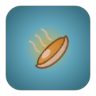

# 角色（39 名）

**中文** · [English](en/CHARACTERS.md)

[README](../README.md) · **角色** · [技能](SKILLS.md) · [武器](WEAPONS.md) · [道具](ITEMS.md) · [怪物](MONSTERS.md) · [关卡](CHAPTERS.md) · [成就](ACHIEVEMENTS.md) · [天赋](TALENTS.md) · [遗物](RELICS.md) · [危机](DANGER.md) · [任务](QUESTS.md) · [设计文档](GDD.md) · [数值表](DATA_TABLES.md) · [更新日志](CHANGELOG.md)

> 由 `npm run docs` 从 `src/data/*.ts` 自动生成，请勿手改。

每名角色 = 属性与特性 + 初始武器 + 专属天赋 + 主动技能 + 独特外观。默认解锁 4 名，其余每名都绑定一项[成就](ACHIEVEMENTS.md)，达成后自动解锁。

技能详情见 [技能](SKILLS.md)，武器详情见 [武器](WEAPONS.md)。

## 目录

- [角色一览](#overview)
- [角色详情](#details)
  - [番茄妹 · 全能少女](#char-tomato)
  - [胡萝卜骑士 · 近战坦克](#char-carrot)
  - [辣椒姐 · 火焰专家](#char-chili)
  - [玉米枪手 · 远程射手](#char-corn)
  - [西瓜胖墩 · 重装坦克](#char-watermelon)
  - [柠檬刺客 · 暴击刺客](#char-lemon)
  - [茄子法师 · 雷电法师](#char-eggplant)
  - [大蒜伯爵 · 吸血贵族](#char-garlic)
  - [蓝莓双子 · 武器大师](#char-blueberry)
  - [菠萝船长 · 商人海盗](#char-pineapple)
  - [南瓜幽灵 · 闪避大师](#char-pumpkin)
  - [草莓偶像 · 成长明星](#char-strawberry)
  - [生姜忍者 · 疾风忍者](#char-ginger)
  - [牛油果博士 · 炸弹专家](#char-avocado)
  - [洋葱大叔 · 催泪硬汉](#char-onion)
  - [蘑菇巫医 · 剧毒专家](#char-mushroom)
  - [椰子拳师 · 重拳格斗](#char-coconut)
  - [葡萄魔术师 · 幻术大师](#char-grape)
  - [樱桃双枪 · 连射枪手](#char-cherry)
  - [豌豆士兵 · 军团兵](#char-pea)
  - [蜜桃天使 · 治愈者](#char-peach)
  - [火龙果龙骑 · 烈焰骑士](#char-dragonfruit)
  - [甜菜狂战士 · 狂战士](#char-beet)
  - [芦笋弓手 · 精准射手](#char-asparagus)
  - [红薯厨神 · 美食家](#char-sweetpotato)
  - [猕猴桃侦探 · 弱点洞察](#char-kiwi)
  - [荔枝公主 · 幸运公主](#char-lychee)
  - [榴莲霸王 · 毒刺霸主](#char-durian)
  - [青椒机甲 · 机甲驾驶员](#char-bellpepper)
  - [冬瓜和尚 · 禅修武僧](#char-wintermelon)
  - [苦瓜冰法 · 寒冰法师](#char-bittermelon)
  - [豆芽学徒 · 潜力新星](#char-sprout)
  - [山葵爆破手 · 爆破狂人](#char-wasabi)
  - [黄豆军师 · 召唤统领](#char-soybean)
  - [菠萝蜜卫士 · 荆棘反伤](#char-jackfruit)
  - [石榴炮手 · 弹幕狂潮](#char-pomegranate)
  - [芋头术士 · 一心一器](#char-taro)
  - [卷心菜老兵 · 不屈老兵](#char-cabbage)
  - [黑莓女巫 · 诅咒术士](#char-blackberry)

## 角色一览

| # | 角色 | 定位 | 天赋 | 契合武器 | 技能 | 解锁条件 |
| --- | --- | --- | --- | --- | --- | --- |
| 1 |  [番茄妹](#char-tomato) | 全能少女 | 番茄之心 | 厨具、酱料（49 把） | [番茄酱爆](SKILLS.md#skill-tomato) （周身爆发） | 默认解锁 |
| 2 |  [胡萝卜骑士](#char-carrot) | 近战坦克 | 骑士之盾 | 钝器（13 把） | [骑士冲锋](SKILLS.md#skill-carrot) （突进冲撞） | 默认解锁 |
| 3 |  [辣椒姐](#char-chili) | 火焰专家 | 火上浇油 | 火焰（27 把） | [烈焰新星](SKILLS.md#skill-chili) （周身爆发） | 默认解锁 |
| 4 |  [玉米枪手](#char-corn) | 远程射手 | 远程压制 | 枪械（24 把） | [爆米花弹幕](SKILLS.md#skill-corn) （环形弹幕） | 默认解锁 |
| 5 |  [西瓜胖墩](#char-watermelon) | 重装坦克 | 皮糙肉厚 | 爆破（23 把） | [西瓜翻滚](SKILLS.md#skill-watermelon) （突进冲撞） | 达成成就 [水果补给（金）](ACHIEVEMENTS.md#ach-fruits)：累计吃到 500 个果实 |
| 6 |  [柠檬刺客](#char-lemon) | 暴击刺客 | 酸爽一击 | 锋利、暴击（36 把） | [酸雾隐身](SKILLS.md#skill-lemon) （无敌潜行） | 达成成就 [会心一击（银）](ACHIEVEMENTS.md#ach-crits)：累计造成 5,000 次暴击 |
| 7 |  [茄子法师](#char-eggplant) | 雷电法师 | 雷霆之力 | 雷电、连锁（14 把） | [紫雷天罚](SKILLS.md#skill-eggplant) （全屏攻击） | 达成成就 [大招成瘾（银）](ACHIEVEMENTS.md#ach-casts)：累计释放 100 次技能 |
| 8 |  [大蒜伯爵](#char-garlic) | 吸血贵族 | 血之盛宴 | 酱料、光环（30 把） | [血之领域](SKILLS.md#skill-garlic) （吸取回复） | 达成成就 [精英猎手（银）](ACHIEVEMENTS.md#ach-elites)：累计击败 10 名精英 |
| 9 |  [蓝莓双子](#char-blueberry) | 武器大师 | 双生默契 | 蔬果、多重射击（45 把） | [双子分身](SKILLS.md#skill-blueberry) （召唤分身） | 达成成就 [多面手（银）](ACHIEVEMENTS.md#ach-chars_won)：用 10 名不同角色通关 |
| 10 |  [菠萝船长](#char-pineapple) | 商人海盗 | 海盗分赃 | 连锁（14 把） | [黄金炮击](SKILLS.md#skill-pineapple) （发射 AOE） | 达成成就 [小有积蓄（钻石）](ACHIEVEMENTS.md#ach-rich)：同时持有 3,000 番茄籽 |
| 11 |  [南瓜幽灵](#char-pumpkin) | 闪避大师 | 幽灵突袭 | 蔬果（38 把） | [灵体化](SKILLS.md#skill-pumpkin) （无敌潜行） | 达成成就 [菜园守护者](ACHIEVEMENTS.md#ach-clear_2)：通关第二章 |
| 12 |  [草莓偶像](#char-strawberry) | 成长明星 | 人气飙升 | 甜点（18 把） | [应援打 Call](SKILLS.md#skill-strawberry) （自身增益） | 达成成就 [茁壮成长（银）](ACHIEVEMENTS.md#ach-level)：单局达到 20 级 |
| 13 |  [生姜忍者](#char-ginger) | 疾风忍者 | 疾风步 | 锋利（23 把） | [瞬影斩](SKILLS.md#skill-ginger) （突进冲撞） | 达成成就 [毫发无伤（金）](ACHIEVEMENTS.md#ach-perfect)：累计 50 次无伤完成波次 |
| 14 |  [牛油果博士](#char-avocado) | 炸弹专家 | 连环爆破 | 爆破（23 把） | [核心过载](SKILLS.md#skill-avocado) （多点轰炸） | 达成成就 [神兵利器（银）](ACHIEVEMENTS.md#ach-t4)：累计合成 5 把 T4 武器 |
| 15 |  [洋葱大叔](#char-onion) | 催泪硬汉 | 催泪弹 | 毒气、厨具（40 把） | [催泪领域](SKILLS.md#skill-onion) （禁锢领域） | 达成成就 [屡败屡战（银）](ACHIEVEMENTS.md#ach-deaths)：累计阵亡 10 次 |
| 16 |  [蘑菇巫医](#char-mushroom) | 剧毒专家 | 孢子扩散 | 毒气、持续伤害（31 把） | [孢子云](SKILLS.md#skill-mushroom) （群体减益） | 达成成就 [中毒专家（金）](ACHIEVEMENTS.md#ach-inflict_poison)：对敌人施加 20,000 次【中毒】 |
| 17 |  [椰子拳师](#char-coconut) | 重拳格斗 | 重拳出击 | 钝器（13 把） | [震地拳](SKILLS.md#skill-coconut) （周身爆发） | 达成成就 [厨房清扫](ACHIEVEMENTS.md#ach-clear_1)：通关第一章 |
| 18 |  [葡萄魔术师](#char-grape) | 幻术大师 | 障眼法 | 多重射击（13 把） | [葡萄分身](SKILLS.md#skill-grape) （召唤分身） | 达成成就 [开箱达人（金）](ACHIEVEMENTS.md#ach-crates)：累计打开 300 个宝箱 |
| 19 |  [樱桃双枪](#char-cherry) | 连射枪手 | 连珠炮 | 枪械（24 把） | [双枪连射](SKILLS.md#skill-cherry) （单体连发） | 达成成就 [枪械套装（铜）](ACHIEVEMENTS.md#ach-set_枪械)：单局持有 2 把【枪械】武器 |
| 20 |  [豌豆士兵](#char-pea) | 军团兵 | 豌豆军团 | 穿透（13 把） | [豌豆炮台](SKILLS.md#skill-pea) （单体连发） | 达成成就 [番茄酱风暴（金）](ACHIEVEMENTS.md#ach-kills)：累计击败 10,000 只怪物 |
| 21 |  [蜜桃天使](#char-peach) | 治愈者 | 天使庇护 | 甜点（18 把） | [天使祝福](SKILLS.md#skill-peach) （吸取回复） | 达成成就 [凤凰涅槃](ACHIEVEMENTS.md#ach-revive)：在战斗中复活 1 次 |
| 22 |  [火龙果龙骑](#char-dragonfruit) | 烈焰骑士 | 龙息 | 火焰（27 把） | [龙焰冲锋](SKILLS.md#skill-dragonfruit) （突进冲撞） | 达成成就 [灼烧专家（金）](ACHIEVEMENTS.md#ach-inflict_burn)：对敌人施加 20,000 次【灼烧】 |
| 23 |  [甜菜狂战士](#char-beet) | 狂战士 | 狂战之血 | 钝器（13 把） | [狂暴](SKILLS.md#skill-beet) （自身增益） | 达成成就 [Boss 终结者（银）](ACHIEVEMENTS.md#ach-bosses)：累计击败 5 名 Boss |
| 24 |  [芦笋弓手](#char-asparagus) | 精准射手 | 一箭穿心 | 穿透（13 把） | [穿心箭](SKILLS.md#skill-asparagus) （单体连发） | 达成成就 [一击必杀（银）](ACHIEVEMENTS.md#ach-max_hit)：单次造成 5,000 点伤害 |
| 25 |  [红薯厨神](#char-sweetpotato) | 美食家 | 美食家 | 厨具（32 把） | [烤红薯盛宴](SKILLS.md#skill-sweetpotato) （吸取回复） | 达成成就 [厨具套装（银）](ACHIEVEMENTS.md#ach-set_厨具)：单局持有 4 把【厨具】武器 |
| 26 |  [猕猴桃侦探](#char-kiwi) | 弱点洞察 | 弱点洞察 | 锋利（23 把） | [真相只有一个](SKILLS.md#skill-kiwi) （群体减益） | 达成成就 [军火库（银）](ACHIEVEMENTS.md#ach-codex_weapons)：在图鉴中发现 25 把武器 |
| 27 |  [荔枝公主](#char-lychee) | 幸运公主 | 好运连连 | 蔬果（38 把） | [公主的好运](SKILLS.md#skill-lychee) （自身增益） | 达成成就 [番茄大亨（钻石）](ACHIEVEMENTS.md#ach-earned)：累计获得 500,000 番茄籽 |
| 28 |  [榴莲霸王](#char-durian) | 毒刺霸主 | 臭气熏天 | 毒气、光环（21 把） | [臭气熏天](SKILLS.md#skill-durian) （群体减益） | 达成成就 [Boss 终结者（金）](ACHIEVEMENTS.md#ach-bosses)：累计击败 15 名 Boss |
| 29 |  [青椒机甲](#char-bellpepper) | 机甲驾驶员 | 机甲装甲 | 枪械（24 把） | [无人机支援](SKILLS.md#skill-bellpepper) （召唤分身） | 达成成就 [垃圾场之王](ACHIEVEMENTS.md#ach-clear_4)：通关第四章 |
| 30 |  [冬瓜和尚](#char-wintermelon) | 禅修武僧 | 禅定 | 冰霜（25 把） | [金钟罩](SKILLS.md#skill-wintermelon) （无敌潜行） | 达成成就 [绝地反击（铜）](ACHIEVEMENTS.md#ach-overtime)：在 Boss 狂暴后将其击败 1 次 |
| 31 |  [苦瓜冰法](#char-bittermelon) | 寒冰法师 | 寒霜侵袭 | 冰霜（25 把） | [冰封领域](SKILLS.md#skill-bittermelon) （禁锢领域） | 达成成就 [破冰者](ACHIEVEMENTS.md#ach-clear_3)：通关第三章 |
| 32 |  [豆芽学徒](#char-sprout) | 潜力新星 | 厚积薄发 | 蔬果（38 把） | [拔苗助长](SKILLS.md#skill-sprout) （自身增益） | 达成成就 [步步高升（银）](ACHIEVEMENTS.md#ach-levelups)：累计升级选择 200 次属性 |
| 33 |  [山葵爆破手](#char-wasabi) | 爆破狂人 | 连锁反应 | 火焰、爆破（46 把） | [冲鼻核弹](SKILLS.md#skill-wasabi) （发射 AOE） | 达成成就 [爆破套装（银）](ACHIEVEMENTS.md#ach-set_爆破)：单局持有 4 把【爆破】武器 |
| 34 |  [黄豆军师](#char-soybean) | 召唤统领 | 撒豆成兵 | 爆破（23 把） | [豆兵出阵](SKILLS.md#skill-soybean) （召唤分身） | 达成成就 [全员集结（银）](ACHIEVEMENTS.md#ach-chars_owned)：拥有 20 名角色 |
| 35 |  [菠萝蜜卫士](#char-jackfruit) | 荆棘反伤 | 以刺还刺 | 光环（14 把） | [千刺甲](SKILLS.md#skill-jackfruit) （自身增益） | 达成成就 [精英怪克星（金）](ACHIEVEMENTS.md#ach-champions)：累计击败 500 只词缀精英怪 |
| 36 |  [石榴炮手](#char-pomegranate) | 弹幕狂潮 | 籽弹倾泻 | 多重射击（13 把） | [石榴籽爆裂](SKILLS.md#skill-pomegranate) （环形弹幕） | 达成成就 [番茄酱风暴（钻石）](ACHIEVEMENTS.md#ach-kills)：累计击败 50,000 只怪物 |
| 37 |  [芋头术士](#char-taro) | 一心一器 | 芋香结界 | 光环（14 把） | [芋泥结界](SKILLS.md#skill-taro) （禁锢领域） | 达成成就 [神兵利器（金）](ACHIEVEMENTS.md#ach-t4)：累计合成 20 把 T4 武器 |
| 38 |  [卷心菜老兵](#char-cabbage) | 不屈老兵 | 层层不倒 | 厨具（32 把） | [不倒金身](SKILLS.md#skill-cabbage) （自身增益） | 达成成就 [常胜将军（银）](ACHIEVEMENTS.md#ach-wins)：累计通关 10 次 |
| 39 |  [黑莓女巫](#char-blackberry) | 诅咒术士 | 黑暗契约 | 持续伤害（31 把） | [枯萎咒](SKILLS.md#skill-blackberry) （群体减益） | 达成成就 [腐烂终结](ACHIEVEMENTS.md#ach-clear_5)：通关第五章，击败腐烂之源 |

## 角色详情

<table>
<tr><td rowspan="7" align="center" valign="middle"></td><th colspan="2" align="left">番茄妹 · 全能少女</th></tr>
<tr><td colspan="2"><i>番茄酱小镇的守护者，各项能力均衡，适合新手。</i></td></tr>
<tr><td nowrap>专属天赋</td><td><b>番茄之心</b>：每完成一波，永久 +1 最大生命，契合武器连击率 +2%（最多 +20%）</td></tr>
<tr><td nowrap>属性与特性</td><td>+1 生命再生；+5% 全伤害</td></tr>
<tr><td nowrap>契合武器</td><td>契合标签：厨具、酱料（49 把） 契合特效（伤害 +10%）：连击：20% 概率立刻追加一次 60% 伤害的攻击 代表： <a href="WEAPONS.md#weapon-fork">番茄叉</a>、 <a href="WEAPONS.md#weapon-rolling_pin">擀面杖</a>、 <a href="WEAPONS.md#weapon-knife">菜刀</a>、 <a href="WEAPONS.md#weapon-pan">平底锅</a>、 <a href="WEAPONS.md#weapon-ketchup">番茄酱瓶</a>、 <a href="WEAPONS.md#weapon-mustard_flamer">芥末喷枪</a></td></tr>
<tr><td nowrap>主动技能</td><td><a href="SKILLS.md#skill-tomato">番茄酱爆</a>【周身爆发】冷却 17s — 炸开番茄酱，造成伤害并减速敌人。</td></tr>
<tr><td nowrap>解锁条件</td><td>默认解锁</td></tr>
</table>

<table>
<tr><td rowspan="7" align="center" valign="middle"></td><th colspan="2" align="left">胡萝卜骑士 · 近战坦克</th></tr>
<tr><td colspan="2"><i>身披银甲的骑士，擅长近身肉搏。</i></td></tr>
<tr><td nowrap>专属天赋</td><td><b>骑士之盾</b>：每 1 点护甲让契合武器横扫与爆炸范围 +2%（最多 +40%）；打破甲 3 层以上的敌人时眩晕 0.3 秒</td></tr>
<tr><td nowrap>属性与特性</td><td>+5 最大生命；+3 近战伤害；+3 护甲；远程伤害 -50%</td></tr>
<tr><td nowrap>契合武器</td><td>契合标签：钝器（13 把） 契合特效（伤害 +10%）：破防：命中叠 1 层破甲 代表： <a href="WEAPONS.md#weapon-rolling_pin">擀面杖</a>、 <a href="WEAPONS.md#weapon-pan">平底锅</a>、 <a href="WEAPONS.md#weapon-watermelon_hammer">西瓜锤</a>、 <a href="WEAPONS.md#weapon-meat_tenderizer">松肉锤</a>、 <a href="WEAPONS.md#weapon-ladle">汤勺</a>、 <a href="WEAPONS.md#weapon-baguette_sword">法棍剑</a></td></tr>
<tr><td nowrap>主动技能</td><td><a href="SKILLS.md#skill-carrot">骑士冲锋</a>【突进冲撞】冷却 11s — 无敌冲锋，撞晕沿途敌人。</td></tr>
<tr><td nowrap>解锁条件</td><td>默认解锁</td></tr>
</table>

<table>
<tr><td rowspan="7" align="center" valign="middle"></td><th colspan="2" align="left">辣椒姐 · 火焰专家</th></tr>
<tr><td colspan="2"><i>脾气火爆，所到之处烈焰滚滚。</i></td></tr>
<tr><td nowrap>专属天赋</td><td><b>火上浇油</b>：契合武器打中灼烧中的敌人时溅出火花，对周围造成 30% 伤害</td></tr>
<tr><td nowrap>属性与特性</td><td>-2 最大生命；+3 元素伤害；所有命中 25% 概率灼烧</td></tr>
<tr><td nowrap>契合武器</td><td>契合标签：火焰（27 把） 契合特效（伤害 +10%）：射程 +30%，命中多叠 1 层灼烧 代表： <a href="WEAPONS.md#weapon-mustard_flamer">芥末喷枪</a>、 <a href="WEAPONS.md#weapon-chili_rocket">辣椒火箭</a>、 <a href="WEAPONS.md#weapon-skewer">烤串签</a>、 <a href="WEAPONS.md#weapon-steam_kettle">蒸汽水壶</a>、 <a href="WEAPONS.md#weapon-curry_aura">咖喱光环</a>、 <a href="WEAPONS.md#weapon-pepper_spray">胡椒喷雾</a></td></tr>
<tr><td nowrap>主动技能</td><td><a href="SKILLS.md#skill-chili">烈焰新星</a>【周身爆发】冷却 20s — 火焰冲击波，叠加 3 层灼烧。</td></tr>
<tr><td nowrap>解锁条件</td><td>默认解锁</td></tr>
</table>

<table>
<tr><td rowspan="7" align="center" valign="middle"></td><th colspan="2" align="left">玉米枪手 · 远程射手</th></tr>
<tr><td colspan="2"><i>西部神枪手，用玉米粒击穿一切。</i></td></tr>
<tr><td nowrap>专属天赋</td><td><b>远程压制</b>：契合子弹每飞行 100 距离，额外穿透 +1（最多 +3）</td></tr>
<tr><td nowrap>属性与特性</td><td>+3 最大生命；+3 远程伤害；+50 射程；近战伤害 -50%</td></tr>
<tr><td nowrap>契合武器</td><td>契合标签：枪械（24 把） 契合特效（伤害 +10%）：射程 +25%，穿透 +1 代表： <a href="WEAPONS.md#weapon-corn_cannon">玉米加农</a>、 <a href="WEAPONS.md#weapon-pea_shooter">豌豆枪</a>、 <a href="WEAPONS.md#weapon-chili_rocket">辣椒火箭</a>、 <a href="WEAPONS.md#weapon-olive_launcher">橄榄发射器</a>、 <a href="WEAPONS.md#weapon-popcorn_machine">爆米花机</a>、 <a href="WEAPONS.md#weapon-grape_shotgun">葡萄霰弹枪</a></td></tr>
<tr><td nowrap>主动技能</td><td><a href="SKILLS.md#skill-corn">爆米花弹幕</a>【环形弹幕】冷却 8s — 向四周发射 18 发爆米花。</td></tr>
<tr><td nowrap>解锁条件</td><td>默认解锁</td></tr>
</table>

<table>
<tr><td rowspan="7" align="center" valign="middle"></td><th colspan="2" align="left">西瓜胖墩 · 重装坦克</th></tr>
<tr><td colspan="2"><i>圆滚滚的大块头，皮糙肉厚。</i></td></tr>
<tr><td nowrap>专属天赋</td><td><b>皮糙肉厚</b>：受到的伤害 -10%；每 20 最大生命让契合武器范围 +5%（最多 +50%）</td></tr>
<tr><td nowrap>属性与特性</td><td>+25 最大生命；-10% 攻击速度；+2 护甲；-6 移动速度</td></tr>
<tr><td nowrap>契合武器</td><td>契合标签：爆破（23 把） 契合特效（伤害 +10%）：爆炸与横扫范围 +25%，击退更强 代表： <a href="WEAPONS.md#weapon-watermelon_hammer">西瓜锤</a>、 <a href="WEAPONS.md#weapon-chili_rocket">辣椒火箭</a>、 <a href="WEAPONS.md#weapon-pepper_mine">胡椒雷</a>、 <a href="WEAPONS.md#weapon-pineapple_mace">菠萝流星锤</a>、 <a href="WEAPONS.md#weapon-popcorn_machine">爆米花机</a>、 <a href="WEAPONS.md#weapon-bean_bazooka">豆子火箭筒</a></td></tr>
<tr><td nowrap>主动技能</td><td><a href="SKILLS.md#skill-watermelon">西瓜翻滚</a>【突进冲撞】冷却 13s — 翻滚冲撞并回复 4.5% 最大生命。</td></tr>
<tr><td nowrap>解锁条件</td><td>达成成就 <a href="ACHIEVEMENTS.md#ach-fruits">水果补给（金）</a>：累计吃到 500 个果实</td></tr>
</table>

<table>
<tr><td rowspan="7" align="center" valign="middle"></td><th colspan="2" align="left">柠檬刺客 · 暴击刺客</th></tr>
<tr><td colspan="2"><i>酸溜溜的刺客，一击致命。</i></td></tr>
<tr><td nowrap>专属天赋</td><td><b>酸爽一击</b>：契合武器暴击后立刻重置冷却（每把武器每秒最多 1 次）</td></tr>
<tr><td nowrap>属性与特性</td><td>-4 最大生命；+20% 暴击率；+10% 闪避；+3 移动速度；暴击伤害 +40%</td></tr>
<tr><td nowrap>契合武器</td><td>契合标签：锋利、暴击（36 把） 契合特效（伤害 +10%）：暴击强化：暴击伤害 +30%，暴击附带流血 代表： <a href="WEAPONS.md#weapon-knife">菜刀</a>、 <a href="WEAPONS.md#weapon-fork">番茄叉</a>、 <a href="WEAPONS.md#weapon-corn_cannon">玉米加农</a>、 <a href="WEAPONS.md#weapon-cleaver">剁骨刀</a>、 <a href="WEAPONS.md#weapon-skewer">烤串签</a>、 <a href="WEAPONS.md#weapon-cucumber_katana">黄瓜武士刀</a></td></tr>
<tr><td nowrap>主动技能</td><td><a href="SKILLS.md#skill-lemon">酸雾隐身</a>【无敌潜行】冷却 11s — 隐身 3 秒（无敌），暴击 +50%。</td></tr>
<tr><td nowrap>解锁条件</td><td>达成成就 <a href="ACHIEVEMENTS.md#ach-crits">会心一击（银）</a>：累计造成 5,000 次暴击</td></tr>
</table>

<table>
<tr><td rowspan="7" align="center" valign="middle"></td><th colspan="2" align="left">茄子法师 · 雷电法师</th></tr>
<tr><td colspan="2"><i>紫袍法师，召唤天雷惩戒害虫。</i></td></tr>
<tr><td nowrap>专属天赋</td><td><b>雷霆之力</b>：契合连锁每跳到一个敌人，15% 概率引下落雷</td></tr>
<tr><td nowrap>属性与特性</td><td>+3 最大生命；+4 元素伤害；+4 幸运；近战伤害 -70%；命中 10% 概率落雷</td></tr>
<tr><td nowrap>契合武器</td><td>契合标签：雷电、连锁（14 把） 契合特效（伤害 +10%）：连锁 +1 跳 代表： <a href="WEAPONS.md#weapon-broccoli_staff">西兰花法杖</a>、 <a href="WEAPONS.md#weapon-slingshot">番茄弹弓</a>、 <a href="WEAPONS.md#weapon-olive_launcher">橄榄发射器</a>、 <a href="WEAPONS.md#weapon-lightning_whisk">闪电打蛋器</a>、 <a href="WEAPONS.md#weapon-dragonfruit_orb">火龙果法球</a>、 <a href="WEAPONS.md#weapon-lemon_battery">柠檬电池</a></td></tr>
<tr><td nowrap>主动技能</td><td><a href="SKILLS.md#skill-eggplant">紫雷天罚</a>【全屏攻击】冷却 14s — 天雷覆盖全屏，劈中所有敌人并短暂眩晕。</td></tr>
<tr><td nowrap>解锁条件</td><td>达成成就 <a href="ACHIEVEMENTS.md#ach-casts">大招成瘾（银）</a>：累计释放 100 次技能</td></tr>
</table>

<table>
<tr><td rowspan="7" align="center" valign="middle"></td><th colspan="2" align="left">大蒜伯爵 · 吸血贵族</th></tr>
<tr><td colspan="2"><i>古老的吸血鬼……却是大蒜做的。</i></td></tr>
<tr><td nowrap>专属天赋</td><td><b>血之盛宴</b>：周身 160 范围的血雾让敌人每秒流血；契合武器损失的生命越多伤害越高（空血时 +60%），吸血冷却减半，一次群体命中最多连续吸血 3 次</td></tr>
<tr><td nowrap>属性与特性</td><td>+15 最大生命；+10% 吸血概率；+10% 全伤害；+2 远程伤害；+2 元素伤害；+15% 攻击速度；周围 160 范围敌人每秒流血</td></tr>
<tr><td nowrap>契合武器</td><td>契合标签：酱料、光环（30 把） 契合特效（伤害 +10%）：命中 25% 概率流血 代表： <a href="WEAPONS.md#weapon-garlic_aura">大蒜光环</a>、 <a href="WEAPONS.md#weapon-ketchup">番茄酱瓶</a>、 <a href="WEAPONS.md#weapon-mustard_flamer">芥末喷枪</a>、 <a href="WEAPONS.md#weapon-whisk_spin">旋风打蛋器</a>、 <a href="WEAPONS.md#weapon-ladle">汤勺</a>、 <a href="WEAPONS.md#weapon-honey_blaster">蜂蜜喷枪</a></td></tr>
<tr><td nowrap>主动技能</td><td><a href="SKILLS.md#skill-garlic">血之领域</a>【吸取回复】冷却 14s — 吸取周围敌人生命，施加流血。</td></tr>
<tr><td nowrap>解锁条件</td><td>达成成就 <a href="ACHIEVEMENTS.md#ach-elites">精英猎手（银）</a>：累计击败 10 名精英</td></tr>
</table>

<table>
<tr><td rowspan="7" align="center" valign="middle"></td><th colspan="2" align="left">蓝莓双子 · 武器大师</th></tr>
<tr><td colspan="2"><i>形影不离的双胞胎，可以携带更多武器。</i></td></tr>
<tr><td nowrap>专属天赋</td><td><b>双生默契</b>：每持有一对同名契合武器，契合武器弹丸再 +1（最多 +2）</td></tr>
<tr><td nowrap>属性与特性</td><td>-10% 全伤害；武器栏 8 格</td></tr>
<tr><td nowrap>契合武器</td><td>契合标签：蔬果、多重射击（45 把） 契合特效（伤害 +10%）：分裂：每次多 1 发弹丸（近战武器改为连击） 代表： <a href="WEAPONS.md#weapon-pea_shooter">豌豆枪</a>、 <a href="WEAPONS.md#weapon-knife">菜刀</a>、 <a href="WEAPONS.md#weapon-watermelon_hammer">西瓜锤</a>、 <a href="WEAPONS.md#weapon-slingshot">番茄弹弓</a>、 <a href="WEAPONS.md#weapon-ketchup">番茄酱瓶</a>、 <a href="WEAPONS.md#weapon-garlic_aura">大蒜光环</a></td></tr>
<tr><td nowrap>主动技能</td><td><a href="SKILLS.md#skill-blueberry">双子分身</a>【召唤分身】冷却 10s — 召唤 2 个分身 8 秒，拿着你的全部武器一起攻击（50% 伤害），身体能挡子弹；分身被打掉或消失时尸体爆炸。</td></tr>
<tr><td nowrap>解锁条件</td><td>达成成就 <a href="ACHIEVEMENTS.md#ach-chars_won">多面手（银）</a>：用 10 名不同角色通关</td></tr>
</table>

<table>
<tr><td rowspan="7" align="center" valign="middle"></td><th colspan="2" align="left">菠萝船长 · 商人海盗</th></tr>
<tr><td colspan="2"><i>精明的海盗船长，擅长讨价还价。</i></td></tr>
<tr><td nowrap>专属天赋</td><td><b>海盗分赃</b>：每波结束获得当前番茄籽 8% 的利息（上限随波次提高）；每持有 100 番茄籽，契合武器弹射再 +1（最多 +3）</td></tr>
<tr><td nowrap>属性与特性</td><td>-3 最大生命；+8 幸运；+10 收获；商店价格 -15%</td></tr>
<tr><td nowrap>契合武器</td><td>契合标签：连锁（14 把） 契合特效（伤害 +10%）：弹射 +1 代表： <a href="WEAPONS.md#weapon-slingshot">番茄弹弓</a>、 <a href="WEAPONS.md#weapon-broccoli_staff">西兰花法杖</a>、 <a href="WEAPONS.md#weapon-olive_launcher">橄榄发射器</a>、 <a href="WEAPONS.md#weapon-lightning_whisk">闪电打蛋器</a>、 <a href="WEAPONS.md#weapon-dragonfruit_orb">火龙果法球</a>、 <a href="WEAPONS.md#weapon-lemon_battery">柠檬电池</a></td></tr>
<tr><td nowrap>主动技能</td><td><a href="SKILLS.md#skill-pineapple">黄金炮击</a>【发射 AOE】冷却 16s — 向敌群最密集处发射黄金炮弹，大范围爆炸，击杀必掉番茄籽。</td></tr>
<tr><td nowrap>解锁条件</td><td>达成成就 <a href="ACHIEVEMENTS.md#ach-rich">小有积蓄（钻石）</a>：同时持有 3,000 番茄籽</td></tr>
</table>

<table>
<tr><td rowspan="7" align="center" valign="middle"></td><th colspan="2" align="left">南瓜幽灵 · 闪避大师</th></tr>
<tr><td colspan="2"><i>万圣节的小幽灵，总是飘来飘去。</i></td></tr>
<tr><td nowrap>专属天赋</td><td><b>幽灵突袭</b>：闪避成功后 1.5 秒内契合武器攻速 +40%</td></tr>
<tr><td nowrap>属性与特性</td><td>-4 最大生命；+25% 闪避；+4 移动速度；闪避上限 75%</td></tr>
<tr><td nowrap>契合武器</td><td>契合标签：蔬果（38 把） 契合特效（伤害 +10%）：闪避后接下来 3 次攻击变成幽灵弹：必定暴击、无限穿透 代表： <a href="WEAPONS.md#weapon-pumpkin_lantern">南瓜鬼火灯</a>、 <a href="WEAPONS.md#weapon-watermelon_hammer">西瓜锤</a>、 <a href="WEAPONS.md#weapon-slingshot">番茄弹弓</a>、 <a href="WEAPONS.md#weapon-pea_shooter">豌豆枪</a>、 <a href="WEAPONS.md#weapon-garlic_aura">大蒜光环</a>、 <a href="WEAPONS.md#weapon-onion_boomerang">洋葱回旋镖</a></td></tr>
<tr><td nowrap>主动技能</td><td><a href="SKILLS.md#skill-pumpkin">灵体化</a>【无敌潜行】冷却 11s — 无敌 2.5 秒并大幅加速。</td></tr>
<tr><td nowrap>解锁条件</td><td>达成成就 <a href="ACHIEVEMENTS.md#ach-clear_2">菜园守护者</a>：通关第二章</td></tr>
</table>

<table>
<tr><td rowspan="7" align="center" valign="middle"></td><th colspan="2" align="left">草莓偶像 · 成长明星</th></tr>
<tr><td colspan="2"><i>人气偶像，成长速度惊人。</i></td></tr>
<tr><td nowrap>专属天赋</td><td><b>人气飙升</b>：每次升级 +1 最大生命；每 4 级契合武器轮流获得一项永久强化：射程 +15%、弹丸 +1、穿透 +1、暴击 +5%</td></tr>
<tr><td nowrap>属性与特性</td><td>-3 最大生命；+40% 经验获取；升级时 5 个选项</td></tr>
<tr><td nowrap>契合武器</td><td>契合标签：甜点（18 把） 契合特效（伤害 +10%）：人气：每级攻速 +1%（最多 +30%） 代表： <a href="WEAPONS.md#weapon-honey_blaster">蜂蜜喷枪</a>、 <a href="WEAPONS.md#weapon-soda">冰镇汽水</a>、 <a href="WEAPONS.md#weapon-jam_mortar">果酱迫击炮</a>、 <a href="WEAPONS.md#weapon-cola_zapper">可乐电击枪</a>、 <a href="WEAPONS.md#weapon-candy_cane">拐杖糖锤</a>、 <a href="WEAPONS.md#weapon-macaron_gun">马卡龙连发</a></td></tr>
<tr><td nowrap>主动技能</td><td><a href="SKILLS.md#skill-strawberry">应援打 Call</a>【自身增益】冷却 13s — 6 秒内急速 3 层 + 怒气 5 层。</td></tr>
<tr><td nowrap>解锁条件</td><td>达成成就 <a href="ACHIEVEMENTS.md#ach-level">茁壮成长（银）</a>：单局达到 20 级</td></tr>
</table>

<table>
<tr><td rowspan="7" align="center" valign="middle"></td><th colspan="2" align="left">生姜忍者 · 疾风忍者</th></tr>
<tr><td colspan="2"><i>来无影去无踪的生姜忍者。</i></td></tr>
<tr><td nowrap>专属天赋</td><td><b>疾风步</b>：移动速度每提高 10%，契合武器攻速 +4%</td></tr>
<tr><td nowrap>属性与特性</td><td>+15% 攻击速度；-1 护甲；+10 移动速度</td></tr>
<tr><td nowrap>契合武器</td><td>契合标签：锋利（23 把） 契合特效（伤害 +10%）：回旋镖与飞镖每次多扔 1 枚（其他武器改为连击） 代表： <a href="WEAPONS.md#weapon-star_anise_shuriken">八角飞镖</a>、 <a href="WEAPONS.md#weapon-knife">菜刀</a>、 <a href="WEAPONS.md#weapon-cleaver">剁骨刀</a>、 <a href="WEAPONS.md#weapon-skewer">烤串签</a>、 <a href="WEAPONS.md#weapon-cucumber_katana">黄瓜武士刀</a>、 <a href="WEAPONS.md#weapon-pizza_cutter">披萨滚刀</a></td></tr>
<tr><td nowrap>主动技能</td><td><a href="SKILLS.md#skill-ginger">瞬影斩</a>【突进冲撞】冷却 11s — 突进斩击，施加流血。</td></tr>
<tr><td nowrap>解锁条件</td><td>达成成就 <a href="ACHIEVEMENTS.md#ach-perfect">毫发无伤（金）</a>：累计 50 次无伤完成波次</td></tr>
</table>

<table>
<tr><td rowspan="7" align="center" valign="middle"></td><th colspan="2" align="left">牛油果博士 · 炸弹专家</th></tr>
<tr><td colspan="2"><i>疯狂科学家，热衷于爆炸实验。</i></td></tr>
<tr><td nowrap>专属天赋</td><td><b>连环爆破</b>：契合武器爆炸后 30% 概率在边缘再炸一次（50% 伤害），概率每波 +3%（最多 60%）</td></tr>
<tr><td nowrap>属性与特性</td><td>+5% 全伤害；+2 元素伤害；+30 射程；击杀 15% 概率爆炸</td></tr>
<tr><td nowrap>契合武器</td><td>契合标签：爆破（23 把） 契合特效（伤害 +10%）：爆炸范围 +20% 代表： <a href="WEAPONS.md#weapon-pepper_mine">胡椒雷</a>、 <a href="WEAPONS.md#weapon-chili_rocket">辣椒火箭</a>、 <a href="WEAPONS.md#weapon-watermelon_hammer">西瓜锤</a>、 <a href="WEAPONS.md#weapon-pineapple_mace">菠萝流星锤</a>、 <a href="WEAPONS.md#weapon-popcorn_machine">爆米花机</a>、 <a href="WEAPONS.md#weapon-bean_bazooka">豆子火箭筒</a></td></tr>
<tr><td nowrap>主动技能</td><td><a href="SKILLS.md#skill-avocado">核心过载</a>【多点轰炸】冷却 11s — 连环爆炸 5 次。</td></tr>
<tr><td nowrap>解锁条件</td><td>达成成就 <a href="ACHIEVEMENTS.md#ach-t4">神兵利器（银）</a>：累计合成 5 把 T4 武器</td></tr>
</table>

<table>
<tr><td rowspan="7" align="center" valign="middle"></td><th colspan="2" align="left">洋葱大叔 · 催泪硬汉</th></tr>
<tr><td colspan="2"><i>层层叠叠的硬汉，让敌人泪流满面。</i></td></tr>
<tr><td nowrap>专属天赋</td><td><b>催泪弹</b>：受击时使周围敌人致盲 2 秒（每 3 秒最多一次）；契合武器打致盲的敌人暴击率 +30%</td></tr>
<tr><td nowrap>属性与特性</td><td>+10 最大生命；+2 生命再生；+4 护甲；-3 移动速度；受击时反弹 15 点伤害</td></tr>
<tr><td nowrap>契合武器</td><td>契合标签：毒气、厨具（40 把） 契合特效（伤害 +10%）：命中 15% 概率致盲 代表： <a href="WEAPONS.md#weapon-pan">平底锅</a>、 <a href="WEAPONS.md#weapon-fork">番茄叉</a>、 <a href="WEAPONS.md#weapon-rolling_pin">擀面杖</a>、 <a href="WEAPONS.md#weapon-knife">菜刀</a>、 <a href="WEAPONS.md#weapon-cleaver">剁骨刀</a>、 <a href="WEAPONS.md#weapon-spatula">锅铲</a></td></tr>
<tr><td nowrap>主动技能</td><td><a href="SKILLS.md#skill-onion">催泪领域</a>【禁锢领域】冷却 12s — 释放 5 秒催泪瓦斯区域，区域内敌人大幅减速并致盲。</td></tr>
<tr><td nowrap>解锁条件</td><td>达成成就 <a href="ACHIEVEMENTS.md#ach-deaths">屡败屡战（银）</a>：累计阵亡 10 次</td></tr>
</table>

<table>
<tr><td rowspan="7" align="center" valign="middle"></td><th colspan="2" align="left">蘑菇巫医 · 剧毒专家</th></tr>
<tr><td colspan="2"><i>森林深处的巫医，擅长用孢子毒倒敌人。</i></td></tr>
<tr><td nowrap>专属天赋</td><td><b>孢子扩散</b>：中毒的敌人死亡时爆出 3 颗追踪孢子弹，并使周围敌人中毒 3 层</td></tr>
<tr><td nowrap>属性与特性</td><td>+2 元素伤害；+2 幸运；所有命中 30% 概率中毒</td></tr>
<tr><td nowrap>契合武器</td><td>契合标签：毒气、持续伤害（31 把） 契合特效（伤害 +10%）：命中必定叠 1 层中毒 代表： <a href="WEAPONS.md#weapon-spore_sprayer">孢子喷壶</a>、 <a href="WEAPONS.md#weapon-chili_rocket">辣椒火箭</a>、 <a href="WEAPONS.md#weapon-mustard_flamer">芥末喷枪</a>、 <a href="WEAPONS.md#weapon-skewer">烤串签</a>、 <a href="WEAPONS.md#weapon-curry_aura">咖喱光环</a>、 <a href="WEAPONS.md#weapon-pepper_spray">胡椒喷雾</a></td></tr>
<tr><td nowrap>主动技能</td><td><a href="SKILLS.md#skill-mushroom">孢子云</a>【群体减益】冷却 19s — 对大范围内敌人施加 5 层中毒与 2 层虚弱。</td></tr>
<tr><td nowrap>解锁条件</td><td>达成成就 <a href="ACHIEVEMENTS.md#ach-inflict_poison">中毒专家（金）</a>：对敌人施加 20,000 次【中毒】</td></tr>
</table>

<table>
<tr><td rowspan="7" align="center" valign="middle"></td><th colspan="2" align="left">椰子拳师 · 重拳格斗</th></tr>
<tr><td colspan="2"><i>坚硬外壳下是一颗火热的格斗之心。</i></td></tr>
<tr><td nowrap>专属天赋</td><td><b>重拳出击</b>：契合武器每第 4 拳伤害 ×2.5 并必定眩晕 0.4 秒；打中眩晕的敌人时打出冲击波，对周围造成 50% 伤害</td></tr>
<tr><td nowrap>属性与特性</td><td>+5 最大生命；+4 近战伤害；+2 护甲；命中 12% 概率眩晕 0.6 秒</td></tr>
<tr><td nowrap>契合武器</td><td>契合标签：钝器（13 把） 契合特效（伤害 +10%）：重拳：每第 4 次攻击造成双倍伤害并大幅击退 代表： <a href="WEAPONS.md#weapon-pan">平底锅</a>、 <a href="WEAPONS.md#weapon-rolling_pin">擀面杖</a>、 <a href="WEAPONS.md#weapon-watermelon_hammer">西瓜锤</a>、 <a href="WEAPONS.md#weapon-meat_tenderizer">松肉锤</a>、 <a href="WEAPONS.md#weapon-ladle">汤勺</a>、 <a href="WEAPONS.md#weapon-baguette_sword">法棍剑</a></td></tr>
<tr><td nowrap>主动技能</td><td><a href="SKILLS.md#skill-coconut">震地拳</a>【周身爆发】冷却 21s — 重击地面，眩晕并破甲。</td></tr>
<tr><td nowrap>解锁条件</td><td>达成成就 <a href="ACHIEVEMENTS.md#ach-clear_1">厨房清扫</a>：通关第一章</td></tr>
</table>

<table>
<tr><td rowspan="7" align="center" valign="middle"></td><th colspan="2" align="left">葡萄魔术师 · 幻术大师</th></tr>
<tr><td colspan="2"><i>一串葡萄组成的魔术师，真真假假难以分辨。</i></td></tr>
<tr><td nowrap>专属天赋</td><td><b>障眼法</b>：每 8 秒获得 1 秒无敌；契合武器命中 15% 概率变出幻影弹打向另一个敌人（60% 伤害），无敌期间必定触发</td></tr>
<tr><td nowrap>属性与特性</td><td>+3 最大生命；+1 远程伤害；+1 元素伤害；+4 幸运；受到攻击 20% 概率使敌人混乱</td></tr>
<tr><td nowrap>契合武器</td><td>契合标签：多重射击（13 把） 契合特效（伤害 +10%）：分裂：每次多 1 发弹丸（近战武器改为连击） 代表： <a href="WEAPONS.md#weapon-ketchup">番茄酱瓶</a>、 <a href="WEAPONS.md#weapon-grape_shotgun">葡萄霰弹枪</a>、 <a href="WEAPONS.md#weapon-cherry_bomb">樱桃炸弹</a>、 <a href="WEAPONS.md#weapon-ice_cube_tray">冰块格</a>、 <a href="WEAPONS.md#weapon-spore_sprayer">孢子喷壶</a>、 <a href="WEAPONS.md#weapon-macaron_gun">马卡龙连发</a></td></tr>
<tr><td nowrap>主动技能</td><td><a href="SKILLS.md#skill-grape">葡萄分身</a>【召唤分身】冷却 10s — 召唤分身 8 秒自动射击。</td></tr>
<tr><td nowrap>解锁条件</td><td>达成成就 <a href="ACHIEVEMENTS.md#ach-crates">开箱达人（金）</a>：累计打开 300 个宝箱</td></tr>
</table>

<table>
<tr><td rowspan="7" align="center" valign="middle"></td><th colspan="2" align="left">樱桃双枪 · 连射枪手</th></tr>
<tr><td colspan="2"><i>一根梗上的两颗樱桃，枪法快如闪电。</i></td></tr>
<tr><td nowrap>专属天赋</td><td><b>连珠炮</b>：契合武器持续开火时每发叠 1 层热枪（攻速 +1%），叠满 20 层后过热 2 秒（攻速 −30%）并清零重叠；停火 1 秒清零</td></tr>
<tr><td nowrap>属性与特性</td><td>-8% 全伤害；+1 远程伤害；+20% 攻击速度</td></tr>
<tr><td nowrap>契合武器</td><td>契合标签：枪械（24 把） 契合特效（伤害 +10%）：攻速 +15% 代表： <a href="WEAPONS.md#weapon-pea_shooter">豌豆枪</a>、 <a href="WEAPONS.md#weapon-chili_rocket">辣椒火箭</a>、 <a href="WEAPONS.md#weapon-corn_cannon">玉米加农</a>、 <a href="WEAPONS.md#weapon-olive_launcher">橄榄发射器</a>、 <a href="WEAPONS.md#weapon-popcorn_machine">爆米花机</a>、 <a href="WEAPONS.md#weapon-grape_shotgun">葡萄霰弹枪</a></td></tr>
<tr><td nowrap>主动技能</td><td><a href="SKILLS.md#skill-cherry">双枪连射</a>【单体连发】冷却 11s — 对最近的敌人连续射出 12 发子弹。</td></tr>
<tr><td nowrap>解锁条件</td><td>达成成就 <a href="ACHIEVEMENTS.md#ach-set_枪械">枪械套装（铜）</a>：单局持有 2 把【枪械】武器</td></tr>
</table>

<table>
<tr><td rowspan="7" align="center" valign="middle"></td><th colspan="2" align="left">豌豆士兵 · 军团兵</th></tr>
<tr><td colspan="2"><i>豆荚里走出的小兵，人多力量大。</i></td></tr>
<tr><td nowrap>专属天赋</td><td><b>豌豆军团</b>：每持有 1 把武器，契合子弹一分为二的概率 +8%</td></tr>
<tr><td nowrap>属性与特性</td><td>+3 最大生命；+2 远程伤害；初始 2 把豌豆枪；每把同名武器 +3% 伤害</td></tr>
<tr><td nowrap>契合武器</td><td>契合标签：穿透（13 把） 契合特效（伤害 +10%）：穿透 +1 代表： <a href="WEAPONS.md#weapon-pea_sniper">豆荚狙击</a>、 <a href="WEAPONS.md#weapon-corn_cannon">玉米加农</a>、 <a href="WEAPONS.md#weapon-soda">冰镇汽水</a>、 <a href="WEAPONS.md#weapon-blueberry_sniper">蓝莓狙击枪</a>、 <a href="WEAPONS.md#weapon-carrot_crossbow">胡萝卜弩</a>、 <a href="WEAPONS.md#weapon-pepper_grinder">胡椒研磨枪</a></td></tr>
<tr><td nowrap>主动技能</td><td><a href="SKILLS.md#skill-pea">豌豆炮台</a>【单体连发】冷却 10s — 对最近的敌人高速连发 16 颗豌豆。</td></tr>
<tr><td nowrap>解锁条件</td><td>达成成就 <a href="ACHIEVEMENTS.md#ach-kills">番茄酱风暴（金）</a>：累计击败 10,000 只怪物</td></tr>
</table>

<table>
<tr><td rowspan="7" align="center" valign="middle"></td><th colspan="2" align="left">蜜桃天使 · 治愈者</th></tr>
<tr><td colspan="2"><i>温柔的天使，守护着每一个伙伴。</i></td></tr>
<tr><td nowrap>专属天赋</td><td><b>天使庇护</b>：每 0.8 秒自动向最近的敌人发射追踪圣光弹（伤害 = 6 + 远程伤害 + 50% 生命再生，有护盾时一次 2 枚）；每波首次受到致命伤害时保留 1 点生命，并获得 2 秒无敌；有护盾时契合武器穿透 +1，命中必定回血（每秒最多 3 次）</td></tr>
<tr><td nowrap>属性与特性</td><td>+5 最大生命；+5 生命再生；+2 远程伤害；每波开始获得 15 点护盾</td></tr>
<tr><td nowrap>契合武器</td><td>契合标签：甜点（18 把） 契合特效（伤害 +10%）：命中 3% 概率回复 1 生命 代表： <a href="WEAPONS.md#weapon-honey_blaster">蜂蜜喷枪</a>、 <a href="WEAPONS.md#weapon-soda">冰镇汽水</a>、 <a href="WEAPONS.md#weapon-jam_mortar">果酱迫击炮</a>、 <a href="WEAPONS.md#weapon-cola_zapper">可乐电击枪</a>、 <a href="WEAPONS.md#weapon-candy_cane">拐杖糖锤</a>、 <a href="WEAPONS.md#weapon-macaron_gun">马卡龙连发</a></td></tr>
<tr><td nowrap>主动技能</td><td><a href="SKILLS.md#skill-peach">天使祝福</a>【吸取回复】冷却 21s — 吸取周围敌人生命并回复 9% 最大生命，无敌 1.5 秒。</td></tr>
<tr><td nowrap>解锁条件</td><td>达成成就 <a href="ACHIEVEMENTS.md#ach-revive">凤凰涅槃</a>：在战斗中复活 1 次</td></tr>
</table>

<table>
<tr><td rowspan="7" align="center" valign="middle"></td><th colspan="2" align="left">火龙果龙骑 · 烈焰骑士</th></tr>
<tr><td colspan="2"><i>拥有龙之血脉的骑士，冲锋时烈焰相随。</i></td></tr>
<tr><td nowrap>专属天赋</td><td><b>龙息</b>：契合武器打中灼烧中的敌人时喷出短程龙息（3 道火焰，40% 伤害）</td></tr>
<tr><td nowrap>属性与特性</td><td>+5 最大生命；+2 近战伤害；+2 元素伤害；+3 移动速度；近战命中 20% 概率灼烧；持续伤害 +40%</td></tr>
<tr><td nowrap>契合武器</td><td>契合标签：火焰（27 把） 契合特效（伤害 +10%）：命中叠 1 层灼烧 代表： <a href="WEAPONS.md#weapon-hotpot_breath">火锅吐息</a>、 <a href="WEAPONS.md#weapon-chili_rocket">辣椒火箭</a>、 <a href="WEAPONS.md#weapon-mustard_flamer">芥末喷枪</a>、 <a href="WEAPONS.md#weapon-skewer">烤串签</a>、 <a href="WEAPONS.md#weapon-steam_kettle">蒸汽水壶</a>、 <a href="WEAPONS.md#weapon-curry_aura">咖喱光环</a></td></tr>
<tr><td nowrap>主动技能</td><td><a href="SKILLS.md#skill-dragonfruit">龙焰冲锋</a>【突进冲撞】冷却 12s — 冲锋并在路径上叠加 4 层灼烧，灼烧持续 5 秒。</td></tr>
<tr><td nowrap>解锁条件</td><td>达成成就 <a href="ACHIEVEMENTS.md#ach-inflict_burn">灼烧专家（金）</a>：对敌人施加 20,000 次【灼烧】</td></tr>
</table>

<table>
<tr><td rowspan="7" align="center" valign="middle"></td><th colspan="2" align="left">甜菜狂战士 · 狂战士</th></tr>
<tr><td colspan="2"><i>血红的甜菜，越战越勇。</i></td></tr>
<tr><td nowrap>专属天赋</td><td><b>狂战之血</b>：每损失 10% 生命，契合武器攻速 +6%、范围 +3%</td></tr>
<tr><td nowrap>属性与特性</td><td>+3% 吸血概率；+15% 全伤害；-1 护甲；受伤时获得怒气</td></tr>
<tr><td nowrap>契合武器</td><td>契合标签：钝器（13 把） 契合特效（伤害 +10%）：吸血概率 +3% 代表： <a href="WEAPONS.md#weapon-pineapple_mace">菠萝流星锤</a>、 <a href="WEAPONS.md#weapon-rolling_pin">擀面杖</a>、 <a href="WEAPONS.md#weapon-pan">平底锅</a>、 <a href="WEAPONS.md#weapon-watermelon_hammer">西瓜锤</a>、 <a href="WEAPONS.md#weapon-meat_tenderizer">松肉锤</a>、 <a href="WEAPONS.md#weapon-ladle">汤勺</a></td></tr>
<tr><td nowrap>主动技能</td><td><a href="SKILLS.md#skill-beet">狂暴</a>【自身增益】冷却 13s — 6 秒暴怒（移速、伤害 +30%）与嗜血。</td></tr>
<tr><td nowrap>解锁条件</td><td>达成成就 <a href="ACHIEVEMENTS.md#ach-bosses">Boss 终结者（银）</a>：累计击败 5 名 Boss</td></tr>
</table>

<table>
<tr><td rowspan="7" align="center" valign="middle"></td><th colspan="2" align="left">芦笋弓手 · 精准射手</th></tr>
<tr><td colspan="2"><i>修长的芦笋，百步穿杨。</i></td></tr>
<tr><td nowrap>专属天赋</td><td><b>一箭穿心</b>：契合武器打满血敌人必定暴击，且这次命中不消耗穿透</td></tr>
<tr><td nowrap>属性与特性</td><td>+1 远程伤害；+10% 暴击率；+80 射程；命中 15% 概率标记敌人（下次必暴击）</td></tr>
<tr><td nowrap>契合武器</td><td>契合标签：穿透（13 把） 契合特效（伤害 +10%）：打被标记的敌人时暴击伤害 +50% 代表： <a href="WEAPONS.md#weapon-corn_cannon">玉米加农</a>、 <a href="WEAPONS.md#weapon-soda">冰镇汽水</a>、 <a href="WEAPONS.md#weapon-blueberry_sniper">蓝莓狙击枪</a>、 <a href="WEAPONS.md#weapon-carrot_crossbow">胡萝卜弩</a>、 <a href="WEAPONS.md#weapon-pepper_grinder">胡椒研磨枪</a>、 <a href="WEAPONS.md#weapon-pumpkin_lantern">南瓜鬼火灯</a></td></tr>
<tr><td nowrap>主动技能</td><td><a href="SKILLS.md#skill-asparagus">穿心箭</a>【单体连发】冷却 12s — 向生命最高的敌人连射 8 支穿透箭，并标记目标。</td></tr>
<tr><td nowrap>解锁条件</td><td>达成成就 <a href="ACHIEVEMENTS.md#ach-max_hit">一击必杀（银）</a>：单次造成 5,000 点伤害</td></tr>
</table>

<table>
<tr><td rowspan="7" align="center" valign="middle"></td><th colspan="2" align="left">红薯厨神 · 美食家</th></tr>
<tr><td colspan="2"><i>烤红薯的香味让人精神百倍。</i></td></tr>
<tr><td nowrap>专属天赋</td><td><b>美食家</b>：拾取果实时额外获得番茄籽（随波次增加），并在 5 秒内让契合武器攻速 +25%、范围 +20%</td></tr>
<tr><td nowrap>属性与特性</td><td>+5 最大生命；-5% 全伤害；+20 收获；果实回血翻倍</td></tr>
<tr><td nowrap>契合武器</td><td>契合标签：厨具（32 把） 契合特效（伤害 +10%）：命中 3% 概率掉落果实（每波最多 4 个） 代表： <a href="WEAPONS.md#weapon-rolling_pin">擀面杖</a>、 <a href="WEAPONS.md#weapon-fork">番茄叉</a>、 <a href="WEAPONS.md#weapon-knife">菜刀</a>、 <a href="WEAPONS.md#weapon-pan">平底锅</a>、 <a href="WEAPONS.md#weapon-cleaver">剁骨刀</a>、 <a href="WEAPONS.md#weapon-spatula">锅铲</a></td></tr>
<tr><td nowrap>主动技能</td><td><a href="SKILLS.md#skill-sweetpotato">烤红薯盛宴</a>【吸取回复】冷却 24s — 吸取周围敌人生命并回复 9% 最大生命，获得 5 层再生。</td></tr>
<tr><td nowrap>解锁条件</td><td>达成成就 <a href="ACHIEVEMENTS.md#ach-set_厨具">厨具套装（银）</a>：单局持有 4 把【厨具】武器</td></tr>
</table>

<table>
<tr><td rowspan="7" align="center" valign="middle"></td><th colspan="2" align="left">猕猴桃侦探 · 弱点洞察</th></tr>
<tr><td colspan="2"><i>毛茸茸的侦探，一眼看穿敌人弱点。</i></td></tr>
<tr><td nowrap>专属天赋</td><td><b>弱点洞察</b>：目标身上每有一种减益，契合武器对它的暴击率 +5%</td></tr>
<tr><td nowrap>属性与特性</td><td>+3 最大生命；+1 近战伤害；+8% 暴击率；+4 幸运；命中 20% 概率易伤；暴击伤害 +30%</td></tr>
<tr><td nowrap>契合武器</td><td>契合标签：锋利（23 把） 契合特效（伤害 +10%）：打带减益的敌人时施加易伤 代表： <a href="WEAPONS.md#weapon-knife">菜刀</a>、 <a href="WEAPONS.md#weapon-cleaver">剁骨刀</a>、 <a href="WEAPONS.md#weapon-skewer">烤串签</a>、 <a href="WEAPONS.md#weapon-cucumber_katana">黄瓜武士刀</a>、 <a href="WEAPONS.md#weapon-pizza_cutter">披萨滚刀</a>、 <a href="WEAPONS.md#weapon-star_anise_shuriken">八角飞镖</a></td></tr>
<tr><td nowrap>主动技能</td><td><a href="SKILLS.md#skill-kiwi">真相只有一个</a>【群体减益】冷却 15s — 看穿全屏敌人：施加标记与 2 层易伤。</td></tr>
<tr><td nowrap>解锁条件</td><td>达成成就 <a href="ACHIEVEMENTS.md#ach-codex_weapons">军火库（银）</a>：在图鉴中发现 25 把武器</td></tr>
</table>

<table>
<tr><td rowspan="7" align="center" valign="middle"></td><th colspan="2" align="left">荔枝公主 · 幸运公主</th></tr>
<tr><td colspan="2"><i>剥开红色外壳，是晶莹剔透的公主。</i></td></tr>
<tr><td nowrap>专属天赋</td><td><b>好运连连</b>：每波第一次商店刷新免费；每 4 点幸运让契合子弹 1% 概率变成红包弹（必定暴击、弹射 +2，最多 30%）</td></tr>
<tr><td nowrap>属性与特性</td><td>+16 幸运；宝箱掉率翻倍</td></tr>
<tr><td nowrap>契合武器</td><td>契合标签：蔬果（38 把） 契合特效（伤害 +10%）：好运：15% 概率一次多射 1 发 代表： <a href="WEAPONS.md#weapon-slingshot">番茄弹弓</a>、 <a href="WEAPONS.md#weapon-watermelon_hammer">西瓜锤</a>、 <a href="WEAPONS.md#weapon-pea_shooter">豌豆枪</a>、 <a href="WEAPONS.md#weapon-garlic_aura">大蒜光环</a>、 <a href="WEAPONS.md#weapon-onion_boomerang">洋葱回旋镖</a>、 <a href="WEAPONS.md#weapon-broccoli_staff">西兰花法杖</a></td></tr>
<tr><td nowrap>主动技能</td><td><a href="SKILLS.md#skill-lychee">公主的好运</a>【自身增益】冷却 10s — 6 秒好运 5 层 + 专注 3 层。</td></tr>
<tr><td nowrap>解锁条件</td><td>达成成就 <a href="ACHIEVEMENTS.md#ach-earned">番茄大亨（钻石）</a>：累计获得 500,000 番茄籽</td></tr>
</table>

<table>
<tr><td rowspan="7" align="center" valign="middle"></td><th colspan="2" align="left">榴莲霸王 · 毒刺霸主</th></tr>
<tr><td colspan="2"><i>浑身是刺，臭名远扬，谁敢靠近？</i></td></tr>
<tr><td nowrap>专属天赋</td><td><b>臭气熏天</b>：每 1.5 秒向最近的敌人掷出臭刺（伤害 = 4 + 元素伤害 + 50% 护甲，附带 2 层中毒与虚弱）；契合武器每次命中给敌人叠 1 层臭气，叠满 3 层时向四周爆出 8 根尖刺（50% 伤害）</td></tr>
<tr><td nowrap>属性与特性</td><td>+10 最大生命；+10% 全伤害；+2 元素伤害；+3 护甲；-2 移动速度；反弹 10 伤害；周围 160 范围敌人持续虚弱并每秒中毒 2 层</td></tr>
<tr><td nowrap>契合武器</td><td>契合标签：毒气、光环（21 把） 契合特效（伤害 +10%）：光环与爆炸范围 +20% 代表： <a href="WEAPONS.md#weapon-garlic_aura">大蒜光环</a>、 <a href="WEAPONS.md#weapon-whisk_spin">旋风打蛋器</a>、 <a href="WEAPONS.md#weapon-curry_aura">咖喱光环</a>、 <a href="WEAPONS.md#weapon-blender_aura">破壁机</a>、 <a href="WEAPONS.md#weapon-salt_aura">海盐结界</a>、 <a href="WEAPONS.md#weapon-spore_sprayer">孢子喷壶</a></td></tr>
<tr><td nowrap>主动技能</td><td><a href="SKILLS.md#skill-durian">臭气熏天</a>【群体减益】冷却 21s — 对周围敌人施加中毒、3 层虚弱与混乱。</td></tr>
<tr><td nowrap>解锁条件</td><td>达成成就 <a href="ACHIEVEMENTS.md#ach-bosses">Boss 终结者（金）</a>：累计击败 15 名 Boss</td></tr>
</table>

<table>
<tr><td rowspan="7" align="center" valign="middle"></td><th colspan="2" align="left">青椒机甲 · 机甲驾驶员</th></tr>
<tr><td colspan="2"><i>驾驶着改装青椒机甲的少年。</i></td></tr>
<tr><td nowrap>专属天赋</td><td><b>机甲装甲</b>：受到的伤害 -15%；有护盾时契合武器攻速 +30%、弹丸 +1</td></tr>
<tr><td nowrap>属性与特性</td><td>+10 最大生命；+5 护甲；-10% 闪避；-5 移动速度；每 12 秒获得 20 点护盾</td></tr>
<tr><td nowrap>契合武器</td><td>契合标签：枪械（24 把） 契合特效（伤害 +10%）：射程与弹速 +20% 代表： <a href="WEAPONS.md#weapon-sauce_gatling">酱料加特林</a>、 <a href="WEAPONS.md#weapon-pea_shooter">豌豆枪</a>、 <a href="WEAPONS.md#weapon-chili_rocket">辣椒火箭</a>、 <a href="WEAPONS.md#weapon-corn_cannon">玉米加农</a>、 <a href="WEAPONS.md#weapon-olive_launcher">橄榄发射器</a>、 <a href="WEAPONS.md#weapon-popcorn_machine">爆米花机</a></td></tr>
<tr><td nowrap>主动技能</td><td><a href="SKILLS.md#skill-bellpepper">无人机支援</a>【召唤分身】冷却 10s — 部署无人机 8 秒。</td></tr>
<tr><td nowrap>解锁条件</td><td>达成成就 <a href="ACHIEVEMENTS.md#ach-clear_4">垃圾场之王</a>：通关第四章</td></tr>
</table>

<table>
<tr><td rowspan="7" align="center" valign="middle"></td><th colspan="2" align="left">冬瓜和尚 · 禅修武僧</th></tr>
<tr><td colspan="2"><i>心如止水的武僧，以静制动。</i></td></tr>
<tr><td nowrap>专属天赋</td><td><b>禅定</b>：静止不动时受到的伤害 -25%、每秒回复 2% 最大生命，契合武器 50% 概率连击（60% 伤害）</td></tr>
<tr><td nowrap>属性与特性</td><td>+3 生命再生；+15% 闪避；+3 移动速度；闪避成功时获得专注</td></tr>
<tr><td nowrap>契合武器</td><td>契合标签：冰霜（25 把） 契合特效（伤害 +10%）：站着不动时射程 +20% 代表： <a href="WEAPONS.md#weapon-whisk_spin">旋风打蛋器</a>、 <a href="WEAPONS.md#weapon-soda">冰镇汽水</a>、 <a href="WEAPONS.md#weapon-honey_blaster">蜂蜜喷枪</a>、 <a href="WEAPONS.md#weapon-ice_cube_tray">冰块格</a>、 <a href="WEAPONS.md#weapon-steam_kettle">蒸汽水壶</a>、 <a href="WEAPONS.md#weapon-mint_frost_mine">薄荷冰雷</a></td></tr>
<tr><td nowrap>主动技能</td><td><a href="SKILLS.md#skill-wintermelon">金钟罩</a>【无敌潜行】冷却 16s — 冥想 2 秒无敌，获得 5 层坚韧。</td></tr>
<tr><td nowrap>解锁条件</td><td>达成成就 <a href="ACHIEVEMENTS.md#ach-overtime">绝地反击（铜）</a>：在 Boss 狂暴后将其击败 1 次</td></tr>
</table>

<table>
<tr><td rowspan="7" align="center" valign="middle"></td><th colspan="2" align="left">苦瓜冰法 · 寒冰法师</th></tr>
<tr><td colspan="2"><i>外表苦涩的冰系法师，冻结一切。</i></td></tr>
<tr><td nowrap>专属天赋</td><td><b>寒霜侵袭</b>：契合武器打中冰冻的敌人必定暴击，并震碎冰块，对周围造成 50% 伤害</td></tr>
<tr><td nowrap>属性与特性</td><td>+3 最大生命；+3 元素伤害；+5% 攻击速度；命中 8% 概率冰冻敌人 1 秒</td></tr>
<tr><td nowrap>契合武器</td><td>契合标签：冰霜（25 把） 契合特效（伤害 +10%）：命中 8% 概率冰冻 代表： <a href="WEAPONS.md#weapon-soda">冰镇汽水</a>、 <a href="WEAPONS.md#weapon-whisk_spin">旋风打蛋器</a>、 <a href="WEAPONS.md#weapon-honey_blaster">蜂蜜喷枪</a>、 <a href="WEAPONS.md#weapon-ice_cube_tray">冰块格</a>、 <a href="WEAPONS.md#weapon-steam_kettle">蒸汽水壶</a>、 <a href="WEAPONS.md#weapon-mint_frost_mine">薄荷冰雷</a></td></tr>
<tr><td nowrap>主动技能</td><td><a href="SKILLS.md#skill-bittermelon">冰封领域</a>【禁锢领域】冷却 16s — 在身边展开 5 秒冰封领域，敌人进入后减速并被冻结。</td></tr>
<tr><td nowrap>解锁条件</td><td>达成成就 <a href="ACHIEVEMENTS.md#ach-clear_3">破冰者</a>：通关第三章</td></tr>
</table>

<table>
<tr><td rowspan="7" align="center" valign="middle"></td><th colspan="2" align="left">豆芽学徒 · 潜力新星</th></tr>
<tr><td colspan="2"><i>小小的豆芽，却有无限可能。</i></td></tr>
<tr><td nowrap>专属天赋</td><td><b>厚积薄发</b>：每升 1 级契合武器攻速 +1%（最多 +40%）；每 5 级穿透 +1（最多 +3）</td></tr>
<tr><td nowrap>属性与特性</td><td>-3 最大生命；-8% 全伤害；+80% 经验获取；升级时 5 个选项</td></tr>
<tr><td nowrap>契合武器</td><td>契合标签：蔬果（38 把） 契合特效（伤害 +10%）：每级射程 +1%（最多 +30%） 代表： <a href="WEAPONS.md#weapon-slingshot">番茄弹弓</a>、 <a href="WEAPONS.md#weapon-watermelon_hammer">西瓜锤</a>、 <a href="WEAPONS.md#weapon-pea_shooter">豌豆枪</a>、 <a href="WEAPONS.md#weapon-garlic_aura">大蒜光环</a>、 <a href="WEAPONS.md#weapon-onion_boomerang">洋葱回旋镖</a>、 <a href="WEAPONS.md#weapon-broccoli_staff">西兰花法杖</a></td></tr>
<tr><td nowrap>主动技能</td><td><a href="SKILLS.md#skill-sprout">拔苗助长</a>【自身增益】冷却 10s — 获得 12 点经验与 5 秒急速。</td></tr>
<tr><td nowrap>解锁条件</td><td>达成成就 <a href="ACHIEVEMENTS.md#ach-levelups">步步高升（银）</a>：累计升级选择 200 次属性</td></tr>
</table>

<table>
<tr><td rowspan="7" align="center" valign="middle"></td><th colspan="2" align="left">山葵爆破手 · 爆破狂人</th></tr>
<tr><td colspan="2"><i>一点就炸的山葵，冲鼻又致命。</i></td></tr>
<tr><td nowrap>专属天赋</td><td><b>连锁反应</b>：被爆炸击杀的敌人 40% 概率再次爆炸，并溅出 2 道火花</td></tr>
<tr><td nowrap>属性与特性</td><td>-5 最大生命；+8% 全伤害；+2 元素伤害；击杀 25% 概率爆炸；爆炸施加灼烧</td></tr>
<tr><td nowrap>契合武器</td><td>契合标签：火焰、爆破（46 把） 契合特效（伤害 +10%）：爆炸范围 +15%，命中附带灼烧 代表： <a href="WEAPONS.md#weapon-chili_rocket">辣椒火箭</a>、 <a href="WEAPONS.md#weapon-watermelon_hammer">西瓜锤</a>、 <a href="WEAPONS.md#weapon-mustard_flamer">芥末喷枪</a>、 <a href="WEAPONS.md#weapon-pepper_mine">胡椒雷</a>、 <a href="WEAPONS.md#weapon-skewer">烤串签</a>、 <a href="WEAPONS.md#weapon-pineapple_mace">菠萝流星锤</a></td></tr>
<tr><td nowrap>主动技能</td><td><a href="SKILLS.md#skill-wasabi">冲鼻核弹</a>【发射 AOE】冷却 23s — 向敌群发射山葵核弹，超大范围爆炸并灼烧。</td></tr>
<tr><td nowrap>解锁条件</td><td>达成成就 <a href="ACHIEVEMENTS.md#ach-set_爆破">爆破套装（银）</a>：单局持有 4 把【爆破】武器</td></tr>
</table>

<table>
<tr><td rowspan="7" align="center" valign="middle"></td><th colspan="2" align="left">黄豆军师 · 召唤统领</th></tr>
<tr><td colspan="2"><i>运筹帷幄的小黄豆，一声令下豆兵齐出。</i></td></tr>
<tr><td nowrap>专属天赋</td><td><b>撒豆成兵</b>：豆兵分身在场时，契合武器攻速 +50%</td></tr>
<tr><td nowrap>属性与特性</td><td>+3 最大生命；-5% 全伤害；+15% 技能冷却缩减；+40% 技能持续</td></tr>
<tr><td nowrap>契合武器</td><td>契合标签：爆破（23 把） 契合特效（伤害 +10%）：地雷爆炸后再炸开 2 颗小豆雷 代表： <a href="WEAPONS.md#weapon-popcorn_machine">爆米花机</a>、 <a href="WEAPONS.md#weapon-watermelon_hammer">西瓜锤</a>、 <a href="WEAPONS.md#weapon-chili_rocket">辣椒火箭</a>、 <a href="WEAPONS.md#weapon-pepper_mine">胡椒雷</a>、 <a href="WEAPONS.md#weapon-pineapple_mace">菠萝流星锤</a>、 <a href="WEAPONS.md#weapon-bean_bazooka">豆子火箭筒</a></td></tr>
<tr><td nowrap>主动技能</td><td><a href="SKILLS.md#skill-soybean">豆兵出阵</a>【召唤分身】冷却 14s — 召唤豆兵分身 10 秒自动射击。</td></tr>
<tr><td nowrap>解锁条件</td><td>达成成就 <a href="ACHIEVEMENTS.md#ach-chars_owned">全员集结（银）</a>：拥有 20 名角色</td></tr>
</table>

<table>
<tr><td rowspan="7" align="center" valign="middle"></td><th colspan="2" align="left">菠萝蜜卫士 · 荆棘反伤</th></tr>
<tr><td colspan="2"><i>浑身硬刺的守卫，谁打它谁疼。</i></td></tr>
<tr><td nowrap>专属天赋</td><td><b>以刺还刺</b>：每 1.2 秒自动向最近的敌人射出 3 根穿透刺针（伤害 = 5 + 护甲 + 5% 最大生命）；受伤时获得 1 层荆棘 4 秒（每层反弹 5 伤害，最多 5 层）；契合飞刺穿透 +1</td></tr>
<tr><td nowrap>属性与特性</td><td>+12 最大生命；-5% 全伤害；+4 护甲；-3 移动速度；受伤反弹 25 伤害</td></tr>
<tr><td nowrap>契合武器</td><td>契合标签：光环（14 把） 契合特效（伤害 +10%）：命中时射出飞刺：1 根 + 每层荆棘 1 根 代表： <a href="WEAPONS.md#weapon-whisk_spin">旋风打蛋器</a>、 <a href="WEAPONS.md#weapon-garlic_aura">大蒜光环</a>、 <a href="WEAPONS.md#weapon-curry_aura">咖喱光环</a>、 <a href="WEAPONS.md#weapon-blender_aura">破壁机</a>、 <a href="WEAPONS.md#weapon-salt_aura">海盐结界</a>、 <a href="WEAPONS.md#weapon-caramel_aura">焦糖光环</a></td></tr>
<tr><td nowrap>主动技能</td><td><a href="SKILLS.md#skill-jackfruit">千刺甲</a>【自身增益】冷却 12s — 6 秒内获得 5 层荆棘与 3 层坚韧。</td></tr>
<tr><td nowrap>解锁条件</td><td>达成成就 <a href="ACHIEVEMENTS.md#ach-champions">精英怪克星（金）</a>：累计击败 500 只词缀精英怪</td></tr>
</table>

<table>
<tr><td rowspan="7" align="center" valign="middle"></td><th colspan="2" align="left">石榴炮手 · 弹幕狂潮</th></tr>
<tr><td colspan="2"><i>肚子里装满籽弹的炮手，开火就停不下来。</i></td></tr>
<tr><td nowrap>专属天赋</td><td><b>籽弹倾泻</b>：用契合武器击杀时，敌人爆出 3 颗石榴籽弹（50% 伤害）；籽弹击杀时再爆一轮（最多连锁 1 次）</td></tr>
<tr><td nowrap>属性与特性</td><td>-2 最大生命；-12% 全伤害；+2 远程伤害；+25% 攻击速度；武器栏 7 格；近战伤害 -50%</td></tr>
<tr><td nowrap>契合武器</td><td>契合标签：多重射击（13 把） 契合特效（伤害 +10%）：分裂：每次多 1 发弹丸 代表： <a href="WEAPONS.md#weapon-grape_shotgun">葡萄霰弹枪</a>、 <a href="WEAPONS.md#weapon-ketchup">番茄酱瓶</a>、 <a href="WEAPONS.md#weapon-cherry_bomb">樱桃炸弹</a>、 <a href="WEAPONS.md#weapon-ice_cube_tray">冰块格</a>、 <a href="WEAPONS.md#weapon-spore_sprayer">孢子喷壶</a>、 <a href="WEAPONS.md#weapon-macaron_gun">马卡龙连发</a></td></tr>
<tr><td nowrap>主动技能</td><td><a href="SKILLS.md#skill-pomegranate">石榴籽爆裂</a>【环形弹幕】冷却 8s — 向四周喷射 30 颗石榴籽。</td></tr>
<tr><td nowrap>解锁条件</td><td>达成成就 <a href="ACHIEVEMENTS.md#ach-kills">番茄酱风暴（钻石）</a>：累计击败 50,000 只怪物</td></tr>
</table>

<table>
<tr><td rowspan="7" align="center" valign="middle"></td><th colspan="2" align="left">芋头术士 · 一心一器</th></tr>
<tr><td colspan="2"><i>不爱刀枪的芋头，只凭一身芋香结界御敌。</i></td></tr>
<tr><td nowrap>专属天赋</td><td><b>芋香结界</b>：契合光环每 3 秒向外脉冲一次：范围瞬间 ×1.5，造成一次伤害、击退敌人并抵消范围内的敌弹</td></tr>
<tr><td nowrap>属性与特性</td><td>+6 最大生命；+35% 光环伤害；+25% 光环范围；+2 元素伤害；+20% 技能冷却缩减；+40% 技能伤害；武器栏 1 格；周围 170 范围敌人每秒灼烧；武器栏满时买入契合武器会被吞噬：手上的契合武器升 1 级（买入的品质更高则直接升到该品质）</td></tr>
<tr><td nowrap>契合武器</td><td>契合标签：光环（14 把） 契合特效（伤害 +10%）：光环范围 +25%（计入光环范围上限） 代表： <a href="WEAPONS.md#weapon-curry_aura">咖喱光环</a>、 <a href="WEAPONS.md#weapon-garlic_aura">大蒜光环</a>、 <a href="WEAPONS.md#weapon-whisk_spin">旋风打蛋器</a>、 <a href="WEAPONS.md#weapon-blender_aura">破壁机</a>、 <a href="WEAPONS.md#weapon-salt_aura">海盐结界</a>、 <a href="WEAPONS.md#weapon-caramel_aura">焦糖光环</a></td></tr>
<tr><td nowrap>主动技能</td><td><a href="SKILLS.md#skill-taro">芋泥结界</a>【禁锢领域】冷却 30s — 展开 6 秒芋泥结界，持续灼烧并减速区域内敌人，挡住飞入结界的敌弹。</td></tr>
<tr><td nowrap>解锁条件</td><td>达成成就 <a href="ACHIEVEMENTS.md#ach-t4">神兵利器（金）</a>：累计合成 20 把 T4 武器</td></tr>
</table>

<table>
<tr><td rowspan="7" align="center" valign="middle"></td><th colspan="2" align="left">卷心菜老兵 · 不屈老兵</th></tr>
<tr><td colspan="2"><i>剥掉一层还有一层，怎么也打不倒的老兵。</i></td></tr>
<tr><td nowrap>专属天赋</td><td><b>层层不倒</b>：每局可复活 1 次；每 6 秒净化自身减益；每次净化或复活后 5 秒内契合武器攻速 +30%；每层坚韧使契合武器伤害 +5%</td></tr>
<tr><td nowrap>属性与特性</td><td>+8 最大生命；+2 生命再生；+3 近战伤害；+2 护甲；受伤时获得 2 层坚韧</td></tr>
<tr><td nowrap>契合武器</td><td>契合标签：厨具（32 把） 契合特效（伤害 +10%）：每层坚韧让范围 +4% 代表： <a href="WEAPONS.md#weapon-ladle">汤勺</a>、 <a href="WEAPONS.md#weapon-fork">番茄叉</a>、 <a href="WEAPONS.md#weapon-rolling_pin">擀面杖</a>、 <a href="WEAPONS.md#weapon-knife">菜刀</a>、 <a href="WEAPONS.md#weapon-pan">平底锅</a>、 <a href="WEAPONS.md#weapon-cleaver">剁骨刀</a></td></tr>
<tr><td nowrap>主动技能</td><td><a href="SKILLS.md#skill-cabbage">不倒金身</a>【自身增益】冷却 15s — 5 秒屏障（受到伤害 -40%）、5 层坚韧与 3 层再生。</td></tr>
<tr><td nowrap>解锁条件</td><td>达成成就 <a href="ACHIEVEMENTS.md#ach-wins">常胜将军（银）</a>：累计通关 10 次</td></tr>
</table>

<table>
<tr><td rowspan="7" align="center" valign="middle"></td><th colspan="2" align="left">黑莓女巫 · 诅咒术士</th></tr>
<tr><td colspan="2"><i>林间的黑莓女巫，低声念咒便让敌人枯萎。</i></td></tr>
<tr><td nowrap>专属天赋</td><td><b>黑暗契约</b>：命中 20% 概率腐烂、8% 概率诅咒；契合武器打中被诅咒的敌人时，把诅咒传给附近 1 个敌人</td></tr>
<tr><td nowrap>属性与特性</td><td>-2 最大生命；+3 元素伤害；+2 幸运；命中附带腐烂与诅咒</td></tr>
<tr><td nowrap>契合武器</td><td>契合标签：持续伤害（31 把） 契合特效（伤害 +10%）：打被诅咒的敌人时额外叠 1 层腐烂 代表： <a href="WEAPONS.md#weapon-dragonfruit_orb">火龙果法球</a>、 <a href="WEAPONS.md#weapon-chili_rocket">辣椒火箭</a>、 <a href="WEAPONS.md#weapon-mustard_flamer">芥末喷枪</a>、 <a href="WEAPONS.md#weapon-skewer">烤串签</a>、 <a href="WEAPONS.md#weapon-curry_aura">咖喱光环</a>、 <a href="WEAPONS.md#weapon-pepper_spray">胡椒喷雾</a></td></tr>
<tr><td nowrap>主动技能</td><td><a href="SKILLS.md#skill-blackberry">枯萎咒</a>【群体减益】冷却 16s — 诅咒周围敌人，施加 3 层腐烂并沉默 3 秒。</td></tr>
<tr><td nowrap>解锁条件</td><td>达成成就 <a href="ACHIEVEMENTS.md#ach-clear_5">腐烂终结</a>：通关第五章，击败腐烂之源</td></tr>
</table>

---

[README](../README.md) · **角色** · [技能](SKILLS.md) · [武器](WEAPONS.md) · [道具](ITEMS.md) · [怪物](MONSTERS.md) · [关卡](CHAPTERS.md) · [成就](ACHIEVEMENTS.md) · [天赋](TALENTS.md) · [遗物](RELICS.md) · [危机](DANGER.md) · [任务](QUESTS.md) · [设计文档](GDD.md) · [数值表](DATA_TABLES.md) · [更新日志](CHANGELOG.md)
