# 道具（566 件）

**中文** · [English](en/ITEMS.md)

[README](../README.md) · [角色](CHARACTERS.md) · [技能](SKILLS.md) · [武器](WEAPONS.md) · **道具** · [怪物](MONSTERS.md) · [关卡](CHAPTERS.md) · [成就](ACHIEVEMENTS.md) · [天赋](TALENTS.md) · [设计文档](GDD.md) · [数值表](DATA_TABLES.md) · [更新日志](CHANGELOG.md)

> 由 `npm run docs` 从 `src/data/*.ts` 自动生成，请勿手改。

道具是在商店购买或从宝箱获得的被动物品，可叠加。共 46 件经典道具 + 52 个主题系列 × 10 件。

效果中的 Buff / Debuff 见[状态效果](SKILLS.md#statuses)，属性说明见[设计文档](GDD.md)。

## 目录

- [稀有度与强度预算](#rarity)
- [升级属性选项](#levelup)
- [经典道具（46）](#classic)
- [系列道具（52 个系列）](#series)

## 稀有度与强度预算

同稀有度道具按“强度预算”生成，每点属性有单价，保证强度一致、价格合理；稀有以上带系列专属特效，史诗/传说部分带代价属性换取更高预算。传说道具从第 7 波起出现，幸运越高稀有度越高。

| 稀有度 | 数量 | 强度预算 |
| --- | --- | --- |
| 普通 | 224 | 10 |
| 稀有 | 170 | 22 |
| 史诗 | 114 | 40 |
| 传说 | 58 | 75 |

## 升级属性选项

每次升级从随机属性中选一项，数值随稀有度提高：

| 属性 | 普通 / 稀有 / 史诗 / 传说 |
| --- | --- |
| 最大生命 | 3 / 6 / 9 / 12 |
| 生命再生 | 2 / 3 / 4 / 5 |
| 吸血 | 1 / 2 / 3 / 4 |
| 近战武器伤害 | 6 / 10 / 14 / 19 |
| 远程武器伤害 | 6 / 10 / 14 / 19 |
| 元素武器伤害 | 6 / 10 / 14 / 19 |
| 光环伤害 | 7 / 11 / 16 / 21 |
| 光环范围 | 6 / 10 / 14 / 20 |
| 近战伤害 | 2 / 3 / 4 / 5 |
| 远程伤害 | 1 / 2 / 3 / 4 |
| 元素伤害 | 1 / 2 / 3 / 4 |
| 攻击速度 | 5 / 10 / 15 / 20 |
| 暴击率 | 3 / 5 / 7 / 9 |
| 射程 | 15 / 30 / 45 / 60 |
| 护甲 | 1 / 2 / 3 / 4 |
| 闪避 | 3 / 6 / 9 / 12 |
| 拾取范围 | 15 / 25 / 40 / 60 |
| 移动速度 | 3 / 6 / 9 / 12 |
| 幸运 | 5 / 10 / 15 / 20 |
| 收获 | 5 / 8 / 10 / 12 |
| 技能伤害 | 8 / 12 / 16 / 22 |
| 技能冷却缩减 | 4 / 6 / 8 / 10 |

## 经典道具（46）

| 道具 | 稀有度 | 效果 | 价格 | 上限 |
| --- | --- | --- | --- | --- |
|  创可贴 | 普通 | +3 最大生命 | 12 | ∞ |
|  番茄汁 | 普通 | +2 生命再生 | 14 | ∞ |
| 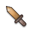 牙签 | 普通 | +2 近战伤害，-5 射程 | 13 | ∞ |
|  橡皮筋 | 普通 | +2 远程伤害 | 13 | ∞ |
|  打火机 | 普通 | +2 元素伤害 | 13 | ∞ |
|  围裙 | 普通 | +2 护甲 | 15 | ∞ |
|  黑咖啡 | 普通 | -1 最大生命，+6% 攻击速度 | 15 | ∞ |
|  旧球鞋 | 普通 | +5% 移动速度 | 14 | ∞ |
|  四叶草 | 普通 | +8 幸运 | 12 | ∞ |
| 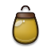 种子袋 | 普通 | +6 收获 | 16 | ∞ |
|  冰箱贴 | 普通 | +30 拾取范围 | 10 | ∞ |
|  老花镜 | 普通 | +30 射程，-1% 闪避 | 14 | ∞ |
|  羽毛 | 普通 | +3% 闪避 | 14 | ∞ |
|  辣酱包 | 普通 | +5% 全伤害 | 14 | ∞ |
|  食谱笔记 | 普通 | +10% 经验获取 | 14 | ∞ |
|  刷新券 | 普通 | 每波商店刷新次数 +1 | 18 | 3 |
|  强力磁铁 | 稀有 | +3 收获，+80 拾取范围 | 30 | ∞ |
|  厨师帽 | 稀有 | +3 最大生命，+3 近战伤害，+1 护甲 | 35 | ∞ |
|  瞄准镜 | 稀有 | +3 远程伤害，+3% 暴击率，+40 射程 | 38 | ∞ |
|  电池 | 稀有 | +3 元素伤害，+5% 攻击速度 | 36 | ∞ |
| 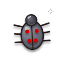 蚊子标本 | 稀有 | -2 最大生命，+4% 吸血 | 40 | ∞ |
|  能量饮料 | 稀有 | -1 生命再生，+10% 攻击速度，+3% 移动速度 | 38 | ∞ |
|  锅盖头盔 | 稀有 | +3 护甲，-3% 移动速度 | 40 | ∞ |
|  存钱罐 | 稀有 | 每波结束获得当前番茄籽 10% 的利息（每波上限 6×波次） | 30 | 3 |
|  爆裂种子 | 稀有 | +3% 全伤害，击杀敌人时 10% 概率爆炸 | 42 | ∞ |
|  仙人掌 | 稀有 | +2 护甲，受到伤害时对攻击者造成 8 点伤害 | 34 | ∞ |
|  招财猫 | 稀有 | +12 幸运，10% 概率番茄籽翻倍 | 38 | ∞ |
|  跑鞋 | 稀有 | +2% 闪避，+10% 移动速度 | 38 | ∞ |
|  柠檬水 | 稀有 | +3 最大生命，+3 生命再生 | 36 | ∞ |
|  绷带卷 | 稀有 | +5 最大生命，+1 生命再生，每击杀 25 个敌人回复 1 生命 | 40 | ∞ |
|  会员卡 | 史诗 | +5 幸运，每波商店刷新次数 +2 | 55 | 2 |
|  吸尘器 | 史诗 | +5 幸运，+150 拾取范围 | 60 | ∞ |
|  铁锅盾 | 史诗 | +5 最大生命，+5 护甲，-5% 移动速度 | 70 | ∞ |
|  磨刀石 | 史诗 | +3 近战伤害，+10% 暴击率 | 72 | ∞ |
|  特斯拉线圈 | 史诗 | +4 元素伤害，命中时 10% 概率召唤闪电 | 75 | ∞ |
|  泡泡糖 | 史诗 | +3% 闪避，每 10 秒获得一次抵挡伤害的泡泡护盾 | 70 | 1 |
|  魔鬼椒 | 史诗 | +5% 全伤害，+3 元素伤害，所有命中 20% 概率造成灼烧 | 68 | ∞ |
|  双肩背包 | 史诗 | -3% 移动速度，武器栏 +1 | 80 | 2 |
|  优惠券 | 史诗 | 商店价格 -10% | 55 | 3 |
|  蛋白粉 | 史诗 | +10 最大生命，+2 近战伤害，-2% 移动速度 | 75 | ∞ |
|  黄金番茄 | 传说 | +10 最大生命，+15% 全伤害，+15 幸运 | 120 | ∞ |
|  凤凰羽毛 | 传说 | +3 生命再生，死亡时以 50% 生命复活一次 | 110 | 1 |
|  大厨刀具套装 | 传说 | +8 近战伤害，+8% 攻击速度，+8% 暴击率 | 130 | ∞ |
|  电磁核心 | 传说 | +8 远程伤害，+8% 攻击速度，+60 射程 | 130 | ∞ |
|  外婆的秘方 | 传说 | +20 幸运，+25 收获，+25% 经验获取 | 115 | ∞ |
|  吸血鬼披风 | 传说 | +10% 吸血，+8% 全伤害，+5% 闪避 | 125 | ∞ |

## 系列道具（52 个系列）

| 系列 | 道具（普通→传说） |
| --- | --- |
| [番茄制品](#series-1) | 番茄干、番茄泥、樱桃番茄、番茄种子、浓缩番茄汁、番茄炖菜、番茄罐头、番茄酱大王瓶、传家番茄、番茄之心 |
| [香料](#series-2) | 黑胡椒粒、花椒、八角、桂皮、孜然粉、咖喱块、十三香、辣椒精、魔鬼椒粉、龙息香料 |
| [酱料](#series-3) | 酱油、醋、蚝油、甜面酱、豆瓣酱、沙茶酱、XO酱、秘制烤肉酱、血色辣酱、永恒母酱 |
| [刀具](#series-4) | 水果刀、削皮刀、面包刀、剔骨刀、片鱼刀、斩骨刀、柳刃刀、大马士革刀、屠龙菜刀、名匠之刃 |
| [锅具](#series-5) | 奶锅、汤锅、蒸笼、砂锅、高压锅、珐琅锅、铸铁锅、千层锅盾、不锈钢堡垒、老祖宗铁锅 |
| [餐具](#series-6) | 筷子、汤匙、叉子、餐刀、银叉、金汤匙、象牙筷、双龙筷、神速筷、宴会银器 |
| [玩具枪](#series-7) | 水枪、橡皮筋枪、泡泡枪、软弹枪、弹珠枪、气动枪、激光笔、精准瞄具、狙击水枪、豪华弹射器 |
| [弹药](#series-8) | 豆子弹、玉米粒弹、石子、弹珠、钢珠、穿甲豆、爆裂弹、追踪弹、钨芯弹、星辰弹药 |
| [火焰](#series-9) | 火柴、蜡烛、酒精灯、打火石、火焰喷嘴、岩浆石、凤凰炭、烈焰核心、太阳碎片、不灭之火 |
| [冰品](#series-10) | 冰块、冰棍、雪糕、刨冰、冰淇淋、干冰、冰川水、永冻晶石、极寒之心、冰雪女王冠 |
| [雷电](#series-11) | 纽扣电池、干电池、充电宝、静电毛衣、避雷针、电容器、闪电瓶、雷神电池、暴风雷核、宙斯之火花 |
| [毒物](#series-12) | 发霉面包、变质牛奶、毒蘑菇片、臭豆腐、蛇毒瓶、蝎尾、剧毒孢子、瘟疫烧瓶、腐化之核、万毒之王 |
| [草药](#series-13) | 薄荷叶、甘草、枸杞、金银花、人参须、灵芝片、雪莲、千年人参、仙草、生命之树叶 |
| [茶饮](#series-14) | 绿茶、红茶、奶茶、乌龙茶、抹茶、普洱饼、金骏眉、大红袍、仙人茶、永恒茶壶 |
| [咖啡](#series-15) | 速溶咖啡、拿铁、美式咖啡、卡布奇诺、浓缩咖啡、冷萃咖啡、猫屎咖啡、三倍浓缩、咖啡因结晶、时间停止咖啡 |
| [甜点](#series-16) | 棒棒糖、软糖、棉花糖、马卡龙、甜甜圈、舒芙蕾、千层蛋糕、彩虹蛋糕、皇家布丁、梦幻甜点塔 |
| [面包](#series-17) | 吐司、馒头、法棍、牛角包、贝果、菠萝包、全麦面包、石炉面包、黄金面包、面包之神 |
| [奶酪](#series-18) | 奶酪片、奶酪条、马苏里拉、切达奶酪、蓝纹奶酪、帕玛森、百年陈酪、奶酪堡垒、至尊奶酪轮、奶酪女神 |
| [海鲜](#series-19) | 小鱼干、虾皮、海带、扇贝、生蚝、龙虾钳、帝王蟹、金枪鱼大腹、深海珍珠、海王之鳞 |
| [蛋类](#series-20) | 鸡蛋、鹌鹑蛋、鸭蛋、咸蛋、皮蛋、溏心蛋、鸵鸟蛋、金蛋、龙蛋、混沌之卵 |
| [农具](#series-21) | 小铲子、水壶、草帽、锄头、镰刀、稻草人、拖拉机钥匙、丰收号角、大地之犁、丰饶女神镰 |
| [种子](#series-22) | 葵花籽、南瓜子、西瓜子、莲子、松子、银杏果、魔豆、星光种子、世界树种子、创世之种 |
| [昆虫标本](#series-23) | 蚂蚁标本、瓢虫标本、蝴蝶标本、甲虫标本、螳螂标本、蜂后标本、蝎子标本、黄金圣甲虫、吸血蝙蝠、虫王琥珀 |
| [鞋子](#series-24) | 拖鞋、凉鞋、布鞋、帆布鞋、跑步鞋、溜冰鞋、弹簧鞋、疾风靴、火箭靴、赫尔墨斯之翼 |
| [帽子](#series-25) | 毛线帽、棒球帽、渔夫帽、贝雷帽、礼帽、魔术帽、将军帽、隐身斗笠、魔王之冠、百变神帽 |
| [手套](#series-26) | 洗碗手套、隔热手套、棉手套、皮手套、拳击手套、铁手套、烈焰拳套、巨人护手、雷霆拳套、神之手 |
| [盾牌](#series-27) | 锅盖、砧板、垃圾桶盖、木盾、圆盾、塔盾、刺盾、反击之盾、不破之壁、圣盾 |
| [书籍](#series-28) | 菜谱、笔记本、百科全书、地图册、魔法入门、战术手册、禁书、贤者之书、万物图鉴、知识之源 |
| [卷轴](#series-29) | 便签、符纸、咒语卷、召唤卷轴、火球卷轴、冰霜卷轴、雷霆卷轴、禁咒卷轴、天启卷轴、创世卷轴 |
| [宝石](#series-30) | 玻璃珠、石英、玛瑙、紫水晶、翡翠、蓝宝石、红宝石、钻石、星辰宝石、无限宝石 |
| [戒指](#series-31) | 易拉罐环、铜戒、银戒、金戒、宝石戒指、猎手之戒、暴君之戒、王者之戒、命运之戒、至尊魔戒 |
| [护身符](#series-32) | 平安符、红绳、幸运硬币、护身石、驱虫香囊、圣徽、守护水晶、天使之泪、神明加护、永恒守护 |
| [钱币](#series-33) | 一毛钱、硬币、纪念币、银元、金币、古钱币、藏宝图、聚宝盆、点金石、财神之手 |
| [药水](#series-34) | 红药水、蓝药水、绿药水、解毒剂、回复药、高级回复药、万能药、不死药水、凤凰药剂、生命之泉 |
| [骨头](#series-35) | 鸡骨头、鱼刺、猪骨、牛骨、恐龙骨、骷髅头、诅咒之骨、死灵骨杖、骨龙之牙、冥王之骨 |
| [羽毛](#series-36) | 鸡毛、鸭毛、鸽子羽毛、孔雀羽、鹰羽、天鹅羽、雷鸟之羽、凤凰尾羽、天使之羽、神鸟金羽 |
| [糖果](#series-37) | 水果糖、奶糖、跳跳糖、巧克力、太妃糖、酒心糖、彩虹糖、魔法糖果、许愿糖、永恒甜蜜 |
| [机械零件](#series-38) | 螺丝、螺母、弹簧、齿轮、轴承、马达、活塞、涡轮、永动机、机械之心 |
| [能源](#series-39) | 五号电池、纽扣电池、太阳能板、锂电池、燃料电池、聚变电池、反物质电池、核电池、零点能源、宇宙能源 |
| [面具](#series-40) | 口罩、眼罩、纸面具、京剧脸谱、狐狸面具、傩面、忍者面具、鬼面、千面之面、无相之面 |
| [玩具](#series-41) | 弹力球、陀螺、积木、拼图、魔方、遥控车、机器人玩具、限定手办、传说卡牌、童心之匣 |
| [乐器](#series-42) | 口哨、铃铛、口琴、三角铁、小鼓、吉他拨片、小号、金色竖琴、战鼓、天籁之音 |
| [暗黑](#series-43) | 黑猫毛、乌鸦羽、诅咒娃娃、暗影布、邪眼、恶魔角、深渊之石、魔王契约、虚空之眼、混沌黑洞 |
| [神圣](#series-44) | 白蜡烛、圣水、念珠、祈祷书、天使雕像、圣光碎片、神圣护符、神之祝福、圣杯、光明之心 |
| [忍具](#series-45) | 苦无、手里剑、烟雾弹、钩爪、忍者绳、飞镖、影分身卷、暗杀匕首、忍之极意、影之王 |
| [海盗](#series-46) | 独眼罩、朗姆酒、望远镜、船锚、弯刀、火枪、宝箱钥匙、黑胡子旗、幽灵船舵、海盗王宝藏 |
| [实验](#series-47) | 试管、烧杯、放大镜、显微镜、化学试剂、离心机、等离子瓶、粒子加速器、反物质、宇宙方程式 |
| [运动](#series-48) | 跳绳、哑铃、网球、篮球、拳击绷带、运动饮料、奥运奖牌、冠军腰带、传奇球衣、体育之神 |
| [腐败](#series-49) | 烂菜叶、馊饭、腐烂苹果、霉菌样本、沼气瓶、腐蚀液、瘟疫之瓶、腐王之眼、堕落精华、终焉腐化 |
| [技能秘籍](#series-50) | 入门心法、招式图解、奥义残页、必杀技手册、绝招秘录、宗师笔记、奥义真解、天书残卷、无上心经、大招圣典 |
| [技能法器](#series-51) | 扩音喇叭、放大镜片、延时沙漏、共鸣水晶、聚能棱镜、时之砂、空间罗盘、永恒沙漏、星辰罗盘、天穹法器 |
| [星辰](#series-52) | 星星贴纸、流星碎片、星砂、月光石、北极星、星座图、银河之尘、超新星、星辰之核、宇宙之眼 |

### 番茄制品

| 道具 | 稀有度 | 效果 | 价格 | 上限 |
| --- | --- | --- | --- | --- |
|  番茄干 | 普通 | +2 最大生命，+1 生命再生 | 15 | ∞ |
|  番茄泥 | 普通 | +3 最大生命 | 15 | ∞ |
|  樱桃番茄 | 普通 | +1 最大生命，+1 生命再生 | 15 | ∞ |
|  番茄种子 | 普通 | +3 最大生命 | 15 | ∞ |
|  浓缩番茄汁 | 稀有 | +2 最大生命，+1 生命再生，果实回血 +38% | 36 | ∞ |
|  番茄炖菜 | 稀有 | +3 最大生命，+3 生命再生 | 36 | ∞ |
|  番茄罐头 | 稀有 | +2 最大生命，+1 生命再生，果实回血 +40% | 36 | ∞ |
|  番茄酱大王瓶 | 史诗 | +6 最大生命，+3 生命再生，-6% 移动速度，果实回血 +96% | 73 | ∞ |
| 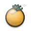 传家番茄 | 史诗 | +3 最大生命，+3 生命再生，果实回血 +68% | 73 | ∞ |
|  番茄之心 | 传说 | +12 最大生命，+5 生命再生，-10% 移动速度，果实回血 +131% | 123 | ∞ |

### 香料

| 道具 | 稀有度 | 效果 | 价格 | 上限 |
| --- | --- | --- | --- | --- |
|  黑胡椒粒 | 普通 | +4% 元素武器伤害，+2% 暴击率 | 15 | ∞ |
|  花椒 | 普通 | +7% 元素武器伤害 | 15 | ∞ |
|  八角 | 普通 | +3% 元素武器伤害，+3% 暴击率 | 15 | ∞ |
|  桂皮 | 普通 | +7% 元素武器伤害 | 15 | ∞ |
|  孜然粉 | 稀有 | +5% 元素武器伤害，+2% 暴击率，命中时11% 概率灼烧 | 36 | ∞ |
|  咖喱块 | 稀有 | +6% 元素武器伤害，+6% 暴击率 | 36 | ∞ |
|  十三香 | 稀有 | +5% 元素武器伤害，+2% 暴击率，命中时12% 概率灼烧 | 36 | ∞ |
|  辣椒精 | 史诗 | -3 最大生命，+12% 元素武器伤害，+5% 暴击率，命中时28% 概率灼烧 | 73 | ∞ |
|  魔鬼椒粉 | 史诗 | +6% 元素武器伤害，+6% 暴击率，命中时21% 概率灼烧 | 73 | ∞ |
|  龙息香料 | 传说 | -6 最大生命，+26% 元素武器伤害，+11% 暴击率，命中时39% 概率灼烧 | 123 | ∞ |

### 酱料

| 道具 | 稀有度 | 效果 | 价格 | 上限 |
| --- | --- | --- | --- | --- |
|  酱油 | 普通 | +1 生命再生，+1% 吸血 | 15 | ∞ |
|  醋 | 普通 | +2% 吸血 | 15 | ∞ |
|  蚝油 | 普通 | +1 生命再生，+1% 吸血 | 15 | ∞ |
|  甜面酱 | 普通 | +2% 吸血 | 15 | ∞ |
|  豆瓣酱 | 稀有 | +1 生命再生，+1% 吸血，击杀时获得14% 概率嗜血 | 36 | ∞ |
|  沙茶酱 | 稀有 | +3 生命再生，+2% 吸血 | 36 | ∞ |
|  XO酱 | 稀有 | +1 生命再生，+1% 吸血，击杀时获得15% 概率嗜血 | 36 | ∞ |
|  秘制烤肉酱 | 史诗 | +3 生命再生，+3% 吸血，-2 护甲，击杀时获得35% 概率嗜血 | 73 | ∞ |
|  血色辣酱 | 史诗 | +3 生命再生，+2% 吸血，击杀时获得26% 概率嗜血 | 73 | ∞ |
|  永恒母酱 | 传说 | +5 生命再生，+7% 吸血，-4 护甲，击杀时获得49% 概率嗜血 | 123 | ∞ |

### 刀具

| 道具 | 稀有度 | 效果 | 价格 | 上限 |
| --- | --- | --- | --- | --- |
|  水果刀 | 普通 | +4% 近战武器伤害，+2% 暴击率 | 15 | ∞ |
| 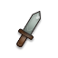 削皮刀 | 普通 | +7% 近战武器伤害 | 15 | ∞ |
| 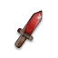 面包刀 | 普通 | +3% 近战武器伤害，+3% 暴击率 | 15 | ∞ |
| 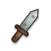 剔骨刀 | 普通 | +7% 近战武器伤害 | 15 | ∞ |
|  片鱼刀 | 稀有 | +5% 近战武器伤害，+2% 暴击率，命中时11% 概率流血 | 36 | ∞ |
| 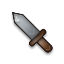 斩骨刀 | 稀有 | +6% 近战武器伤害，+6% 暴击率 | 36 | ∞ |
| 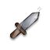 柳刃刀 | 稀有 | +5% 近战武器伤害，+2% 暴击率，命中时12% 概率流血 | 36 | ∞ |
|  大马士革刀 | 史诗 | +13% 近战武器伤害，+5% 暴击率，-35 射程，命中时29% 概率流血 | 73 | ∞ |
| 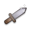 屠龙菜刀 | 史诗 | +6% 近战武器伤害，+6% 暴击率，命中时21% 概率流血 | 73 | ∞ |
|  名匠之刃 | 传说 | +26% 近战武器伤害，+11% 暴击率，-60 射程，命中时39% 概率流血 | 123 | ∞ |

### 锅具

| 道具 | 稀有度 | 效果 | 价格 | 上限 |
| --- | --- | --- | --- | --- |
|  奶锅 | 普通 | +1 最大生命，+1 护甲 | 15 | ∞ |
|  汤锅 | 普通 | +2 护甲 | 15 | ∞ |
|  蒸笼 | 普通 | +2 最大生命，+1 护甲 | 15 | ∞ |
|  砂锅 | 普通 | +2 护甲 | 15 | ∞ |
|  高压锅 | 稀有 | +2 最大生命，+2 护甲，受伤时获得坚韧 | 36 | ∞ |
|  珐琅锅 | 稀有 | +4 最大生命，+2 护甲 | 36 | ∞ |
|  铸铁锅 | 稀有 | +2 最大生命，+2 护甲，受伤时获得坚韧 | 36 | ∞ |
|  千层锅盾 | 史诗 | +4 最大生命，+4 护甲，-6% 移动速度，受伤时获得2层坚韧 | 73 | ∞ |
|  不锈钢堡垒 | 史诗 | +4 最大生命，+2 护甲，受伤时获得2层坚韧 | 73 | ∞ |
|  老祖宗铁锅 | 传说 | +8 最大生命，+8 护甲，-10% 移动速度，受伤时获得3层坚韧 | 123 | ∞ |

### 餐具

| 道具 | 稀有度 | 效果 | 价格 | 上限 |
| --- | --- | --- | --- | --- |
|  筷子 | 普通 | +1 近战伤害，+2% 攻击速度 | 15 | ∞ |
|  汤匙 | 普通 | +2 近战伤害 | 15 | ∞ |
| 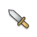 叉子 | 普通 | +1 近战伤害，+3% 攻击速度 | 15 | ∞ |
| 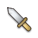 餐刀 | 普通 | +2 近战伤害 | 15 | ∞ |
|  银叉 | 稀有 | +2 近战伤害，+2% 攻击速度，击杀时获得24% 概率怒气 | 36 | ∞ |
|  金汤匙 | 稀有 | +2 近战伤害，+6% 攻击速度 | 36 | ∞ |
| 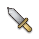 象牙筷 | 稀有 | +2 近战伤害，+2% 攻击速度，击杀时获得25% 概率怒气 | 36 | ∞ |
|  双龙筷 | 史诗 | +4 近战伤害，+6% 攻击速度，-2 护甲，击杀时获得58% 概率怒气 | 73 | ∞ |
|  神速筷 | 史诗 | +2 近战伤害，+6% 攻击速度，击杀时获得43% 概率怒气 | 73 | ∞ |
|  宴会银器 | 传说 | +8 近战伤害，+12% 攻击速度，-4 护甲，击杀时获得82% 概率怒气 | 123 | ∞ |

### 玩具枪

| 道具 | 稀有度 | 效果 | 价格 | 上限 |
| --- | --- | --- | --- | --- |
|  水枪 | 普通 | +1 远程伤害，+15 射程 | 15 | ∞ |
|  橡皮筋枪 | 普通 | +2 远程伤害 | 15 | ∞ |
|  泡泡枪 | 普通 | +1 远程伤害，+20 射程 | 15 | ∞ |
|  软弹枪 | 普通 | +2 远程伤害 | 15 | ∞ |
|  弹珠枪 | 稀有 | +2 远程伤害，+15 射程，命中时7% 概率标记 | 36 | ∞ |
|  气动枪 | 稀有 | +2 远程伤害，+45 射程 | 36 | ∞ |
|  激光笔 | 稀有 | +2 远程伤害，+15 射程，命中时7% 概率标记 | 36 | ∞ |
|  精准瞄具 | 史诗 | -2 近战伤害，+4 远程伤害，+40 射程，命中时16% 概率标记 | 73 | ∞ |
|  狙击水枪 | 史诗 | +2 远程伤害，+40 射程，命中时12% 概率标记 | 73 | ∞ |
|  豪华弹射器 | 传说 | -4 近战伤害，+8 远程伤害，+80 射程，命中时20% 概率标记 | 123 | ∞ |

### 弹药

| 道具 | 稀有度 | 效果 | 价格 | 上限 |
| --- | --- | --- | --- | --- |
|  豆子弹 | 普通 | +4% 远程武器伤害，+2% 攻击速度 | 15 | ∞ |
|  玉米粒弹 | 普通 | +7% 远程武器伤害 | 15 | ∞ |
|  石子 | 普通 | +3% 远程武器伤害，+3% 攻击速度 | 15 | ∞ |
|  弹珠 | 普通 | +7% 远程武器伤害 | 15 | ∞ |
|  钢珠 | 稀有 | +5% 远程武器伤害，+2% 攻击速度，命中时12% 概率破甲 | 36 | ∞ |
|  穿甲豆 | 稀有 | +6% 远程武器伤害，+6% 攻击速度 | 36 | ∞ |
|  爆裂弹 | 稀有 | +5% 远程武器伤害，+2% 攻击速度，命中时13% 概率破甲 | 36 | ∞ |
|  追踪弹 | 史诗 | +12% 远程武器伤害，+6% 攻击速度，-3% 闪避，命中时30% 概率破甲 | 73 | ∞ |
|  钨芯弹 | 史诗 | +6% 远程武器伤害，+6% 攻击速度，命中时22% 概率破甲 | 73 | ∞ |
|  星辰弹药 | 传说 | +26% 远程武器伤害，+12% 攻击速度，-6% 闪避，命中时40% 概率破甲 | 123 | ∞ |

### 火焰

| 道具 | 稀有度 | 效果 | 价格 | 上限 |
| --- | --- | --- | --- | --- |
|  火柴 | 普通 | +3% 元素武器伤害，+1 元素伤害 | 15 | ∞ |
|  蜡烛 | 普通 | +2 元素伤害 | 15 | ∞ |
|  酒精灯 | 普通 | +4% 元素武器伤害，+1 元素伤害 | 15 | ∞ |
|  打火石 | 普通 | +2 元素伤害 | 15 | ∞ |
|  火焰喷嘴 | 稀有 | +3% 元素武器伤害，+2 元素伤害，命中时11% 概率灼烧 | 36 | ∞ |
|  岩浆石 | 稀有 | +9% 元素武器伤害，+2 元素伤害 | 36 | ∞ |
|  凤凰炭 | 稀有 | +3% 元素武器伤害，+2 元素伤害，命中时12% 概率灼烧 | 36 | ∞ |
|  烈焰核心 | 史诗 | -2 生命再生，+8% 元素武器伤害，+4 元素伤害，命中时28% 概率灼烧 | 73 | ∞ |
|  太阳碎片 | 史诗 | +9% 元素武器伤害，+2 元素伤害，命中时21% 概率灼烧 | 73 | ∞ |
|  不灭之火 | 传说 | -4 生命再生，+17% 元素武器伤害，+8 元素伤害，命中时39% 概率灼烧 | 123 | ∞ |

### 冰品

| 道具 | 稀有度 | 效果 | 价格 | 上限 |
| --- | --- | --- | --- | --- |
|  冰块 | 普通 | +1 元素伤害，+1 护甲 | 15 | ∞ |
|  冰棍 | 普通 | +2 元素伤害 | 15 | ∞ |
|  雪糕 | 普通 | +1 元素伤害，+1 护甲 | 15 | ∞ |
|  刨冰 | 普通 | +2 元素伤害 | 15 | ∞ |
|  冰淇淋 | 稀有 | +2 元素伤害，+1 护甲，命中时19% 概率减速 | 36 | ∞ |
|  干冰 | 稀有 | +2 元素伤害，+3 护甲 | 36 | ∞ |
|  冰川水 | 稀有 | +2 元素伤害，+1 护甲，命中时20% 概率减速 | 36 | ∞ |
|  永冻晶石 | 史诗 | +4 元素伤害，+3 护甲，-6% 移动速度，命中时48% 概率减速 | 73 | ∞ |
|  极寒之心 | 史诗 | +2 元素伤害，+3 护甲，命中时34% 概率减速 | 73 | ∞ |
|  冰雪女王冠 | 传说 | +8 元素伤害，+5 护甲，-10% 移动速度，命中时50% 概率减速 | 123 | ∞ |

### 雷电

| 道具 | 稀有度 | 效果 | 价格 | 上限 |
| --- | --- | --- | --- | --- |
|  纽扣电池 | 普通 | +1 元素伤害，+2% 攻击速度 | 15 | ∞ |
|  干电池 | 普通 | +2 元素伤害 | 15 | ∞ |
|  充电宝 | 普通 | +1 元素伤害，+3% 攻击速度 | 15 | ∞ |
|  静电毛衣 | 普通 | +2 元素伤害 | 15 | ∞ |
|  避雷针 | 稀有 | +2 元素伤害，+2% 攻击速度，命中 5% 概率落雷 | 36 | ∞ |
|  电容器 | 稀有 | +2 元素伤害，+6% 攻击速度 | 36 | ∞ |
|  闪电瓶 | 稀有 | +2 元素伤害，+2% 攻击速度，命中 5% 概率落雷 | 36 | ∞ |
|  雷神电池 | 史诗 | +4 元素伤害，+6% 攻击速度，-2 护甲，命中 12% 概率落雷 | 73 | ∞ |
|  暴风雷核 | 史诗 | +2 元素伤害，+6% 攻击速度，命中 9% 概率落雷 | 73 | ∞ |
|  宙斯之火花 | 传说 | +8 元素伤害，+12% 攻击速度，-4 护甲，命中 16% 概率落雷 | 123 | ∞ |

### 毒物

| 道具 | 稀有度 | 效果 | 价格 | 上限 |
| --- | --- | --- | --- | --- |
|  发霉面包 | 普通 | +1 元素伤害，+3 幸运 | 15 | ∞ |
|  变质牛奶 | 普通 | +2 元素伤害 | 15 | ∞ |
|  毒蘑菇片 | 普通 | +1 元素伤害，+6 幸运 | 15 | ∞ |
|  臭豆腐 | 普通 | +2 元素伤害 | 15 | ∞ |
|  蛇毒瓶 | 稀有 | +2 元素伤害，+4 幸运，命中时14% 概率中毒 | 36 | ∞ |
|  蝎尾 | 稀有 | +2 元素伤害，+12 幸运 | 36 | ∞ |
|  剧毒孢子 | 稀有 | +2 元素伤害，+4 幸运，命中时15% 概率中毒 | 36 | ∞ |
|  瘟疫烧瓶 | 史诗 | -3 最大生命，+4 元素伤害，+10 幸运，命中时35% 概率中毒 | 73 | ∞ |
|  腐化之核 | 史诗 | +2 元素伤害，+11 幸运，命中时26% 概率中毒 | 73 | ∞ |
|  万毒之王 | 传说 | -6 最大生命，+8 元素伤害，+22 幸运，命中时45% 概率中毒 | 123 | ∞ |

### 草药

| 道具 | 稀有度 | 效果 | 价格 | 上限 |
| --- | --- | --- | --- | --- |
|  薄荷叶 | 普通 | +1 最大生命，+1 生命再生 | 15 | ∞ |
|  甘草 | 普通 | +2 生命再生 | 15 | ∞ |
|  枸杞 | 普通 | +2 最大生命，+1 生命再生 | 15 | ∞ |
|  金银花 | 普通 | +2 生命再生 | 15 | ∞ |
|  人参须 | 稀有 | +2 最大生命，+2 生命再生，受伤时获得再生 | 36 | ∞ |
|  灵芝片 | 稀有 | +4 最大生命，+2 生命再生 | 36 | ∞ |
|  雪莲 | 稀有 | +2 最大生命，+2 生命再生，受伤时获得再生 | 36 | ∞ |
|  千年人参 | 史诗 | +4 最大生命，+4 生命再生，-6% 全伤害，受伤时获得2层再生 | 73 | ∞ |
|  仙草 | 史诗 | +4 最大生命，+2 生命再生，受伤时获得2层再生 | 73 | ∞ |
|  生命之树叶 | 传说 | +8 最大生命，+8 生命再生，-10% 全伤害，受伤时获得3层再生 | 123 | ∞ |

### 茶饮

| 道具 | 稀有度 | 效果 | 价格 | 上限 |
| --- | --- | --- | --- | --- |
|  绿茶 | 普通 | +3% 攻击速度，+3% 技能冷却缩减 | 15 | ∞ |
|  红茶 | 普通 | +5% 攻击速度 | 15 | ∞ |
|  奶茶 | 普通 | +2% 攻击速度，+4% 技能冷却缩减 | 15 | ∞ |
|  乌龙茶 | 普通 | +5% 攻击速度 | 15 | ∞ |
|  抹茶 | 稀有 | +3% 攻击速度，+3% 技能冷却缩减，每 17 秒获得2层急速 | 36 | 2 |
|  普洱饼 | 稀有 | +4% 攻击速度，+9% 技能冷却缩减 | 36 | ∞ |
|  金骏眉 | 稀有 | +4% 攻击速度，+3% 技能冷却缩减，每 17 秒获得2层急速 | 36 | 2 |
|  大红袍 | 史诗 | -3 最大生命，+8% 攻击速度，+8% 技能冷却缩减，每 12 秒获得2层急速 | 73 | 2 |
|  仙人茶 | 史诗 | +4% 攻击速度，+8% 技能冷却缩减，每 14 秒获得2层急速 | 73 | 2 |
|  永恒茶壶 | 传说 | -6 最大生命，+18% 攻击速度，+16% 技能冷却缩减，每 9 秒获得2层急速 | 123 | 2 |

### 咖啡

| 道具 | 稀有度 | 效果 | 价格 | 上限 |
| --- | --- | --- | --- | --- |
|  速溶咖啡 | 普通 | +3% 攻击速度，+2% 移动速度 | 15 | ∞ |
|  拿铁 | 普通 | +5% 攻击速度 | 15 | ∞ |
|  美式咖啡 | 普通 | +2% 攻击速度，+3% 移动速度 | 15 | ∞ |
|  卡布奇诺 | 普通 | +5% 攻击速度 | 15 | ∞ |
|  浓缩咖啡 | 稀有 | +3% 攻击速度，+3% 移动速度，击杀时获得19% 概率急速 | 36 | ∞ |
|  冷萃咖啡 | 稀有 | +4% 攻击速度，+7% 移动速度 | 36 | ∞ |
|  猫屎咖啡 | 稀有 | +4% 攻击速度，+3% 移动速度，击杀时获得20% 概率急速 | 36 | ∞ |
|  三倍浓缩 | 史诗 | -2 生命再生，+8% 攻击速度，+6% 移动速度，击杀时获得46% 概率急速 | 73 | ∞ |
|  咖啡因结晶 | 史诗 | +4% 攻击速度，+7% 移动速度，击杀时获得34% 概率急速 | 73 | ∞ |
|  时间停止咖啡 | 传说 | -4 生命再生，+18% 攻击速度，+13% 移动速度，击杀时获得60% 概率急速 | 123 | ∞ |

### 甜点

| 道具 | 稀有度 | 效果 | 价格 | 上限 |
| --- | --- | --- | --- | --- |
|  棒棒糖 | 普通 | +2 最大生命，+3 幸运 | 15 | ∞ |
|  软糖 | 普通 | +3 最大生命 | 15 | ∞ |
|  棉花糖 | 普通 | +1 最大生命，+6 幸运 | 15 | ∞ |
|  马卡龙 | 普通 | +3 最大生命 | 15 | ∞ |
|  甜甜圈 | 稀有 | +2 最大生命，+4 幸运，每波开始获得护盾（8） | 36 | 2 |
|  舒芙蕾 | 稀有 | +3 最大生命，+12 幸运 | 36 | ∞ |
|  千层蛋糕 | 稀有 | +2 最大生命，+4 幸运，每波开始获得护盾（9） | 36 | 2 |
|  彩虹蛋糕 | 史诗 | +6 最大生命，-5% 攻击速度，+11 幸运，每波开始获得护盾（21） | 73 | 2 |
|  皇家布丁 | 史诗 | +3 最大生命，+11 幸运，每波开始获得护盾（15） | 73 | 2 |
|  梦幻甜点塔 | 传说 | +12 最大生命，-9% 攻击速度，+22 幸运，每波开始获得护盾（29） | 123 | 2 |

### 面包

| 道具 | 稀有度 | 效果 | 价格 | 上限 |
| --- | --- | --- | --- | --- |
|  吐司 | 普通 | +2 最大生命，+1 护甲 | 15 | ∞ |
|  馒头 | 普通 | +3 最大生命 | 15 | ∞ |
|  法棍 | 普通 | +1 最大生命，+1 护甲 | 15 | ∞ |
|  牛角包 | 普通 | +3 最大生命 | 15 | ∞ |
|  贝果 | 稀有 | +2 最大生命，+1 护甲，每波开始获得护盾（8） | 36 | 2 |
|  菠萝包 | 稀有 | +3 最大生命，+3 护甲 | 36 | ∞ |
|  全麦面包 | 稀有 | +2 最大生命，+1 护甲，每波开始获得护盾（9） | 36 | 2 |
|  石炉面包 | 史诗 | +6 最大生命，-5% 攻击速度，+3 护甲，每波开始获得护盾（21） | 73 | 2 |
|  黄金面包 | 史诗 | +3 最大生命，+3 护甲，每波开始获得护盾（15） | 73 | 2 |
|  面包之神 | 传说 | +12 最大生命，-9% 攻击速度，+5 护甲，每波开始获得护盾（29） | 123 | 2 |

### 奶酪

| 道具 | 稀有度 | 效果 | 价格 | 上限 |
| --- | --- | --- | --- | --- |
|  奶酪片 | 普通 | +1 生命再生，+1 护甲 | 15 | ∞ |
|  奶酪条 | 普通 | +2 护甲 | 15 | ∞ |
|  马苏里拉 | 普通 | +1 生命再生，+1 护甲 | 15 | ∞ |
|  切达奶酪 | 普通 | +2 护甲 | 15 | ∞ |
|  蓝纹奶酪 | 稀有 | +1 生命再生，+2 护甲，受伤时获得坚韧 | 36 | ∞ |
|  帕玛森 | 稀有 | +3 生命再生，+2 护甲 | 36 | ∞ |
|  百年陈酪 | 稀有 | +1 生命再生，+2 护甲，受伤时获得坚韧 | 36 | ∞ |
|  奶酪堡垒 | 史诗 | +3 生命再生，+4 护甲，-6% 移动速度，受伤时获得2层坚韧 | 73 | ∞ |
|  至尊奶酪轮 | 史诗 | +3 生命再生，+2 护甲，受伤时获得2层坚韧 | 73 | ∞ |
|  奶酪女神 | 传说 | +5 生命再生，+8 护甲，-10% 移动速度，受伤时获得3层坚韧 | 123 | ∞ |

### 海鲜

| 道具 | 稀有度 | 效果 | 价格 | 上限 |
| --- | --- | --- | --- | --- |
|  小鱼干 | 普通 | +5 幸运，+3 收获 | 15 | ∞ |
|  虾皮 | 普通 | +9 幸运 | 15 | ∞ |
|  海带 | 普通 | +4 幸运，+4 收获 | 15 | ∞ |
|  扇贝 | 普通 | +9 幸运 | 15 | ∞ |
|  生蚝 | 稀有 | +6 幸运，+3 收获，8% 概率番茄籽翻倍 | 36 | ∞ |
|  龙虾钳 | 稀有 | +8 幸运，+9 收获 | 36 | ∞ |
|  帝王蟹 | 稀有 | +7 幸运，+3 收获，8% 概率番茄籽翻倍 | 36 | ∞ |
|  金枪鱼大腹 | 史诗 | -2 护甲，+15 幸运，+8 收获，19% 概率番茄籽翻倍 | 73 | ∞ |
|  深海珍珠 | 史诗 | +8 幸运，+8 收获，14% 概率番茄籽翻倍 | 73 | ∞ |
|  海王之鳞 | 传说 | -4 护甲，+33 幸运，+16 收获，25% 概率番茄籽翻倍 | 123 | ∞ |

### 蛋类

| 道具 | 稀有度 | 效果 | 价格 | 上限 |
| --- | --- | --- | --- | --- |
|  鸡蛋 | 普通 | +2 最大生命，+4% 经验获取 | 15 | ∞ |
| 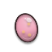 鹌鹑蛋 | 普通 | +3 最大生命 | 15 | ∞ |
|  鸭蛋 | 普通 | +1 最大生命，+7% 经验获取 | 15 | ∞ |
| 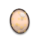 咸蛋 | 普通 | +3 最大生命 | 15 | ∞ |
| 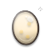 皮蛋 | 稀有 | +2 最大生命，+5% 经验获取，受伤时获得再生 | 36 | ∞ |
| 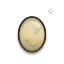 溏心蛋 | 稀有 | +3 最大生命，+14% 经验获取 | 36 | ∞ |
|  鸵鸟蛋 | 稀有 | +2 最大生命，+5% 经验获取，受伤时获得再生 | 36 | ∞ |
|  金蛋 | 史诗 | +6 最大生命，-6% 全伤害，+13% 经验获取，受伤时获得2层再生 | 73 | ∞ |
|  龙蛋 | 史诗 | +3 最大生命，+14% 经验获取，受伤时获得2层再生 | 73 | ∞ |
|  混沌之卵 | 传说 | +12 最大生命，-10% 全伤害，+27% 经验获取，受伤时获得3层再生 | 123 | ∞ |

### 农具

| 道具 | 稀有度 | 效果 | 价格 | 上限 |
| --- | --- | --- | --- | --- |
| 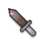 小铲子 | 普通 | +1 最大生命，+4 收获 | 15 | ∞ |
| 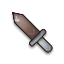 水壶 | 普通 | +7 收获 | 15 | ∞ |
| 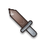 草帽 | 普通 | +2 最大生命，+3 收获 | 15 | ∞ |
|  锄头 | 普通 | +7 收获 | 15 | ∞ |
|  镰刀 | 稀有 | +2 最大生命，+5 收获，8% 概率番茄籽翻倍 | 36 | ∞ |
|  稻草人 | 稀有 | +4 最大生命，+6 收获 | 36 | ∞ |
| 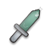 拖拉机钥匙 | 稀有 | +2 最大生命，+5 收获，8% 概率番茄籽翻倍 | 36 | ∞ |
|  丰收号角 | 史诗 | +4 最大生命，-6% 移动速度，+12 收获，19% 概率番茄籽翻倍 | 73 | ∞ |
| 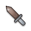 大地之犁 | 史诗 | +4 最大生命，+6 收获，14% 概率番茄籽翻倍 | 73 | ∞ |
|  丰饶女神镰 | 传说 | +8 最大生命，-10% 移动速度，+24 收获，25% 概率番茄籽翻倍 | 123 | ∞ |

### 种子

| 道具 | 稀有度 | 效果 | 价格 | 上限 |
| --- | --- | --- | --- | --- |
| 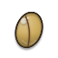 葵花籽 | 普通 | +3 幸运，+4 收获 | 15 | ∞ |
| 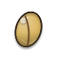 南瓜子 | 普通 | +7 收获 | 15 | ∞ |
| 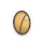 西瓜子 | 普通 | +6 幸运，+3 收获 | 15 | ∞ |
| 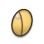 莲子 | 普通 | +7 收获 | 15 | ∞ |
|  松子 | 稀有 | +4 幸运，+5 收获，8% 概率番茄籽翻倍 | 36 | ∞ |
| 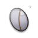 银杏果 | 稀有 | +12 幸运，+6 收获 | 36 | ∞ |
|  魔豆 | 稀有 | +4 幸运，+5 收获，8% 概率番茄籽翻倍 | 36 | ∞ |
|  星光种子 | 史诗 | -6% 全伤害，+11 幸运，+12 收获，19% 概率番茄籽翻倍 | 73 | ∞ |
|  世界树种子 | 史诗 | +11 幸运，+6 收获，14% 概率番茄籽翻倍 | 73 | ∞ |
| 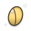 创世之种 | 传说 | -10% 全伤害，+22 幸运，+24 收获，25% 概率番茄籽翻倍 | 123 | ∞ |

### 昆虫标本

| 道具 | 稀有度 | 效果 | 价格 | 上限 |
| --- | --- | --- | --- | --- |
|  蚂蚁标本 | 普通 | +1% 吸血，+2% 暴击率 | 15 | ∞ |
|  瓢虫标本 | 普通 | +2% 吸血 | 15 | ∞ |
|  蝴蝶标本 | 普通 | +1% 吸血，+3% 暴击率 | 15 | ∞ |
|  甲虫标本 | 普通 | +2% 吸血 | 15 | ∞ |
|  螳螂标本 | 稀有 | +1% 吸血，+2% 暴击率，击杀时获得14% 概率嗜血 | 36 | ∞ |
|  蜂后标本 | 稀有 | +2% 吸血，+6% 暴击率 | 36 | ∞ |
|  蝎子标本 | 稀有 | +1% 吸血，+2% 暴击率，击杀时获得15% 概率嗜血 | 36 | ∞ |
|  黄金圣甲虫 | 史诗 | -3 最大生命，+3% 吸血，+5% 暴击率，击杀时获得35% 概率嗜血 | 73 | ∞ |
|  吸血蝙蝠 | 史诗 | +2% 吸血，+6% 暴击率，击杀时获得26% 概率嗜血 | 73 | ∞ |
|  虫王琥珀 | 传说 | -6 最大生命，+7% 吸血，+11% 暴击率，击杀时获得49% 概率嗜血 | 123 | ∞ |

### 鞋子

| 道具 | 稀有度 | 效果 | 价格 | 上限 |
| --- | --- | --- | --- | --- |
|  拖鞋 | 普通 | +1% 闪避，+3% 移动速度 | 15 | ∞ |
|  凉鞋 | 普通 | +5% 移动速度 | 15 | ∞ |
|  布鞋 | 普通 | +2% 闪避，+2% 移动速度 | 15 | ∞ |
|  帆布鞋 | 普通 | +6% 移动速度 | 15 | ∞ |
|  跑步鞋 | 稀有 | +2% 闪避，+4% 移动速度，击杀时获得19% 概率急速 | 36 | ∞ |
| 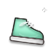 溜冰鞋 | 稀有 | +4% 闪避，+5% 移动速度 | 36 | ∞ |
|  弹簧鞋 | 稀有 | +2% 闪避，+4% 移动速度，击杀时获得20% 概率急速 | 36 | ∞ |
|  疾风靴 | 史诗 | -2 护甲，+4% 闪避，+9% 移动速度，击杀时获得46% 概率急速 | 73 | ∞ |
|  火箭靴 | 史诗 | +4% 闪避，+5% 移动速度，击杀时获得34% 概率急速 | 73 | ∞ |
|  赫尔墨斯之翼 | 传说 | -4 护甲，+8% 闪避，+20% 移动速度，击杀时获得60% 概率急速 | 123 | ∞ |

### 帽子

| 道具 | 稀有度 | 效果 | 价格 | 上限 |
| --- | --- | --- | --- | --- |
|  毛线帽 | 普通 | +1 护甲，+1% 闪避 | 15 | ∞ |
|  棒球帽 | 普通 | +2 护甲 | 15 | ∞ |
|  渔夫帽 | 普通 | +1 护甲，+2% 闪避 | 15 | ∞ |
|  贝雷帽 | 普通 | +2 护甲 | 15 | ∞ |
|  礼帽 | 稀有 | +2 护甲，+2% 闪避，受伤时使攻击者19% 概率混乱 | 36 | ∞ |
|  魔术帽 | 稀有 | +2 护甲，+4% 闪避 | 36 | ∞ |
|  将军帽 | 稀有 | +2 护甲，+2% 闪避，受伤时使攻击者20% 概率混乱 | 36 | ∞ |
|  隐身斗笠 | 史诗 | -6% 全伤害，+4 护甲，+4% 闪避，受伤时使攻击者48% 概率混乱 | 73 | ∞ |
|  魔王之冠 | 史诗 | +2 护甲，+4% 闪避，受伤时使攻击者34% 概率混乱 | 73 | ∞ |
|  百变神帽 | 传说 | -10% 全伤害，+8 护甲，+8% 闪避，受伤时使攻击者60% 概率混乱 | 123 | ∞ |

### 手套

| 道具 | 稀有度 | 效果 | 价格 | 上限 |
| --- | --- | --- | --- | --- |
|  洗碗手套 | 普通 | +1 近战伤害，+1 护甲 | 15 | ∞ |
|  隔热手套 | 普通 | +2 近战伤害 | 15 | ∞ |
|  棉手套 | 普通 | +1 近战伤害，+1 护甲 | 15 | ∞ |
|  皮手套 | 普通 | +2 近战伤害 | 15 | ∞ |
|  拳击手套 | 稀有 | +2 近战伤害，+1 护甲，命中时4% 概率眩晕 | 36 | ∞ |
|  铁手套 | 稀有 | +2 近战伤害，+3 护甲 | 36 | ∞ |
|  烈焰拳套 | 稀有 | +2 近战伤害，+1 护甲，命中时4% 概率眩晕 | 36 | ∞ |
|  巨人护手 | 史诗 | +4 近战伤害，-35 射程，+3 护甲，命中时10% 概率眩晕 | 73 | ∞ |
|  雷霆拳套 | 史诗 | +2 近战伤害，+3 护甲，命中时7% 概率眩晕 | 73 | ∞ |
|  神之手 | 传说 | +8 近战伤害，-60 射程，+5 护甲，命中时12% 概率眩晕 | 123 | ∞ |

### 盾牌

| 道具 | 稀有度 | 效果 | 价格 | 上限 |
| --- | --- | --- | --- | --- |
|  锅盖 | 普通 | +1 最大生命，+1 护甲 | 15 | ∞ |
|  砧板 | 普通 | +2 护甲 | 15 | ∞ |
|  垃圾桶盖 | 普通 | +2 最大生命，+1 护甲 | 15 | ∞ |
|  木盾 | 普通 | +2 护甲 | 15 | ∞ |
|  圆盾 | 稀有 | +2 最大生命，+2 护甲，受伤反弹 8 伤害 | 36 | ∞ |
|  塔盾 | 稀有 | +4 最大生命，+2 护甲 | 36 | ∞ |
|  刺盾 | 稀有 | +2 最大生命，+2 护甲，受伤反弹 8 伤害 | 36 | ∞ |
|  反击之盾 | 史诗 | +4 最大生命，-5% 攻击速度，+4 护甲，受伤反弹 19 伤害 | 73 | ∞ |
|  不破之壁 | 史诗 | +4 最大生命，+2 护甲，受伤反弹 14 伤害 | 73 | ∞ |
|  圣盾 | 传说 | +8 最大生命，-9% 攻击速度，+8 护甲，受伤反弹 26 伤害 | 123 | ∞ |

### 书籍

| 道具 | 稀有度 | 效果 | 价格 | 上限 |
| --- | --- | --- | --- | --- |
|  菜谱 | 普通 | +6% 经验获取，+3% 技能冷却缩减 | 15 | ∞ |
|  笔记本 | 普通 | +11% 经验获取 | 15 | ∞ |
|  百科全书 | 普通 | +4% 经验获取，+4% 技能冷却缩减 | 15 | ∞ |
|  地图册 | 普通 | +12% 经验获取 | 15 | ∞ |
|  魔法入门 | 稀有 | +8% 经验获取，+3% 技能冷却缩减，命中时自身获得8% 概率专注 | 36 | ∞ |
|  战术手册 | 稀有 | +10% 经验获取，+9% 技能冷却缩减 | 36 | ∞ |
|  禁书 | 稀有 | +8% 经验获取，+3% 技能冷却缩减，命中时自身获得8% 概率专注 | 36 | ∞ |
|  贤者之书 | 史诗 | -3 最大生命，+19% 经验获取，+8% 技能冷却缩减，命中时自身获得19% 概率专注 | 73 | ∞ |
|  万物图鉴 | 史诗 | +9% 经验获取，+8% 技能冷却缩减，命中时自身获得14% 概率专注 | 73 | ∞ |
|  知识之源 | 传说 | -6 最大生命，+40% 经验获取，+16% 技能冷却缩减，命中时自身获得25% 概率专注 | 123 | ∞ |

### 卷轴

| 道具 | 稀有度 | 效果 | 价格 | 上限 |
| --- | --- | --- | --- | --- |
|  便签 | 普通 | +1 元素伤害，+3% 技能冷却缩减 | 15 | ∞ |
|  符纸 | 普通 | +2 元素伤害 | 15 | ∞ |
|  咒语卷 | 普通 | +1 元素伤害，+4% 技能冷却缩减 | 15 | ∞ |
|  召唤卷轴 | 普通 | +2 元素伤害 | 15 | ∞ |
|  火球卷轴 | 稀有 | +2 元素伤害，+3% 技能冷却缩减，命中 5% 概率落雷 | 36 | ∞ |
|  冰霜卷轴 | 稀有 | +2 元素伤害，+9% 技能冷却缩减 | 36 | ∞ |
|  雷霆卷轴 | 稀有 | +2 元素伤害，+3% 技能冷却缩减，命中 5% 概率落雷 | 36 | ∞ |
|  禁咒卷轴 | 史诗 | +4 元素伤害，-2 护甲，+8% 技能冷却缩减，命中 12% 概率落雷 | 73 | ∞ |
|  天启卷轴 | 史诗 | +2 元素伤害，+8% 技能冷却缩减，命中 9% 概率落雷 | 73 | ∞ |
|  创世卷轴 | 传说 | +8 元素伤害，-4 护甲，+16% 技能冷却缩减，命中 16% 概率落雷 | 123 | ∞ |

### 宝石

| 道具 | 稀有度 | 效果 | 价格 | 上限 |
| --- | --- | --- | --- | --- |
|  玻璃珠 | 普通 | +3% 暴击率，+3 幸运 | 15 | ∞ |
|  石英 | 普通 | +4% 暴击率 | 15 | ∞ |
|  玛瑙 | 普通 | +2% 暴击率，+6 幸运 | 15 | ∞ |
|  紫水晶 | 普通 | +5% 暴击率 | 15 | ∞ |
|  翡翠 | 稀有 | +3% 暴击率，+4 幸运，暴击伤害 +11% | 36 | ∞ |
|  蓝宝石 | 稀有 | +4% 暴击率，+12 幸运 | 36 | ∞ |
|  红宝石 | 稀有 | +3% 暴击率，+4 幸运，暴击伤害 +12% | 36 | ∞ |
|  钻石 | 史诗 | -2 生命再生，+8% 暴击率，+10 幸运，暴击伤害 +28% | 73 | ∞ |
|  星辰宝石 | 史诗 | +4% 暴击率，+11 幸运，暴击伤害 +21% | 73 | ∞ |
|  无限宝石 | 传说 | -4 生命再生，+17% 暴击率，+22 幸运，暴击伤害 +39% | 123 | ∞ |

### 戒指

| 道具 | 稀有度 | 效果 | 价格 | 上限 |
| --- | --- | --- | --- | --- |
|  易拉罐环 | 普通 | +3% 远程武器伤害，+3% 暴击率 | 15 | ∞ |
|  铜戒 | 普通 | +4% 暴击率 | 15 | ∞ |
|  银戒 | 普通 | +4% 远程武器伤害，+2% 暴击率 | 15 | ∞ |
|  金戒 | 普通 | +5% 暴击率 | 15 | ∞ |
|  宝石戒指 | 稀有 | +3% 远程武器伤害，+3% 暴击率，命中时7% 概率标记 | 36 | ∞ |
|  猎手之戒 | 稀有 | +9% 远程武器伤害，+4% 暴击率 | 36 | ∞ |
|  暴君之戒 | 稀有 | +3% 远程武器伤害，+3% 暴击率，命中时7% 概率标记 | 36 | ∞ |
|  王者之戒 | 史诗 | -3 最大生命，+8% 远程武器伤害，+8% 暴击率，命中时16% 概率标记 | 73 | ∞ |
|  命运之戒 | 史诗 | +9% 远程武器伤害，+4% 暴击率，命中时12% 概率标记 | 73 | ∞ |
|  至尊魔戒 | 传说 | -6 最大生命，+17% 远程武器伤害，+17% 暴击率，命中时20% 概率标记 | 123 | ∞ |

### 护身符

| 道具 | 稀有度 | 效果 | 价格 | 上限 |
| --- | --- | --- | --- | --- |
|  平安符 | 普通 | +2% 闪避，+3 幸运 | 15 | ∞ |
| 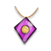 红绳 | 普通 | +3% 闪避 | 15 | ∞ |
| 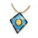 幸运硬币 | 普通 | +1% 闪避，+6 幸运 | 15 | ∞ |
|  护身石 | 普通 | +3% 闪避 | 15 | ∞ |
|  驱虫香囊 | 稀有 | +2% 闪避，+4 幸运，每 20 秒净化所有减益 | 36 | 2 |
| 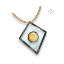 圣徽 | 稀有 | +3% 闪避，+12 幸运 | 36 | ∞ |
|  守护水晶 | 稀有 | +2% 闪避，+4 幸运，每 20 秒净化所有减益 | 36 | 2 |
|  天使之泪 | 史诗 | -6% 全伤害，+6% 闪避，+11 幸运，每 13 秒净化所有减益 | 73 | 2 |
|  神明加护 | 史诗 | +3% 闪避，+11 幸运，每 16 秒净化所有减益 | 73 | 2 |
|  永恒守护 | 传说 | -10% 全伤害，+12% 闪避，+22 幸运，每 9 秒净化所有减益 | 123 | 2 |

### 钱币

| 道具 | 稀有度 | 效果 | 价格 | 上限 |
| --- | --- | --- | --- | --- |
|  一毛钱 | 普通 | +5 幸运，+3 收获 | 15 | ∞ |
|  硬币 | 普通 | +9 幸运 | 15 | ∞ |
|  纪念币 | 普通 | +4 幸运，+4 收获 | 15 | ∞ |
|  银元 | 普通 | +9 幸运 | 15 | ∞ |
|  金币 | 稀有 | +6 幸运，+3 收获，8% 概率番茄籽翻倍 | 36 | ∞ |
|  古钱币 | 稀有 | +8 幸运，+9 收获 | 36 | ∞ |
|  藏宝图 | 稀有 | +7 幸运，+3 收获，8% 概率番茄籽翻倍 | 36 | ∞ |
|  聚宝盆 | 史诗 | -3 最大生命，+15 幸运，+8 收获，19% 概率番茄籽翻倍 | 73 | ∞ |
|  点金石 | 史诗 | +8 幸运，+8 收获，14% 概率番茄籽翻倍 | 73 | ∞ |
|  财神之手 | 传说 | -6 最大生命，+33 幸运，+16 收获，25% 概率番茄籽翻倍 | 123 | ∞ |

### 药水

| 道具 | 稀有度 | 效果 | 价格 | 上限 |
| --- | --- | --- | --- | --- |
|  红药水 | 普通 | +1 生命再生，+1% 吸血 | 15 | ∞ |
|  蓝药水 | 普通 | +2 生命再生 | 15 | ∞ |
|  绿药水 | 普通 | +1 生命再生，+1% 吸血 | 15 | ∞ |
|  解毒剂 | 普通 | +2 生命再生 | 15 | ∞ |
|  回复药 | 稀有 | +2 生命再生，+1% 吸血，每击杀 51 个敌人回复 1 生命 | 36 | ∞ |
|  高级回复药 | 稀有 | +2 生命再生，+2% 吸血 | 36 | ∞ |
|  万能药 | 稀有 | +2 生命再生，+1% 吸血，每击杀 50 个敌人回复 1 生命 | 36 | ∞ |
|  不死药水 | 史诗 | +4 生命再生，+2% 吸血，-6% 移动速度，每击杀 36 个敌人回复 1 生命 | 73 | ∞ |
|  凤凰药剂 | 史诗 | +2 生命再生，+2% 吸血，每击杀 43 个敌人回复 1 生命 | 73 | ∞ |
|  生命之泉 | 传说 | +8 生命再生，+4% 吸血，-10% 移动速度，每击杀 27 个敌人回复 1 生命 | 123 | ∞ |

### 骨头

| 道具 | 稀有度 | 效果 | 价格 | 上限 |
| --- | --- | --- | --- | --- |
|  鸡骨头 | 普通 | +1% 吸血，+1 近战伤害 | 15 | ∞ |
|  鱼刺 | 普通 | +2 近战伤害 | 15 | ∞ |
|  猪骨 | 普通 | +1% 吸血，+1 近战伤害 | 15 | ∞ |
|  牛骨 | 普通 | +2 近战伤害 | 15 | ∞ |
|  恐龙骨 | 稀有 | +1% 吸血，+2 近战伤害，命中时8% 概率诅咒 | 36 | ∞ |
|  骷髅头 | 稀有 | +2% 吸血，+2 近战伤害 | 36 | ∞ |
|  诅咒之骨 | 稀有 | +1% 吸血，+2 近战伤害，命中时8% 概率诅咒 | 36 | ∞ |
|  死灵骨杖 | 史诗 | -2 生命再生，+2% 吸血，+4 近战伤害，命中时19% 概率诅咒 | 73 | ∞ |
|  骨龙之牙 | 史诗 | +2% 吸血，+2 近战伤害，命中时14% 概率诅咒 | 73 | ∞ |
|  冥王之骨 | 传说 | -4 生命再生，+4% 吸血，+8 近战伤害，命中时25% 概率诅咒 | 123 | ∞ |

### 羽毛

| 道具 | 稀有度 | 效果 | 价格 | 上限 |
| --- | --- | --- | --- | --- |
| 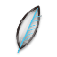 鸡毛 | 普通 | +2% 闪避，+2% 移动速度 | 15 | ∞ |
|  鸭毛 | 普通 | +3% 闪避 | 15 | ∞ |
|  鸽子羽毛 | 普通 | +1% 闪避，+3% 移动速度 | 15 | ∞ |
|  孔雀羽 | 普通 | +3% 闪避 | 15 | ∞ |
|  鹰羽 | 稀有 | +2% 闪避，+3% 移动速度，击杀时获得19% 概率急速 | 36 | ∞ |
|  天鹅羽 | 稀有 | +3% 闪避，+7% 移动速度 | 36 | ∞ |
|  雷鸟之羽 | 稀有 | +2% 闪避，+3% 移动速度，击杀时获得20% 概率急速 | 36 | ∞ |
|  凤凰尾羽 | 史诗 | -2 护甲，+6% 闪避，+6% 移动速度，击杀时获得46% 概率急速 | 73 | ∞ |
|  天使之羽 | 史诗 | +3% 闪避，+7% 移动速度，击杀时获得34% 概率急速 | 73 | ∞ |
|  神鸟金羽 | 传说 | -4 护甲，+12% 闪避，+13% 移动速度，击杀时获得60% 概率急速 | 123 | ∞ |

### 糖果

| 道具 | 稀有度 | 效果 | 价格 | 上限 |
| --- | --- | --- | --- | --- |
|  水果糖 | 普通 | +3 幸运，+6% 经验获取 | 15 | ∞ |
|  奶糖 | 普通 | +11% 经验获取 | 15 | ∞ |
|  跳跳糖 | 普通 | +6 幸运，+4% 经验获取 | 15 | ∞ |
|  巧克力 | 普通 | +12% 经验获取 | 15 | ∞ |
|  太妃糖 | 稀有 | +4 幸运，+8% 经验获取，每波开始获得好运 | 36 | 2 |
|  酒心糖 | 稀有 | +12 幸运，+10% 经验获取 | 36 | ∞ |
|  彩虹糖 | 稀有 | +4 幸运，+8% 经验获取，每波开始获得好运 | 36 | 2 |
|  魔法糖果 | 史诗 | -2 护甲，+10 幸运，+19% 经验获取，每波开始获得2层好运 | 73 | 2 |
|  许愿糖 | 史诗 | +11 幸运，+9% 经验获取，每波开始获得好运 | 73 | 2 |
|  永恒甜蜜 | 传说 | -4 护甲，+22 幸运，+40% 经验获取，每波开始获得3层好运 | 123 | 2 |

### 机械零件

| 道具 | 稀有度 | 效果 | 价格 | 上限 |
| --- | --- | --- | --- | --- |
|  螺丝 | 普通 | +1 远程伤害，+1 护甲 | 15 | ∞ |
|  螺母 | 普通 | +2 远程伤害 | 15 | ∞ |
|  弹簧 | 普通 | +1 远程伤害，+1 护甲 | 15 | ∞ |
|  齿轮 | 普通 | +2 远程伤害 | 15 | ∞ |
|  轴承 | 稀有 | +2 远程伤害，+1 护甲，命中时12% 概率破甲 | 36 | ∞ |
|  马达 | 稀有 | +2 远程伤害，+3 护甲 | 36 | ∞ |
|  活塞 | 稀有 | +2 远程伤害，+1 护甲，命中时13% 概率破甲 | 36 | ∞ |
|  涡轮 | 史诗 | +4 远程伤害，+3 护甲，-3% 闪避，命中时30% 概率破甲 | 73 | ∞ |
|  永动机 | 史诗 | +2 远程伤害，+3 护甲，命中时22% 概率破甲 | 73 | ∞ |
|  机械之心 | 传说 | +8 远程伤害，+5 护甲，-6% 闪避，命中时40% 概率破甲 | 123 | ∞ |

### 能源

| 道具 | 稀有度 | 效果 | 价格 | 上限 |
| --- | --- | --- | --- | --- |
|  五号电池 | 普通 | +1 元素伤害，+3% 攻击速度 | 15 | ∞ |
|  纽扣电池 | 普通 | +5% 攻击速度 | 15 | ∞ |
|  太阳能板 | 普通 | +1 元素伤害，+2% 攻击速度 | 15 | ∞ |
|  锂电池 | 普通 | +5% 攻击速度 | 15 | ∞ |
|  燃料电池 | 稀有 | +1 元素伤害，+3% 攻击速度，命中 5% 概率落雷 | 36 | ∞ |
|  聚变电池 | 稀有 | +3 元素伤害，+4% 攻击速度 | 36 | ∞ |
|  反物质电池 | 稀有 | +1 元素伤害，+4% 攻击速度，命中 5% 概率落雷 | 36 | ∞ |
|  核电池 | 史诗 | -2 生命再生，+3 元素伤害，+8% 攻击速度，命中 12% 概率落雷 | 73 | ∞ |
|  零点能源 | 史诗 | +3 元素伤害，+4% 攻击速度，命中 9% 概率落雷 | 73 | ∞ |
|  宇宙能源 | 传说 | -4 生命再生，+5 元素伤害，+18% 攻击速度，命中 16% 概率落雷 | 123 | ∞ |

### 面具

| 道具 | 稀有度 | 效果 | 价格 | 上限 |
| --- | --- | --- | --- | --- |
|  口罩 | 普通 | +2% 暴击率，+2% 闪避 | 15 | ∞ |
|  眼罩 | 普通 | +3% 闪避 | 15 | ∞ |
|  纸面具 | 普通 | +3% 暴击率，+1% 闪避 | 15 | ∞ |
|  京剧脸谱 | 普通 | +3% 闪避 | 15 | ∞ |
|  狐狸面具 | 稀有 | +2% 暴击率，+2% 闪避，受伤时使攻击者19% 概率混乱 | 36 | ∞ |
|  傩面 | 稀有 | +6% 暴击率，+3% 闪避 | 36 | ∞ |
|  忍者面具 | 稀有 | +2% 暴击率，+2% 闪避，受伤时使攻击者20% 概率混乱 | 36 | ∞ |
|  鬼面 | 史诗 | -3 最大生命，+5% 暴击率，+6% 闪避，受伤时使攻击者46% 概率混乱 | 73 | ∞ |
|  千面之面 | 史诗 | +6% 暴击率，+3% 闪避，受伤时使攻击者34% 概率混乱 | 73 | ∞ |
|  无相之面 | 传说 | -6 最大生命，+11% 暴击率，+12% 闪避，受伤时使攻击者60% 概率混乱 | 123 | ∞ |

### 玩具

| 道具 | 稀有度 | 效果 | 价格 | 上限 |
| --- | --- | --- | --- | --- |
|  弹力球 | 普通 | +5 幸运，+4% 经验获取 | 15 | ∞ |
|  陀螺 | 普通 | +9 幸运 | 15 | ∞ |
|  积木 | 普通 | +4 幸运，+7% 经验获取 | 15 | ∞ |
|  拼图 | 普通 | +9 幸运 | 15 | ∞ |
|  魔方 | 稀有 | +6 幸运，+5% 经验获取，每波开始获得好运 | 36 | 2 |
|  遥控车 | 稀有 | +8 幸运，+14% 经验获取 | 36 | ∞ |
|  机器人玩具 | 稀有 | +7 幸运，+5% 经验获取，每波开始获得好运 | 36 | 2 |
|  限定手办 | 史诗 | -6% 全伤害，+16 幸运，+13% 经验获取，每波开始获得2层好运 | 73 | 2 |
|  传说卡牌 | 史诗 | +8 幸运，+14% 经验获取，每波开始获得好运 | 73 | 2 |
|  童心之匣 | 传说 | -10% 全伤害，+33 幸运，+27% 经验获取，每波开始获得3层好运 | 123 | 2 |

### 乐器

| 道具 | 稀有度 | 效果 | 价格 | 上限 |
| --- | --- | --- | --- | --- |
|  口哨 | 普通 | +3% 攻击速度，+3% 技能冷却缩减 | 15 | ∞ |
|  铃铛 | 普通 | +5% 攻击速度 | 15 | ∞ |
|  口琴 | 普通 | +2% 攻击速度，+4% 技能冷却缩减 | 15 | ∞ |
|  三角铁 | 普通 | +5% 攻击速度 | 15 | ∞ |
|  小鼓 | 稀有 | +3% 攻击速度，+3% 技能冷却缩减，每 17 秒获得2层急速 | 36 | 2 |
|  吉他拨片 | 稀有 | +4% 攻击速度，+9% 技能冷却缩减 | 36 | ∞ |
|  小号 | 稀有 | +4% 攻击速度，+3% 技能冷却缩减，每 17 秒获得2层急速 | 36 | 2 |
|  金色竖琴 | 史诗 | +8% 攻击速度，-2 护甲，+8% 技能冷却缩减，每 12 秒获得2层急速 | 73 | 2 |
|  战鼓 | 史诗 | +4% 攻击速度，+8% 技能冷却缩减，每 14 秒获得2层急速 | 73 | 2 |
|  天籁之音 | 传说 | +18% 攻击速度，-4 护甲，+16% 技能冷却缩减，每 9 秒获得2层急速 | 123 | 2 |

### 暗黑

| 道具 | 稀有度 | 效果 | 价格 | 上限 |
| --- | --- | --- | --- | --- |
|  黑猫毛 | 普通 | +1% 吸血，+4% 光环伤害 | 15 | ∞ |
|  乌鸦羽 | 普通 | +8% 光环伤害 | 15 | ∞ |
|  诅咒娃娃 | 普通 | +1% 吸血，+3% 光环伤害 | 15 | ∞ |
|  暗影布 | 普通 | +8% 光环伤害 | 15 | ∞ |
|  邪眼 | 稀有 | +1% 吸血，+5% 光环伤害，命中时8% 概率诅咒 | 36 | ∞ |
|  恶魔角 | 稀有 | +2% 吸血，+7% 光环伤害 | 36 | ∞ |
|  深渊之石 | 稀有 | +1% 吸血，+6% 光环伤害，命中时8% 概率诅咒 | 36 | ∞ |
|  魔王契约 | 史诗 | -2 生命再生，+2% 吸血，+13% 光环伤害，命中时19% 概率诅咒 | 73 | ∞ |
|  虚空之眼 | 史诗 | +2% 吸血，+6% 光环伤害，命中时14% 概率诅咒 | 73 | ∞ |
|  混沌黑洞 | 传说 | -4 生命再生，+4% 吸血，+28% 光环伤害，命中时25% 概率诅咒 | 123 | ∞ |

### 神圣

| 道具 | 稀有度 | 效果 | 价格 | 上限 |
| --- | --- | --- | --- | --- |
| 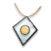 白蜡烛 | 普通 | +1 生命再生，+1 护甲 | 15 | ∞ |
| 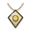 圣水 | 普通 | +2 生命再生 | 15 | ∞ |
| 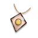 念珠 | 普通 | +1 生命再生，+1 护甲 | 15 | ∞ |
|  祈祷书 | 普通 | +2 生命再生 | 15 | ∞ |
|  天使雕像 | 稀有 | +2 生命再生，+1 护甲，每 20 秒净化所有减益 | 36 | 2 |
| 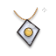 圣光碎片 | 稀有 | +2 生命再生，+3 护甲 | 36 | ∞ |
|  神圣护符 | 稀有 | +2 生命再生，+1 护甲，每 20 秒净化所有减益 | 36 | 2 |
|  神之祝福 | 史诗 | +4 生命再生，-6% 全伤害，+3 护甲，每 13 秒净化所有减益 | 73 | 2 |
| 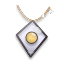 圣杯 | 史诗 | +2 生命再生，+3 护甲，每 16 秒净化所有减益 | 73 | 2 |
|  光明之心 | 传说 | +8 生命再生，-10% 全伤害，+5 护甲，每 9 秒净化所有减益 | 123 | 2 |

### 忍具

| 道具 | 稀有度 | 效果 | 价格 | 上限 |
| --- | --- | --- | --- | --- |
|  苦无 | 普通 | +2% 暴击率，+3% 移动速度 | 15 | ∞ |
|  手里剑 | 普通 | +5% 移动速度 | 15 | ∞ |
|  烟雾弹 | 普通 | +3% 暴击率，+2% 移动速度 | 15 | ∞ |
|  钩爪 | 普通 | +6% 移动速度 | 15 | ∞ |
|  忍者绳 | 稀有 | +2% 暴击率，+4% 移动速度，命中时11% 概率流血 | 36 | ∞ |
|  飞镖 | 稀有 | +6% 暴击率，+5% 移动速度 | 36 | ∞ |
|  影分身卷 | 稀有 | +2% 暴击率，+4% 移动速度，命中时12% 概率流血 | 36 | ∞ |
|  暗杀匕首 | 史诗 | -3 最大生命，+5% 暴击率，+9% 移动速度，命中时28% 概率流血 | 73 | ∞ |
|  忍之极意 | 史诗 | +6% 暴击率，+5% 移动速度，命中时21% 概率流血 | 73 | ∞ |
|  影之王 | 传说 | -6 最大生命，+11% 暴击率，+20% 移动速度，命中时39% 概率流血 | 123 | ∞ |

### 海盗

| 道具 | 稀有度 | 效果 | 价格 | 上限 |
| --- | --- | --- | --- | --- |
|  独眼罩 | 普通 | +1 近战伤害，+5 幸运 | 15 | ∞ |
|  朗姆酒 | 普通 | +9 幸运 | 15 | ∞ |
|  望远镜 | 普通 | +1 近战伤害，+4 幸运 | 15 | ∞ |
|  船锚 | 普通 | +9 幸运 | 15 | ∞ |
|  弯刀 | 稀有 | +1 近战伤害，+6 幸运，8% 概率番茄籽翻倍 | 36 | ∞ |
|  火枪 | 稀有 | +3 近战伤害，+8 幸运 | 36 | ∞ |
|  宝箱钥匙 | 稀有 | +1 近战伤害，+7 幸运，8% 概率番茄籽翻倍 | 36 | ∞ |
|  黑胡子旗 | 史诗 | +3 近战伤害，-2 护甲，+15 幸运，19% 概率番茄籽翻倍 | 73 | ∞ |
|  幽灵船舵 | 史诗 | +3 近战伤害，+8 幸运，14% 概率番茄籽翻倍 | 73 | ∞ |
|  海盗王宝藏 | 传说 | +5 近战伤害，-4 护甲，+33 幸运，25% 概率番茄籽翻倍 | 123 | ∞ |

### 实验

| 道具 | 稀有度 | 效果 | 价格 | 上限 |
| --- | --- | --- | --- | --- |
|  试管 | 普通 | +1 元素伤害，+15 射程 | 15 | ∞ |
|  烧杯 | 普通 | +2 元素伤害 | 15 | ∞ |
|  放大镜 | 普通 | +1 元素伤害，+20 射程 | 15 | ∞ |
|  显微镜 | 普通 | +2 元素伤害 | 15 | ∞ |
|  化学试剂 | 稀有 | +2 元素伤害，+15 射程，击杀 6% 概率爆炸（14 伤害） | 36 | ∞ |
|  离心机 | 稀有 | +2 元素伤害，+45 射程 | 36 | ∞ |
|  等离子瓶 | 稀有 | +2 元素伤害，+15 射程，击杀 6% 概率爆炸（14 伤害） | 36 | ∞ |
|  粒子加速器 | 史诗 | -3 最大生命，+4 元素伤害，+40 射程，击杀 14% 概率爆炸（19 伤害） | 73 | ∞ |
|  反物质 | 史诗 | +2 元素伤害，+40 射程，击杀 10% 概率爆炸（17 伤害） | 73 | ∞ |
|  宇宙方程式 | 传说 | -6 最大生命，+8 元素伤害，+80 射程，击杀 20% 概率爆炸（23 伤害） | 123 | ∞ |

### 运动

| 道具 | 稀有度 | 效果 | 价格 | 上限 |
| --- | --- | --- | --- | --- |
|  跳绳 | 普通 | +1 最大生命，+3% 移动速度 | 15 | ∞ |
|  哑铃 | 普通 | +5% 移动速度 | 15 | ∞ |
|  网球 | 普通 | +2 最大生命，+2% 移动速度 | 15 | ∞ |
|  篮球 | 普通 | +6% 移动速度 | 15 | ∞ |
|  拳击绷带 | 稀有 | +2 最大生命，+4% 移动速度，受伤时获得再生 | 36 | ∞ |
|  运动饮料 | 稀有 | +4 最大生命，+5% 移动速度 | 36 | ∞ |
|  奥运奖牌 | 稀有 | +2 最大生命，+4% 移动速度，受伤时获得再生 | 36 | ∞ |
|  冠军腰带 | 史诗 | +4 最大生命，+10% 移动速度，-9 幸运，受伤时获得2层再生 | 73 | ∞ |
|  传奇球衣 | 史诗 | +4 最大生命，+5% 移动速度，受伤时获得2层再生 | 73 | ∞ |
|  体育之神 | 传说 | +8 最大生命，+20% 移动速度，-17 幸运，受伤时获得3层再生 | 123 | ∞ |

### 腐败

| 道具 | 稀有度 | 效果 | 价格 | 上限 |
| --- | --- | --- | --- | --- |
|  烂菜叶 | 普通 | +4% 光环伤害，+5% 光环范围 | 15 | ∞ |
|  馊饭 | 普通 | +8% 光环伤害 | 15 | ∞ |
|  腐烂苹果 | 普通 | +3% 光环伤害，+8% 光环范围 | 15 | ∞ |
|  霉菌样本 | 普通 | +8% 光环伤害 | 15 | ∞ |
|  沼气瓶 | 稀有 | +5% 光环伤害，+6% 光环范围，命中时11% 概率虚弱 | 36 | ∞ |
|  腐蚀液 | 稀有 | +7% 光环伤害，+16% 光环范围 | 36 | ∞ |
|  瘟疫之瓶 | 稀有 | +6% 光环伤害，+6% 光环范围，命中时12% 概率虚弱 | 36 | ∞ |
|  腐王之眼 | 史诗 | -2 生命再生，+13% 光环伤害，+14% 光环范围，命中时28% 概率虚弱 | 73 | ∞ |
|  堕落精华 | 史诗 | +6% 光环伤害，+16% 光环范围，命中时21% 概率虚弱 | 73 | ∞ |
|  终焉腐化 | 传说 | -4 生命再生，+28% 光环伤害，+30% 光环范围，命中时35% 概率虚弱 | 123 | ∞ |

### 技能秘籍

| 道具 | 稀有度 | 效果 | 价格 | 上限 |
| --- | --- | --- | --- | --- |
|  入门心法 | 普通 | +3% 技能冷却缩减，+6% 技能伤害 | 15 | ∞ |
|  招式图解 | 普通 | +11% 技能伤害 | 15 | ∞ |
|  奥义残页 | 普通 | +4% 技能冷却缩减，+4% 技能伤害 | 15 | ∞ |
|  必杀技手册 | 普通 | +12% 技能伤害 | 15 | ∞ |
|  绝招秘录 | 稀有 | +6% 技能冷却缩减，+14% 技能伤害 | 36 | ∞ |
|  宗师笔记 | 稀有 | +9% 技能冷却缩减，+10% 技能伤害 | 36 | ∞ |
|  奥义真解 | 稀有 | +6% 技能冷却缩减，+15% 技能伤害 | 36 | ∞ |
|  天书残卷 | 史诗 | -3 最大生命，+14% 技能冷却缩减，+34% 技能伤害 | 73 | ∞ |
|  无上心经 | 史诗 | +15% 技能冷却缩减，+17% 技能伤害 | 73 | ∞ |
|  大招圣典 | 传说 | -6 最大生命，+25% 技能冷却缩减，+62% 技能伤害 | 123 | ∞ |

### 技能法器

| 道具 | 稀有度 | 效果 | 价格 | 上限 |
| --- | --- | --- | --- | --- |
|  扩音喇叭 | 普通 | +8% 技能范围，+5% 技能持续 | 15 | ∞ |
|  放大镜片 | 普通 | +14% 技能范围 | 15 | ∞ |
|  延时沙漏 | 普通 | +6% 技能范围，+8% 技能持续 | 15 | ∞ |
|  共鸣水晶 | 普通 | +15% 技能范围 | 15 | ∞ |
|  聚能棱镜 | 稀有 | +18% 技能范围，+10% 技能持续 | 36 | ∞ |
|  时之砂 | 稀有 | +12% 技能范围，+16% 技能持续 | 36 | ∞ |
|  空间罗盘 | 稀有 | +19% 技能范围，+11% 技能持续 | 36 | ∞ |
|  永恒沙漏 | 史诗 | -6% 全伤害，+46% 技能范围，+27% 技能持续 | 73 | ∞ |
|  星辰罗盘 | 史诗 | +22% 技能范围，+29% 技能持续 | 73 | ∞ |
|  天穹法器 | 传说 | -10% 全伤害，+80% 技能范围，+47% 技能持续 | 123 | ∞ |

### 星辰

| 道具 | 稀有度 | 效果 | 价格 | 上限 |
| --- | --- | --- | --- | --- |
|  星星贴纸 | 普通 | +3% 暴击率，+4% 经验获取 | 15 | ∞ |
|  流星碎片 | 普通 | +4% 暴击率 | 15 | ∞ |
|  星砂 | 普通 | +2% 暴击率，+7% 经验获取 | 15 | ∞ |
|  月光石 | 普通 | +5% 暴击率 | 15 | ∞ |
|  北极星 | 稀有 | +3% 暴击率，+5% 经验获取，暴击伤害 +11% | 36 | ∞ |
|  星座图 | 稀有 | +4% 暴击率，+14% 经验获取 | 36 | ∞ |
|  银河之尘 | 稀有 | +3% 暴击率，+5% 经验获取，暴击伤害 +12% | 36 | ∞ |
|  超新星 | 史诗 | +8% 暴击率，-2 护甲，+13% 经验获取，暴击伤害 +28% | 73 | ∞ |
|  星辰之核 | 史诗 | +4% 暴击率，+14% 经验获取，暴击伤害 +21% | 73 | ∞ |
|  宇宙之眼 | 传说 | +17% 暴击率，-4 护甲，+27% 经验获取，暴击伤害 +39% | 123 | ∞ |

---

[README](../README.md) · [角色](CHARACTERS.md) · [技能](SKILLS.md) · [武器](WEAPONS.md) · **道具** · [怪物](MONSTERS.md) · [关卡](CHAPTERS.md) · [成就](ACHIEVEMENTS.md) · [天赋](TALENTS.md) · [设计文档](GDD.md) · [数值表](DATA_TABLES.md) · [更新日志](CHANGELOG.md)
