# 武器（180 把）

**中文** · [English](en/WEAPONS.md)

[README](../README.md) · [角色](CHARACTERS.md) · [技能](SKILLS.md) · **武器** · [道具](ITEMS.md) · [怪物](MONSTERS.md) · [关卡](CHAPTERS.md) · [成就](ACHIEVEMENTS.md) · [天赋](TALENTS.md) · [遗物](RELICS.md) · [危机](DANGER.md) · [任务](QUESTS.md) · [设计文档](GDD.md) · [数值表](DATA_TABLES.md) · [更新日志](CHANGELOG.md)

> 由 `npm run docs` 从 `src/data/*.ts` 自动生成，请勿手改。

武器自动索敌、自动攻击，每名角色最多携带 6 把（部分[角色](CHARACTERS.md)例外）。每把武器有 T1~T4 四个品质，两把同名同品质可在商店合成升一级。

价格：T1 基础价 × [1, 2.1, 4, 7.5]，再随波次上涨。伤害 = (基础 + Σ属性×系数) × (1+伤害%) × 类别倍率。

## 目录

- [武器一览](#overview)
- [随机词条与打造](#affixes)
- [近战武器](#class-melee)
  - [番茄叉](#weapon-fork)
  - [擀面杖](#weapon-rolling_pin)
  - [菜刀](#weapon-knife)
  - [平底锅](#weapon-pan)
  - [西瓜锤](#weapon-watermelon_hammer)
  - [剁骨刀](#weapon-cleaver)
  - [锅铲](#weapon-spatula)
  - [旋风打蛋器](#weapon-whisk_spin)
  - [松肉锤](#weapon-meat_tenderizer)
  - [烤串签](#weapon-skewer)
  - [汤勺](#weapon-ladle)
  - [法棍剑](#weapon-baguette_sword)
  - [黄瓜武士刀](#weapon-cucumber_katana)
  - [披萨滚刀](#weapon-pizza_cutter)
  - [竹筷](#weapon-chopsticks)
  - [竹笋长矛](#weapon-bamboo_spear)
  - [菠萝流星锤](#weapon-pineapple_mace)
  - [芥末太刀](#weapon-wasabi_katana)
  - [厨房剪刀](#weapon-kitchen_scissors)
  - [破壁机](#weapon-blender_aura)
  - [炸药鸡腿](#weapon-dynamite_drumstick)
  - [椰壳拳套](#weapon-coconut_gloves)
  - [拐杖糖锤](#weapon-candy_cane)
  - [冰棍刺剑](#weapon-popsicle_blade)
  - [雪糕大锤](#weapon-icecream_hammer)
  - [电磁炒锅](#weapon-shock_wok)
  - [高压电叉](#weapon-volt_fork)
  - [毒菇刺](#weapon-toxic_spike)
  - [烤肉长签](#weapon-bbq_skewer)
  - [炭火钳](#weapon-coal_tongs)
  - [寿司刀](#weapon-sushi_blade)
  - [双持菜刀](#weapon-twin_cleavers)
  - [刃风光环](#weapon-blade_aura)
  - [刨丝刀](#weapon-grater_sweep)
  - [剁椒飞轮](#weapon-chili_shuriken)
  - [切片器](#weapon-mandoline)
  - [胡椒风暴](#weapon-pepper_storm_aura)
  - [双刃寿司刀](#weapon-sushi_twin_blade)
  - [霜刃剁骨刀](#weapon-frost_cleaver)
  - [雷霆铁壁锅](#weapon-storm_whisk_pan)
  - [椰雷流星锤](#weapon-coconut_quake_mace)
  - [烈焰菜刀](#weapon-fz_knife_ember_mine)
  - [霜寒拐杖糖锤](#weapon-fz_candy_cane_glacier_mortar)
  - [散射双持菜刀](#weapon-fz_twin_cleavers_ketchup)
  - [酱爆烤串签](#weapon-fz_skewer_soy_pistol)
  - [霜寒黄瓜武士刀](#weapon-fz_cucumber_katana_soda)
  - [连环锅铲](#weapon-fz_spatula_slingshot)
  - [剧毒厨房剪刀](#weapon-fz_kitchen_scissors_toxic_spike)
  - [连环冰棍刺剑](#weapon-fz_popsicle_blade_olive_launcher)
  - [霜寒烤肉长签](#weapon-fz_bbq_skewer_cream_torch)
  - [霜寒椰壳拳套](#weapon-fz_coconut_gloves_ice_cube_tray)
  - [霜寒炭火钳](#weapon-fz_coal_tongs_whisk_spin)
  - [爆裂汤勺](#weapon-fz_ladle_watermelon_hammer)
  - [烈焰竹筷](#weapon-fz_chopsticks_pepper_spray)
  - [爆裂披萨滚刀](#weapon-fz_pizza_cutter_potato_mine)
  - [剧毒法棍剑](#weapon-fz_baguette_sword_spore_cannon)
  - [鲜果松肉锤](#weapon-fz_meat_tenderizer_seed_spitter)
- [远程武器](#class-ranged)
  - [番茄弹弓](#weapon-slingshot)
  - [豌豆枪](#weapon-pea_shooter)
  - [辣椒火箭](#weapon-chili_rocket)
  - [玉米加农](#weapon-corn_cannon)
  - [番茄酱瓶](#weapon-ketchup)
  - [洋葱回旋镖](#weapon-onion_boomerang)
  - [酱料加特林](#weapon-sauce_gatling)
  - [橄榄发射器](#weapon-olive_launcher)
  - [爆米花机](#weapon-popcorn_machine)
  - [葡萄霰弹枪](#weapon-grape_shotgun)
  - [豆子火箭筒](#weapon-bean_bazooka)
  - [樱桃炸弹](#weapon-cherry_bomb)
  - [蓝莓狙击枪](#weapon-blueberry_sniper)
  - [餐盘飞碟](#weapon-plate_frisbee)
  - [瓜子机枪](#weapon-seed_spitter)
  - [胡萝卜弩](#weapon-carrot_crossbow)
  - [蜂蜜喷枪](#weapon-honey_blaster)
  - [酱油手枪](#weapon-soy_pistol)
  - [胡椒研磨枪](#weapon-pepper_grinder)
  - [酱油炸弹](#weapon-soy_bomb)
  - [烧烤喷枪](#weapon-bbq_torch)
  - [果酱迫击炮](#weapon-jam_mortar)
  - [海胆雷](#weapon-sea_urchin_mine)
  - [芦笋长弓](#weapon-asparagus_bow)
  - [马卡龙连发](#weapon-macaron_gun)
  - [甜甜圈飞环](#weapon-donut_ring)
  - [巧克力地雷](#weapon-choco_mine)
  - [刨冰机枪](#weapon-shaved_ice_gun)
  - [冰川迫击炮](#weapon-glacier_mortar)
  - [微波炉炮](#weapon-microwave_cannon)
  - [孢子炮](#weapon-spore_cannon)
  - [菌丝回旋镖](#weapon-mycelium_boomerang)
  - [毒刺吹管](#weapon-blowpipe)
  - [烧烤酱炮](#weapon-bbq_sauce_cannon)
  - [辣酱手枪](#weapon-hot_sauce_gun)
  - [飞刀匣](#weapon-knife_case)
  - [椰子炮](#weapon-coconut_cannon)
  - [南瓜迫击炮](#weapon-pumpkin_mortar)
  - [西瓜榴弹](#weapon-melon_grenade)
  - [土豆地雷](#weapon-potato_mine)
  - [玉米散弹](#weapon-corn_scatter)
  - [豆荚狙击](#weapon-pea_sniper)
  - [爆裂豌豆炮](#weapon-blast_pea_cannon)
  - [毒雾加特林](#weapon-toxic_gatling)
  - [炎狱迫击炮](#weapon-inferno_mortar)
  - [电磁蓝莓狙](#weapon-railgun_sniper)
  - [糖果霰弹枪](#weapon-candy_shotgun)
  - [鲜果餐盘飞碟](#weapon-fz_plate_frisbee_onion_boomerang)
  - [致命玉米散弹](#weapon-fz_corn_scatter_grater_sweep)
  - [烈焰海胆雷](#weapon-fz_sea_urchin_mine_dragonfruit_orb)
  - [锐锋玉米加农](#weapon-fz_corn_cannon_blade_aura)
  - [烈焰蜂蜜喷枪](#weapon-fz_honey_blaster_pumpkin_mortar)
  - [剧毒爆米花机](#weapon-fz_popcorn_machine_rot_aura)
  - [爆裂甜甜圈飞环](#weapon-fz_donut_ring_dynamite_drumstick)
  - [酱爆豆子火箭筒](#weapon-fz_bean_bazooka_soy_bomb)
  - [烈焰巧克力地雷](#weapon-fz_choco_mine_bbq_torch)
  - [致命樱桃炸弹](#weapon-fz_cherry_bomb_bamboo_spear)
  - [主厨胡萝卜弩](#weapon-fz_carrot_crossbow_fork)
  - [爆裂飞刀匣](#weapon-fz_knife_case_microwave_cannon)
  - [贯穿西瓜榴弹](#weapon-fz_melon_grenade_pumpkin_lantern)
  - [烈焰毒刺吹管](#weapon-fz_blowpipe_syrup_sprayer)
  - [霜寒菌丝回旋镖](#weapon-fz_mycelium_boomerang_rice_cooker_aura)
- [元素武器](#class-elemental)
  - [芥末喷枪](#weapon-mustard_flamer)
  - [冰镇汽水](#weapon-soda)
  - [大蒜光环](#weapon-garlic_aura)
  - [胡椒雷](#weapon-pepper_mine)
  - [西兰花法杖](#weapon-broccoli_staff)
  - [冰块格](#weapon-ice_cube_tray)
  - [闪电打蛋器](#weapon-lightning_whisk)
  - [蒸汽水壶](#weapon-steam_kettle)
  - [咖喱光环](#weapon-curry_aura)
  - [胡椒喷雾](#weapon-pepper_spray)
  - [薄荷冰雷](#weapon-mint_frost_mine)
  - [雷霆榴莲](#weapon-thunder_durian)
  - [火龙果法球](#weapon-dragonfruit_orb)
  - [八角飞镖](#weapon-star_anise_shuriken)
  - [柠檬电池](#weapon-lemon_battery)
  - [海盐结界](#weapon-salt_aura)
  - [可乐电击枪](#weapon-cola_zapper)
  - [火锅吐息](#weapon-hotpot_breath)
  - [南瓜鬼火灯](#weapon-pumpkin_lantern)
  - [孢子喷壶](#weapon-spore_sprayer)
  - [奶油喷枪](#weapon-cream_torch)
  - [焦糖光环](#weapon-caramel_aura)
  - [跳跳糖电击](#weapon-popping_candy)
  - [冰沙喷雾](#weapon-slush_spray)
  - [寒霜光环](#weapon-frost_aura)
  - [冰锥连射](#weapon-icicle_volley)
  - [电饭煲光环](#weapon-rice_cooker_aura)
  - [电烤架](#weapon-grill_arc)
  - [电动打蛋机](#weapon-mixer_storm)
  - [吐司闪电](#weapon-toaster_zap)
  - [毒雾喷壶](#weapon-miasma_sprayer)
  - [腐菌光环](#weapon-rot_aura)
  - [毒蘑菇雷](#weapon-toadstool_mine)
  - [炭烤光环](#weapon-charcoal_aura)
  - [火炭雷](#weapon-ember_mine)
  - [孜然飞镖](#weapon-cumin_star)
  - [薄荷清凉光环](#weapon-mint_aura)
  - [蜂蜜光环](#weapon-honey_aura)
  - [茶壶雷暴](#weapon-teapot_storm)
  - [果冻弹](#weapon-jelly_bounce)
  - [糖浆喷枪](#weapon-syrup_sprayer)
  - [咖喱蒜香结界](#weapon-curry_garlic_field)
  - [雷霆果园](#weapon-thunder_orchard)
  - [蜜霜结界](#weapon-honey_frost_aura)
  - [孢子雷区](#weapon-spore_minefield)
  - [龙息喷流](#weapon-dragon_breath_flame)
  - [霜星八角](#weapon-anise_frost_storm)
  - [圣盐结界](#weapon-holy_salt_barrier)
  - [贯穿雷霆榴莲](#weapon-fz_thunder_durian_volt_fork)
  - [烈焰果冻弹](#weapon-fz_jelly_bounce_chili_shuriken)
  - [蚀骨冰沙喷雾](#weapon-fz_slush_spray_caramel_aura)
  - [酱爆电烤架](#weapon-fz_grill_arc_pepper_storm_aura)
  - [烈焰茶壶雷暴](#weapon-fz_teapot_storm_charcoal_aura)
  - [主厨可乐电击枪](#weapon-fz_cola_zapper_mixer_storm)
  - [贯穿蒸汽水壶](#weapon-fz_steam_kettle_asparagus_bow)
  - [贯穿闪电打蛋器](#weapon-fz_lightning_whisk_pepper_grinder)
  - [霜寒孢子喷壶](#weapon-fz_spore_sprayer_shaved_ice_gun)
  - [烈焰吐司闪电](#weapon-fz_toaster_zap_hot_sauce_gun)
  - [致命薄荷冰雷](#weapon-fz_mint_frost_mine_blender_aura)
  - [重击跳跳糖电击](#weapon-fz_popping_candy_rolling_pin)
  - [贯穿孜然飞镖](#weapon-fz_cumin_star_mandoline)
- [合成关系图](#craft-graph)
  - [近战（65 条配方）](#craft-graph-melee)
  - [远程（67 条配方）](#craft-graph-ranged)
  - [元素（67 条配方）](#craft-graph-elemental)
- [超武（20 把）](#evolution)

<a id="overview"></a>

## 武器一览

| 武器 | 类别 | 攻击方式 | 标签 | 伤害 T1~T4 | 冷却 T1~T4 | 射程 | 价格 |
| --- | --- | --- | --- | --- | --- | --- | --- |
|  [番茄叉](#weapon-fork) | 近战 | 直刺 | 厨具 | 8 / 14 / 22 / 34 | 0.9 / 0.85 / 0.78 / 0.7 | 150 | 15 |
|  [擀面杖](#weapon-rolling_pin) | 近战 | 横扫 | 厨具 | 12 / 20 / 32 / 48 | 1.25 / 1.18 / 1.1 / 1 | 130 | 18 |
|  [菜刀](#weapon-knife) | 近战 | 直刺 | 厨具/锋利 | 6 / 10 / 16 / 25 | 0.6 / 0.55 / 0.5 / 0.44 | 130 | 20 |
|  [平底锅](#weapon-pan) | 近战 | 横扫 | 厨具 | 18 / 30 / 46 / 70 | 1.6 / 1.5 / 1.4 / 1.3 | 120 | 25 |
|  [西瓜锤](#weapon-watermelon_hammer) | 近战 | 横扫 | 蔬果/爆破 | 30 / 50 / 80 / 120 | 2.2 / 2.1 / 2 / 1.8 | 140 | 35 |
|  [番茄弹弓](#weapon-slingshot) | 远程 | 子弹 | 蔬果 | 8 / 13 / 20 / 30 | 0.95 / 0.9 / 0.83 / 0.75 | 380 | 15 |
|  [豌豆枪](#weapon-pea_shooter) | 远程 | 子弹 | 枪械/蔬果 | 4 / 6 / 9 / 13 | 0.32 / 0.29 / 0.26 / 0.22 | 400 | 22 |
|  [辣椒火箭](#weapon-chili_rocket) | 远程 | 爆炸弹 | 枪械/元素/爆破 | 14 / 24 / 38 / 58 | 1.8 / 1.7 / 1.6 / 1.4 | 450 | 30 |
|  [玉米加农](#weapon-corn_cannon) | 远程 | 子弹 | 枪械 | 16 / 28 / 44 / 68 | 1.1 / 1 / 0.92 / 0.84 | 520 | 28 |
|  [番茄酱瓶](#weapon-ketchup) | 远程 | 子弹 | 酱料 | 5 / 8 / 12 / 17 | 0.75 / 0.7 / 0.65 / 0.6 | 280 | 20 |
|  [芥末喷枪](#weapon-mustard_flamer) | 元素 | 喷火 | 酱料/元素 | 2 / 3 / 5 / 8 | 0.2 / 0.18 / 0.16 / 0.14 | 200 | 28 |
|  [冰镇汽水](#weapon-soda) | 元素 | 子弹 | 元素 | 9 / 15 / 22 / 32 | 0.75 / 0.7 / 0.65 / 0.58 | 400 | 22 |
|  [大蒜光环](#weapon-garlic_aura) | 元素 | 光环 | 蔬果/元素 | 4 / 6 / 9 / 13 | 0.5 / 0.5 / 0.5 / 0.5 | 133 | 30 |
|  [胡椒雷](#weapon-pepper_mine) | 元素 | 地雷 | 元素/爆破 | 20 / 34 / 52 / 80 | 2.5 / 2.3 / 2.1 / 1.8 | 200 | 25 |
|  [洋葱回旋镖](#weapon-onion_boomerang) | 远程 | 回旋镖 | 蔬果 | 10 / 17 / 26 / 40 | 1.4 / 1.3 / 1.2 / 1.1 | 360 | 24 |
|  [西兰花法杖](#weapon-broccoli_staff) | 元素 | 连锁闪电 | 蔬果/元素 | 10 / 17 / 26 / 40 | 1.1 / 1 / 0.92 / 0.84 | 420 | 30 |
|  [酱料加特林](#weapon-sauce_gatling) | 远程 | 子弹 | 枪械/酱料 | 4 / 6 / 8 / 11 | 0.16 / 0.14 / 0.12 / 0.1 | 420 | 40 |
|  [剁骨刀](#weapon-cleaver) | 近战 | 横扫 | 厨具/锋利 | 13 / 22 / 35 / 54 | 1.1 / 1.05 / 1 / 0.9 | 125 | 26 |
|  [锅铲](#weapon-spatula) | 近战 | 横扫 | 厨具 | 9 / 16 / 25 / 38 | 1.05 / 1 / 0.92 / 0.84 | 115 | 16 |
|  [旋风打蛋器](#weapon-whisk_spin) | 近战 | 光环 | 厨具 | 3 / 5 / 8 / 12 | 0.45 / 0.45 / 0.42 / 0.4 | 137 | 22 |
|  [松肉锤](#weapon-meat_tenderizer) | 近战 | 横扫 | 厨具 | 22 / 36 / 56 / 84 | 1.9 / 1.8 / 1.7 / 1.55 | 110 | 30 |
|  [烤串签](#weapon-skewer) | 近战 | 直刺 | 厨具/锋利 | 12 / 21 / 33 / 51 | 1.05 / 1 / 0.92 / 0.84 | 185 | 24 |
|  [汤勺](#weapon-ladle) | 近战 | 横扫 | 厨具/酱料 | 10 / 17 / 27 / 41 | 1.15 / 1.1 / 1.02 / 0.94 | 120 | 20 |
|  [法棍剑](#weapon-baguette_sword) | 近战 | 横扫 | 蔬果 | 11 / 19 / 30 / 46 | 1.3 / 1.22 / 1.14 / 1.04 | 140 | 22 |
|  [黄瓜武士刀](#weapon-cucumber_katana) | 近战 | 直刺 | 蔬果/锋利 | 9 / 15 / 24 / 36 | 0.8 / 0.75 / 0.69 / 0.62 | 140 | 24 |
|  [披萨滚刀](#weapon-pizza_cutter) | 近战 | 回旋镖 | 厨具/锋利 | 9 / 15 / 24 / 36 | 1.3 / 1.2 / 1.1 / 1 | 230 | 26 |
|  [竹筷](#weapon-chopsticks) | 近战 | 直刺 | 厨具 | 5 / 9 / 14 / 21 | 0.5 / 0.46 / 0.42 / 0.38 | 155 | 18 |
|  [竹笋长矛](#weapon-bamboo_spear) | 近战 | 直刺 | 蔬果 | 19 / 32 / 50 / 77 | 1.5 / 1.42 / 1.32 / 1.2 | 200 | 28 |
|  [菠萝流星锤](#weapon-pineapple_mace) | 近战 | 横扫 | 蔬果/爆破 | 20 / 34 / 53 / 80 | 1.8 / 1.7 / 1.6 / 1.45 | 130 | 32 |
|  [橄榄发射器](#weapon-olive_launcher) | 远程 | 子弹 | 枪械/蔬果 | 6 / 10 / 15 / 23 | 0.8 / 0.75 / 0.7 / 0.62 | 400 | 22 |
|  [爆米花机](#weapon-popcorn_machine) | 远程 | 地雷 | 枪械/爆破 | 14 / 24 / 37 / 56 | 2 / 1.9 / 1.75 / 1.6 | 220 | 24 |
|  [葡萄霰弹枪](#weapon-grape_shotgun) | 远程 | 子弹 | 枪械/蔬果 | 4 / 7 / 10 / 15 | 1 / 0.95 / 0.88 / 0.8 | 240 | 26 |
|  [豆子火箭筒](#weapon-bean_bazooka) | 远程 | 爆炸弹 | 枪械/爆破 | 22 / 36 / 56 / 84 | 2.4 / 2.25 / 2.1 / 1.9 | 480 | 34 |
|  [樱桃炸弹](#weapon-cherry_bomb) | 远程 | 爆炸弹 | 蔬果/爆破 | 10 / 17 / 26 / 40 | 1.6 / 1.5 / 1.4 / 1.3 | 360 | 28 |
|  [蓝莓狙击枪](#weapon-blueberry_sniper) | 远程 | 子弹 | 枪械/蔬果 | 26 / 44 / 68 / 100 | 1.9 / 1.8 / 1.65 / 1.5 | 650 | 32 |
|  [餐盘飞碟](#weapon-plate_frisbee) | 远程 | 回旋镖 | 厨具 | 12 / 20 / 31 / 47 | 1.5 / 1.4 / 1.3 / 1.2 | 330 | 24 |
|  [瓜子机枪](#weapon-seed_spitter) | 远程 | 子弹 | 枪械/蔬果 | 3 / 5 / 7 / 10 | 0.22 / 0.2 / 0.18 / 0.16 | 360 | 26 |
|  [胡萝卜弩](#weapon-carrot_crossbow) | 远程 | 子弹 | 蔬果 | 12 / 20 / 31 / 47 | 1.05 / 1 / 0.92 / 0.84 | 460 | 25 |
|  [蜂蜜喷枪](#weapon-honey_blaster) | 远程 | 子弹 | 酱料 | 6 / 10 / 15 / 22 | 0.7 / 0.66 / 0.6 / 0.54 | 360 | 22 |
|  [酱油手枪](#weapon-soy_pistol) | 远程 | 子弹 | 枪械/酱料 | 7 / 12 / 18 / 27 | 0.55 / 0.5 / 0.46 / 0.42 | 380 | 20 |
|  [冰块格](#weapon-ice_cube_tray) | 元素 | 子弹 | 厨具/元素 | 5 / 8 / 12 / 18 | 1 / 0.95 / 0.88 / 0.8 | 340 | 26 |
|  [闪电打蛋器](#weapon-lightning_whisk) | 元素 | 连锁闪电 | 厨具/元素 | 7 / 12 / 18 / 27 | 0.95 / 0.9 / 0.82 / 0.74 | 380 | 30 |
|  [蒸汽水壶](#weapon-steam_kettle) | 元素 | 喷火 | 厨具/元素 | 3 / 5 / 7 / 11 | 0.26 / 0.24 / 0.21 / 0.18 | 170 | 28 |
|  [咖喱光环](#weapon-curry_aura) | 元素 | 光环 | 酱料/元素 | 3 / 5 / 7 / 11 | 0.5 / 0.5 / 0.5 / 0.5 | 140 | 32 |
|  [胡椒喷雾](#weapon-pepper_spray) | 元素 | 喷火 | 元素 | 2 / 4 / 6 / 9 | 0.18 / 0.16 / 0.14 / 0.12 | 150 | 26 |
|  [薄荷冰雷](#weapon-mint_frost_mine) | 元素 | 地雷 | 蔬果/元素/爆破 | 16 / 27 / 42 / 64 | 2.6 / 2.4 / 2.2 / 1.9 | 220 | 26 |
|  [雷霆榴莲](#weapon-thunder_durian) | 元素 | 爆炸弹 | 蔬果/元素/爆破 | 16 / 27 / 42 / 64 | 2.2 / 2.1 / 1.95 / 1.75 | 400 | 32 |
|  [火龙果法球](#weapon-dragonfruit_orb) | 元素 | 子弹 | 蔬果/元素 | 8 / 13 / 20 / 30 | 1 / 0.95 / 0.88 / 0.8 | 400 | 28 |
|  [八角飞镖](#weapon-star_anise_shuriken) | 元素 | 回旋镖 | 锋利/元素 | 9 / 15 / 23 / 35 | 1.3 / 1.2 / 1.1 / 1 | 320 | 28 |
|  [柠檬电池](#weapon-lemon_battery) | 元素 | 连锁闪电 | 蔬果/元素 | 12 / 20 / 31 / 47 | 1.3 / 1.2 / 1.1 / 1 | 360 | 30 |
|  [芥末太刀](#weapon-wasabi_katana) | 近战 | 直刺 | 锋利/酱料 | 10 / 17 / 27 / 41 | 0.85 / 0.8 / 0.74 / 0.67 | 150 | 26 |
|  [厨房剪刀](#weapon-kitchen_scissors) | 近战 | 横扫 | 厨具/锋利 | 8 / 14 / 22 / 33 | 0.85 / 0.8 / 0.74 / 0.68 | 105 | 22 |
|  [破壁机](#weapon-blender_aura) | 近战 | 光环 | 厨具/锋利 | 4 / 6 / 9 / 14 | 0.45 / 0.43 / 0.41 / 0.38 | 121 | 28 |
|  [炸药鸡腿](#weapon-dynamite_drumstick) | 近战 | 横扫 | 爆破 | 17 / 29 / 45 / 68 | 1.7 / 1.6 / 1.5 / 1.36 | 120 | 30 |
|  [胡椒研磨枪](#weapon-pepper_grinder) | 远程 | 子弹 | 枪械/锋利 | 6 / 10 / 15 / 22 | 0.5 / 0.46 / 0.42 / 0.38 | 400 | 26 |
|  [酱油炸弹](#weapon-soy_bomb) | 远程 | 地雷 | 酱料/爆破 | 15 / 25 / 39 / 60 | 2.2 / 2.05 / 1.9 / 1.7 | 210 | 26 |
|  [烧烤喷枪](#weapon-bbq_torch) | 远程 | 喷火 | 枪械/酱料 | 2 / 3 / 5 / 8 | 0.2 / 0.18 / 0.16 / 0.14 | 190 | 30 |
|  [果酱迫击炮](#weapon-jam_mortar) | 远程 | 爆炸弹 | 酱料/爆破 | 16 / 27 / 42 / 64 | 2 / 1.9 / 1.78 / 1.6 | 460 | 32 |
|  [海胆雷](#weapon-sea_urchin_mine) | 远程 | 地雷 | 锋利/爆破 | 13 / 22 / 34 / 52 | 1.9 / 1.8 / 1.65 / 1.5 | 230 | 26 |
|  [海盐结界](#weapon-salt_aura) | 元素 | 光环 | 锋利/元素 | 3 / 5 / 8 / 12 | 0.5 / 0.5 / 0.5 / 0.5 | 152 | 30 |
|  [可乐电击枪](#weapon-cola_zapper) | 元素 | 连锁闪电 | 枪械/元素 | 8 / 14 / 21 / 32 | 0.95 / 0.88 / 0.8 / 0.72 | 440 | 28 |
|  [火锅吐息](#weapon-hotpot_breath) | 元素 | 喷火 | 酱料/元素 | 3 / 4 / 6 / 10 | 0.22 / 0.2 / 0.18 / 0.16 | 165 | 30 |
|  [南瓜鬼火灯](#weapon-pumpkin_lantern) | 元素 | 子弹 | 蔬果/元素 | 9 / 15 / 24 / 37 | 0.8 / 0.75 / 0.7 / 0.62 | 420 | 24 |
|  [孢子喷壶](#weapon-spore_sprayer) | 元素 | 子弹 | 蔬果/元素 | 5 / 8 / 13 / 20 | 0.7 / 0.65 / 0.6 / 0.54 | 330 | 22 |
|  [椰壳拳套](#weapon-coconut_gloves) | 近战 | 直刺 | 蔬果 | 5 / 9 / 14 / 22 | 0.42 / 0.4 / 0.37 / 0.34 | 95 | 20 |
|  [芦笋长弓](#weapon-asparagus_bow) | 远程 | 子弹 | 蔬果 | 14 / 24 / 37 / 56 | 1.1 / 1.04 / 0.97 / 0.88 | 520 | 26 |
|  [拐杖糖锤](#weapon-candy_cane) | 近战 | 横扫 | 甜点/钝器 | 11 / 18 / 29 / 43 | 1.25 / 1.18 / 1.1 / 1 | 130 | 19 |
|  [马卡龙连发](#weapon-macaron_gun) | 远程 | 子弹 | 甜点/枪械 | 3 / 4 / 6 / 8 | 0.32 / 0.29 / 0.26 / 0.22 | 400 | 22 |
|  [奶油喷枪](#weapon-cream_torch) | 元素 | 喷火 | 甜点 | 2 / 3 / 5 / 8 | 0.2 / 0.18 / 0.16 / 0.14 | 200 | 29 |
|  [甜甜圈飞环](#weapon-donut_ring) | 远程 | 回旋镖 | 甜点 | 11 / 18 / 28 / 42 | 1.5 / 1.4 / 1.3 / 1.2 | 330 | 25 |
|  [焦糖光环](#weapon-caramel_aura) | 元素 | 光环 | 甜点 | 3 / 5 / 6 / 10 | 0.5 / 0.5 / 0.5 / 0.5 | 131 | 33 |
|  [巧克力地雷](#weapon-choco_mine) | 远程 | 地雷 | 甜点 | 13 / 23 / 35 / 53 | 2 / 1.9 / 1.75 / 1.6 | 220 | 25 |
|  [跳跳糖电击](#weapon-popping_candy) | 元素 | 连锁闪电 | 甜点 | 8 / 13 / 20 / 30 | 0.95 / 0.88 / 0.8 / 0.72 | 440 | 29 |
|  [冰棍刺剑](#weapon-popsicle_blade) | 近战 | 直刺 | 锋利/甜点 | 9 / 14 / 23 / 34 | 0.8 / 0.75 / 0.69 / 0.62 | 140 | 25 |
|  [雪糕大锤](#weapon-icecream_hammer) | 近战 | 横扫 | 钝器/甜点 | 21 / 34 / 53 / 80 | 1.9 / 1.8 / 1.7 / 1.55 | 110 | 31 |
|  [刨冰机枪](#weapon-shaved_ice_gun) | 远程 | 子弹 | 枪械 | 3 / 5 / 7 / 10 | 0.22 / 0.2 / 0.18 / 0.16 | 360 | 27 |
|  [冰沙喷雾](#weapon-slush_spray) | 元素 | 喷火 | 甜点 | 3 / 5 / 7 / 11 | 0.26 / 0.24 / 0.21 / 0.18 | 170 | 29 |
|  [寒霜光环](#weapon-frost_aura) | 元素 | 光环 |  | 3 / 5 / 7 / 11 | 0.5 / 0.5 / 0.5 / 0.5 | 134 | 31 |
|  [冰川迫击炮](#weapon-glacier_mortar) | 远程 | 爆炸弹 | 枪械 | 15 / 26 / 40 / 61 | 2 / 1.9 / 1.78 / 1.6 | 460 | 33 |
|  [冰锥连射](#weapon-icicle_volley) | 元素 | 子弹 |  | 5 / 7 / 11 / 16 | 1 / 0.95 / 0.88 / 0.8 | 340 | 27 |
|  [电磁炒锅](#weapon-shock_wok) | 近战 | 横扫 | 厨具/钝器 | 16 / 27 / 41 / 63 | 1.6 / 1.5 / 1.4 / 1.3 | 120 | 26 |
|  [高压电叉](#weapon-volt_fork) | 近战 | 直刺 | 厨具 | 7 / 13 / 20 / 31 | 0.9 / 0.85 / 0.78 / 0.7 | 150 | 16 |
|  [微波炉炮](#weapon-microwave_cannon) | 远程 | 爆炸弹 | 厨具/枪械 | 20 / 32 / 50 / 76 | 2.4 / 2.25 / 2.1 / 1.9 | 480 | 35 |
| 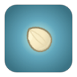 [电饭煲光环](#weapon-rice_cooker_aura) | 元素 | 光环 | 厨具 | 3 / 5 / 8 / 11 | 0.5 / 0.5 / 0.5 / 0.5 | 143 | 31 |
|  [电烤架](#weapon-grill_arc) | 元素 | 连锁闪电 | 厨具 | 9 / 14 / 22 / 34 | 1.1 / 1 / 0.92 / 0.84 | 420 | 31 |
|  [电动打蛋机](#weapon-mixer_storm) | 元素 | 连锁闪电 | 厨具 | 6 / 10 / 15 / 23 | 0.95 / 0.9 / 0.82 / 0.74 | 380 | 31 |
| 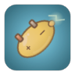 [吐司闪电](#weapon-toaster_zap) | 元素 | 连锁闪电 | 厨具/甜点 | 11 / 19 / 29 / 45 | 1.3 / 1.2 / 1.1 / 1 | 360 | 31 |
|  [毒菇刺](#weapon-toxic_spike) | 近战 | 直刺 | 蔬果/锋利 | 11 / 20 / 31 / 48 | 1.05 / 1 / 0.92 / 0.84 | 185 | 25 |
|  [孢子炮](#weapon-spore_cannon) | 远程 | 子弹 | 蔬果/枪械 | 5 / 9 / 13 / 20 | 0.8 / 0.75 / 0.7 / 0.62 | 400 | 23 |
|  [毒雾喷壶](#weapon-miasma_sprayer) | 元素 | 喷火 | 蔬果 | 2 / 4 / 6 / 9 | 0.18 / 0.16 / 0.14 / 0.12 | 150 | 27 |
| 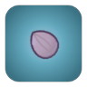 [腐菌光环](#weapon-rot_aura) | 元素 | 光环 | 蔬果 | 3 / 5 / 8 / 11 | 0.5 / 0.5 / 0.5 / 0.5 | 149 | 31 |
|  [毒蘑菇雷](#weapon-toadstool_mine) | 元素 | 地雷 | 蔬果 | 18 / 31 / 47 / 72 | 2.5 / 2.3 / 2.1 / 1.8 | 200 | 26 |
|  [菌丝回旋镖](#weapon-mycelium_boomerang) | 远程 | 回旋镖 | 蔬果 | 9 / 15 / 23 / 36 | 1.4 / 1.3 / 1.2 / 1.1 | 360 | 25 |
|  [毒刺吹管](#weapon-blowpipe) | 远程 | 子弹 | 蔬果 | 10 / 17 / 26 / 40 | 1.05 / 1 / 0.92 / 0.84 | 460 | 26 |
|  [烤肉长签](#weapon-bbq_skewer) | 近战 | 直刺 | 酱料/锋利 | 17 / 29 / 45 / 69 | 1.5 / 1.42 / 1.32 / 1.2 | 200 | 29 |
|  [炭火钳](#weapon-coal_tongs) | 近战 | 横扫 | 厨具/钝器 | 12 / 20 / 32 / 49 | 1.1 / 1.05 / 1 / 0.9 | 125 | 27 |
|  [烧烤酱炮](#weapon-bbq_sauce_cannon) | 远程 | 爆炸弹 | 酱料/枪械 | 13 / 22 / 34 / 52 | 1.8 / 1.7 / 1.6 / 1.4 | 450 | 31 |
| 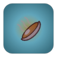 [炭烤光环](#weapon-charcoal_aura) | 元素 | 光环 | 酱料 | 3 / 5 / 7 / 10 | 0.5 / 0.5 / 0.5 / 0.5 | 133 | 33 |
|  [火炭雷](#weapon-ember_mine) | 元素 | 地雷 | 酱料 | 18 / 31 / 47 / 72 | 2.5 / 2.3 / 2.1 / 1.8 | 200 | 26 |
|  [孜然飞镖](#weapon-cumin_star) | 元素 | 回旋镖 | 酱料/锋利 | 7 / 12 / 18 / 28 | 1.3 / 1.2 / 1.1 / 1 | 320 | 29 |
|  [辣酱手枪](#weapon-hot_sauce_gun) | 远程 | 子弹 | 酱料/枪械 | 6 / 11 / 16 / 24 | 0.55 / 0.5 / 0.46 / 0.42 | 380 | 21 |
|  [寿司刀](#weapon-sushi_blade) | 近战 | 直刺 | 锋利/厨具 | 5 / 9 / 14 / 23 | 0.6 / 0.55 / 0.5 / 0.44 | 130 | 21 |
|  [双持菜刀](#weapon-twin_cleavers) | 近战 | 横扫 | 锋利/厨具 | 8 / 13 / 21 / 31 | 0.85 / 0.8 / 0.74 / 0.68 | 105 | 23 |
|  [飞刀匣](#weapon-knife_case) | 远程 | 子弹 | 锋利 | 4 / 7 / 11 / 15 | 0.5 / 0.46 / 0.42 / 0.38 | 400 | 27 |
|  [刃风光环](#weapon-blade_aura) | 近战 | 光环 | 锋利 | 4 / 5 / 8 / 13 | 0.45 / 0.43 / 0.41 / 0.38 | 118 | 29 |
|  [刨丝刀](#weapon-grater_sweep) | 近战 | 横扫 | 锋利/厨具 | 9 / 15 / 24 / 36 | 1.05 / 1 / 0.92 / 0.84 | 115 | 17 |
|  [剁椒飞轮](#weapon-chili_shuriken) | 近战 | 回旋镖 | 锋利/酱料 | 8 / 13 / 20 / 31 | 1.3 / 1.2 / 1.1 / 1 | 230 | 27 |
| 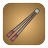 [切片器](#weapon-mandoline) | 近战 | 直刺 | 锋利/厨具 | 5 / 8 / 13 / 19 | 0.5 / 0.46 / 0.42 / 0.38 | 155 | 19 |
|  [椰子炮](#weapon-coconut_cannon) | 远程 | 爆炸弹 | 蔬果/枪械 | 22 / 36 / 56 / 84 | 2.4 / 2.25 / 2.1 / 1.9 | 480 | 36 |
|  [南瓜迫击炮](#weapon-pumpkin_mortar) | 远程 | 爆炸弹 | 蔬果/枪械 | 15 / 26 / 40 / 61 | 2 / 1.9 / 1.78 / 1.6 | 460 | 33 |
|  [西瓜榴弹](#weapon-melon_grenade) | 远程 | 爆炸弹 | 蔬果 | 9 / 14 / 22 / 34 | 1.6 / 1.5 / 1.4 / 1.3 | 360 | 29 |
|  [土豆地雷](#weapon-potato_mine) | 远程 | 地雷 | 蔬果 | 15 / 25 / 39 / 59 | 2 / 1.9 / 1.75 / 1.6 | 220 | 25 |
|  [玉米散弹](#weapon-corn_scatter) | 远程 | 子弹 | 蔬果/枪械 | 4 / 6 / 9 / 14 | 1 / 0.95 / 0.88 / 0.8 | 240 | 27 |
|  [豆荚狙击](#weapon-pea_sniper) | 远程 | 子弹 | 蔬果/枪械 | 22 / 37 / 58 / 85 | 1.9 / 1.8 / 1.65 / 1.5 | 650 | 33 |
|  [薄荷清凉光环](#weapon-mint_aura) | 元素 | 光环 | 蔬果 | 3 / 5 / 7 / 11 | 0.5 / 0.5 / 0.5 / 0.5 | 136 | 31 |
|  [胡椒风暴](#weapon-pepper_storm_aura) | 近战 | 光环 | 酱料/厨具 | 3 / 5 / 7 / 11 | 0.45 / 0.45 / 0.42 / 0.4 | 133 | 23 |
| 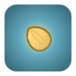 [蜂蜜光环](#weapon-honey_aura) | 元素 | 光环 | 甜点 | 3 / 5 / 8 / 11 | 0.5 / 0.5 / 0.5 / 0.5 | 141 | 31 |
|  [茶壶雷暴](#weapon-teapot_storm) | 元素 | 连锁闪电 | 厨具 | 7 / 13 / 19 / 29 | 0.95 / 0.88 / 0.8 / 0.72 | 440 | 29 |
|  [果冻弹](#weapon-jelly_bounce) | 元素 | 子弹 | 甜点 | 7 / 11 / 17 / 26 | 1 / 0.95 / 0.88 / 0.8 | 400 | 29 |
|  [糖浆喷枪](#weapon-syrup_sprayer) | 元素 | 喷火 | 甜点 | 2 / 3 / 5 / 7 | 0.2 / 0.18 / 0.16 / 0.14 | 200 | 29 |
| 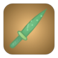 [双刃寿司刀](#weapon-sushi_twin_blade) | 近战 | 直刺 | 锋利/酱料/厨具 | 11 / 19 / 30 / 45 | 0.6 / 0.55 / 0.5 / 0.44 | 158 | 34 |
|  [爆裂豌豆炮](#weapon-blast_pea_cannon) | 远程 | 子弹 | 枪械/蔬果/元素 | 15 / 26 / 42 / 64 | 0.32 / 0.29 / 0.26 / 0.22 | 473 | 39 |
|  [咖喱蒜香结界](#weapon-curry_garlic_field) | 元素 | 光环 | 酱料/元素/蔬果 | 4 / 7 / 10 / 14 | 0.5 / 0.5 / 0.5 / 0.5 | 147 | 42 |
|  [雷霆果园](#weapon-thunder_orchard) | 元素 | 连锁闪电 | 蔬果/元素 | 13 / 22 / 34 / 52 | 1.1 / 1 / 0.92 / 0.84 | 441 | 39 |
|  [霜刃剁骨刀](#weapon-frost_cleaver) | 近战 | 横扫 | 厨具/锋利/钝器 | 23 / 37 / 58 / 88 | 1.1 / 1.05 / 1 / 0.9 | 131 | 40 |
|  [毒雾加特林](#weapon-toxic_gatling) | 远程 | 子弹 | 枪械/酱料/蔬果 | 4 / 7 / 9 / 12 | 0.16 / 0.14 / 0.12 / 0.1 | 441 | 52 |
|  [炎狱迫击炮](#weapon-inferno_mortar) | 远程 | 爆炸弹 | 酱料/爆破/枪械 | 18 / 30 / 46 / 70 | 1.8 / 1.7 / 1.6 / 1.4 | 483 | 42 |
|  [雷霆铁壁锅](#weapon-storm_whisk_pan) | 近战 | 横扫 | 厨具/钝器 | 20 / 33 / 51 / 77 | 1.6 / 1.5 / 1.4 / 1.3 | 126 | 34 |
|  [电磁蓝莓狙](#weapon-railgun_sniper) | 远程 | 子弹 | 枪械/蔬果 | 29 / 48 / 75 / 110 | 1.9 / 1.8 / 1.65 / 1.5 | 683 | 43 |
|  [蜜霜结界](#weapon-honey_frost_aura) | 元素 | 光环 | 甜点 | 3 / 6 / 9 / 12 | 0.5 / 0.5 / 0.5 / 0.5 | 148 | 40 |
|  [孢子雷区](#weapon-spore_minefield) | 元素 | 地雷 | 蔬果/元素/爆破 | 22 / 37 / 57 / 88 | 2.5 / 2.3 / 2.1 / 1.8 | 210 | 34 |
|  [糖果霰弹枪](#weapon-candy_shotgun) | 远程 | 子弹 | 枪械/蔬果/甜点 | 4 / 8 / 11 / 17 | 0.32 / 0.29 / 0.26 / 0.22 | 420 | 34 |
|  [龙息喷流](#weapon-dragon_breath_flame) | 元素 | 喷火 | 酱料/元素 | 3 / 4 / 7 / 11 | 0.2 / 0.18 / 0.16 / 0.14 | 210 | 39 |
|  [椰雷流星锤](#weapon-coconut_quake_mace) | 近战 | 横扫 | 蔬果/爆破/枪械 | 24 / 40 / 62 / 92 | 1.8 / 1.7 / 1.6 / 1.45 | 504 | 47 |
|  [霜星八角](#weapon-anise_frost_storm) | 元素 | 回旋镖 | 锋利/元素 | 10 / 17 / 25 / 39 | 1 / 0.95 / 0.88 / 0.8 | 357 | 36 |
|  [圣盐结界](#weapon-holy_salt_barrier) | 元素 | 光环 | 锋利/元素/蔬果 | 3 / 6 / 9 / 13 | 0.5 / 0.5 / 0.5 / 0.5 | 160 | 40 |
|  [烈焰菜刀](#weapon-fz_knife_ember_mine) | 近战 | 直刺 | 厨具/锋利/酱料 | 20 / 34 / 52 / 79 | 0.6 / 0.55 / 0.5 / 0.44 | 210 | 34 |
|  [贯穿雷霆榴莲](#weapon-fz_thunder_durian_volt_fork) | 元素 | 爆炸弹 | 蔬果/元素/爆破 | 18 / 30 / 46 / 70 | 0.9 / 0.85 / 0.78 / 0.7 | 420 | 42 |
|  [鲜果餐盘飞碟](#weapon-fz_plate_frisbee_onion_boomerang) | 远程 | 回旋镖 | 厨具/蔬果 | 13 / 22 / 34 / 52 | 1.4 / 1.3 / 1.2 / 1.1 | 378 | 31 |
|  [霜寒拐杖糖锤](#weapon-fz_candy_cane_glacier_mortar) | 近战 | 横扫 | 甜点/钝器/枪械 | 17 / 29 / 44 / 67 | 1.25 / 1.18 / 1.1 / 1 | 483 | 43 |
|  [致命玉米散弹](#weapon-fz_corn_scatter_grater_sweep) | 远程 | 子弹 | 蔬果/枪械/锋利 | 10 / 17 / 26 / 40 | 1 / 0.95 / 0.88 / 0.8 | 252 | 35 |
|  [烈焰海胆雷](#weapon-fz_sea_urchin_mine_dragonfruit_orb) | 远程 | 地雷 | 锋利/爆破/蔬果 | 14 / 24 / 37 / 57 | 1 / 0.95 / 0.88 / 0.8 | 420 | 36 |
|  [散射双持菜刀](#weapon-fz_twin_cleavers_ketchup) | 近战 | 横扫 | 锋利/厨具/酱料 | 9 / 14 / 23 / 34 | 0.75 / 0.7 / 0.65 / 0.6 | 294 | 30 |
|  [烈焰果冻弹](#weapon-fz_jelly_bounce_chili_shuriken) | 元素 | 子弹 | 甜点/锋利/酱料 | 9 / 14 / 22 / 34 | 1 / 0.95 / 0.88 / 0.8 | 420 | 38 |
|  [蚀骨冰沙喷雾](#weapon-fz_slush_spray_caramel_aura) | 元素 | 喷火 | 甜点 | 3 / 6 / 8 / 12 | 0.26 / 0.24 / 0.21 / 0.18 | 179 | 43 |
| 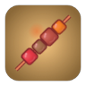 [酱爆烤串签](#weapon-fz_skewer_soy_pistol) | 近战 | 直刺 | 厨具/锋利/枪械 | 13 / 23 / 36 / 56 | 0.55 / 0.5 / 0.46 / 0.42 | 399 | 31 |
| 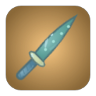 [霜寒黄瓜武士刀](#weapon-fz_cucumber_katana_soda) | 近战 | 直刺 | 蔬果/锋利/元素 | 10 / 17 / 26 / 40 | 0.75 / 0.7 / 0.65 / 0.58 | 420 | 31 |
|  [锐锋玉米加农](#weapon-fz_corn_cannon_blade_aura) | 远程 | 子弹 | 枪械/锋利 | 18 / 31 / 48 / 75 | 0.45 / 0.43 / 0.41 / 0.38 | 546 | 38 |
|  [酱爆电烤架](#weapon-fz_grill_arc_pepper_storm_aura) | 元素 | 连锁闪电 | 厨具/酱料 | 10 / 15 / 24 / 37 | 0.45 / 0.45 / 0.42 / 0.4 | 441 | 40 |
|  [烈焰茶壶雷暴](#weapon-fz_teapot_storm_charcoal_aura) | 元素 | 连锁闪电 | 厨具/酱料 | 8 / 14 / 21 / 32 | 0.5 / 0.5 / 0.5 / 0.5 | 462 | 43 |
|  [烈焰蜂蜜喷枪](#weapon-fz_honey_blaster_pumpkin_mortar) | 远程 | 子弹 | 酱料/蔬果/枪械 | 17 / 29 / 44 / 67 | 0.7 / 0.66 / 0.6 / 0.54 | 483 | 43 |
|  [剧毒爆米花机](#weapon-fz_popcorn_machine_rot_aura) | 远程 | 地雷 | 枪械/爆破/蔬果 | 15 / 26 / 41 / 62 | 0.5 / 0.5 / 0.5 / 0.5 | 231 | 40 |
|  [爆裂甜甜圈飞环](#weapon-fz_donut_ring_dynamite_drumstick) | 远程 | 回旋镖 | 甜点/爆破 | 19 / 32 / 50 / 75 | 1.5 / 1.4 / 1.3 / 1.2 | 347 | 39 |
|  [连环锅铲](#weapon-fz_spatula_slingshot) | 近战 | 横扫 | 厨具/蔬果 | 10 / 18 / 28 / 42 | 0.95 / 0.9 / 0.83 / 0.75 | 399 | 21 |
|  [主厨可乐电击枪](#weapon-fz_cola_zapper_mixer_storm) | 元素 | 连锁闪电 | 枪械/元素/厨具 | 9 / 15 / 23 / 35 | 0.95 / 0.88 / 0.8 / 0.72 | 462 | 40 |
|  [酱爆豆子火箭筒](#weapon-fz_bean_bazooka_soy_bomb) | 远程 | 爆炸弹 | 枪械/爆破/酱料 | 24 / 40 / 62 / 92 | 2.2 / 2.05 / 1.9 / 1.7 | 504 | 44 |
|  [贯穿蒸汽水壶](#weapon-fz_steam_kettle_asparagus_bow) | 元素 | 喷火 | 厨具/元素/蔬果 | 15 / 26 / 41 / 62 | 0.26 / 0.24 / 0.21 / 0.18 | 546 | 36 |
|  [贯穿闪电打蛋器](#weapon-fz_lightning_whisk_pepper_grinder) | 元素 | 连锁闪电 | 厨具/元素/枪械 | 8 / 13 / 20 / 30 | 0.5 / 0.46 / 0.42 / 0.38 | 420 | 39 |
|  [烈焰巧克力地雷](#weapon-fz_choco_mine_bbq_torch) | 远程 | 地雷 | 甜点/枪械/酱料 | 14 / 25 / 39 / 58 | 0.2 / 0.18 / 0.16 / 0.14 | 231 | 39 |
|  [致命樱桃炸弹](#weapon-fz_cherry_bomb_bamboo_spear) | 远程 | 爆炸弹 | 蔬果/爆破 | 21 / 35 / 55 / 85 | 1.5 / 1.42 / 1.32 / 1.2 | 378 | 36 |
|  [剧毒厨房剪刀](#weapon-fz_kitchen_scissors_toxic_spike) | 近战 | 横扫 | 厨具/锋利/蔬果 | 12 / 22 / 34 / 53 | 0.85 / 0.8 / 0.74 / 0.68 | 194 | 33 |
|  [主厨胡萝卜弩](#weapon-fz_carrot_crossbow_fork) | 远程 | 子弹 | 蔬果/厨具 | 13 / 22 / 34 / 52 | 0.9 / 0.85 / 0.78 / 0.7 | 483 | 33 |
|  [霜寒孢子喷壶](#weapon-fz_spore_sprayer_shaved_ice_gun) | 元素 | 子弹 | 蔬果/元素/枪械 | 6 / 9 / 14 / 22 | 0.22 / 0.2 / 0.18 / 0.16 | 378 | 35 |
| 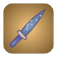 [连环冰棍刺剑](#weapon-fz_popsicle_blade_olive_launcher) | 近战 | 直刺 | 锋利/甜点/枪械 | 10 / 15 / 25 / 37 | 0.8 / 0.75 / 0.69 / 0.62 | 420 | 33 |
| 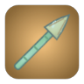 [霜寒烤肉长签](#weapon-fz_bbq_skewer_cream_torch) | 近战 | 直刺 | 酱料/锋利/甜点 | 19 / 32 / 50 / 76 | 0.2 / 0.18 / 0.16 / 0.14 | 210 | 38 |
|  [霜寒椰壳拳套](#weapon-fz_coconut_gloves_ice_cube_tray) | 近战 | 直刺 | 蔬果/厨具/元素 | 6 / 10 / 15 / 24 | 0.42 / 0.4 / 0.37 / 0.34 | 357 | 34 |
|  [爆裂飞刀匣](#weapon-fz_knife_case_microwave_cannon) | 远程 | 子弹 | 锋利/厨具/枪械 | 22 / 35 / 55 / 84 | 0.5 / 0.46 / 0.42 / 0.38 | 504 | 46 |
|  [霜寒炭火钳](#weapon-fz_coal_tongs_whisk_spin) | 近战 | 横扫 | 厨具/钝器 | 13 / 22 / 35 / 54 | 0.45 / 0.45 / 0.42 / 0.4 | 144 | 35 |
| 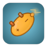 [烈焰吐司闪电](#weapon-fz_toaster_zap_hot_sauce_gun) | 元素 | 连锁闪电 | 厨具/甜点/酱料 | 12 / 21 / 32 / 50 | 0.55 / 0.5 / 0.46 / 0.42 | 399 | 40 |
|  [爆裂汤勺](#weapon-fz_ladle_watermelon_hammer) | 近战 | 横扫 | 厨具/酱料/蔬果 | 33 / 55 / 88 / 132 | 1.15 / 1.1 / 1.02 / 0.94 | 147 | 46 |
| 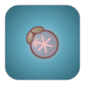 [致命薄荷冰雷](#weapon-fz_mint_frost_mine_blender_aura) | 元素 | 地雷 | 蔬果/元素/爆破 | 18 / 30 / 46 / 70 | 0.45 / 0.43 / 0.41 / 0.38 | 231 | 36 |
|  [贯穿西瓜榴弹](#weapon-fz_melon_grenade_pumpkin_lantern) | 远程 | 爆炸弹 | 蔬果/元素 | 10 / 17 / 26 / 41 | 0.8 / 0.75 / 0.7 / 0.62 | 441 | 38 |
|  [烈焰毒刺吹管](#weapon-fz_blowpipe_syrup_sprayer) | 远程 | 子弹 | 蔬果/甜点 | 11 / 19 / 29 / 44 | 0.2 / 0.18 / 0.16 / 0.14 | 483 | 38 |
|  [烈焰竹筷](#weapon-fz_chopsticks_pepper_spray) | 近战 | 直刺 | 厨具/元素 | 6 / 10 / 15 / 23 | 0.18 / 0.16 / 0.14 / 0.12 | 163 | 34 |
|  [爆裂披萨滚刀](#weapon-fz_pizza_cutter_potato_mine) | 近战 | 回旋镖 | 厨具/锋利/蔬果 | 17 / 28 / 43 / 65 | 1.3 / 1.2 / 1.1 / 1 | 242 | 34 |
|  [重击跳跳糖电击](#weapon-fz_popping_candy_rolling_pin) | 元素 | 连锁闪电 | 甜点/厨具 | 13 / 22 / 35 / 53 | 0.95 / 0.88 / 0.8 / 0.72 | 462 | 38 |
|  [剧毒法棍剑](#weapon-fz_baguette_sword_spore_cannon) | 近战 | 横扫 | 蔬果/枪械 | 12 / 21 / 33 / 51 | 0.8 / 0.75 / 0.7 / 0.62 | 420 | 30 |
|  [霜寒菌丝回旋镖](#weapon-fz_mycelium_boomerang_rice_cooker_aura) | 远程 | 回旋镖 | 蔬果/厨具 | 10 / 17 / 25 / 40 | 0.5 / 0.5 / 0.5 / 0.5 | 378 | 40 |
|  [贯穿孜然飞镖](#weapon-fz_cumin_star_mandoline) | 元素 | 回旋镖 | 酱料/锋利/厨具 | 8 / 13 / 20 / 31 | 0.5 / 0.46 / 0.42 / 0.38 | 336 | 38 |
|  [鲜果松肉锤](#weapon-fz_meat_tenderizer_seed_spitter) | 近战 | 横扫 | 厨具/枪械/蔬果 | 24 / 40 / 62 / 92 | 0.22 / 0.2 / 0.18 / 0.16 | 378 | 39 |

<a id="affixes"></a>

## 随机词条与打造

- T3 武器随机 1 条词条、T4 武器 2 条；词条分 I~IV 级（I 常见、IV 稀有，幸运越高越容易出高等级）
- 商店中可花番茄籽洗练：全部重洗 `8 + 2×波次`，单条重洗为其 2.5 倍
- T4 武器可打造，每级伤害 +5%，最高 +10；费用随等级 ×1.45 递增，失败只扣费用不降级

| 词条 | I | II | III | IV |
| --- | --- | --- | --- | --- |
| 伤害 +N% | 6 | 10 | 15 | 22 |
| 攻速 +N% | 4 | 7 | 10 | 15 |
| 暴击率 +N% | 3 | 5 | 8 | 11 |
| 暴击伤害 +N% | 10 | 18 | 28 | 42 |
| 射程 +N | 20 | 35 | 55 | 80 |
| 吸血概率 +N% | 1 | 2 | 3 | 5 |
| 命中 N% 概率灼烧 | 8 | 14 | 22 | 32 |
| 命中 N% 概率中毒 | 8 | 14 | 22 | 32 |
| 命中 N% 概率减速 | 10 | 18 | 28 | 40 |

| 打造等级 | +1 | +2 | +3 | +4 | +5 | +6 | +7 | +8 | +9 | +10 |
| --- | --- | --- | --- | --- | --- | --- | --- | --- | --- | --- |
| 成功率 | 95% | 90% | 82% | 74% | 65% | 56% | 48% | 40% | 34% | 30% |

<a id="class-melee"></a>

## 近战武器

<a id="weapon-fork"></a>

<table>
<tr><td rowspan="12" align="center" valign="middle"></td><th colspan="2" align="left">番茄叉</th></tr>
<tr><td colspan="2"><i>朴实的三齿叉，向前直刺。</i></td></tr>
<tr><td nowrap>类别 / 方式</td><td>近战 / 直刺</td></tr>
<tr><td nowrap>标签</td><td>厨具</td></tr>
<tr><td nowrap>伤害 T1~T4</td><td>8 / 14 / 22 / 34</td></tr>
<tr><td nowrap>冷却 T1~T4</td><td>0.9s / 0.85s / 0.78s / 0.7s</td></tr>
<tr><td nowrap>射程</td><td>150</td></tr>
<tr><td nowrap>属性加成</td><td>近战伤害 ×1</td></tr>
<tr><td nowrap>暴击倍率</td><td>×2</td></tr>
<tr><td nowrap>特效</td><td>击退 10</td></tr>
<tr><td nowrap>T1 价格</td><td>15</td></tr>
<tr><td nowrap>初始携带</td><td><a href="CHARACTERS.md#char-tomato">番茄妹</a></td></tr>
</table>

<a id="weapon-rolling_pin"></a>

<table>
<tr><td rowspan="12" align="center" valign="middle"></td><th colspan="2" align="left">擀面杖</th></tr>
<tr><td colspan="2"><i>横扫一片，击退敌人。</i></td></tr>
<tr><td nowrap>类别 / 方式</td><td>近战 / 横扫</td></tr>
<tr><td nowrap>标签</td><td>厨具</td></tr>
<tr><td nowrap>伤害 T1~T4</td><td>12 / 20 / 32 / 48</td></tr>
<tr><td nowrap>冷却 T1~T4</td><td>1.25s / 1.18s / 1.1s / 1s</td></tr>
<tr><td nowrap>射程</td><td>130</td></tr>
<tr><td nowrap>属性加成</td><td>近战伤害 ×1</td></tr>
<tr><td nowrap>暴击倍率</td><td>×1.5</td></tr>
<tr><td nowrap>特效</td><td>击退 30</td></tr>
<tr><td nowrap>T1 价格</td><td>18</td></tr>
<tr><td nowrap>初始携带</td><td><a href="CHARACTERS.md#char-carrot">胡萝卜骑士</a>、<a href="CHARACTERS.md#char-sweetpotato">红薯厨神</a></td></tr>
</table>

<a id="weapon-knife"></a>

<table>
<tr><td rowspan="12" align="center" valign="middle"></td><th colspan="2" align="left">菜刀</th></tr>
<tr><td colspan="2"><i>快速直刺，高暴击。</i></td></tr>
<tr><td nowrap>类别 / 方式</td><td>近战 / 直刺</td></tr>
<tr><td nowrap>标签</td><td>厨具、锋利</td></tr>
<tr><td nowrap>伤害 T1~T4</td><td>6 / 10 / 16 / 25</td></tr>
<tr><td nowrap>冷却 T1~T4</td><td>0.6s / 0.55s / 0.5s / 0.44s</td></tr>
<tr><td nowrap>射程</td><td>130</td></tr>
<tr><td nowrap>属性加成</td><td>近战伤害 ×0.8</td></tr>
<tr><td nowrap>暴击倍率</td><td>×2.5</td></tr>
<tr><td nowrap>特效</td><td>额外暴击 15%</td></tr>
<tr><td nowrap>T1 价格</td><td>20</td></tr>
<tr><td nowrap>初始携带</td><td><a href="CHARACTERS.md#char-lemon">柠檬刺客</a>、<a href="CHARACTERS.md#char-blueberry">蓝莓双子</a>、<a href="CHARACTERS.md#char-kiwi">猕猴桃侦探</a></td></tr>
</table>

<a id="weapon-pan"></a>

<table>
<tr><td rowspan="12" align="center" valign="middle"></td><th colspan="2" align="left">平底锅</th></tr>
<tr><td colspan="2"><i>沉重横扫，眩晕敌人 0.4 秒。伤害受护甲加成。</i></td></tr>
<tr><td nowrap>类别 / 方式</td><td>近战 / 横扫</td></tr>
<tr><td nowrap>标签</td><td>厨具</td></tr>
<tr><td nowrap>伤害 T1~T4</td><td>18 / 30 / 46 / 70</td></tr>
<tr><td nowrap>冷却 T1~T4</td><td>1.6s / 1.5s / 1.4s / 1.3s</td></tr>
<tr><td nowrap>射程</td><td>120</td></tr>
<tr><td nowrap>属性加成</td><td>近战伤害 ×1.2，护甲 ×1</td></tr>
<tr><td nowrap>暴击倍率</td><td>×1.5</td></tr>
<tr><td nowrap>特效</td><td>眩晕 0.4s，击退 20</td></tr>
<tr><td nowrap>T1 价格</td><td>25</td></tr>
<tr><td nowrap>初始携带</td><td><a href="CHARACTERS.md#char-onion">洋葱大叔</a>、<a href="CHARACTERS.md#char-coconut">椰子拳师</a></td></tr>
</table>

<a id="weapon-watermelon_hammer"></a>

<table>
<tr><td rowspan="12" align="center" valign="middle"></td><th colspan="2" align="left">西瓜锤</th></tr>
<tr><td colspan="2"><i>砸地产生爆炸，范围巨大。</i></td></tr>
<tr><td nowrap>类别 / 方式</td><td>近战 / 横扫</td></tr>
<tr><td nowrap>标签</td><td>蔬果、爆破</td></tr>
<tr><td nowrap>伤害 T1~T4</td><td>30 / 50 / 80 / 120</td></tr>
<tr><td nowrap>冷却 T1~T4</td><td>2.2s / 2.1s / 2s / 1.8s</td></tr>
<tr><td nowrap>射程</td><td>140</td></tr>
<tr><td nowrap>属性加成</td><td>近战伤害 ×1.5，最大生命 ×0.1</td></tr>
<tr><td nowrap>暴击倍率</td><td>×1.5</td></tr>
<tr><td nowrap>特效</td><td>爆炸半径 100，击退 40</td></tr>
<tr><td nowrap>T1 价格</td><td>35</td></tr>
<tr><td nowrap>初始携带</td><td><a href="CHARACTERS.md#char-watermelon">西瓜胖墩</a></td></tr>
</table>

<a id="weapon-cleaver"></a>

<table>
<tr><td rowspan="12" align="center" valign="middle"></td><th colspan="2" align="left">剁骨刀</th></tr>
<tr><td colspan="2"><i>大力横扫，击杀敌人时 20% 概率额外掉落番茄籽。</i></td></tr>
<tr><td nowrap>类别 / 方式</td><td>近战 / 横扫</td></tr>
<tr><td nowrap>标签</td><td>厨具、锋利</td></tr>
<tr><td nowrap>伤害 T1~T4</td><td>13 / 22 / 35 / 54</td></tr>
<tr><td nowrap>冷却 T1~T4</td><td>1.1s / 1.05s / 1s / 0.9s</td></tr>
<tr><td nowrap>射程</td><td>125</td></tr>
<tr><td nowrap>属性加成</td><td>近战伤害 ×1</td></tr>
<tr><td nowrap>暴击倍率</td><td>×2</td></tr>
<tr><td nowrap>特效</td><td>击退 15，额外暴击 5%</td></tr>
<tr><td nowrap>T1 价格</td><td>26</td></tr>
<tr><td nowrap>初始携带</td><td>-</td></tr>
</table>

<a id="weapon-spatula"></a>

<table>
<tr><td rowspan="12" align="center" valign="middle"></td><th colspan="2" align="left">锅铲</th></tr>
<tr><td colspan="2"><i>轻快横扫，把敌人铲飞老远。</i></td></tr>
<tr><td nowrap>类别 / 方式</td><td>近战 / 横扫</td></tr>
<tr><td nowrap>标签</td><td>厨具</td></tr>
<tr><td nowrap>伤害 T1~T4</td><td>9 / 16 / 25 / 38</td></tr>
<tr><td nowrap>冷却 T1~T4</td><td>1.05s / 1s / 0.92s / 0.84s</td></tr>
<tr><td nowrap>射程</td><td>115</td></tr>
<tr><td nowrap>属性加成</td><td>近战伤害 ×0.8</td></tr>
<tr><td nowrap>暴击倍率</td><td>×1.5</td></tr>
<tr><td nowrap>特效</td><td>击退 38</td></tr>
<tr><td nowrap>T1 价格</td><td>16</td></tr>
<tr><td nowrap>初始携带</td><td>-</td></tr>
</table>

<a id="weapon-whisk_spin"></a>

<table>
<tr><td rowspan="12" align="center" valign="middle"></td><th colspan="2" align="left">旋风打蛋器</th></tr>
<tr><td colspan="2"><i>在身边高速搅拌，持续伤害并减速周围敌人。</i></td></tr>
<tr><td nowrap>类别 / 方式</td><td>近战 / 光环</td></tr>
<tr><td nowrap>标签</td><td>厨具</td></tr>
<tr><td nowrap>伤害 T1~T4</td><td>3 / 5 / 8 / 12</td></tr>
<tr><td nowrap>冷却 T1~T4</td><td>0.45s / 0.45s / 0.42s / 0.4s</td></tr>
<tr><td nowrap>射程</td><td>137</td></tr>
<tr><td nowrap>属性加成</td><td>近战伤害 ×0.4</td></tr>
<tr><td nowrap>暴击倍率</td><td>×1.5</td></tr>
<tr><td nowrap>特效</td><td>减速 20% 0.6s</td></tr>
<tr><td nowrap>T1 价格</td><td>22</td></tr>
<tr><td nowrap>初始携带</td><td><a href="CHARACTERS.md#char-wintermelon">冬瓜和尚</a>、<a href="CHARACTERS.md#char-jackfruit">菠萝蜜卫士</a></td></tr>
</table>

<a id="weapon-meat_tenderizer"></a>

<table>
<tr><td rowspan="12" align="center" valign="middle"></td><th colspan="2" align="left">松肉锤</th></tr>
<tr><td colspan="2"><i>沉重一锤，眩晕敌人 0.6 秒。受护甲加成。</i></td></tr>
<tr><td nowrap>类别 / 方式</td><td>近战 / 横扫</td></tr>
<tr><td nowrap>标签</td><td>厨具</td></tr>
<tr><td nowrap>伤害 T1~T4</td><td>22 / 36 / 56 / 84</td></tr>
<tr><td nowrap>冷却 T1~T4</td><td>1.9s / 1.8s / 1.7s / 1.55s</td></tr>
<tr><td nowrap>射程</td><td>110</td></tr>
<tr><td nowrap>属性加成</td><td>近战伤害 ×1.3，护甲 ×0.5</td></tr>
<tr><td nowrap>暴击倍率</td><td>×1.5</td></tr>
<tr><td nowrap>特效</td><td>眩晕 0.6s，击退 25</td></tr>
<tr><td nowrap>T1 价格</td><td>30</td></tr>
<tr><td nowrap>初始携带</td><td>-</td></tr>
</table>

<a id="weapon-skewer"></a>

<table>
<tr><td rowspan="12" align="center" valign="middle"></td><th colspan="2" align="left">烤串签</th></tr>
<tr><td colspan="2"><i>长距离直刺，烤得敌人滋滋冒烟。</i></td></tr>
<tr><td nowrap>类别 / 方式</td><td>近战 / 直刺</td></tr>
<tr><td nowrap>标签</td><td>厨具、锋利</td></tr>
<tr><td nowrap>伤害 T1~T4</td><td>12 / 21 / 33 / 51</td></tr>
<tr><td nowrap>冷却 T1~T4</td><td>1.05s / 1s / 0.92s / 0.84s</td></tr>
<tr><td nowrap>射程</td><td>185</td></tr>
<tr><td nowrap>属性加成</td><td>近战伤害 ×0.9</td></tr>
<tr><td nowrap>暴击倍率</td><td>×2</td></tr>
<tr><td nowrap>特效</td><td>灼烧 2/秒 2s</td></tr>
<tr><td nowrap>T1 价格</td><td>24</td></tr>
<tr><td nowrap>初始携带</td><td>-</td></tr>
</table>

<a id="weapon-ladle"></a>

<table>
<tr><td rowspan="12" align="center" valign="middle"></td><th colspan="2" align="left">汤勺</th></tr>
<tr><td colspan="2"><i>舀一勺热汤横扫，命中额外提高吸血概率。</i></td></tr>
<tr><td nowrap>类别 / 方式</td><td>近战 / 横扫</td></tr>
<tr><td nowrap>标签</td><td>厨具、酱料</td></tr>
<tr><td nowrap>伤害 T1~T4</td><td>10 / 17 / 27 / 41</td></tr>
<tr><td nowrap>冷却 T1~T4</td><td>1.15s / 1.1s / 1.02s / 0.94s</td></tr>
<tr><td nowrap>射程</td><td>120</td></tr>
<tr><td nowrap>属性加成</td><td>近战伤害 ×0.9，最大生命 ×0.05</td></tr>
<tr><td nowrap>暴击倍率</td><td>×1.5</td></tr>
<tr><td nowrap>特效</td><td>额外吸血概率 3%，击退 20</td></tr>
<tr><td nowrap>T1 价格</td><td>20</td></tr>
<tr><td nowrap>初始携带</td><td><a href="CHARACTERS.md#char-cabbage">卷心菜老兵</a></td></tr>
</table>

<a id="weapon-baguette_sword"></a>

<table>
<tr><td rowspan="12" align="center" valign="middle"></td><th colspan="2" align="left">法棍剑</th></tr>
<tr><td colspan="2"><i>超长法棍大范围横扫。受最大生命加成。</i></td></tr>
<tr><td nowrap>类别 / 方式</td><td>近战 / 横扫</td></tr>
<tr><td nowrap>标签</td><td>蔬果</td></tr>
<tr><td nowrap>伤害 T1~T4</td><td>11 / 19 / 30 / 46</td></tr>
<tr><td nowrap>冷却 T1~T4</td><td>1.3s / 1.22s / 1.14s / 1.04s</td></tr>
<tr><td nowrap>射程</td><td>140</td></tr>
<tr><td nowrap>属性加成</td><td>近战伤害 ×1，最大生命 ×0.15</td></tr>
<tr><td nowrap>暴击倍率</td><td>×1.5</td></tr>
<tr><td nowrap>特效</td><td>击退 25</td></tr>
<tr><td nowrap>T1 价格</td><td>22</td></tr>
<tr><td nowrap>初始携带</td><td>-</td></tr>
</table>

<a id="weapon-cucumber_katana"></a>

<table>
<tr><td rowspan="12" align="center" valign="middle">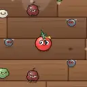</td><th colspan="2" align="left">黄瓜武士刀</th></tr>
<tr><td colspan="2"><i>清脆一斩，暴击率极高。</i></td></tr>
<tr><td nowrap>类别 / 方式</td><td>近战 / 直刺</td></tr>
<tr><td nowrap>标签</td><td>蔬果、锋利</td></tr>
<tr><td nowrap>伤害 T1~T4</td><td>9 / 15 / 24 / 36</td></tr>
<tr><td nowrap>冷却 T1~T4</td><td>0.8s / 0.75s / 0.69s / 0.62s</td></tr>
<tr><td nowrap>射程</td><td>140</td></tr>
<tr><td nowrap>属性加成</td><td>近战伤害 ×0.9</td></tr>
<tr><td nowrap>暴击倍率</td><td>×2.5</td></tr>
<tr><td nowrap>特效</td><td>额外暴击 10%</td></tr>
<tr><td nowrap>T1 价格</td><td>24</td></tr>
<tr><td nowrap>初始携带</td><td>-</td></tr>
</table>

<a id="weapon-pizza_cutter"></a>

<table>
<tr><td rowspan="12" align="center" valign="middle"></td><th colspan="2" align="left">披萨滚刀</th></tr>
<tr><td colspan="2"><i>甩出滚刀蛇形滚出再收回，沿途切开一切。</i></td></tr>
<tr><td nowrap>类别 / 方式</td><td>近战 / 回旋镖</td></tr>
<tr><td nowrap>标签</td><td>厨具、锋利</td></tr>
<tr><td nowrap>伤害 T1~T4</td><td>9 / 15 / 24 / 36</td></tr>
<tr><td nowrap>冷却 T1~T4</td><td>1.3s / 1.2s / 1.1s / 1s</td></tr>
<tr><td nowrap>射程</td><td>230</td></tr>
<tr><td nowrap>属性加成</td><td>近战伤害 ×0.8</td></tr>
<tr><td nowrap>暴击倍率</td><td>×2</td></tr>
<tr><td nowrap>特效</td><td>-</td></tr>
<tr><td nowrap>T1 价格</td><td>26</td></tr>
<tr><td nowrap>初始携带</td><td>-</td></tr>
</table>

<a id="weapon-chopsticks"></a>

<table>
<tr><td rowspan="12" align="center" valign="middle"></td><th colspan="2" align="left">竹筷</th></tr>
<tr><td colspan="2"><i>闪电般连戳，快准狠。</i></td></tr>
<tr><td nowrap>类别 / 方式</td><td>近战 / 直刺</td></tr>
<tr><td nowrap>标签</td><td>厨具</td></tr>
<tr><td nowrap>伤害 T1~T4</td><td>5 / 9 / 14 / 21</td></tr>
<tr><td nowrap>冷却 T1~T4</td><td>0.5s / 0.46s / 0.42s / 0.38s</td></tr>
<tr><td nowrap>射程</td><td>155</td></tr>
<tr><td nowrap>属性加成</td><td>近战伤害 ×0.7</td></tr>
<tr><td nowrap>暴击倍率</td><td>×2</td></tr>
<tr><td nowrap>特效</td><td>额外暴击 5%</td></tr>
<tr><td nowrap>T1 价格</td><td>18</td></tr>
<tr><td nowrap>初始携带</td><td>-</td></tr>
</table>

<a id="weapon-bamboo_spear"></a>

<table>
<tr><td rowspan="12" align="center" valign="middle"></td><th colspan="2" align="left">竹笋长矛</th></tr>
<tr><td colspan="2"><i>缓慢而有力的超远直刺。</i></td></tr>
<tr><td nowrap>类别 / 方式</td><td>近战 / 直刺</td></tr>
<tr><td nowrap>标签</td><td>蔬果</td></tr>
<tr><td nowrap>伤害 T1~T4</td><td>19 / 32 / 50 / 77</td></tr>
<tr><td nowrap>冷却 T1~T4</td><td>1.5s / 1.42s / 1.32s / 1.2s</td></tr>
<tr><td nowrap>射程</td><td>200</td></tr>
<tr><td nowrap>属性加成</td><td>近战伤害 ×1.2</td></tr>
<tr><td nowrap>暴击倍率</td><td>×2</td></tr>
<tr><td nowrap>特效</td><td>击退 20</td></tr>
<tr><td nowrap>T1 价格</td><td>28</td></tr>
<tr><td nowrap>初始携带</td><td>-</td></tr>
</table>

<a id="weapon-pineapple_mace"></a>

<table>
<tr><td rowspan="12" align="center" valign="middle"></td><th colspan="2" align="left">菠萝流星锤</th></tr>
<tr><td colspan="2"><i>带刺的菠萝砸下，引发小范围爆炸。</i></td></tr>
<tr><td nowrap>类别 / 方式</td><td>近战 / 横扫</td></tr>
<tr><td nowrap>标签</td><td>蔬果、爆破</td></tr>
<tr><td nowrap>伤害 T1~T4</td><td>20 / 34 / 53 / 80</td></tr>
<tr><td nowrap>冷却 T1~T4</td><td>1.8s / 1.7s / 1.6s / 1.45s</td></tr>
<tr><td nowrap>射程</td><td>130</td></tr>
<tr><td nowrap>属性加成</td><td>近战伤害 ×1.3</td></tr>
<tr><td nowrap>暴击倍率</td><td>×1.5</td></tr>
<tr><td nowrap>特效</td><td>爆炸半径 75，击退 30</td></tr>
<tr><td nowrap>T1 价格</td><td>32</td></tr>
<tr><td nowrap>初始携带</td><td><a href="CHARACTERS.md#char-beet">甜菜狂战士</a></td></tr>
</table>

<a id="weapon-wasabi_katana"></a>

<table>
<tr><td rowspan="12" align="center" valign="middle"></td><th colspan="2" align="left">芥末太刀</th></tr>
<tr><td colspan="2"><i>刀身抹满芥末，刺中带灼烧，暴击率高。</i></td></tr>
<tr><td nowrap>类别 / 方式</td><td>近战 / 直刺</td></tr>
<tr><td nowrap>标签</td><td>锋利、酱料</td></tr>
<tr><td nowrap>伤害 T1~T4</td><td>10 / 17 / 27 / 41</td></tr>
<tr><td nowrap>冷却 T1~T4</td><td>0.85s / 0.8s / 0.74s / 0.67s</td></tr>
<tr><td nowrap>射程</td><td>150</td></tr>
<tr><td nowrap>属性加成</td><td>近战伤害 ×0.9</td></tr>
<tr><td nowrap>暴击倍率</td><td>×2.2</td></tr>
<tr><td nowrap>特效</td><td>灼烧 2/秒 1.5s，额外暴击 8%</td></tr>
<tr><td nowrap>T1 价格</td><td>26</td></tr>
<tr><td nowrap>初始携带</td><td>-</td></tr>
</table>

<a id="weapon-kitchen_scissors"></a>

<table>
<tr><td rowspan="12" align="center" valign="middle">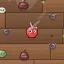</td><th colspan="2" align="left">厨房剪刀</th></tr>
<tr><td colspan="2"><i>咔嚓咔嚓快速横剪，暴击率高。</i></td></tr>
<tr><td nowrap>类别 / 方式</td><td>近战 / 横扫</td></tr>
<tr><td nowrap>标签</td><td>厨具、锋利</td></tr>
<tr><td nowrap>伤害 T1~T4</td><td>8 / 14 / 22 / 33</td></tr>
<tr><td nowrap>冷却 T1~T4</td><td>0.85s / 0.8s / 0.74s / 0.68s</td></tr>
<tr><td nowrap>射程</td><td>105</td></tr>
<tr><td nowrap>属性加成</td><td>近战伤害 ×0.8</td></tr>
<tr><td nowrap>暴击倍率</td><td>×2.2</td></tr>
<tr><td nowrap>特效</td><td>击退 8，额外暴击 10%</td></tr>
<tr><td nowrap>T1 价格</td><td>22</td></tr>
<tr><td nowrap>初始携带</td><td>-</td></tr>
</table>

<a id="weapon-blender_aura"></a>

<table>
<tr><td rowspan="12" align="center" valign="middle"></td><th colspan="2" align="left">破壁机</th></tr>
<tr><td colspan="2"><i>在身边高速旋转的刀片，持续切割周围敌人。</i></td></tr>
<tr><td nowrap>类别 / 方式</td><td>近战 / 光环</td></tr>
<tr><td nowrap>标签</td><td>厨具、锋利</td></tr>
<tr><td nowrap>伤害 T1~T4</td><td>4 / 6 / 9 / 14</td></tr>
<tr><td nowrap>冷却 T1~T4</td><td>0.45s / 0.43s / 0.41s / 0.38s</td></tr>
<tr><td nowrap>射程</td><td>121</td></tr>
<tr><td nowrap>属性加成</td><td>近战伤害 ×0.5</td></tr>
<tr><td nowrap>暴击倍率</td><td>×2</td></tr>
<tr><td nowrap>特效</td><td>额外暴击 5%</td></tr>
<tr><td nowrap>T1 价格</td><td>28</td></tr>
<tr><td nowrap>初始携带</td><td>-</td></tr>
</table>

<a id="weapon-dynamite_drumstick"></a>

<table>
<tr><td rowspan="12" align="center" valign="middle"></td><th colspan="2" align="left">炸药鸡腿</th></tr>
<tr><td colspan="2"><i>绑着炸药的大鸡腿，抡一下就炸一片。受最大生命加成。</i></td></tr>
<tr><td nowrap>类别 / 方式</td><td>近战 / 横扫</td></tr>
<tr><td nowrap>标签</td><td>爆破</td></tr>
<tr><td nowrap>伤害 T1~T4</td><td>17 / 29 / 45 / 68</td></tr>
<tr><td nowrap>冷却 T1~T4</td><td>1.7s / 1.6s / 1.5s / 1.36s</td></tr>
<tr><td nowrap>射程</td><td>120</td></tr>
<tr><td nowrap>属性加成</td><td>近战伤害 ×1.1，最大生命 ×0.1</td></tr>
<tr><td nowrap>暴击倍率</td><td>×1.5</td></tr>
<tr><td nowrap>特效</td><td>爆炸半径 85，击退 30</td></tr>
<tr><td nowrap>T1 价格</td><td>30</td></tr>
<tr><td nowrap>初始携带</td><td>-</td></tr>
</table>

<a id="weapon-coconut_gloves"></a>

<table>
<tr><td rowspan="12" align="center" valign="middle"></td><th colspan="2" align="left">椰壳拳套</th></tr>
<tr><td colspan="2"><i>椰壳做的拳套，短距离快速出拳，击退敌人。</i></td></tr>
<tr><td nowrap>类别 / 方式</td><td>近战 / 直刺</td></tr>
<tr><td nowrap>标签</td><td>蔬果</td></tr>
<tr><td nowrap>伤害 T1~T4</td><td>5 / 9 / 14 / 22</td></tr>
<tr><td nowrap>冷却 T1~T4</td><td>0.42s / 0.4s / 0.37s / 0.34s</td></tr>
<tr><td nowrap>射程</td><td>95</td></tr>
<tr><td nowrap>属性加成</td><td>近战伤害 ×0.85</td></tr>
<tr><td nowrap>暴击倍率</td><td>×1.8</td></tr>
<tr><td nowrap>特效</td><td>击退 14</td></tr>
<tr><td nowrap>T1 价格</td><td>20</td></tr>
<tr><td nowrap>初始携带</td><td>-</td></tr>
</table>

<a id="weapon-candy_cane"></a>

<table>
<tr><td rowspan="12" align="center" valign="middle"></td><th colspan="2" align="left">拐杖糖锤</th></tr>
<tr><td colspan="2"><i>硬邦邦的拐杖糖，横扫并短暂眩晕敌人。</i></td></tr>
<tr><td nowrap>类别 / 方式</td><td>近战 / 横扫</td></tr>
<tr><td nowrap>标签</td><td>甜点、钝器</td></tr>
<tr><td nowrap>伤害 T1~T4</td><td>11 / 18 / 29 / 43</td></tr>
<tr><td nowrap>冷却 T1~T4</td><td>1.25s / 1.18s / 1.1s / 1s</td></tr>
<tr><td nowrap>射程</td><td>130</td></tr>
<tr><td nowrap>属性加成</td><td>近战伤害 ×1</td></tr>
<tr><td nowrap>暴击倍率</td><td>×1.5</td></tr>
<tr><td nowrap>特效</td><td>眩晕 0.3s，击退 30</td></tr>
<tr><td nowrap>T1 价格</td><td>19</td></tr>
<tr><td nowrap>初始携带</td><td>-</td></tr>
</table>

<a id="weapon-popsicle_blade"></a>

<table>
<tr><td rowspan="12" align="center" valign="middle"></td><th colspan="2" align="left">冰棍刺剑</th></tr>
<tr><td colspan="2"><i>冰棍削成的刺剑，刺中减速。</i></td></tr>
<tr><td nowrap>类别 / 方式</td><td>近战 / 直刺</td></tr>
<tr><td nowrap>标签</td><td>锋利、甜点</td></tr>
<tr><td nowrap>伤害 T1~T4</td><td>9 / 14 / 23 / 34</td></tr>
<tr><td nowrap>冷却 T1~T4</td><td>0.8s / 0.75s / 0.69s / 0.62s</td></tr>
<tr><td nowrap>射程</td><td>140</td></tr>
<tr><td nowrap>属性加成</td><td>近战伤害 ×0.9</td></tr>
<tr><td nowrap>暴击倍率</td><td>×2.5</td></tr>
<tr><td nowrap>特效</td><td>减速 30% 1s，额外暴击 10%</td></tr>
<tr><td nowrap>T1 价格</td><td>25</td></tr>
<tr><td nowrap>初始携带</td><td>-</td></tr>
</table>

<a id="weapon-icecream_hammer"></a>

<table>
<tr><td rowspan="12" align="center" valign="middle"></td><th colspan="2" align="left">雪糕大锤</th></tr>
<tr><td colspan="2"><i>冻成冰坨的雪糕，砸中大幅减速。</i></td></tr>
<tr><td nowrap>类别 / 方式</td><td>近战 / 横扫</td></tr>
<tr><td nowrap>标签</td><td>钝器、甜点</td></tr>
<tr><td nowrap>伤害 T1~T4</td><td>21 / 34 / 53 / 80</td></tr>
<tr><td nowrap>冷却 T1~T4</td><td>1.9s / 1.8s / 1.7s / 1.55s</td></tr>
<tr><td nowrap>射程</td><td>110</td></tr>
<tr><td nowrap>属性加成</td><td>近战伤害 ×1.3，护甲 ×0.5</td></tr>
<tr><td nowrap>暴击倍率</td><td>×1.5</td></tr>
<tr><td nowrap>特效</td><td>减速 45% 1.5s，击退 25</td></tr>
<tr><td nowrap>T1 价格</td><td>31</td></tr>
<tr><td nowrap>初始携带</td><td>-</td></tr>
</table>

<a id="weapon-shock_wok"></a>

<table>
<tr><td rowspan="12" align="center" valign="middle"></td><th colspan="2" align="left">电磁炒锅</th></tr>
<tr><td colspan="2"><i>通了电的炒锅，拍中眩晕更久。</i></td></tr>
<tr><td nowrap>类别 / 方式</td><td>近战 / 横扫</td></tr>
<tr><td nowrap>标签</td><td>厨具、钝器</td></tr>
<tr><td nowrap>伤害 T1~T4</td><td>16 / 27 / 41 / 63</td></tr>
<tr><td nowrap>冷却 T1~T4</td><td>1.6s / 1.5s / 1.4s / 1.3s</td></tr>
<tr><td nowrap>射程</td><td>120</td></tr>
<tr><td nowrap>属性加成</td><td>近战伤害 ×1.2，护甲 ×1</td></tr>
<tr><td nowrap>暴击倍率</td><td>×1.5</td></tr>
<tr><td nowrap>特效</td><td>眩晕 0.6s，击退 20</td></tr>
<tr><td nowrap>T1 价格</td><td>26</td></tr>
<tr><td nowrap>初始携带</td><td>-</td></tr>
</table>

<a id="weapon-volt_fork"></a>

<table>
<tr><td rowspan="12" align="center" valign="middle"></td><th colspan="2" align="left">高压电叉</th></tr>
<tr><td colspan="2"><i>带电的叉子，刺穿敌人并眩晕。</i></td></tr>
<tr><td nowrap>类别 / 方式</td><td>近战 / 直刺</td></tr>
<tr><td nowrap>标签</td><td>厨具</td></tr>
<tr><td nowrap>伤害 T1~T4</td><td>7 / 13 / 20 / 31</td></tr>
<tr><td nowrap>冷却 T1~T4</td><td>0.9s / 0.85s / 0.78s / 0.7s</td></tr>
<tr><td nowrap>射程</td><td>150</td></tr>
<tr><td nowrap>属性加成</td><td>近战伤害 ×1</td></tr>
<tr><td nowrap>暴击倍率</td><td>×2</td></tr>
<tr><td nowrap>特效</td><td>眩晕 0.25s，穿透 1/1/2/2，击退 10</td></tr>
<tr><td nowrap>T1 价格</td><td>16</td></tr>
<tr><td nowrap>初始携带</td><td>-</td></tr>
</table>

<a id="weapon-toxic_spike"></a>

<table>
<tr><td rowspan="12" align="center" valign="middle"></td><th colspan="2" align="left">毒菇刺</th></tr>
<tr><td colspan="2"><i>淬了毒的菇刺，刺中中毒。</i></td></tr>
<tr><td nowrap>类别 / 方式</td><td>近战 / 直刺</td></tr>
<tr><td nowrap>标签</td><td>蔬果、锋利</td></tr>
<tr><td nowrap>伤害 T1~T4</td><td>11 / 20 / 31 / 48</td></tr>
<tr><td nowrap>冷却 T1~T4</td><td>1.05s / 1s / 0.92s / 0.84s</td></tr>
<tr><td nowrap>射程</td><td>185</td></tr>
<tr><td nowrap>属性加成</td><td>近战伤害 ×0.9</td></tr>
<tr><td nowrap>暴击倍率</td><td>×2</td></tr>
<tr><td nowrap>特效</td><td>-</td></tr>
<tr><td nowrap>T1 价格</td><td>25</td></tr>
<tr><td nowrap>初始携带</td><td>-</td></tr>
</table>

<a id="weapon-bbq_skewer"></a>

<table>
<tr><td rowspan="12" align="center" valign="middle"></td><th colspan="2" align="left">烤肉长签</th></tr>
<tr><td colspan="2"><i>烧红的烤肉签，刺中灼烧。</i></td></tr>
<tr><td nowrap>类别 / 方式</td><td>近战 / 直刺</td></tr>
<tr><td nowrap>标签</td><td>酱料、锋利</td></tr>
<tr><td nowrap>伤害 T1~T4</td><td>17 / 29 / 45 / 69</td></tr>
<tr><td nowrap>冷却 T1~T4</td><td>1.5s / 1.42s / 1.32s / 1.2s</td></tr>
<tr><td nowrap>射程</td><td>200</td></tr>
<tr><td nowrap>属性加成</td><td>近战伤害 ×1.2</td></tr>
<tr><td nowrap>暴击倍率</td><td>×2</td></tr>
<tr><td nowrap>特效</td><td>灼烧 3/秒 2s，击退 20</td></tr>
<tr><td nowrap>T1 价格</td><td>29</td></tr>
<tr><td nowrap>初始携带</td><td>-</td></tr>
</table>

<a id="weapon-coal_tongs"></a>

<table>
<tr><td rowspan="12" align="center" valign="middle"></td><th colspan="2" align="left">炭火钳</th></tr>
<tr><td colspan="2"><i>夹着炭火横扫，灼烧敌人。</i></td></tr>
<tr><td nowrap>类别 / 方式</td><td>近战 / 横扫</td></tr>
<tr><td nowrap>标签</td><td>厨具、钝器</td></tr>
<tr><td nowrap>伤害 T1~T4</td><td>12 / 20 / 32 / 49</td></tr>
<tr><td nowrap>冷却 T1~T4</td><td>1.1s / 1.05s / 1s / 0.9s</td></tr>
<tr><td nowrap>射程</td><td>125</td></tr>
<tr><td nowrap>属性加成</td><td>近战伤害 ×1</td></tr>
<tr><td nowrap>暴击倍率</td><td>×2</td></tr>
<tr><td nowrap>特效</td><td>灼烧 3/秒 2s，击退 15，额外暴击 5%</td></tr>
<tr><td nowrap>T1 价格</td><td>27</td></tr>
<tr><td nowrap>初始携带</td><td>-</td></tr>
</table>

<a id="weapon-sushi_blade"></a>

<table>
<tr><td rowspan="12" align="center" valign="middle">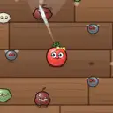</td><th colspan="2" align="left">寿司刀</th></tr>
<tr><td colspan="2"><i>极薄的寿司刀，暴击伤害极高。</i></td></tr>
<tr><td nowrap>类别 / 方式</td><td>近战 / 直刺</td></tr>
<tr><td nowrap>标签</td><td>锋利、厨具</td></tr>
<tr><td nowrap>伤害 T1~T4</td><td>5 / 9 / 14 / 23</td></tr>
<tr><td nowrap>冷却 T1~T4</td><td>0.6s / 0.55s / 0.5s / 0.44s</td></tr>
<tr><td nowrap>射程</td><td>130</td></tr>
<tr><td nowrap>属性加成</td><td>近战伤害 ×0.8</td></tr>
<tr><td nowrap>暴击倍率</td><td>×2.6</td></tr>
<tr><td nowrap>特效</td><td>额外暴击 10%</td></tr>
<tr><td nowrap>T1 价格</td><td>21</td></tr>
<tr><td nowrap>初始携带</td><td>-</td></tr>
</table>

<a id="weapon-twin_cleavers"></a>

<table>
<tr><td rowspan="12" align="center" valign="middle"></td><th colspan="2" align="left">双持菜刀</th></tr>
<tr><td colspan="2"><i>左右开弓的两把菜刀，容易暴击。</i></td></tr>
<tr><td nowrap>类别 / 方式</td><td>近战 / 横扫</td></tr>
<tr><td nowrap>标签</td><td>锋利、厨具</td></tr>
<tr><td nowrap>伤害 T1~T4</td><td>8 / 13 / 21 / 31</td></tr>
<tr><td nowrap>冷却 T1~T4</td><td>0.85s / 0.8s / 0.74s / 0.68s</td></tr>
<tr><td nowrap>射程</td><td>105</td></tr>
<tr><td nowrap>属性加成</td><td>近战伤害 ×0.8</td></tr>
<tr><td nowrap>暴击倍率</td><td>×2.2</td></tr>
<tr><td nowrap>特效</td><td>击退 8，额外暴击 8%</td></tr>
<tr><td nowrap>T1 价格</td><td>23</td></tr>
<tr><td nowrap>初始携带</td><td>-</td></tr>
</table>

<a id="weapon-blade_aura"></a>

<table>
<tr><td rowspan="12" align="center" valign="middle"></td><th colspan="2" align="left">刃风光环</th></tr>
<tr><td colspan="2"><i>周身飞舞的刀刃，容易暴击。</i></td></tr>
<tr><td nowrap>类别 / 方式</td><td>近战 / 光环</td></tr>
<tr><td nowrap>标签</td><td>锋利</td></tr>
<tr><td nowrap>伤害 T1~T4</td><td>4 / 5 / 8 / 13</td></tr>
<tr><td nowrap>冷却 T1~T4</td><td>0.45s / 0.43s / 0.41s / 0.38s</td></tr>
<tr><td nowrap>射程</td><td>118</td></tr>
<tr><td nowrap>属性加成</td><td>近战伤害 ×0.5</td></tr>
<tr><td nowrap>暴击倍率</td><td>×2</td></tr>
<tr><td nowrap>特效</td><td>额外暴击 10%</td></tr>
<tr><td nowrap>T1 价格</td><td>29</td></tr>
<tr><td nowrap>初始携带</td><td>-</td></tr>
</table>

<a id="weapon-grater_sweep"></a>

<table>
<tr><td rowspan="12" align="center" valign="middle"></td><th colspan="2" align="left">刨丝刀</th></tr>
<tr><td colspan="2"><i>刨丝刀横扫，刮出高暴击。</i></td></tr>
<tr><td nowrap>类别 / 方式</td><td>近战 / 横扫</td></tr>
<tr><td nowrap>标签</td><td>锋利、厨具</td></tr>
<tr><td nowrap>伤害 T1~T4</td><td>9 / 15 / 24 / 36</td></tr>
<tr><td nowrap>冷却 T1~T4</td><td>1.05s / 1s / 0.92s / 0.84s</td></tr>
<tr><td nowrap>射程</td><td>115</td></tr>
<tr><td nowrap>属性加成</td><td>近战伤害 ×0.8</td></tr>
<tr><td nowrap>暴击倍率</td><td>×2</td></tr>
<tr><td nowrap>特效</td><td>击退 38，额外暴击 12%</td></tr>
<tr><td nowrap>T1 价格</td><td>17</td></tr>
<tr><td nowrap>初始携带</td><td>-</td></tr>
</table>

<a id="weapon-chili_shuriken"></a>

<table>
<tr><td rowspan="12" align="center" valign="middle"></td><th colspan="2" align="left">剁椒飞轮</th></tr>
<tr><td colspan="2"><i>沾满剁椒的飞轮，暴击并灼烧。</i></td></tr>
<tr><td nowrap>类别 / 方式</td><td>近战 / 回旋镖</td></tr>
<tr><td nowrap>标签</td><td>锋利、酱料</td></tr>
<tr><td nowrap>伤害 T1~T4</td><td>8 / 13 / 20 / 31</td></tr>
<tr><td nowrap>冷却 T1~T4</td><td>1.3s / 1.2s / 1.1s / 1s</td></tr>
<tr><td nowrap>射程</td><td>230</td></tr>
<tr><td nowrap>属性加成</td><td>近战伤害 ×0.8</td></tr>
<tr><td nowrap>暴击倍率</td><td>×2.1</td></tr>
<tr><td nowrap>特效</td><td>灼烧 2/秒 1.5s</td></tr>
<tr><td nowrap>T1 价格</td><td>27</td></tr>
<tr><td nowrap>初始携带</td><td>-</td></tr>
</table>

<a id="weapon-mandoline"></a>

<table>
<tr><td rowspan="12" align="center" valign="middle"></td><th colspan="2" align="left">切片器</th></tr>
<tr><td colspan="2"><i>一刀切穿一排，容易暴击。</i></td></tr>
<tr><td nowrap>类别 / 方式</td><td>近战 / 直刺</td></tr>
<tr><td nowrap>标签</td><td>锋利、厨具</td></tr>
<tr><td nowrap>伤害 T1~T4</td><td>5 / 8 / 13 / 19</td></tr>
<tr><td nowrap>冷却 T1~T4</td><td>0.5s / 0.46s / 0.42s / 0.38s</td></tr>
<tr><td nowrap>射程</td><td>155</td></tr>
<tr><td nowrap>属性加成</td><td>近战伤害 ×0.7</td></tr>
<tr><td nowrap>暴击倍率</td><td>×2</td></tr>
<tr><td nowrap>特效</td><td>穿透 1/2/2/3，额外暴击 10%</td></tr>
<tr><td nowrap>T1 价格</td><td>19</td></tr>
<tr><td nowrap>初始携带</td><td>-</td></tr>
</table>

<a id="weapon-pepper_storm_aura"></a>

<table>
<tr><td rowspan="12" align="center" valign="middle"></td><th colspan="2" align="left">胡椒风暴</th></tr>
<tr><td colspan="2"><i>卷起胡椒的旋风，灼烧周围敌人。</i></td></tr>
<tr><td nowrap>类别 / 方式</td><td>近战 / 光环</td></tr>
<tr><td nowrap>标签</td><td>酱料、厨具</td></tr>
<tr><td nowrap>伤害 T1~T4</td><td>3 / 5 / 7 / 11</td></tr>
<tr><td nowrap>冷却 T1~T4</td><td>0.45s / 0.45s / 0.42s / 0.4s</td></tr>
<tr><td nowrap>射程</td><td>133</td></tr>
<tr><td nowrap>属性加成</td><td>近战伤害 ×0.4</td></tr>
<tr><td nowrap>暴击倍率</td><td>×1.5</td></tr>
<tr><td nowrap>特效</td><td>灼烧 2/秒 1.5s</td></tr>
<tr><td nowrap>T1 价格</td><td>23</td></tr>
<tr><td nowrap>初始携带</td><td>-</td></tr>
</table>

<a id="weapon-sushi_twin_blade"></a>

<table>
<tr><td rowspan="12" align="center" valign="middle"></td><th colspan="2" align="left">双刃寿司刀</th></tr>
<tr><td colspan="2"><i>两把名刀熔成一把，暴击又快又狠，刀光所过之处余烬未消。</i></td></tr>
<tr><td nowrap>类别 / 方式</td><td>近战 / 直刺</td></tr>
<tr><td nowrap>标签</td><td>锋利、酱料、厨具</td></tr>
<tr><td nowrap>伤害 T1~T4</td><td>11 / 19 / 30 / 45</td></tr>
<tr><td nowrap>冷却 T1~T4</td><td>0.6s / 0.55s / 0.5s / 0.44s</td></tr>
<tr><td nowrap>射程</td><td>158</td></tr>
<tr><td nowrap>属性加成</td><td>近战伤害 ×1.02</td></tr>
<tr><td nowrap>暴击倍率</td><td>×2.6</td></tr>
<tr><td nowrap>特效</td><td>灼烧 2/秒 1.5s，额外暴击 10%</td></tr>
<tr><td nowrap>T1 价格</td><td>34</td></tr>
<tr><td nowrap>初始携带</td><td>-</td></tr>
</table>

<a id="weapon-frost_cleaver"></a>

<table>
<tr><td rowspan="12" align="center" valign="middle"></td><th colspan="2" align="left">霜刃剁骨刀</th></tr>
<tr><td colspan="2"><i>冻进刀身的寒气，每一斩都让敌人迟滞。</i></td></tr>
<tr><td nowrap>类别 / 方式</td><td>近战 / 横扫</td></tr>
<tr><td nowrap>标签</td><td>厨具、锋利、钝器</td></tr>
<tr><td nowrap>伤害 T1~T4</td><td>23 / 37 / 58 / 88</td></tr>
<tr><td nowrap>冷却 T1~T4</td><td>1.1s / 1.05s / 1s / 0.9s</td></tr>
<tr><td nowrap>射程</td><td>131</td></tr>
<tr><td nowrap>属性加成</td><td>近战伤害 ×1.38，护甲 ×0.3</td></tr>
<tr><td nowrap>暴击倍率</td><td>×2</td></tr>
<tr><td nowrap>特效</td><td>减速 45% 1.5s，击退 15，额外暴击 5%</td></tr>
<tr><td nowrap>T1 价格</td><td>40</td></tr>
<tr><td nowrap>初始携带</td><td>-</td></tr>
</table>

<a id="weapon-storm_whisk_pan"></a>

<table>
<tr><td rowspan="12" align="center" valign="middle"></td><th colspan="2" align="left">雷霆铁壁锅</th></tr>
<tr><td colspan="2"><i>平底锅焊上电打蛋器，拍下去连人带甲一起电晕。</i></td></tr>
<tr><td nowrap>类别 / 方式</td><td>近战 / 横扫</td></tr>
<tr><td nowrap>标签</td><td>厨具、钝器</td></tr>
<tr><td nowrap>伤害 T1~T4</td><td>20 / 33 / 51 / 77</td></tr>
<tr><td nowrap>冷却 T1~T4</td><td>1.6s / 1.5s / 1.4s / 1.3s</td></tr>
<tr><td nowrap>射程</td><td>126</td></tr>
<tr><td nowrap>属性加成</td><td>近战伤害 ×1.44，护甲 ×1.2</td></tr>
<tr><td nowrap>暴击倍率</td><td>×1.5</td></tr>
<tr><td nowrap>特效</td><td>眩晕 0.7s，击退 20</td></tr>
<tr><td nowrap>T1 价格</td><td>34</td></tr>
<tr><td nowrap>初始携带</td><td>-</td></tr>
</table>

<a id="weapon-coconut_quake_mace"></a>

<table>
<tr><td rowspan="12" align="center" valign="middle"></td><th colspan="2" align="left">椰雷流星锤</th></tr>
<tr><td colspan="2"><i>椰子炮的弹药绑在流星锤上，砸地就是一声巨响。</i></td></tr>
<tr><td nowrap>类别 / 方式</td><td>近战 / 横扫</td></tr>
<tr><td nowrap>标签</td><td>蔬果、爆破、枪械</td></tr>
<tr><td nowrap>伤害 T1~T4</td><td>24 / 40 / 62 / 92</td></tr>
<tr><td nowrap>冷却 T1~T4</td><td>1.8s / 1.7s / 1.6s / 1.45s</td></tr>
<tr><td nowrap>射程</td><td>504</td></tr>
<tr><td nowrap>属性加成</td><td>近战伤害 ×0.78，远程伤害 ×0.78</td></tr>
<tr><td nowrap>暴击倍率</td><td>×1.5</td></tr>
<tr><td nowrap>特效</td><td>爆炸半径 120，击退 30</td></tr>
<tr><td nowrap>T1 价格</td><td>47</td></tr>
<tr><td nowrap>初始携带</td><td>-</td></tr>
</table>

<a id="weapon-fz_knife_ember_mine"></a>

<table>
<tr><td rowspan="12" align="center" valign="middle">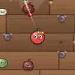</td><th colspan="2" align="left">烈焰菜刀</th></tr>
<tr><td colspan="2"><i>把火炭雷熔进菜刀：保留菜刀的攻击方式，同时带上两把武器的特效。</i></td></tr>
<tr><td nowrap>类别 / 方式</td><td>近战 / 直刺</td></tr>
<tr><td nowrap>标签</td><td>厨具、锋利、酱料</td></tr>
<tr><td nowrap>伤害 T1~T4</td><td>20 / 34 / 52 / 79</td></tr>
<tr><td nowrap>冷却 T1~T4</td><td>0.6s / 0.55s / 0.5s / 0.44s</td></tr>
<tr><td nowrap>射程</td><td>210</td></tr>
<tr><td nowrap>属性加成</td><td>近战伤害 ×0.48，元素伤害 ×0.6</td></tr>
<tr><td nowrap>暴击倍率</td><td>×2.5</td></tr>
<tr><td nowrap>特效</td><td>灼烧 4/秒 2s，爆炸半径 150，额外暴击 15%</td></tr>
<tr><td nowrap>T1 价格</td><td>34</td></tr>
<tr><td nowrap>初始携带</td><td>-</td></tr>
</table>

<a id="weapon-fz_candy_cane_glacier_mortar"></a>

<table>
<tr><td rowspan="12" align="center" valign="middle"></td><th colspan="2" align="left">霜寒拐杖糖锤</th></tr>
<tr><td colspan="2"><i>把冰川迫击炮熔进拐杖糖锤：保留拐杖糖锤的攻击方式，同时带上两把武器的特效。</i></td></tr>
<tr><td nowrap>类别 / 方式</td><td>近战 / 横扫</td></tr>
<tr><td nowrap>标签</td><td>甜点、钝器、枪械</td></tr>
<tr><td nowrap>伤害 T1~T4</td><td>17 / 29 / 44 / 67</td></tr>
<tr><td nowrap>冷却 T1~T4</td><td>1.25s / 1.18s / 1.1s / 1s</td></tr>
<tr><td nowrap>射程</td><td>483</td></tr>
<tr><td nowrap>属性加成</td><td>近战伤害 ×0.6，远程伤害 ×0.66</td></tr>
<tr><td nowrap>暴击倍率</td><td>×1.5</td></tr>
<tr><td nowrap>特效</td><td>减速 50% 2s，眩晕 0.3s，爆炸半径 100，击退 30</td></tr>
<tr><td nowrap>T1 价格</td><td>43</td></tr>
<tr><td nowrap>初始携带</td><td>-</td></tr>
</table>

<a id="weapon-fz_twin_cleavers_ketchup"></a>

<table>
<tr><td rowspan="12" align="center" valign="middle"></td><th colspan="2" align="left">散射双持菜刀</th></tr>
<tr><td colspan="2"><i>把番茄酱瓶熔进双持菜刀：保留双持菜刀的攻击方式，同时带上两把武器的特效。</i></td></tr>
<tr><td nowrap>类别 / 方式</td><td>近战 / 横扫</td></tr>
<tr><td nowrap>标签</td><td>锋利、厨具、酱料</td></tr>
<tr><td nowrap>伤害 T1~T4</td><td>9 / 14 / 23 / 34</td></tr>
<tr><td nowrap>冷却 T1~T4</td><td>0.75s / 0.7s / 0.65s / 0.6s</td></tr>
<tr><td nowrap>射程</td><td>294</td></tr>
<tr><td nowrap>属性加成</td><td>近战伤害 ×0.48，远程伤害 ×0.36</td></tr>
<tr><td nowrap>暴击倍率</td><td>×2.2</td></tr>
<tr><td nowrap>特效</td><td>额外吸血概率 5%，击退 8，额外暴击 8%</td></tr>
<tr><td nowrap>T1 价格</td><td>30</td></tr>
<tr><td nowrap>初始携带</td><td>-</td></tr>
</table>

<a id="weapon-fz_skewer_soy_pistol"></a>

<table>
<tr><td rowspan="12" align="center" valign="middle"></td><th colspan="2" align="left">酱爆烤串签</th></tr>
<tr><td colspan="2"><i>把酱油手枪熔进烤串签：保留烤串签的攻击方式，同时带上两把武器的特效。</i></td></tr>
<tr><td nowrap>类别 / 方式</td><td>近战 / 直刺</td></tr>
<tr><td nowrap>标签</td><td>厨具、锋利、枪械</td></tr>
<tr><td nowrap>伤害 T1~T4</td><td>13 / 23 / 36 / 56</td></tr>
<tr><td nowrap>冷却 T1~T4</td><td>0.55s / 0.5s / 0.46s / 0.42s</td></tr>
<tr><td nowrap>射程</td><td>399</td></tr>
<tr><td nowrap>属性加成</td><td>近战伤害 ×0.54，远程伤害 ×0.42</td></tr>
<tr><td nowrap>暴击倍率</td><td>×2</td></tr>
<tr><td nowrap>特效</td><td>灼烧 2/秒 2s，额外吸血概率 2%</td></tr>
<tr><td nowrap>T1 价格</td><td>31</td></tr>
<tr><td nowrap>初始携带</td><td>-</td></tr>
</table>

<a id="weapon-fz_cucumber_katana_soda"></a>

<table>
<tr><td rowspan="12" align="center" valign="middle"></td><th colspan="2" align="left">霜寒黄瓜武士刀</th></tr>
<tr><td colspan="2"><i>把冰镇汽水熔进黄瓜武士刀：保留黄瓜武士刀的攻击方式，同时带上两把武器的特效。</i></td></tr>
<tr><td nowrap>类别 / 方式</td><td>近战 / 直刺</td></tr>
<tr><td nowrap>标签</td><td>蔬果、锋利、元素</td></tr>
<tr><td nowrap>伤害 T1~T4</td><td>10 / 17 / 26 / 40</td></tr>
<tr><td nowrap>冷却 T1~T4</td><td>0.75s / 0.7s / 0.65s / 0.58s</td></tr>
<tr><td nowrap>射程</td><td>420</td></tr>
<tr><td nowrap>属性加成</td><td>近战伤害 ×0.54，元素伤害 ×0.54</td></tr>
<tr><td nowrap>暴击倍率</td><td>×2.5</td></tr>
<tr><td nowrap>特效</td><td>减速 40% 1.5s，额外暴击 10%</td></tr>
<tr><td nowrap>T1 价格</td><td>31</td></tr>
<tr><td nowrap>初始携带</td><td>-</td></tr>
</table>

<a id="weapon-fz_spatula_slingshot"></a>

<table>
<tr><td rowspan="12" align="center" valign="middle"></td><th colspan="2" align="left">连环锅铲</th></tr>
<tr><td colspan="2"><i>把番茄弹弓熔进锅铲：保留锅铲的攻击方式，同时带上两把武器的特效。</i></td></tr>
<tr><td nowrap>类别 / 方式</td><td>近战 / 横扫</td></tr>
<tr><td nowrap>标签</td><td>厨具、蔬果</td></tr>
<tr><td nowrap>伤害 T1~T4</td><td>10 / 18 / 28 / 42</td></tr>
<tr><td nowrap>冷却 T1~T4</td><td>0.95s / 0.9s / 0.83s / 0.75s</td></tr>
<tr><td nowrap>射程</td><td>399</td></tr>
<tr><td nowrap>属性加成</td><td>近战伤害 ×0.48，远程伤害 ×0.54</td></tr>
<tr><td nowrap>暴击倍率</td><td>×1.5</td></tr>
<tr><td nowrap>特效</td><td>击退 38</td></tr>
<tr><td nowrap>T1 价格</td><td>21</td></tr>
<tr><td nowrap>初始携带</td><td>-</td></tr>
</table>

<a id="weapon-fz_kitchen_scissors_toxic_spike"></a>

<table>
<tr><td rowspan="12" align="center" valign="middle"></td><th colspan="2" align="left">剧毒厨房剪刀</th></tr>
<tr><td colspan="2"><i>把毒菇刺熔进厨房剪刀：保留厨房剪刀的攻击方式，同时带上两把武器的特效。</i></td></tr>
<tr><td nowrap>类别 / 方式</td><td>近战 / 横扫</td></tr>
<tr><td nowrap>标签</td><td>厨具、锋利、蔬果</td></tr>
<tr><td nowrap>伤害 T1~T4</td><td>12 / 22 / 34 / 53</td></tr>
<tr><td nowrap>冷却 T1~T4</td><td>0.85s / 0.8s / 0.74s / 0.68s</td></tr>
<tr><td nowrap>射程</td><td>194</td></tr>
<tr><td nowrap>属性加成</td><td>近战伤害 ×1.02</td></tr>
<tr><td nowrap>暴击倍率</td><td>×2.2</td></tr>
<tr><td nowrap>特效</td><td>击退 8，额外暴击 10%</td></tr>
<tr><td nowrap>T1 价格</td><td>33</td></tr>
<tr><td nowrap>初始携带</td><td>-</td></tr>
</table>

<a id="weapon-fz_popsicle_blade_olive_launcher"></a>

<table>
<tr><td rowspan="12" align="center" valign="middle"></td><th colspan="2" align="left">连环冰棍刺剑</th></tr>
<tr><td colspan="2"><i>把橄榄发射器熔进冰棍刺剑：保留冰棍刺剑的攻击方式，同时带上两把武器的特效。</i></td></tr>
<tr><td nowrap>类别 / 方式</td><td>近战 / 直刺</td></tr>
<tr><td nowrap>标签</td><td>锋利、甜点、枪械</td></tr>
<tr><td nowrap>伤害 T1~T4</td><td>10 / 15 / 25 / 37</td></tr>
<tr><td nowrap>冷却 T1~T4</td><td>0.8s / 0.75s / 0.69s / 0.62s</td></tr>
<tr><td nowrap>射程</td><td>420</td></tr>
<tr><td nowrap>属性加成</td><td>近战伤害 ×0.54，远程伤害 ×0.48</td></tr>
<tr><td nowrap>暴击倍率</td><td>×2.5</td></tr>
<tr><td nowrap>特效</td><td>减速 30% 1s，额外暴击 10%</td></tr>
<tr><td nowrap>T1 价格</td><td>33</td></tr>
<tr><td nowrap>初始携带</td><td>-</td></tr>
</table>

<a id="weapon-fz_bbq_skewer_cream_torch"></a>

<table>
<tr><td rowspan="12" align="center" valign="middle"></td><th colspan="2" align="left">霜寒烤肉长签</th></tr>
<tr><td colspan="2"><i>把奶油喷枪熔进烤肉长签：保留烤肉长签的攻击方式，同时带上两把武器的特效。</i></td></tr>
<tr><td nowrap>类别 / 方式</td><td>近战 / 直刺</td></tr>
<tr><td nowrap>标签</td><td>酱料、锋利、甜点</td></tr>
<tr><td nowrap>伤害 T1~T4</td><td>19 / 32 / 50 / 76</td></tr>
<tr><td nowrap>冷却 T1~T4</td><td>0.2s / 0.18s / 0.16s / 0.14s</td></tr>
<tr><td nowrap>射程</td><td>210</td></tr>
<tr><td nowrap>属性加成</td><td>近战伤害 ×0.72，元素伤害 ×0.15</td></tr>
<tr><td nowrap>暴击倍率</td><td>×2</td></tr>
<tr><td nowrap>特效</td><td>灼烧 3/秒 2s，减速 30% 1s，击退 20</td></tr>
<tr><td nowrap>T1 价格</td><td>38</td></tr>
<tr><td nowrap>初始携带</td><td>-</td></tr>
</table>

<a id="weapon-fz_coconut_gloves_ice_cube_tray"></a>

<table>
<tr><td rowspan="12" align="center" valign="middle"></td><th colspan="2" align="left">霜寒椰壳拳套</th></tr>
<tr><td colspan="2"><i>把冰块格熔进椰壳拳套：保留椰壳拳套的攻击方式，同时带上两把武器的特效。</i></td></tr>
<tr><td nowrap>类别 / 方式</td><td>近战 / 直刺</td></tr>
<tr><td nowrap>标签</td><td>蔬果、厨具、元素</td></tr>
<tr><td nowrap>伤害 T1~T4</td><td>6 / 10 / 15 / 24</td></tr>
<tr><td nowrap>冷却 T1~T4</td><td>0.42s / 0.4s / 0.37s / 0.34s</td></tr>
<tr><td nowrap>射程</td><td>357</td></tr>
<tr><td nowrap>属性加成</td><td>近战伤害 ×0.51，元素伤害 ×0.36</td></tr>
<tr><td nowrap>暴击倍率</td><td>×1.8</td></tr>
<tr><td nowrap>特效</td><td>减速 50% 1.2s，击退 14</td></tr>
<tr><td nowrap>T1 价格</td><td>34</td></tr>
<tr><td nowrap>初始携带</td><td>-</td></tr>
</table>

<a id="weapon-fz_coal_tongs_whisk_spin"></a>

<table>
<tr><td rowspan="12" align="center" valign="middle"></td><th colspan="2" align="left">霜寒炭火钳</th></tr>
<tr><td colspan="2"><i>把旋风打蛋器熔进炭火钳：保留炭火钳的攻击方式，同时带上两把武器的特效。</i></td></tr>
<tr><td nowrap>类别 / 方式</td><td>近战 / 横扫</td></tr>
<tr><td nowrap>标签</td><td>厨具、钝器</td></tr>
<tr><td nowrap>伤害 T1~T4</td><td>13 / 22 / 35 / 54</td></tr>
<tr><td nowrap>冷却 T1~T4</td><td>0.45s / 0.45s / 0.42s / 0.4s</td></tr>
<tr><td nowrap>射程</td><td>144</td></tr>
<tr><td nowrap>属性加成</td><td>近战伤害 ×0.84</td></tr>
<tr><td nowrap>暴击倍率</td><td>×2</td></tr>
<tr><td nowrap>特效</td><td>灼烧 3/秒 2s，减速 20% 0.6s，击退 15，额外暴击 5%</td></tr>
<tr><td nowrap>T1 价格</td><td>35</td></tr>
<tr><td nowrap>初始携带</td><td>-</td></tr>
</table>

<a id="weapon-fz_ladle_watermelon_hammer"></a>

<table>
<tr><td rowspan="12" align="center" valign="middle"></td><th colspan="2" align="left">爆裂汤勺</th></tr>
<tr><td colspan="2"><i>把西瓜锤熔进汤勺：保留汤勺的攻击方式，同时带上两把武器的特效。</i></td></tr>
<tr><td nowrap>类别 / 方式</td><td>近战 / 横扫</td></tr>
<tr><td nowrap>标签</td><td>厨具、酱料、蔬果</td></tr>
<tr><td nowrap>伤害 T1~T4</td><td>33 / 55 / 88 / 132</td></tr>
<tr><td nowrap>冷却 T1~T4</td><td>1.15s / 1.1s / 1.02s / 0.94s</td></tr>
<tr><td nowrap>射程</td><td>147</td></tr>
<tr><td nowrap>属性加成</td><td>近战伤害 ×1.44，最大生命 ×0.09</td></tr>
<tr><td nowrap>暴击倍率</td><td>×1.5</td></tr>
<tr><td nowrap>特效</td><td>爆炸半径 100，额外吸血概率 3%，击退 20</td></tr>
<tr><td nowrap>T1 价格</td><td>46</td></tr>
<tr><td nowrap>初始携带</td><td>-</td></tr>
</table>

<a id="weapon-fz_chopsticks_pepper_spray"></a>

<table>
<tr><td rowspan="12" align="center" valign="middle"></td><th colspan="2" align="left">烈焰竹筷</th></tr>
<tr><td colspan="2"><i>把胡椒喷雾熔进竹筷：保留竹筷的攻击方式，同时带上两把武器的特效。</i></td></tr>
<tr><td nowrap>类别 / 方式</td><td>近战 / 直刺</td></tr>
<tr><td nowrap>标签</td><td>厨具、元素</td></tr>
<tr><td nowrap>伤害 T1~T4</td><td>6 / 10 / 15 / 23</td></tr>
<tr><td nowrap>冷却 T1~T4</td><td>0.18s / 0.16s / 0.14s / 0.12s</td></tr>
<tr><td nowrap>射程</td><td>163</td></tr>
<tr><td nowrap>属性加成</td><td>近战伤害 ×0.42，元素伤害 ×0.15</td></tr>
<tr><td nowrap>暴击倍率</td><td>×2</td></tr>
<tr><td nowrap>特效</td><td>灼烧 3/秒 1.5s，额外暴击 5%</td></tr>
<tr><td nowrap>T1 价格</td><td>34</td></tr>
<tr><td nowrap>初始携带</td><td>-</td></tr>
</table>

<a id="weapon-fz_pizza_cutter_potato_mine"></a>

<table>
<tr><td rowspan="12" align="center" valign="middle"></td><th colspan="2" align="left">爆裂披萨滚刀</th></tr>
<tr><td colspan="2"><i>把土豆地雷熔进披萨滚刀：保留披萨滚刀的攻击方式，同时带上两把武器的特效。</i></td></tr>
<tr><td nowrap>类别 / 方式</td><td>近战 / 回旋镖</td></tr>
<tr><td nowrap>标签</td><td>厨具、锋利、蔬果</td></tr>
<tr><td nowrap>伤害 T1~T4</td><td>17 / 28 / 43 / 65</td></tr>
<tr><td nowrap>冷却 T1~T4</td><td>1.3s / 1.2s / 1.1s / 1s</td></tr>
<tr><td nowrap>射程</td><td>242</td></tr>
<tr><td nowrap>属性加成</td><td>近战伤害 ×0.48，远程伤害 ×0.54</td></tr>
<tr><td nowrap>暴击倍率</td><td>×2</td></tr>
<tr><td nowrap>特效</td><td>爆炸半径 125</td></tr>
<tr><td nowrap>T1 价格</td><td>34</td></tr>
<tr><td nowrap>初始携带</td><td>-</td></tr>
</table>

<a id="weapon-fz_baguette_sword_spore_cannon"></a>

<table>
<tr><td rowspan="12" align="center" valign="middle"></td><th colspan="2" align="left">剧毒法棍剑</th></tr>
<tr><td colspan="2"><i>把孢子炮熔进法棍剑：保留法棍剑的攻击方式，同时带上两把武器的特效。</i></td></tr>
<tr><td nowrap>类别 / 方式</td><td>近战 / 横扫</td></tr>
<tr><td nowrap>标签</td><td>蔬果、枪械</td></tr>
<tr><td nowrap>伤害 T1~T4</td><td>12 / 21 / 33 / 51</td></tr>
<tr><td nowrap>冷却 T1~T4</td><td>0.8s / 0.75s / 0.7s / 0.62s</td></tr>
<tr><td nowrap>射程</td><td>420</td></tr>
<tr><td nowrap>属性加成</td><td>近战伤害 ×0.6，最大生命 ×0.09，远程伤害 ×0.48</td></tr>
<tr><td nowrap>暴击倍率</td><td>×1.5</td></tr>
<tr><td nowrap>特效</td><td>击退 25</td></tr>
<tr><td nowrap>T1 价格</td><td>30</td></tr>
<tr><td nowrap>初始携带</td><td>-</td></tr>
</table>

<a id="weapon-fz_meat_tenderizer_seed_spitter"></a>

<table>
<tr><td rowspan="12" align="center" valign="middle"></td><th colspan="2" align="left">鲜果松肉锤</th></tr>
<tr><td colspan="2"><i>把瓜子机枪熔进松肉锤：保留松肉锤的攻击方式，同时带上两把武器的特效。</i></td></tr>
<tr><td nowrap>类别 / 方式</td><td>近战 / 横扫</td></tr>
<tr><td nowrap>标签</td><td>厨具、枪械、蔬果</td></tr>
<tr><td nowrap>伤害 T1~T4</td><td>24 / 40 / 62 / 92</td></tr>
<tr><td nowrap>冷却 T1~T4</td><td>0.22s / 0.2s / 0.18s / 0.16s</td></tr>
<tr><td nowrap>射程</td><td>378</td></tr>
<tr><td nowrap>属性加成</td><td>近战伤害 ×0.78，护甲 ×0.3，远程伤害 ×0.27</td></tr>
<tr><td nowrap>暴击倍率</td><td>×1.5</td></tr>
<tr><td nowrap>特效</td><td>眩晕 0.6s，击退 25</td></tr>
<tr><td nowrap>T1 价格</td><td>39</td></tr>
<tr><td nowrap>初始携带</td><td>-</td></tr>
</table>

<a id="class-ranged"></a>

## 远程武器

<a id="weapon-slingshot"></a>

<table>
<tr><td rowspan="12" align="center" valign="middle"></td><th colspan="2" align="left">番茄弹弓</th></tr>
<tr><td colspan="2"><i>弹出番茄，命中后弹射到下一个敌人。</i></td></tr>
<tr><td nowrap>类别 / 方式</td><td>远程 / 子弹</td></tr>
<tr><td nowrap>标签</td><td>蔬果</td></tr>
<tr><td nowrap>伤害 T1~T4</td><td>8 / 13 / 20 / 30</td></tr>
<tr><td nowrap>冷却 T1~T4</td><td>0.95s / 0.9s / 0.83s / 0.75s</td></tr>
<tr><td nowrap>射程</td><td>380</td></tr>
<tr><td nowrap>属性加成</td><td>远程伤害 ×0.9</td></tr>
<tr><td nowrap>暴击倍率</td><td>×1.5</td></tr>
<tr><td nowrap>特效</td><td>弹射 1/1/2/3</td></tr>
<tr><td nowrap>T1 价格</td><td>15</td></tr>
<tr><td nowrap>初始携带</td><td><a href="CHARACTERS.md#char-pineapple">菠萝船长</a>、<a href="CHARACTERS.md#char-lychee">荔枝公主</a>、<a href="CHARACTERS.md#char-sprout">豆芽学徒</a></td></tr>
</table>

<a id="weapon-pea_shooter"></a>

<table>
<tr><td rowspan="12" align="center" valign="middle"></td><th colspan="2" align="left">豌豆枪</th></tr>
<tr><td colspan="2"><i>高射速豌豆连发。</i></td></tr>
<tr><td nowrap>类别 / 方式</td><td>远程 / 子弹</td></tr>
<tr><td nowrap>标签</td><td>枪械、蔬果</td></tr>
<tr><td nowrap>伤害 T1~T4</td><td>4 / 6 / 9 / 13</td></tr>
<tr><td nowrap>冷却 T1~T4</td><td>0.32s / 0.29s / 0.26s / 0.22s</td></tr>
<tr><td nowrap>射程</td><td>400</td></tr>
<tr><td nowrap>属性加成</td><td>远程伤害 ×0.6</td></tr>
<tr><td nowrap>暴击倍率</td><td>×1.5</td></tr>
<tr><td nowrap>特效</td><td>-</td></tr>
<tr><td nowrap>T1 价格</td><td>22</td></tr>
<tr><td nowrap>初始携带</td><td><a href="CHARACTERS.md#char-blueberry">蓝莓双子</a>、<a href="CHARACTERS.md#char-cherry">樱桃双枪</a></td></tr>
</table>

<a id="weapon-chili_rocket"></a>

<table>
<tr><td rowspan="12" align="center" valign="middle"></td><th colspan="2" align="left">辣椒火箭</th></tr>
<tr><td colspan="2"><i>命中爆炸并灼烧敌人。</i></td></tr>
<tr><td nowrap>类别 / 方式</td><td>远程 / 爆炸弹</td></tr>
<tr><td nowrap>标签</td><td>枪械、元素、爆破</td></tr>
<tr><td nowrap>伤害 T1~T4</td><td>14 / 24 / 38 / 58</td></tr>
<tr><td nowrap>冷却 T1~T4</td><td>1.8s / 1.7s / 1.6s / 1.4s</td></tr>
<tr><td nowrap>射程</td><td>450</td></tr>
<tr><td nowrap>属性加成</td><td>远程伤害 ×1，元素伤害 ×0.5</td></tr>
<tr><td nowrap>暴击倍率</td><td>×1.5</td></tr>
<tr><td nowrap>特效</td><td>灼烧 3/秒 2s，爆炸半径 90</td></tr>
<tr><td nowrap>T1 价格</td><td>30</td></tr>
<tr><td nowrap>初始携带</td><td><a href="CHARACTERS.md#char-avocado">牛油果博士</a>、<a href="CHARACTERS.md#char-wasabi">山葵爆破手</a></td></tr>
</table>

<a id="weapon-corn_cannon"></a>

<table>
<tr><td rowspan="12" align="center" valign="middle"></td><th colspan="2" align="left">玉米加农</th></tr>
<tr><td colspan="2"><i>玉米粒炮弹，穿透多个敌人。</i></td></tr>
<tr><td nowrap>类别 / 方式</td><td>远程 / 子弹</td></tr>
<tr><td nowrap>标签</td><td>枪械</td></tr>
<tr><td nowrap>伤害 T1~T4</td><td>16 / 28 / 44 / 68</td></tr>
<tr><td nowrap>冷却 T1~T4</td><td>1.1s / 1s / 0.92s / 0.84s</td></tr>
<tr><td nowrap>射程</td><td>520</td></tr>
<tr><td nowrap>属性加成</td><td>远程伤害 ×1.2</td></tr>
<tr><td nowrap>暴击倍率</td><td>×2</td></tr>
<tr><td nowrap>特效</td><td>穿透 3/4/5/6，击退 15</td></tr>
<tr><td nowrap>T1 价格</td><td>28</td></tr>
<tr><td nowrap>初始携带</td><td><a href="CHARACTERS.md#char-corn">玉米枪手</a>、<a href="CHARACTERS.md#char-asparagus">芦笋弓手</a></td></tr>
</table>

<a id="weapon-ketchup"></a>

<table>
<tr><td rowspan="12" align="center" valign="middle"></td><th colspan="2" align="left">番茄酱瓶</th></tr>
<tr><td colspan="2"><i>扇形喷射番茄酱，命中额外提高吸血概率。</i></td></tr>
<tr><td nowrap>类别 / 方式</td><td>远程 / 子弹</td></tr>
<tr><td nowrap>标签</td><td>酱料</td></tr>
<tr><td nowrap>伤害 T1~T4</td><td>5 / 8 / 12 / 17</td></tr>
<tr><td nowrap>冷却 T1~T4</td><td>0.75s / 0.7s / 0.65s / 0.6s</td></tr>
<tr><td nowrap>射程</td><td>280</td></tr>
<tr><td nowrap>属性加成</td><td>远程伤害 ×0.6</td></tr>
<tr><td nowrap>暴击倍率</td><td>×1.5</td></tr>
<tr><td nowrap>特效</td><td>额外吸血概率 5%，弹丸 3/3/4/5</td></tr>
<tr><td nowrap>T1 价格</td><td>20</td></tr>
<tr><td nowrap>初始携带</td><td><a href="CHARACTERS.md#char-grape">葡萄魔术师</a></td></tr>
</table>

<a id="weapon-onion_boomerang"></a>

<table>
<tr><td rowspan="12" align="center" valign="middle"></td><th colspan="2" align="left">洋葱回旋镖</th></tr>
<tr><td colspan="2"><i>划出一道弧线飞出又绕回，沿途无限穿透。</i></td></tr>
<tr><td nowrap>类别 / 方式</td><td>远程 / 回旋镖</td></tr>
<tr><td nowrap>标签</td><td>蔬果</td></tr>
<tr><td nowrap>伤害 T1~T4</td><td>10 / 17 / 26 / 40</td></tr>
<tr><td nowrap>冷却 T1~T4</td><td>1.4s / 1.3s / 1.2s / 1.1s</td></tr>
<tr><td nowrap>射程</td><td>360</td></tr>
<tr><td nowrap>属性加成</td><td>远程伤害 ×0.9</td></tr>
<tr><td nowrap>暴击倍率</td><td>×1.5</td></tr>
<tr><td nowrap>特效</td><td>-</td></tr>
<tr><td nowrap>T1 价格</td><td>24</td></tr>
<tr><td nowrap>初始携带</td><td>-</td></tr>
</table>

<a id="weapon-sauce_gatling"></a>

<table>
<tr><td rowspan="12" align="center" valign="middle"></td><th colspan="2" align="left">酱料加特林</th></tr>
<tr><td colspan="2"><i>疯狂扫射的酱料机枪。</i></td></tr>
<tr><td nowrap>类别 / 方式</td><td>远程 / 子弹</td></tr>
<tr><td nowrap>标签</td><td>枪械、酱料</td></tr>
<tr><td nowrap>伤害 T1~T4</td><td>4 / 6 / 8 / 11</td></tr>
<tr><td nowrap>冷却 T1~T4</td><td>0.16s / 0.14s / 0.12s / 0.1s</td></tr>
<tr><td nowrap>射程</td><td>420</td></tr>
<tr><td nowrap>属性加成</td><td>远程伤害 ×0.4</td></tr>
<tr><td nowrap>暴击倍率</td><td>×1.5</td></tr>
<tr><td nowrap>特效</td><td>额外吸血概率 1%</td></tr>
<tr><td nowrap>T1 价格</td><td>40</td></tr>
<tr><td nowrap>初始携带</td><td><a href="CHARACTERS.md#char-bellpepper">青椒机甲</a></td></tr>
</table>

<a id="weapon-olive_launcher"></a>

<table>
<tr><td rowspan="12" align="center" valign="middle"></td><th colspan="2" align="left">橄榄发射器</th></tr>
<tr><td colspan="2"><i>滑溜溜的橄榄可在敌人间多次弹射。</i></td></tr>
<tr><td nowrap>类别 / 方式</td><td>远程 / 子弹</td></tr>
<tr><td nowrap>标签</td><td>枪械、蔬果</td></tr>
<tr><td nowrap>伤害 T1~T4</td><td>6 / 10 / 15 / 23</td></tr>
<tr><td nowrap>冷却 T1~T4</td><td>0.8s / 0.75s / 0.7s / 0.62s</td></tr>
<tr><td nowrap>射程</td><td>400</td></tr>
<tr><td nowrap>属性加成</td><td>远程伤害 ×0.8</td></tr>
<tr><td nowrap>暴击倍率</td><td>×1.5</td></tr>
<tr><td nowrap>特效</td><td>弹射 2/2/3/4</td></tr>
<tr><td nowrap>T1 价格</td><td>22</td></tr>
<tr><td nowrap>初始携带</td><td>-</td></tr>
</table>

<a id="weapon-popcorn_machine"></a>

<table>
<tr><td rowspan="12" align="center" valign="middle"></td><th colspan="2" align="left">爆米花机</th></tr>
<tr><td colspan="2"><i>撒出玉米粒，敌人靠近时砰地爆开。</i></td></tr>
<tr><td nowrap>类别 / 方式</td><td>远程 / 地雷</td></tr>
<tr><td nowrap>标签</td><td>枪械、爆破</td></tr>
<tr><td nowrap>伤害 T1~T4</td><td>14 / 24 / 37 / 56</td></tr>
<tr><td nowrap>冷却 T1~T4</td><td>2s / 1.9s / 1.75s / 1.6s</td></tr>
<tr><td nowrap>射程</td><td>220</td></tr>
<tr><td nowrap>属性加成</td><td>远程伤害 ×0.9</td></tr>
<tr><td nowrap>暴击倍率</td><td>×1.5</td></tr>
<tr><td nowrap>特效</td><td>爆炸半径 100</td></tr>
<tr><td nowrap>T1 价格</td><td>24</td></tr>
<tr><td nowrap>初始携带</td><td><a href="CHARACTERS.md#char-soybean">黄豆军师</a></td></tr>
</table>

<a id="weapon-grape_shotgun"></a>

<table>
<tr><td rowspan="12" align="center" valign="middle"></td><th colspan="2" align="left">葡萄霰弹枪</th></tr>
<tr><td colspan="2"><i>近距离喷出一串葡萄，击退敌人。</i></td></tr>
<tr><td nowrap>类别 / 方式</td><td>远程 / 子弹</td></tr>
<tr><td nowrap>标签</td><td>枪械、蔬果</td></tr>
<tr><td nowrap>伤害 T1~T4</td><td>4 / 7 / 10 / 15</td></tr>
<tr><td nowrap>冷却 T1~T4</td><td>1s / 0.95s / 0.88s / 0.8s</td></tr>
<tr><td nowrap>射程</td><td>240</td></tr>
<tr><td nowrap>属性加成</td><td>远程伤害 ×0.5</td></tr>
<tr><td nowrap>暴击倍率</td><td>×1.5</td></tr>
<tr><td nowrap>特效</td><td>弹丸 5/5/6/7，击退 12</td></tr>
<tr><td nowrap>T1 价格</td><td>26</td></tr>
<tr><td nowrap>初始携带</td><td><a href="CHARACTERS.md#char-pomegranate">石榴炮手</a></td></tr>
</table>

<a id="weapon-bean_bazooka"></a>

<table>
<tr><td rowspan="12" align="center" valign="middle">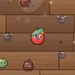</td><th colspan="2" align="left">豆子火箭筒</th></tr>
<tr><td colspan="2"><i>发射巨型豆荚，造成大范围爆炸。</i></td></tr>
<tr><td nowrap>类别 / 方式</td><td>远程 / 爆炸弹</td></tr>
<tr><td nowrap>标签</td><td>枪械、爆破</td></tr>
<tr><td nowrap>伤害 T1~T4</td><td>22 / 36 / 56 / 84</td></tr>
<tr><td nowrap>冷却 T1~T4</td><td>2.4s / 2.25s / 2.1s / 1.9s</td></tr>
<tr><td nowrap>射程</td><td>480</td></tr>
<tr><td nowrap>属性加成</td><td>远程伤害 ×1.3</td></tr>
<tr><td nowrap>暴击倍率</td><td>×1.5</td></tr>
<tr><td nowrap>特效</td><td>爆炸半径 115，击退 30</td></tr>
<tr><td nowrap>T1 价格</td><td>34</td></tr>
<tr><td nowrap>初始携带</td><td>-</td></tr>
</table>

<a id="weapon-cherry_bomb"></a>

<table>
<tr><td rowspan="12" align="center" valign="middle"></td><th colspan="2" align="left">樱桃炸弹</th></tr>
<tr><td colspan="2"><i>一次抛出成对樱桃，各自爆炸。</i></td></tr>
<tr><td nowrap>类别 / 方式</td><td>远程 / 爆炸弹</td></tr>
<tr><td nowrap>标签</td><td>蔬果、爆破</td></tr>
<tr><td nowrap>伤害 T1~T4</td><td>10 / 17 / 26 / 40</td></tr>
<tr><td nowrap>冷却 T1~T4</td><td>1.6s / 1.5s / 1.4s / 1.3s</td></tr>
<tr><td nowrap>射程</td><td>360</td></tr>
<tr><td nowrap>属性加成</td><td>远程伤害 ×0.8</td></tr>
<tr><td nowrap>暴击倍率</td><td>×1.5</td></tr>
<tr><td nowrap>特效</td><td>爆炸半径 70，弹丸 2/2/2/3</td></tr>
<tr><td nowrap>T1 价格</td><td>28</td></tr>
<tr><td nowrap>初始携带</td><td>-</td></tr>
</table>

<a id="weapon-blueberry_sniper"></a>

<table>
<tr><td rowspan="12" align="center" valign="middle"></td><th colspan="2" align="left">蓝莓狙击枪</th></tr>
<tr><td colspan="2"><i>超远距离精准狙击，高暴击。</i></td></tr>
<tr><td nowrap>类别 / 方式</td><td>远程 / 子弹</td></tr>
<tr><td nowrap>标签</td><td>枪械、蔬果</td></tr>
<tr><td nowrap>伤害 T1~T4</td><td>26 / 44 / 68 / 100</td></tr>
<tr><td nowrap>冷却 T1~T4</td><td>1.9s / 1.8s / 1.65s / 1.5s</td></tr>
<tr><td nowrap>射程</td><td>650</td></tr>
<tr><td nowrap>属性加成</td><td>远程伤害 ×1.5</td></tr>
<tr><td nowrap>暴击倍率</td><td>×2.5</td></tr>
<tr><td nowrap>特效</td><td>穿透 1/1/2/2，额外暴击 10%</td></tr>
<tr><td nowrap>T1 价格</td><td>32</td></tr>
<tr><td nowrap>初始携带</td><td>-</td></tr>
</table>

<a id="weapon-plate_frisbee"></a>

<table>
<tr><td rowspan="12" align="center" valign="middle"></td><th colspan="2" align="left">餐盘飞碟</th></tr>
<tr><td colspan="2"><i>掷出餐盘，远处大幅甩弯再飞回，回程再撞一次。</i></td></tr>
<tr><td nowrap>类别 / 方式</td><td>远程 / 回旋镖</td></tr>
<tr><td nowrap>标签</td><td>厨具</td></tr>
<tr><td nowrap>伤害 T1~T4</td><td>12 / 20 / 31 / 47</td></tr>
<tr><td nowrap>冷却 T1~T4</td><td>1.5s / 1.4s / 1.3s / 1.2s</td></tr>
<tr><td nowrap>射程</td><td>330</td></tr>
<tr><td nowrap>属性加成</td><td>远程伤害 ×1</td></tr>
<tr><td nowrap>暴击倍率</td><td>×1.5</td></tr>
<tr><td nowrap>特效</td><td>击退 15</td></tr>
<tr><td nowrap>T1 价格</td><td>24</td></tr>
<tr><td nowrap>初始携带</td><td>-</td></tr>
</table>

<a id="weapon-seed_spitter"></a>

<table>
<tr><td rowspan="12" align="center" valign="middle"></td><th colspan="2" align="left">瓜子机枪</th></tr>
<tr><td colspan="2"><i>噗噗噗！高速连射西瓜籽。</i></td></tr>
<tr><td nowrap>类别 / 方式</td><td>远程 / 子弹</td></tr>
<tr><td nowrap>标签</td><td>枪械、蔬果</td></tr>
<tr><td nowrap>伤害 T1~T4</td><td>3 / 5 / 7 / 10</td></tr>
<tr><td nowrap>冷却 T1~T4</td><td>0.22s / 0.2s / 0.18s / 0.16s</td></tr>
<tr><td nowrap>射程</td><td>360</td></tr>
<tr><td nowrap>属性加成</td><td>远程伤害 ×0.45</td></tr>
<tr><td nowrap>暴击倍率</td><td>×1.5</td></tr>
<tr><td nowrap>特效</td><td>-</td></tr>
<tr><td nowrap>T1 价格</td><td>26</td></tr>
<tr><td nowrap>初始携带</td><td>-</td></tr>
</table>

<a id="weapon-carrot_crossbow"></a>

<table>
<tr><td rowspan="12" align="center" valign="middle"></td><th colspan="2" align="left">胡萝卜弩</th></tr>
<tr><td colspan="2"><i>尖尖的胡萝卜箭穿透一排敌人。</i></td></tr>
<tr><td nowrap>类别 / 方式</td><td>远程 / 子弹</td></tr>
<tr><td nowrap>标签</td><td>蔬果</td></tr>
<tr><td nowrap>伤害 T1~T4</td><td>12 / 20 / 31 / 47</td></tr>
<tr><td nowrap>冷却 T1~T4</td><td>1.05s / 1s / 0.92s / 0.84s</td></tr>
<tr><td nowrap>射程</td><td>460</td></tr>
<tr><td nowrap>属性加成</td><td>远程伤害 ×1</td></tr>
<tr><td nowrap>暴击倍率</td><td>×2</td></tr>
<tr><td nowrap>特效</td><td>穿透 2/3/3/4</td></tr>
<tr><td nowrap>T1 价格</td><td>25</td></tr>
<tr><td nowrap>初始携带</td><td>-</td></tr>
</table>

<a id="weapon-honey_blaster"></a>

<table>
<tr><td rowspan="12" align="center" valign="middle"></td><th colspan="2" align="left">蜂蜜喷枪</th></tr>
<tr><td colspan="2"><i>黏糊糊的蜂蜜弹，减速敌人 35%。</i></td></tr>
<tr><td nowrap>类别 / 方式</td><td>远程 / 子弹</td></tr>
<tr><td nowrap>标签</td><td>酱料</td></tr>
<tr><td nowrap>伤害 T1~T4</td><td>6 / 10 / 15 / 22</td></tr>
<tr><td nowrap>冷却 T1~T4</td><td>0.7s / 0.66s / 0.6s / 0.54s</td></tr>
<tr><td nowrap>射程</td><td>360</td></tr>
<tr><td nowrap>属性加成</td><td>远程伤害 ×0.7</td></tr>
<tr><td nowrap>暴击倍率</td><td>×1.5</td></tr>
<tr><td nowrap>特效</td><td>减速 35% 1.5s</td></tr>
<tr><td nowrap>T1 价格</td><td>22</td></tr>
<tr><td nowrap>初始携带</td><td><a href="CHARACTERS.md#char-strawberry">草莓偶像</a>、<a href="CHARACTERS.md#char-peach">蜜桃天使</a></td></tr>
</table>

<a id="weapon-soy_pistol"></a>

<table>
<tr><td rowspan="12" align="center" valign="middle"></td><th colspan="2" align="left">酱油手枪</th></tr>
<tr><td colspan="2"><i>稳定的点射手枪，命中额外提高吸血概率。</i></td></tr>
<tr><td nowrap>类别 / 方式</td><td>远程 / 子弹</td></tr>
<tr><td nowrap>标签</td><td>枪械、酱料</td></tr>
<tr><td nowrap>伤害 T1~T4</td><td>7 / 12 / 18 / 27</td></tr>
<tr><td nowrap>冷却 T1~T4</td><td>0.55s / 0.5s / 0.46s / 0.42s</td></tr>
<tr><td nowrap>射程</td><td>380</td></tr>
<tr><td nowrap>属性加成</td><td>远程伤害 ×0.7</td></tr>
<tr><td nowrap>暴击倍率</td><td>×1.5</td></tr>
<tr><td nowrap>特效</td><td>额外吸血概率 2%</td></tr>
<tr><td nowrap>T1 价格</td><td>20</td></tr>
<tr><td nowrap>初始携带</td><td>-</td></tr>
</table>

<a id="weapon-pepper_grinder"></a>

<table>
<tr><td rowspan="12" align="center" valign="middle"></td><th colspan="2" align="left">胡椒研磨枪</th></tr>
<tr><td colspan="2"><i>高速射出锋利胡椒粒，可穿透，暴击率高。</i></td></tr>
<tr><td nowrap>类别 / 方式</td><td>远程 / 子弹</td></tr>
<tr><td nowrap>标签</td><td>枪械、锋利</td></tr>
<tr><td nowrap>伤害 T1~T4</td><td>6 / 10 / 15 / 22</td></tr>
<tr><td nowrap>冷却 T1~T4</td><td>0.5s / 0.46s / 0.42s / 0.38s</td></tr>
<tr><td nowrap>射程</td><td>400</td></tr>
<tr><td nowrap>属性加成</td><td>远程伤害 ×0.7</td></tr>
<tr><td nowrap>暴击倍率</td><td>×2.2</td></tr>
<tr><td nowrap>特效</td><td>穿透 1/1/1/2，额外暴击 8%</td></tr>
<tr><td nowrap>T1 价格</td><td>26</td></tr>
<tr><td nowrap>初始携带</td><td>-</td></tr>
</table>

<a id="weapon-soy_bomb"></a>

<table>
<tr><td rowspan="12" align="center" valign="middle"></td><th colspan="2" align="left">酱油炸弹</th></tr>
<tr><td colspan="2"><i>在身边布下酱油炸弹，爆炸并额外提高吸血概率。</i></td></tr>
<tr><td nowrap>类别 / 方式</td><td>远程 / 地雷</td></tr>
<tr><td nowrap>标签</td><td>酱料、爆破</td></tr>
<tr><td nowrap>伤害 T1~T4</td><td>15 / 25 / 39 / 60</td></tr>
<tr><td nowrap>冷却 T1~T4</td><td>2.2s / 2.05s / 1.9s / 1.7s</td></tr>
<tr><td nowrap>射程</td><td>210</td></tr>
<tr><td nowrap>属性加成</td><td>远程伤害 ×0.9</td></tr>
<tr><td nowrap>暴击倍率</td><td>×1.5</td></tr>
<tr><td nowrap>特效</td><td>爆炸半径 120，额外吸血概率 3%</td></tr>
<tr><td nowrap>T1 价格</td><td>26</td></tr>
<tr><td nowrap>初始携带</td><td>-</td></tr>
</table>

<a id="weapon-bbq_torch"></a>

<table>
<tr><td rowspan="12" align="center" valign="middle"></td><th colspan="2" align="left">烧烤喷枪</th></tr>
<tr><td colspan="2"><i>喷出带酱汁的火焰，无限穿透并灼烧，命中额外提高吸血概率。</i></td></tr>
<tr><td nowrap>类别 / 方式</td><td>远程 / 喷火</td></tr>
<tr><td nowrap>标签</td><td>枪械、酱料</td></tr>
<tr><td nowrap>伤害 T1~T4</td><td>2 / 3 / 5 / 8</td></tr>
<tr><td nowrap>冷却 T1~T4</td><td>0.2s / 0.18s / 0.16s / 0.14s</td></tr>
<tr><td nowrap>射程</td><td>190</td></tr>
<tr><td nowrap>属性加成</td><td>远程伤害 ×0.25</td></tr>
<tr><td nowrap>暴击倍率</td><td>×1.5</td></tr>
<tr><td nowrap>特效</td><td>灼烧 2/秒 2s，额外吸血概率 1%</td></tr>
<tr><td nowrap>T1 价格</td><td>30</td></tr>
<tr><td nowrap>初始携带</td><td>-</td></tr>
</table>

<a id="weapon-jam_mortar"></a>

<table>
<tr><td rowspan="12" align="center" valign="middle"></td><th colspan="2" align="left">果酱迫击炮</th></tr>
<tr><td colspan="2"><i>轰出一坨果酱，爆炸并黏住敌人（减速 30%）。</i></td></tr>
<tr><td nowrap>类别 / 方式</td><td>远程 / 爆炸弹</td></tr>
<tr><td nowrap>标签</td><td>酱料、爆破</td></tr>
<tr><td nowrap>伤害 T1~T4</td><td>16 / 27 / 42 / 64</td></tr>
<tr><td nowrap>冷却 T1~T4</td><td>2s / 1.9s / 1.78s / 1.6s</td></tr>
<tr><td nowrap>射程</td><td>460</td></tr>
<tr><td nowrap>属性加成</td><td>远程伤害 ×1.1</td></tr>
<tr><td nowrap>暴击倍率</td><td>×1.5</td></tr>
<tr><td nowrap>特效</td><td>减速 30% 1.5s，爆炸半径 95，击退 15</td></tr>
<tr><td nowrap>T1 价格</td><td>32</td></tr>
<tr><td nowrap>初始携带</td><td>-</td></tr>
</table>

<a id="weapon-sea_urchin_mine"></a>

<table>
<tr><td rowspan="12" align="center" valign="middle"></td><th colspan="2" align="left">海胆雷</th></tr>
<tr><td colspan="2"><i>浑身是刺的海胆雷，爆炸伤害容易暴击。</i></td></tr>
<tr><td nowrap>类别 / 方式</td><td>远程 / 地雷</td></tr>
<tr><td nowrap>标签</td><td>锋利、爆破</td></tr>
<tr><td nowrap>伤害 T1~T4</td><td>13 / 22 / 34 / 52</td></tr>
<tr><td nowrap>冷却 T1~T4</td><td>1.9s / 1.8s / 1.65s / 1.5s</td></tr>
<tr><td nowrap>射程</td><td>230</td></tr>
<tr><td nowrap>属性加成</td><td>远程伤害 ×0.8</td></tr>
<tr><td nowrap>暴击倍率</td><td>×2.5</td></tr>
<tr><td nowrap>特效</td><td>爆炸半径 95，额外暴击 10%</td></tr>
<tr><td nowrap>T1 价格</td><td>26</td></tr>
<tr><td nowrap>初始携带</td><td>-</td></tr>
</table>

<a id="weapon-asparagus_bow"></a>

<table>
<tr><td rowspan="12" align="center" valign="middle">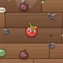</td><th colspan="2" align="left">芦笋长弓</th></tr>
<tr><td colspan="2"><i>修长的芦笋弓，射程很远，箭矢能连穿多个敌人。</i></td></tr>
<tr><td nowrap>类别 / 方式</td><td>远程 / 子弹</td></tr>
<tr><td nowrap>标签</td><td>蔬果</td></tr>
<tr><td nowrap>伤害 T1~T4</td><td>14 / 24 / 37 / 56</td></tr>
<tr><td nowrap>冷却 T1~T4</td><td>1.1s / 1.04s / 0.97s / 0.88s</td></tr>
<tr><td nowrap>射程</td><td>520</td></tr>
<tr><td nowrap>属性加成</td><td>远程伤害 ×1.1</td></tr>
<tr><td nowrap>暴击倍率</td><td>×2.2</td></tr>
<tr><td nowrap>特效</td><td>穿透 2/3/3/4，额外暴击 5%</td></tr>
<tr><td nowrap>T1 价格</td><td>26</td></tr>
<tr><td nowrap>初始携带</td><td>-</td></tr>
</table>

<a id="weapon-macaron_gun"></a>

<table>
<tr><td rowspan="12" align="center" valign="middle"></td><th colspan="2" align="left">马卡龙连发</th></tr>
<tr><td colspan="2"><i>一次射出两颗马卡龙。</i></td></tr>
<tr><td nowrap>类别 / 方式</td><td>远程 / 子弹</td></tr>
<tr><td nowrap>标签</td><td>甜点、枪械</td></tr>
<tr><td nowrap>伤害 T1~T4</td><td>3 / 4 / 6 / 8</td></tr>
<tr><td nowrap>冷却 T1~T4</td><td>0.32s / 0.29s / 0.26s / 0.22s</td></tr>
<tr><td nowrap>射程</td><td>400</td></tr>
<tr><td nowrap>属性加成</td><td>远程伤害 ×0.6</td></tr>
<tr><td nowrap>暴击倍率</td><td>×1.5</td></tr>
<tr><td nowrap>特效</td><td>弹丸 2/2/3/3</td></tr>
<tr><td nowrap>T1 价格</td><td>22</td></tr>
<tr><td nowrap>初始携带</td><td>-</td></tr>
</table>

<a id="weapon-donut_ring"></a>

<table>
<tr><td rowspan="12" align="center" valign="middle"></td><th colspan="2" align="left">甜甜圈飞环</th></tr>
<tr><td colspan="2"><i>甩出甜甜圈，T3 起一次两个。</i></td></tr>
<tr><td nowrap>类别 / 方式</td><td>远程 / 回旋镖</td></tr>
<tr><td nowrap>标签</td><td>甜点</td></tr>
<tr><td nowrap>伤害 T1~T4</td><td>11 / 18 / 28 / 42</td></tr>
<tr><td nowrap>冷却 T1~T4</td><td>1.5s / 1.4s / 1.3s / 1.2s</td></tr>
<tr><td nowrap>射程</td><td>330</td></tr>
<tr><td nowrap>属性加成</td><td>远程伤害 ×1</td></tr>
<tr><td nowrap>暴击倍率</td><td>×1.5</td></tr>
<tr><td nowrap>特效</td><td>弹丸 1/1/2/2，击退 15</td></tr>
<tr><td nowrap>T1 价格</td><td>25</td></tr>
<tr><td nowrap>初始携带</td><td>-</td></tr>
</table>

<a id="weapon-choco_mine"></a>

<table>
<tr><td rowspan="12" align="center" valign="middle"></td><th colspan="2" align="left">巧克力地雷</th></tr>
<tr><td colspan="2"><i>炸开后溅出热巧克力，减速敌人。</i></td></tr>
<tr><td nowrap>类别 / 方式</td><td>远程 / 地雷</td></tr>
<tr><td nowrap>标签</td><td>甜点</td></tr>
<tr><td nowrap>伤害 T1~T4</td><td>13 / 23 / 35 / 53</td></tr>
<tr><td nowrap>冷却 T1~T4</td><td>2s / 1.9s / 1.75s / 1.6s</td></tr>
<tr><td nowrap>射程</td><td>220</td></tr>
<tr><td nowrap>属性加成</td><td>远程伤害 ×0.9</td></tr>
<tr><td nowrap>暴击倍率</td><td>×1.5</td></tr>
<tr><td nowrap>特效</td><td>减速 35% 1.5s，爆炸半径 100</td></tr>
<tr><td nowrap>T1 价格</td><td>25</td></tr>
<tr><td nowrap>初始携带</td><td>-</td></tr>
</table>

<a id="weapon-shaved_ice_gun"></a>

<table>
<tr><td rowspan="12" align="center" valign="middle"></td><th colspan="2" align="left">刨冰机枪</th></tr>
<tr><td colspan="2"><i>高速喷射冰屑，命中减速。</i></td></tr>
<tr><td nowrap>类别 / 方式</td><td>远程 / 子弹</td></tr>
<tr><td nowrap>标签</td><td>枪械</td></tr>
<tr><td nowrap>伤害 T1~T4</td><td>3 / 5 / 7 / 10</td></tr>
<tr><td nowrap>冷却 T1~T4</td><td>0.22s / 0.2s / 0.18s / 0.16s</td></tr>
<tr><td nowrap>射程</td><td>360</td></tr>
<tr><td nowrap>属性加成</td><td>远程伤害 ×0.45</td></tr>
<tr><td nowrap>暴击倍率</td><td>×1.5</td></tr>
<tr><td nowrap>特效</td><td>减速 20% 0.8s</td></tr>
<tr><td nowrap>T1 价格</td><td>27</td></tr>
<tr><td nowrap>初始携带</td><td>-</td></tr>
</table>

<a id="weapon-glacier_mortar"></a>

<table>
<tr><td rowspan="12" align="center" valign="middle"></td><th colspan="2" align="left">冰川迫击炮</th></tr>
<tr><td colspan="2"><i>砸下冰块，爆炸并冻僵敌人。</i></td></tr>
<tr><td nowrap>类别 / 方式</td><td>远程 / 爆炸弹</td></tr>
<tr><td nowrap>标签</td><td>枪械</td></tr>
<tr><td nowrap>伤害 T1~T4</td><td>15 / 26 / 40 / 61</td></tr>
<tr><td nowrap>冷却 T1~T4</td><td>2s / 1.9s / 1.78s / 1.6s</td></tr>
<tr><td nowrap>射程</td><td>460</td></tr>
<tr><td nowrap>属性加成</td><td>远程伤害 ×1.1</td></tr>
<tr><td nowrap>暴击倍率</td><td>×1.5</td></tr>
<tr><td nowrap>特效</td><td>减速 50% 2s，爆炸半径 100，击退 15</td></tr>
<tr><td nowrap>T1 价格</td><td>33</td></tr>
<tr><td nowrap>初始携带</td><td>-</td></tr>
</table>

<a id="weapon-microwave_cannon"></a>

<table>
<tr><td rowspan="12" align="center" valign="middle"></td><th colspan="2" align="left">微波炉炮</th></tr>
<tr><td colspan="2"><i>轰出一团微波，爆炸并眩晕。</i></td></tr>
<tr><td nowrap>类别 / 方式</td><td>远程 / 爆炸弹</td></tr>
<tr><td nowrap>标签</td><td>厨具、枪械</td></tr>
<tr><td nowrap>伤害 T1~T4</td><td>20 / 32 / 50 / 76</td></tr>
<tr><td nowrap>冷却 T1~T4</td><td>2.4s / 2.25s / 2.1s / 1.9s</td></tr>
<tr><td nowrap>射程</td><td>480</td></tr>
<tr><td nowrap>属性加成</td><td>远程伤害 ×1.3</td></tr>
<tr><td nowrap>暴击倍率</td><td>×1.5</td></tr>
<tr><td nowrap>特效</td><td>眩晕 0.3s，爆炸半径 110，击退 30</td></tr>
<tr><td nowrap>T1 价格</td><td>35</td></tr>
<tr><td nowrap>初始携带</td><td>-</td></tr>
</table>

<a id="weapon-spore_cannon"></a>

<table>
<tr><td rowspan="12" align="center" valign="middle"></td><th colspan="2" align="left">孢子炮</th></tr>
<tr><td colspan="2"><i>射出毒孢子，命中中毒并分裂。</i></td></tr>
<tr><td nowrap>类别 / 方式</td><td>远程 / 子弹</td></tr>
<tr><td nowrap>标签</td><td>蔬果、枪械</td></tr>
<tr><td nowrap>伤害 T1~T4</td><td>5 / 9 / 13 / 20</td></tr>
<tr><td nowrap>冷却 T1~T4</td><td>0.8s / 0.75s / 0.7s / 0.62s</td></tr>
<tr><td nowrap>射程</td><td>400</td></tr>
<tr><td nowrap>属性加成</td><td>远程伤害 ×0.8</td></tr>
<tr><td nowrap>暴击倍率</td><td>×1.5</td></tr>
<tr><td nowrap>特效</td><td>弹射 2/2/3/4</td></tr>
<tr><td nowrap>T1 价格</td><td>23</td></tr>
<tr><td nowrap>初始携带</td><td>-</td></tr>
</table>

<a id="weapon-mycelium_boomerang"></a>

<table>
<tr><td rowspan="12" align="center" valign="middle"></td><th colspan="2" align="left">菌丝回旋镖</th></tr>
<tr><td colspan="2"><i>缠满菌丝的回旋镖，所过之处中毒。</i></td></tr>
<tr><td nowrap>类别 / 方式</td><td>远程 / 回旋镖</td></tr>
<tr><td nowrap>标签</td><td>蔬果</td></tr>
<tr><td nowrap>伤害 T1~T4</td><td>9 / 15 / 23 / 36</td></tr>
<tr><td nowrap>冷却 T1~T4</td><td>1.4s / 1.3s / 1.2s / 1.1s</td></tr>
<tr><td nowrap>射程</td><td>360</td></tr>
<tr><td nowrap>属性加成</td><td>远程伤害 ×0.9</td></tr>
<tr><td nowrap>暴击倍率</td><td>×1.5</td></tr>
<tr><td nowrap>特效</td><td>-</td></tr>
<tr><td nowrap>T1 价格</td><td>25</td></tr>
<tr><td nowrap>初始携带</td><td>-</td></tr>
</table>

<a id="weapon-blowpipe"></a>

<table>
<tr><td rowspan="12" align="center" valign="middle"></td><th colspan="2" align="left">毒刺吹管</th></tr>
<tr><td colspan="2"><i>吹出毒刺，穿透并中毒 2 层。</i></td></tr>
<tr><td nowrap>类别 / 方式</td><td>远程 / 子弹</td></tr>
<tr><td nowrap>标签</td><td>蔬果</td></tr>
<tr><td nowrap>伤害 T1~T4</td><td>10 / 17 / 26 / 40</td></tr>
<tr><td nowrap>冷却 T1~T4</td><td>1.05s / 1s / 0.92s / 0.84s</td></tr>
<tr><td nowrap>射程</td><td>460</td></tr>
<tr><td nowrap>属性加成</td><td>远程伤害 ×1</td></tr>
<tr><td nowrap>暴击倍率</td><td>×2</td></tr>
<tr><td nowrap>特效</td><td>穿透 1/1/2/2</td></tr>
<tr><td nowrap>T1 价格</td><td>26</td></tr>
<tr><td nowrap>初始携带</td><td>-</td></tr>
</table>

<a id="weapon-bbq_sauce_cannon"></a>

<table>
<tr><td rowspan="12" align="center" valign="middle"></td><th colspan="2" align="left">烧烤酱炮</th></tr>
<tr><td colspan="2"><i>轰出烧烤酱，爆炸灼烧并减速。</i></td></tr>
<tr><td nowrap>类别 / 方式</td><td>远程 / 爆炸弹</td></tr>
<tr><td nowrap>标签</td><td>酱料、枪械</td></tr>
<tr><td nowrap>伤害 T1~T4</td><td>13 / 22 / 34 / 52</td></tr>
<tr><td nowrap>冷却 T1~T4</td><td>1.8s / 1.7s / 1.6s / 1.4s</td></tr>
<tr><td nowrap>射程</td><td>450</td></tr>
<tr><td nowrap>属性加成</td><td>远程伤害 ×1，元素伤害 ×0.5</td></tr>
<tr><td nowrap>暴击倍率</td><td>×1.5</td></tr>
<tr><td nowrap>特效</td><td>灼烧 3/秒 2s，减速 20% 1s，爆炸半径 90</td></tr>
<tr><td nowrap>T1 价格</td><td>31</td></tr>
<tr><td nowrap>初始携带</td><td>-</td></tr>
</table>

<a id="weapon-hot_sauce_gun"></a>

<table>
<tr><td rowspan="12" align="center" valign="middle"></td><th colspan="2" align="left">辣酱手枪</th></tr>
<tr><td colspan="2"><i>射出辣酱，命中灼烧。</i></td></tr>
<tr><td nowrap>类别 / 方式</td><td>远程 / 子弹</td></tr>
<tr><td nowrap>标签</td><td>酱料、枪械</td></tr>
<tr><td nowrap>伤害 T1~T4</td><td>6 / 11 / 16 / 24</td></tr>
<tr><td nowrap>冷却 T1~T4</td><td>0.55s / 0.5s / 0.46s / 0.42s</td></tr>
<tr><td nowrap>射程</td><td>380</td></tr>
<tr><td nowrap>属性加成</td><td>远程伤害 ×0.7</td></tr>
<tr><td nowrap>暴击倍率</td><td>×1.5</td></tr>
<tr><td nowrap>特效</td><td>灼烧 2/秒 2s</td></tr>
<tr><td nowrap>T1 价格</td><td>21</td></tr>
<tr><td nowrap>初始携带</td><td>-</td></tr>
</table>

<a id="weapon-knife_case"></a>

<table>
<tr><td rowspan="12" align="center" valign="middle"></td><th colspan="2" align="left">飞刀匣</th></tr>
<tr><td colspan="2"><i>一次甩出多把飞刀，可穿透。</i></td></tr>
<tr><td nowrap>类别 / 方式</td><td>远程 / 子弹</td></tr>
<tr><td nowrap>标签</td><td>锋利</td></tr>
<tr><td nowrap>伤害 T1~T4</td><td>4 / 7 / 11 / 15</td></tr>
<tr><td nowrap>冷却 T1~T4</td><td>0.5s / 0.46s / 0.42s / 0.38s</td></tr>
<tr><td nowrap>射程</td><td>400</td></tr>
<tr><td nowrap>属性加成</td><td>远程伤害 ×0.7</td></tr>
<tr><td nowrap>暴击倍率</td><td>×2.2</td></tr>
<tr><td nowrap>特效</td><td>穿透 1/1/2/2，弹丸 2/2/3/3，额外暴击 8%</td></tr>
<tr><td nowrap>T1 价格</td><td>27</td></tr>
<tr><td nowrap>初始携带</td><td>-</td></tr>
</table>

<a id="weapon-coconut_cannon"></a>

<table>
<tr><td rowspan="12" align="center" valign="middle">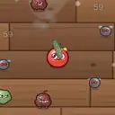</td><th colspan="2" align="left">椰子炮</th></tr>
<tr><td colspan="2"><i>发射整颗椰子，爆炸范围巨大。</i></td></tr>
<tr><td nowrap>类别 / 方式</td><td>远程 / 爆炸弹</td></tr>
<tr><td nowrap>标签</td><td>蔬果、枪械</td></tr>
<tr><td nowrap>伤害 T1~T4</td><td>22 / 36 / 56 / 84</td></tr>
<tr><td nowrap>冷却 T1~T4</td><td>2.4s / 2.25s / 2.1s / 1.9s</td></tr>
<tr><td nowrap>射程</td><td>480</td></tr>
<tr><td nowrap>属性加成</td><td>远程伤害 ×1.3</td></tr>
<tr><td nowrap>暴击倍率</td><td>×1.5</td></tr>
<tr><td nowrap>特效</td><td>爆炸半径 135，击退 30</td></tr>
<tr><td nowrap>T1 价格</td><td>36</td></tr>
<tr><td nowrap>初始携带</td><td>-</td></tr>
</table>

<a id="weapon-pumpkin_mortar"></a>

<table>
<tr><td rowspan="12" align="center" valign="middle"></td><th colspan="2" align="left">南瓜迫击炮</th></tr>
<tr><td colspan="2"><i>抛射南瓜炸弹，爆炸并灼烧。</i></td></tr>
<tr><td nowrap>类别 / 方式</td><td>远程 / 爆炸弹</td></tr>
<tr><td nowrap>标签</td><td>蔬果、枪械</td></tr>
<tr><td nowrap>伤害 T1~T4</td><td>15 / 26 / 40 / 61</td></tr>
<tr><td nowrap>冷却 T1~T4</td><td>2s / 1.9s / 1.78s / 1.6s</td></tr>
<tr><td nowrap>射程</td><td>460</td></tr>
<tr><td nowrap>属性加成</td><td>远程伤害 ×1.1</td></tr>
<tr><td nowrap>暴击倍率</td><td>×1.5</td></tr>
<tr><td nowrap>特效</td><td>灼烧 2/秒 2s，爆炸半径 100，击退 15</td></tr>
<tr><td nowrap>T1 价格</td><td>33</td></tr>
<tr><td nowrap>初始携带</td><td>-</td></tr>
</table>

<a id="weapon-melon_grenade"></a>

<table>
<tr><td rowspan="12" align="center" valign="middle"></td><th colspan="2" align="left">西瓜榴弹</th></tr>
<tr><td colspan="2"><i>一次扔出多颗西瓜榴弹。</i></td></tr>
<tr><td nowrap>类别 / 方式</td><td>远程 / 爆炸弹</td></tr>
<tr><td nowrap>标签</td><td>蔬果</td></tr>
<tr><td nowrap>伤害 T1~T4</td><td>9 / 14 / 22 / 34</td></tr>
<tr><td nowrap>冷却 T1~T4</td><td>1.6s / 1.5s / 1.4s / 1.3s</td></tr>
<tr><td nowrap>射程</td><td>360</td></tr>
<tr><td nowrap>属性加成</td><td>远程伤害 ×0.8</td></tr>
<tr><td nowrap>暴击倍率</td><td>×1.5</td></tr>
<tr><td nowrap>特效</td><td>爆炸半径 80，弹丸 2/2/3/3</td></tr>
<tr><td nowrap>T1 价格</td><td>29</td></tr>
<tr><td nowrap>初始携带</td><td>-</td></tr>
</table>

<a id="weapon-potato_mine"></a>

<table>
<tr><td rowspan="12" align="center" valign="middle"></td><th colspan="2" align="left">土豆地雷</th></tr>
<tr><td colspan="2"><i>埋进土里的土豆，炸得又大又响。</i></td></tr>
<tr><td nowrap>类别 / 方式</td><td>远程 / 地雷</td></tr>
<tr><td nowrap>标签</td><td>蔬果</td></tr>
<tr><td nowrap>伤害 T1~T4</td><td>15 / 25 / 39 / 59</td></tr>
<tr><td nowrap>冷却 T1~T4</td><td>2s / 1.9s / 1.75s / 1.6s</td></tr>
<tr><td nowrap>射程</td><td>220</td></tr>
<tr><td nowrap>属性加成</td><td>远程伤害 ×0.9</td></tr>
<tr><td nowrap>暴击倍率</td><td>×1.5</td></tr>
<tr><td nowrap>特效</td><td>爆炸半径 125</td></tr>
<tr><td nowrap>T1 价格</td><td>25</td></tr>
<tr><td nowrap>初始携带</td><td>-</td></tr>
</table>

<a id="weapon-corn_scatter"></a>

<table>
<tr><td rowspan="12" align="center" valign="middle"></td><th colspan="2" align="left">玉米散弹</th></tr>
<tr><td colspan="2"><i>一次喷出大把玉米粒。</i></td></tr>
<tr><td nowrap>类别 / 方式</td><td>远程 / 子弹</td></tr>
<tr><td nowrap>标签</td><td>蔬果、枪械</td></tr>
<tr><td nowrap>伤害 T1~T4</td><td>4 / 6 / 9 / 14</td></tr>
<tr><td nowrap>冷却 T1~T4</td><td>1s / 0.95s / 0.88s / 0.8s</td></tr>
<tr><td nowrap>射程</td><td>240</td></tr>
<tr><td nowrap>属性加成</td><td>远程伤害 ×0.5</td></tr>
<tr><td nowrap>暴击倍率</td><td>×1.5</td></tr>
<tr><td nowrap>特效</td><td>弹丸 5/5/6/7，击退 12</td></tr>
<tr><td nowrap>T1 价格</td><td>27</td></tr>
<tr><td nowrap>初始携带</td><td>-</td></tr>
</table>

<a id="weapon-pea_sniper"></a>

<table>
<tr><td rowspan="12" align="center" valign="middle"></td><th colspan="2" align="left">豆荚狙击</th></tr>
<tr><td colspan="2"><i>高速豆荚弹，穿透整排敌人。</i></td></tr>
<tr><td nowrap>类别 / 方式</td><td>远程 / 子弹</td></tr>
<tr><td nowrap>标签</td><td>蔬果、枪械</td></tr>
<tr><td nowrap>伤害 T1~T4</td><td>22 / 37 / 58 / 85</td></tr>
<tr><td nowrap>冷却 T1~T4</td><td>1.9s / 1.8s / 1.65s / 1.5s</td></tr>
<tr><td nowrap>射程</td><td>650</td></tr>
<tr><td nowrap>属性加成</td><td>远程伤害 ×1.5</td></tr>
<tr><td nowrap>暴击倍率</td><td>×2.5</td></tr>
<tr><td nowrap>特效</td><td>穿透 3/4/5/6，额外暴击 10%</td></tr>
<tr><td nowrap>T1 价格</td><td>33</td></tr>
<tr><td nowrap>初始携带</td><td><a href="CHARACTERS.md#char-pea">豌豆士兵</a></td></tr>
</table>

<a id="weapon-blast_pea_cannon"></a>

<table>
<tr><td rowspan="12" align="center" valign="middle"></td><th colspan="2" align="left">爆裂豌豆炮</th></tr>
<tr><td colspan="2"><i>豌豆枪接上火箭筒，豆子落地就炸。</i></td></tr>
<tr><td nowrap>类别 / 方式</td><td>远程 / 子弹</td></tr>
<tr><td nowrap>标签</td><td>枪械、蔬果、元素</td></tr>
<tr><td nowrap>伤害 T1~T4</td><td>15 / 26 / 42 / 64</td></tr>
<tr><td nowrap>冷却 T1~T4</td><td>0.32s / 0.29s / 0.26s / 0.22s</td></tr>
<tr><td nowrap>射程</td><td>473</td></tr>
<tr><td nowrap>属性加成</td><td>远程伤害 ×0.96，元素伤害 ×0.3</td></tr>
<tr><td nowrap>暴击倍率</td><td>×1.5</td></tr>
<tr><td nowrap>特效</td><td>灼烧 2/秒 2s，爆炸半径 70</td></tr>
<tr><td nowrap>T1 价格</td><td>39</td></tr>
<tr><td nowrap>初始携带</td><td>-</td></tr>
</table>

<a id="weapon-toxic_gatling"></a>

<table>
<tr><td rowspan="12" align="center" valign="middle"></td><th colspan="2" align="left">毒雾加特林</th></tr>
<tr><td colspan="2"><i>酱料加特林灌满毒雾，弹雨所过之处无人站立。</i></td></tr>
<tr><td nowrap>类别 / 方式</td><td>远程 / 子弹</td></tr>
<tr><td nowrap>标签</td><td>枪械、酱料、蔬果</td></tr>
<tr><td nowrap>伤害 T1~T4</td><td>4 / 7 / 9 / 12</td></tr>
<tr><td nowrap>冷却 T1~T4</td><td>0.16s / 0.14s / 0.12s / 0.1s</td></tr>
<tr><td nowrap>射程</td><td>441</td></tr>
<tr><td nowrap>属性加成</td><td>远程伤害 ×0.24，元素伤害 ×0.15</td></tr>
<tr><td nowrap>暴击倍率</td><td>×1.5</td></tr>
<tr><td nowrap>特效</td><td>-</td></tr>
<tr><td nowrap>T1 价格</td><td>52</td></tr>
<tr><td nowrap>初始携带</td><td>-</td></tr>
</table>

<a id="weapon-inferno_mortar"></a>

<table>
<tr><td rowspan="12" align="center" valign="middle"></td><th colspan="2" align="left">炎狱迫击炮</th></tr>
<tr><td colspan="2"><i>果酱迫击炮混入烧烤酱，落点变成一片火海。</i></td></tr>
<tr><td nowrap>类别 / 方式</td><td>远程 / 爆炸弹</td></tr>
<tr><td nowrap>标签</td><td>酱料、爆破、枪械</td></tr>
<tr><td nowrap>伤害 T1~T4</td><td>18 / 30 / 46 / 70</td></tr>
<tr><td nowrap>冷却 T1~T4</td><td>1.8s / 1.7s / 1.6s / 1.4s</td></tr>
<tr><td nowrap>射程</td><td>483</td></tr>
<tr><td nowrap>属性加成</td><td>远程伤害 ×1.26，元素伤害 ×0.3</td></tr>
<tr><td nowrap>暴击倍率</td><td>×1.5</td></tr>
<tr><td nowrap>特效</td><td>灼烧 5/秒 3s，爆炸半径 120，击退 15</td></tr>
<tr><td nowrap>T1 价格</td><td>42</td></tr>
<tr><td nowrap>初始携带</td><td>-</td></tr>
</table>

<a id="weapon-railgun_sniper"></a>

<table>
<tr><td rowspan="12" align="center" valign="middle"></td><th colspan="2" align="left">电磁蓝莓狙</th></tr>
<tr><td colspan="2"><i>蓝莓狙击枪接上电磁核心，一枪贯穿整列。</i></td></tr>
<tr><td nowrap>类别 / 方式</td><td>远程 / 子弹</td></tr>
<tr><td nowrap>标签</td><td>枪械、蔬果</td></tr>
<tr><td nowrap>伤害 T1~T4</td><td>29 / 48 / 75 / 110</td></tr>
<tr><td nowrap>冷却 T1~T4</td><td>1.9s / 1.8s / 1.65s / 1.5s</td></tr>
<tr><td nowrap>射程</td><td>683</td></tr>
<tr><td nowrap>属性加成</td><td>远程伤害 ×1.8</td></tr>
<tr><td nowrap>暴击倍率</td><td>×2.5</td></tr>
<tr><td nowrap>特效</td><td>穿透 5/6/7/8，额外暴击 10%</td></tr>
<tr><td nowrap>T1 价格</td><td>43</td></tr>
<tr><td nowrap>初始携带</td><td>-</td></tr>
</table>

<a id="weapon-candy_shotgun"></a>

<table>
<tr><td rowspan="12" align="center" valign="middle"></td><th colspan="2" align="left">糖果霰弹枪</th></tr>
<tr><td colspan="2"><i>一次喷出满膛硬糖，近距离摧枯拉朽。</i></td></tr>
<tr><td nowrap>类别 / 方式</td><td>远程 / 子弹</td></tr>
<tr><td nowrap>标签</td><td>枪械、蔬果、甜点</td></tr>
<tr><td nowrap>伤害 T1~T4</td><td>4 / 8 / 11 / 17</td></tr>
<tr><td nowrap>冷却 T1~T4</td><td>0.32s / 0.29s / 0.26s / 0.22s</td></tr>
<tr><td nowrap>射程</td><td>420</td></tr>
<tr><td nowrap>属性加成</td><td>远程伤害 ×0.66</td></tr>
<tr><td nowrap>暴击倍率</td><td>×1.5</td></tr>
<tr><td nowrap>特效</td><td>弹丸 6/6/7/8，击退 12</td></tr>
<tr><td nowrap>T1 价格</td><td>34</td></tr>
<tr><td nowrap>初始携带</td><td>-</td></tr>
</table>

<a id="weapon-fz_plate_frisbee_onion_boomerang"></a>

<table>
<tr><td rowspan="12" align="center" valign="middle"></td><th colspan="2" align="left">鲜果餐盘飞碟</th></tr>
<tr><td colspan="2"><i>把洋葱回旋镖熔进餐盘飞碟：保留餐盘飞碟的攻击方式，同时带上两把武器的特效。</i></td></tr>
<tr><td nowrap>类别 / 方式</td><td>远程 / 回旋镖</td></tr>
<tr><td nowrap>标签</td><td>厨具、蔬果</td></tr>
<tr><td nowrap>伤害 T1~T4</td><td>13 / 22 / 34 / 52</td></tr>
<tr><td nowrap>冷却 T1~T4</td><td>1.4s / 1.3s / 1.2s / 1.1s</td></tr>
<tr><td nowrap>射程</td><td>378</td></tr>
<tr><td nowrap>属性加成</td><td>远程伤害 ×1.14</td></tr>
<tr><td nowrap>暴击倍率</td><td>×1.5</td></tr>
<tr><td nowrap>特效</td><td>击退 15</td></tr>
<tr><td nowrap>T1 价格</td><td>31</td></tr>
<tr><td nowrap>初始携带</td><td>-</td></tr>
</table>

<a id="weapon-fz_corn_scatter_grater_sweep"></a>

<table>
<tr><td rowspan="12" align="center" valign="middle"></td><th colspan="2" align="left">致命玉米散弹</th></tr>
<tr><td colspan="2"><i>把刨丝刀熔进玉米散弹：保留玉米散弹的攻击方式，同时带上两把武器的特效。</i></td></tr>
<tr><td nowrap>类别 / 方式</td><td>远程 / 子弹</td></tr>
<tr><td nowrap>标签</td><td>蔬果、枪械、锋利</td></tr>
<tr><td nowrap>伤害 T1~T4</td><td>10 / 17 / 26 / 40</td></tr>
<tr><td nowrap>冷却 T1~T4</td><td>1s / 0.95s / 0.88s / 0.8s</td></tr>
<tr><td nowrap>射程</td><td>252</td></tr>
<tr><td nowrap>属性加成</td><td>远程伤害 ×0.3，近战伤害 ×0.48</td></tr>
<tr><td nowrap>暴击倍率</td><td>×2</td></tr>
<tr><td nowrap>特效</td><td>弹丸 5/5/6/7，击退 12，额外暴击 12%</td></tr>
<tr><td nowrap>T1 价格</td><td>35</td></tr>
<tr><td nowrap>初始携带</td><td>-</td></tr>
</table>

<a id="weapon-fz_sea_urchin_mine_dragonfruit_orb"></a>

<table>
<tr><td rowspan="12" align="center" valign="middle"></td><th colspan="2" align="left">烈焰海胆雷</th></tr>
<tr><td colspan="2"><i>把火龙果法球熔进海胆雷：保留海胆雷的攻击方式，同时带上两把武器的特效。</i></td></tr>
<tr><td nowrap>类别 / 方式</td><td>远程 / 地雷</td></tr>
<tr><td nowrap>标签</td><td>锋利、爆破、蔬果</td></tr>
<tr><td nowrap>伤害 T1~T4</td><td>14 / 24 / 37 / 57</td></tr>
<tr><td nowrap>冷却 T1~T4</td><td>1s / 0.95s / 0.88s / 0.8s</td></tr>
<tr><td nowrap>射程</td><td>420</td></tr>
<tr><td nowrap>属性加成</td><td>远程伤害 ×0.48，元素伤害 ×0.48</td></tr>
<tr><td nowrap>暴击倍率</td><td>×2.5</td></tr>
<tr><td nowrap>特效</td><td>灼烧 3/秒 2s，爆炸半径 95，额外暴击 10%</td></tr>
<tr><td nowrap>T1 价格</td><td>36</td></tr>
<tr><td nowrap>初始携带</td><td>-</td></tr>
</table>

<a id="weapon-fz_corn_cannon_blade_aura"></a>

<table>
<tr><td rowspan="12" align="center" valign="middle"></td><th colspan="2" align="left">锐锋玉米加农</th></tr>
<tr><td colspan="2"><i>把刃风光环熔进玉米加农：保留玉米加农的攻击方式，同时带上两把武器的特效。</i></td></tr>
<tr><td nowrap>类别 / 方式</td><td>远程 / 子弹</td></tr>
<tr><td nowrap>标签</td><td>枪械、锋利</td></tr>
<tr><td nowrap>伤害 T1~T4</td><td>18 / 31 / 48 / 75</td></tr>
<tr><td nowrap>冷却 T1~T4</td><td>0.45s / 0.43s / 0.41s / 0.38s</td></tr>
<tr><td nowrap>射程</td><td>546</td></tr>
<tr><td nowrap>属性加成</td><td>远程伤害 ×0.72，近战伤害 ×0.3</td></tr>
<tr><td nowrap>暴击倍率</td><td>×2</td></tr>
<tr><td nowrap>特效</td><td>穿透 3/4/5/6，击退 15，额外暴击 10%</td></tr>
<tr><td nowrap>T1 价格</td><td>38</td></tr>
<tr><td nowrap>初始携带</td><td>-</td></tr>
</table>

<a id="weapon-fz_honey_blaster_pumpkin_mortar"></a>

<table>
<tr><td rowspan="12" align="center" valign="middle"></td><th colspan="2" align="left">烈焰蜂蜜喷枪</th></tr>
<tr><td colspan="2"><i>把南瓜迫击炮熔进蜂蜜喷枪：保留蜂蜜喷枪的攻击方式，同时带上两把武器的特效。</i></td></tr>
<tr><td nowrap>类别 / 方式</td><td>远程 / 子弹</td></tr>
<tr><td nowrap>标签</td><td>酱料、蔬果、枪械</td></tr>
<tr><td nowrap>伤害 T1~T4</td><td>17 / 29 / 44 / 67</td></tr>
<tr><td nowrap>冷却 T1~T4</td><td>0.7s / 0.66s / 0.6s / 0.54s</td></tr>
<tr><td nowrap>射程</td><td>483</td></tr>
<tr><td nowrap>属性加成</td><td>远程伤害 ×1.08</td></tr>
<tr><td nowrap>暴击倍率</td><td>×1.5</td></tr>
<tr><td nowrap>特效</td><td>灼烧 2/秒 2s，减速 35% 1.5s，爆炸半径 100</td></tr>
<tr><td nowrap>T1 价格</td><td>43</td></tr>
<tr><td nowrap>初始携带</td><td>-</td></tr>
</table>

<a id="weapon-fz_popcorn_machine_rot_aura"></a>

<table>
<tr><td rowspan="12" align="center" valign="middle"></td><th colspan="2" align="left">剧毒爆米花机</th></tr>
<tr><td colspan="2"><i>把腐菌光环熔进爆米花机：保留爆米花机的攻击方式，同时带上两把武器的特效。</i></td></tr>
<tr><td nowrap>类别 / 方式</td><td>远程 / 地雷</td></tr>
<tr><td nowrap>标签</td><td>枪械、爆破、蔬果</td></tr>
<tr><td nowrap>伤害 T1~T4</td><td>15 / 26 / 41 / 62</td></tr>
<tr><td nowrap>冷却 T1~T4</td><td>0.5s / 0.5s / 0.5s / 0.5s</td></tr>
<tr><td nowrap>射程</td><td>231</td></tr>
<tr><td nowrap>属性加成</td><td>远程伤害 ×0.54，元素伤害 ×0.3</td></tr>
<tr><td nowrap>暴击倍率</td><td>×1.5</td></tr>
<tr><td nowrap>特效</td><td>爆炸半径 100</td></tr>
<tr><td nowrap>T1 价格</td><td>40</td></tr>
<tr><td nowrap>初始携带</td><td>-</td></tr>
</table>

<a id="weapon-fz_donut_ring_dynamite_drumstick"></a>

<table>
<tr><td rowspan="12" align="center" valign="middle"></td><th colspan="2" align="left">爆裂甜甜圈飞环</th></tr>
<tr><td colspan="2"><i>把炸药鸡腿熔进甜甜圈飞环：保留甜甜圈飞环的攻击方式，同时带上两把武器的特效。</i></td></tr>
<tr><td nowrap>类别 / 方式</td><td>远程 / 回旋镖</td></tr>
<tr><td nowrap>标签</td><td>甜点、爆破</td></tr>
<tr><td nowrap>伤害 T1~T4</td><td>19 / 32 / 50 / 75</td></tr>
<tr><td nowrap>冷却 T1~T4</td><td>1.5s / 1.4s / 1.3s / 1.2s</td></tr>
<tr><td nowrap>射程</td><td>347</td></tr>
<tr><td nowrap>属性加成</td><td>远程伤害 ×0.6，近战伤害 ×0.66，最大生命 ×0.06</td></tr>
<tr><td nowrap>暴击倍率</td><td>×1.5</td></tr>
<tr><td nowrap>特效</td><td>爆炸半径 85，弹丸 1/1/2/2，击退 15</td></tr>
<tr><td nowrap>T1 价格</td><td>39</td></tr>
<tr><td nowrap>初始携带</td><td>-</td></tr>
</table>

<a id="weapon-fz_bean_bazooka_soy_bomb"></a>

<table>
<tr><td rowspan="12" align="center" valign="middle"></td><th colspan="2" align="left">酱爆豆子火箭筒</th></tr>
<tr><td colspan="2"><i>把酱油炸弹熔进豆子火箭筒：保留豆子火箭筒的攻击方式，同时带上两把武器的特效。</i></td></tr>
<tr><td nowrap>类别 / 方式</td><td>远程 / 爆炸弹</td></tr>
<tr><td nowrap>标签</td><td>枪械、爆破、酱料</td></tr>
<tr><td nowrap>伤害 T1~T4</td><td>24 / 40 / 62 / 92</td></tr>
<tr><td nowrap>冷却 T1~T4</td><td>2.2s / 2.05s / 1.9s / 1.7s</td></tr>
<tr><td nowrap>射程</td><td>504</td></tr>
<tr><td nowrap>属性加成</td><td>远程伤害 ×1.32</td></tr>
<tr><td nowrap>暴击倍率</td><td>×1.5</td></tr>
<tr><td nowrap>特效</td><td>爆炸半径 120，额外吸血概率 3%，击退 30</td></tr>
<tr><td nowrap>T1 价格</td><td>44</td></tr>
<tr><td nowrap>初始携带</td><td>-</td></tr>
</table>

<a id="weapon-fz_choco_mine_bbq_torch"></a>

<table>
<tr><td rowspan="12" align="center" valign="middle"></td><th colspan="2" align="left">烈焰巧克力地雷</th></tr>
<tr><td colspan="2"><i>把烧烤喷枪熔进巧克力地雷：保留巧克力地雷的攻击方式，同时带上两把武器的特效。</i></td></tr>
<tr><td nowrap>类别 / 方式</td><td>远程 / 地雷</td></tr>
<tr><td nowrap>标签</td><td>甜点、枪械、酱料</td></tr>
<tr><td nowrap>伤害 T1~T4</td><td>14 / 25 / 39 / 58</td></tr>
<tr><td nowrap>冷却 T1~T4</td><td>0.2s / 0.18s / 0.16s / 0.14s</td></tr>
<tr><td nowrap>射程</td><td>231</td></tr>
<tr><td nowrap>属性加成</td><td>远程伤害 ×0.69</td></tr>
<tr><td nowrap>暴击倍率</td><td>×1.5</td></tr>
<tr><td nowrap>特效</td><td>灼烧 2/秒 2s，减速 35% 1.5s，爆炸半径 100，额外吸血概率 1%</td></tr>
<tr><td nowrap>T1 价格</td><td>39</td></tr>
<tr><td nowrap>初始携带</td><td>-</td></tr>
</table>

<a id="weapon-fz_cherry_bomb_bamboo_spear"></a>

<table>
<tr><td rowspan="12" align="center" valign="middle"></td><th colspan="2" align="left">致命樱桃炸弹</th></tr>
<tr><td colspan="2"><i>把竹笋长矛熔进樱桃炸弹：保留樱桃炸弹的攻击方式，同时带上两把武器的特效。</i></td></tr>
<tr><td nowrap>类别 / 方式</td><td>远程 / 爆炸弹</td></tr>
<tr><td nowrap>标签</td><td>蔬果、爆破</td></tr>
<tr><td nowrap>伤害 T1~T4</td><td>21 / 35 / 55 / 85</td></tr>
<tr><td nowrap>冷却 T1~T4</td><td>1.5s / 1.42s / 1.32s / 1.2s</td></tr>
<tr><td nowrap>射程</td><td>378</td></tr>
<tr><td nowrap>属性加成</td><td>远程伤害 ×0.48，近战伤害 ×0.72</td></tr>
<tr><td nowrap>暴击倍率</td><td>×2</td></tr>
<tr><td nowrap>特效</td><td>爆炸半径 70，弹丸 2/2/2/3</td></tr>
<tr><td nowrap>T1 价格</td><td>36</td></tr>
<tr><td nowrap>初始携带</td><td>-</td></tr>
</table>

<a id="weapon-fz_carrot_crossbow_fork"></a>

<table>
<tr><td rowspan="12" align="center" valign="middle"></td><th colspan="2" align="left">主厨胡萝卜弩</th></tr>
<tr><td colspan="2"><i>把番茄叉熔进胡萝卜弩：保留胡萝卜弩的攻击方式，同时带上两把武器的特效。</i></td></tr>
<tr><td nowrap>类别 / 方式</td><td>远程 / 子弹</td></tr>
<tr><td nowrap>标签</td><td>蔬果、厨具</td></tr>
<tr><td nowrap>伤害 T1~T4</td><td>13 / 22 / 34 / 52</td></tr>
<tr><td nowrap>冷却 T1~T4</td><td>0.9s / 0.85s / 0.78s / 0.7s</td></tr>
<tr><td nowrap>射程</td><td>483</td></tr>
<tr><td nowrap>属性加成</td><td>远程伤害 ×0.6，近战伤害 ×0.6</td></tr>
<tr><td nowrap>暴击倍率</td><td>×2</td></tr>
<tr><td nowrap>特效</td><td>穿透 2/3/3/4</td></tr>
<tr><td nowrap>T1 价格</td><td>33</td></tr>
<tr><td nowrap>初始携带</td><td>-</td></tr>
</table>

<a id="weapon-fz_knife_case_microwave_cannon"></a>

<table>
<tr><td rowspan="12" align="center" valign="middle"></td><th colspan="2" align="left">爆裂飞刀匣</th></tr>
<tr><td colspan="2"><i>把微波炉炮熔进飞刀匣：保留飞刀匣的攻击方式，同时带上两把武器的特效。</i></td></tr>
<tr><td nowrap>类别 / 方式</td><td>远程 / 子弹</td></tr>
<tr><td nowrap>标签</td><td>锋利、厨具、枪械</td></tr>
<tr><td nowrap>伤害 T1~T4</td><td>22 / 35 / 55 / 84</td></tr>
<tr><td nowrap>冷却 T1~T4</td><td>0.5s / 0.46s / 0.42s / 0.38s</td></tr>
<tr><td nowrap>射程</td><td>504</td></tr>
<tr><td nowrap>属性加成</td><td>远程伤害 ×1.2</td></tr>
<tr><td nowrap>暴击倍率</td><td>×2.2</td></tr>
<tr><td nowrap>特效</td><td>眩晕 0.3s，爆炸半径 110，穿透 1/1/2/2，弹丸 2/2/3/3，额外暴击 8%</td></tr>
<tr><td nowrap>T1 价格</td><td>46</td></tr>
<tr><td nowrap>初始携带</td><td>-</td></tr>
</table>

<a id="weapon-fz_melon_grenade_pumpkin_lantern"></a>

<table>
<tr><td rowspan="12" align="center" valign="middle"></td><th colspan="2" align="left">贯穿西瓜榴弹</th></tr>
<tr><td colspan="2"><i>把南瓜鬼火灯熔进西瓜榴弹：保留西瓜榴弹的攻击方式，同时带上两把武器的特效。</i></td></tr>
<tr><td nowrap>类别 / 方式</td><td>远程 / 爆炸弹</td></tr>
<tr><td nowrap>标签</td><td>蔬果、元素</td></tr>
<tr><td nowrap>伤害 T1~T4</td><td>10 / 17 / 26 / 41</td></tr>
<tr><td nowrap>冷却 T1~T4</td><td>0.8s / 0.75s / 0.7s / 0.62s</td></tr>
<tr><td nowrap>射程</td><td>441</td></tr>
<tr><td nowrap>属性加成</td><td>远程伤害 ×0.48，元素伤害 ×0.51</td></tr>
<tr><td nowrap>暴击倍率</td><td>×1.8</td></tr>
<tr><td nowrap>特效</td><td>爆炸半径 80，弹丸 2/2/3/3</td></tr>
<tr><td nowrap>T1 价格</td><td>38</td></tr>
<tr><td nowrap>初始携带</td><td>-</td></tr>
</table>

<a id="weapon-fz_blowpipe_syrup_sprayer"></a>

<table>
<tr><td rowspan="12" align="center" valign="middle"></td><th colspan="2" align="left">烈焰毒刺吹管</th></tr>
<tr><td colspan="2"><i>把糖浆喷枪熔进毒刺吹管：保留毒刺吹管的攻击方式，同时带上两把武器的特效。</i></td></tr>
<tr><td nowrap>类别 / 方式</td><td>远程 / 子弹</td></tr>
<tr><td nowrap>标签</td><td>蔬果、甜点</td></tr>
<tr><td nowrap>伤害 T1~T4</td><td>11 / 19 / 29 / 44</td></tr>
<tr><td nowrap>冷却 T1~T4</td><td>0.2s / 0.18s / 0.16s / 0.14s</td></tr>
<tr><td nowrap>射程</td><td>483</td></tr>
<tr><td nowrap>属性加成</td><td>远程伤害 ×0.6，元素伤害 ×0.15</td></tr>
<tr><td nowrap>暴击倍率</td><td>×2</td></tr>
<tr><td nowrap>特效</td><td>灼烧 2/秒 1.5s，减速 20% 0.8s，穿透 1/1/2/2</td></tr>
<tr><td nowrap>T1 价格</td><td>38</td></tr>
<tr><td nowrap>初始携带</td><td>-</td></tr>
</table>

<a id="weapon-fz_mycelium_boomerang_rice_cooker_aura"></a>

<table>
<tr><td rowspan="12" align="center" valign="middle"></td><th colspan="2" align="left">霜寒菌丝回旋镖</th></tr>
<tr><td colspan="2"><i>把电饭煲光环熔进菌丝回旋镖：保留菌丝回旋镖的攻击方式，同时带上两把武器的特效。</i></td></tr>
<tr><td nowrap>类别 / 方式</td><td>远程 / 回旋镖</td></tr>
<tr><td nowrap>标签</td><td>蔬果、厨具</td></tr>
<tr><td nowrap>伤害 T1~T4</td><td>10 / 17 / 25 / 40</td></tr>
<tr><td nowrap>冷却 T1~T4</td><td>0.5s / 0.5s / 0.5s / 0.5s</td></tr>
<tr><td nowrap>射程</td><td>378</td></tr>
<tr><td nowrap>属性加成</td><td>远程伤害 ×0.54，元素伤害 ×0.3</td></tr>
<tr><td nowrap>暴击倍率</td><td>×1.5</td></tr>
<tr><td nowrap>特效</td><td>减速 15% 0.5s，眩晕 0.1s</td></tr>
<tr><td nowrap>T1 价格</td><td>40</td></tr>
<tr><td nowrap>初始携带</td><td>-</td></tr>
</table>

<a id="class-elemental"></a>

## 元素武器

<a id="weapon-mustard_flamer"></a>

<table>
<tr><td rowspan="12" align="center" valign="middle"></td><th colspan="2" align="left">芥末喷枪</th></tr>
<tr><td colspan="2"><i>短距离喷射火焰，无限穿透并灼烧。</i></td></tr>
<tr><td nowrap>类别 / 方式</td><td>元素 / 喷火</td></tr>
<tr><td nowrap>标签</td><td>酱料、元素</td></tr>
<tr><td nowrap>伤害 T1~T4</td><td>2 / 3 / 5 / 8</td></tr>
<tr><td nowrap>冷却 T1~T4</td><td>0.2s / 0.18s / 0.16s / 0.14s</td></tr>
<tr><td nowrap>射程</td><td>200</td></tr>
<tr><td nowrap>属性加成</td><td>元素伤害 ×0.25</td></tr>
<tr><td nowrap>暴击倍率</td><td>×1.5</td></tr>
<tr><td nowrap>特效</td><td>灼烧 2/秒 2s</td></tr>
<tr><td nowrap>T1 价格</td><td>28</td></tr>
<tr><td nowrap>初始携带</td><td><a href="CHARACTERS.md#char-chili">辣椒姐</a></td></tr>
</table>

<a id="weapon-soda"></a>

<table>
<tr><td rowspan="12" align="center" valign="middle"></td><th colspan="2" align="left">冰镇汽水</th></tr>
<tr><td colspan="2"><i>冰冷的气泡穿透敌人并减速 40%。</i></td></tr>
<tr><td nowrap>类别 / 方式</td><td>元素 / 子弹</td></tr>
<tr><td nowrap>标签</td><td>元素</td></tr>
<tr><td nowrap>伤害 T1~T4</td><td>9 / 15 / 22 / 32</td></tr>
<tr><td nowrap>冷却 T1~T4</td><td>0.75s / 0.7s / 0.65s / 0.58s</td></tr>
<tr><td nowrap>射程</td><td>400</td></tr>
<tr><td nowrap>属性加成</td><td>元素伤害 ×0.9</td></tr>
<tr><td nowrap>暴击倍率</td><td>×1.5</td></tr>
<tr><td nowrap>特效</td><td>减速 40% 1.5s，穿透 1/1/2/2</td></tr>
<tr><td nowrap>T1 价格</td><td>22</td></tr>
<tr><td nowrap>初始携带</td><td><a href="CHARACTERS.md#char-bittermelon">苦瓜冰法</a></td></tr>
</table>

<a id="weapon-garlic_aura"></a>

<table>
<tr><td rowspan="12" align="center" valign="middle">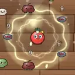</td><th colspan="2" align="left">大蒜光环</th></tr>
<tr><td colspan="2"><i>持续伤害周围敌人（每 0.5 秒）。</i></td></tr>
<tr><td nowrap>类别 / 方式</td><td>元素 / 光环</td></tr>
<tr><td nowrap>标签</td><td>蔬果、元素</td></tr>
<tr><td nowrap>伤害 T1~T4</td><td>4 / 6 / 9 / 13</td></tr>
<tr><td nowrap>冷却 T1~T4</td><td>0.5s / 0.5s / 0.5s / 0.5s</td></tr>
<tr><td nowrap>射程</td><td>133</td></tr>
<tr><td nowrap>属性加成</td><td>元素伤害 ×0.5</td></tr>
<tr><td nowrap>暴击倍率</td><td>×1.5</td></tr>
<tr><td nowrap>特效</td><td>-</td></tr>
<tr><td nowrap>T1 价格</td><td>30</td></tr>
<tr><td nowrap>初始携带</td><td><a href="CHARACTERS.md#char-garlic">大蒜伯爵</a>、<a href="CHARACTERS.md#char-durian">榴莲霸王</a></td></tr>
</table>

<a id="weapon-pepper_mine"></a>

<table>
<tr><td rowspan="12" align="center" valign="middle">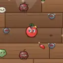</td><th colspan="2" align="left">胡椒雷</th></tr>
<tr><td colspan="2"><i>在身边布雷，敌人踩中后爆炸。</i></td></tr>
<tr><td nowrap>类别 / 方式</td><td>元素 / 地雷</td></tr>
<tr><td nowrap>标签</td><td>元素、爆破</td></tr>
<tr><td nowrap>伤害 T1~T4</td><td>20 / 34 / 52 / 80</td></tr>
<tr><td nowrap>冷却 T1~T4</td><td>2.5s / 2.3s / 2.1s / 1.8s</td></tr>
<tr><td nowrap>射程</td><td>200</td></tr>
<tr><td nowrap>属性加成</td><td>元素伤害 ×1</td></tr>
<tr><td nowrap>暴击倍率</td><td>×1.5</td></tr>
<tr><td nowrap>特效</td><td>爆炸半径 150</td></tr>
<tr><td nowrap>T1 价格</td><td>25</td></tr>
<tr><td nowrap>初始携带</td><td><a href="CHARACTERS.md#char-avocado">牛油果博士</a></td></tr>
</table>

<a id="weapon-broccoli_staff"></a>

<table>
<tr><td rowspan="12" align="center" valign="middle"></td><th colspan="2" align="left">西兰花法杖</th></tr>
<tr><td colspan="2"><i>释放连锁闪电，在敌人间跳跃。</i></td></tr>
<tr><td nowrap>类别 / 方式</td><td>元素 / 连锁闪电</td></tr>
<tr><td nowrap>标签</td><td>蔬果、元素</td></tr>
<tr><td nowrap>伤害 T1~T4</td><td>10 / 17 / 26 / 40</td></tr>
<tr><td nowrap>冷却 T1~T4</td><td>1.1s / 1s / 0.92s / 0.84s</td></tr>
<tr><td nowrap>射程</td><td>420</td></tr>
<tr><td nowrap>属性加成</td><td>元素伤害 ×1</td></tr>
<tr><td nowrap>暴击倍率</td><td>×1.5</td></tr>
<tr><td nowrap>特效</td><td>连锁 2/3/4/6 次</td></tr>
<tr><td nowrap>T1 价格</td><td>30</td></tr>
<tr><td nowrap>初始携带</td><td><a href="CHARACTERS.md#char-eggplant">茄子法师</a></td></tr>
</table>

<a id="weapon-ice_cube_tray"></a>

<table>
<tr><td rowspan="12" align="center" valign="middle"></td><th colspan="2" align="left">冰块格</th></tr>
<tr><td colspan="2"><i>甩出一排冰块，大幅减速敌人。</i></td></tr>
<tr><td nowrap>类别 / 方式</td><td>元素 / 子弹</td></tr>
<tr><td nowrap>标签</td><td>厨具、元素</td></tr>
<tr><td nowrap>伤害 T1~T4</td><td>5 / 8 / 12 / 18</td></tr>
<tr><td nowrap>冷却 T1~T4</td><td>1s / 0.95s / 0.88s / 0.8s</td></tr>
<tr><td nowrap>射程</td><td>340</td></tr>
<tr><td nowrap>属性加成</td><td>元素伤害 ×0.6</td></tr>
<tr><td nowrap>暴击倍率</td><td>×1.5</td></tr>
<tr><td nowrap>特效</td><td>减速 50% 1.2s，弹丸 3/3/4/4</td></tr>
<tr><td nowrap>T1 价格</td><td>26</td></tr>
<tr><td nowrap>初始携带</td><td>-</td></tr>
</table>

<a id="weapon-lightning_whisk"></a>

<table>
<tr><td rowspan="12" align="center" valign="middle"></td><th colspan="2" align="left">闪电打蛋器</th></tr>
<tr><td colspan="2"><i>搅出电流，在更多敌人间跳跃。</i></td></tr>
<tr><td nowrap>类别 / 方式</td><td>元素 / 连锁闪电</td></tr>
<tr><td nowrap>标签</td><td>厨具、元素</td></tr>
<tr><td nowrap>伤害 T1~T4</td><td>7 / 12 / 18 / 27</td></tr>
<tr><td nowrap>冷却 T1~T4</td><td>0.95s / 0.9s / 0.82s / 0.74s</td></tr>
<tr><td nowrap>射程</td><td>380</td></tr>
<tr><td nowrap>属性加成</td><td>元素伤害 ×0.8</td></tr>
<tr><td nowrap>暴击倍率</td><td>×1.5</td></tr>
<tr><td nowrap>特效</td><td>连锁 3/4/5/7 次</td></tr>
<tr><td nowrap>T1 价格</td><td>30</td></tr>
<tr><td nowrap>初始携带</td><td>-</td></tr>
</table>

<a id="weapon-steam_kettle"></a>

<table>
<tr><td rowspan="12" align="center" valign="middle"></td><th colspan="2" align="left">蒸汽水壶</th></tr>
<tr><td colspan="2"><i>喷出宽幅蒸汽，穿透并减速敌人。</i></td></tr>
<tr><td nowrap>类别 / 方式</td><td>元素 / 喷火</td></tr>
<tr><td nowrap>标签</td><td>厨具、元素</td></tr>
<tr><td nowrap>伤害 T1~T4</td><td>3 / 5 / 7 / 11</td></tr>
<tr><td nowrap>冷却 T1~T4</td><td>0.26s / 0.24s / 0.21s / 0.18s</td></tr>
<tr><td nowrap>射程</td><td>170</td></tr>
<tr><td nowrap>属性加成</td><td>元素伤害 ×0.3</td></tr>
<tr><td nowrap>暴击倍率</td><td>×1.5</td></tr>
<tr><td nowrap>特效</td><td>减速 20% 1s，击退 4</td></tr>
<tr><td nowrap>T1 价格</td><td>28</td></tr>
<tr><td nowrap>初始携带</td><td>-</td></tr>
</table>

<a id="weapon-curry_aura"></a>

<table>
<tr><td rowspan="12" align="center" valign="middle"></td><th colspan="2" align="left">咖喱光环</th></tr>
<tr><td colspan="2"><i>浓郁的咖喱香气灼烧周围敌人。</i></td></tr>
<tr><td nowrap>类别 / 方式</td><td>元素 / 光环</td></tr>
<tr><td nowrap>标签</td><td>酱料、元素</td></tr>
<tr><td nowrap>伤害 T1~T4</td><td>3 / 5 / 7 / 11</td></tr>
<tr><td nowrap>冷却 T1~T4</td><td>0.5s / 0.5s / 0.5s / 0.5s</td></tr>
<tr><td nowrap>射程</td><td>140</td></tr>
<tr><td nowrap>属性加成</td><td>元素伤害 ×0.4</td></tr>
<tr><td nowrap>暴击倍率</td><td>×1.5</td></tr>
<tr><td nowrap>特效</td><td>灼烧 2/秒 2s</td></tr>
<tr><td nowrap>T1 价格</td><td>32</td></tr>
<tr><td nowrap>初始携带</td><td><a href="CHARACTERS.md#char-taro">芋头术士</a></td></tr>
</table>

<a id="weapon-pepper_spray"></a>

<table>
<tr><td rowspan="12" align="center" valign="middle"></td><th colspan="2" align="left">胡椒喷雾</th></tr>
<tr><td colspan="2"><i>极近距离喷出辛辣粉末，强力灼烧。</i></td></tr>
<tr><td nowrap>类别 / 方式</td><td>元素 / 喷火</td></tr>
<tr><td nowrap>标签</td><td>元素</td></tr>
<tr><td nowrap>伤害 T1~T4</td><td>2 / 4 / 6 / 9</td></tr>
<tr><td nowrap>冷却 T1~T4</td><td>0.18s / 0.16s / 0.14s / 0.12s</td></tr>
<tr><td nowrap>射程</td><td>150</td></tr>
<tr><td nowrap>属性加成</td><td>元素伤害 ×0.25</td></tr>
<tr><td nowrap>暴击倍率</td><td>×1.5</td></tr>
<tr><td nowrap>特效</td><td>灼烧 3/秒 1.5s</td></tr>
<tr><td nowrap>T1 价格</td><td>26</td></tr>
<tr><td nowrap>初始携带</td><td>-</td></tr>
</table>

<a id="weapon-mint_frost_mine"></a>

<table>
<tr><td rowspan="12" align="center" valign="middle">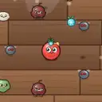</td><th colspan="2" align="left">薄荷冰雷</th></tr>
<tr><td colspan="2"><i>清凉薄荷雷，爆炸冻得敌人走不动。</i></td></tr>
<tr><td nowrap>类别 / 方式</td><td>元素 / 地雷</td></tr>
<tr><td nowrap>标签</td><td>蔬果、元素、爆破</td></tr>
<tr><td nowrap>伤害 T1~T4</td><td>16 / 27 / 42 / 64</td></tr>
<tr><td nowrap>冷却 T1~T4</td><td>2.6s / 2.4s / 2.2s / 1.9s</td></tr>
<tr><td nowrap>射程</td><td>220</td></tr>
<tr><td nowrap>属性加成</td><td>元素伤害 ×0.9</td></tr>
<tr><td nowrap>暴击倍率</td><td>×1.5</td></tr>
<tr><td nowrap>特效</td><td>减速 50% 2s，爆炸半径 160</td></tr>
<tr><td nowrap>T1 价格</td><td>26</td></tr>
<tr><td nowrap>初始携带</td><td>-</td></tr>
</table>

<a id="weapon-thunder_durian"></a>

<table>
<tr><td rowspan="12" align="center" valign="middle"></td><th colspan="2" align="left">雷霆榴莲</th></tr>
<tr><td colspan="2"><i>扔出带电榴莲，爆炸并眩晕敌人。</i></td></tr>
<tr><td nowrap>类别 / 方式</td><td>元素 / 爆炸弹</td></tr>
<tr><td nowrap>标签</td><td>蔬果、元素、爆破</td></tr>
<tr><td nowrap>伤害 T1~T4</td><td>16 / 27 / 42 / 64</td></tr>
<tr><td nowrap>冷却 T1~T4</td><td>2.2s / 2.1s / 1.95s / 1.75s</td></tr>
<tr><td nowrap>射程</td><td>400</td></tr>
<tr><td nowrap>属性加成</td><td>元素伤害 ×1</td></tr>
<tr><td nowrap>暴击倍率</td><td>×1.5</td></tr>
<tr><td nowrap>特效</td><td>眩晕 0.35s，爆炸半径 100</td></tr>
<tr><td nowrap>T1 价格</td><td>32</td></tr>
<tr><td nowrap>初始携带</td><td>-</td></tr>
</table>

<a id="weapon-dragonfruit_orb"></a>

<table>
<tr><td rowspan="12" align="center" valign="middle"></td><th colspan="2" align="left">火龙果法球</th></tr>
<tr><td colspan="2"><i>燃烧的火龙果弹射并点燃敌人。</i></td></tr>
<tr><td nowrap>类别 / 方式</td><td>元素 / 子弹</td></tr>
<tr><td nowrap>标签</td><td>蔬果、元素</td></tr>
<tr><td nowrap>伤害 T1~T4</td><td>8 / 13 / 20 / 30</td></tr>
<tr><td nowrap>冷却 T1~T4</td><td>1s / 0.95s / 0.88s / 0.8s</td></tr>
<tr><td nowrap>射程</td><td>400</td></tr>
<tr><td nowrap>属性加成</td><td>元素伤害 ×0.8</td></tr>
<tr><td nowrap>暴击倍率</td><td>×1.5</td></tr>
<tr><td nowrap>特效</td><td>灼烧 3/秒 2s，弹射 1/2/2/3</td></tr>
<tr><td nowrap>T1 价格</td><td>28</td></tr>
<tr><td nowrap>初始携带</td><td><a href="CHARACTERS.md#char-blackberry">黑莓女巫</a></td></tr>
</table>

<a id="weapon-star_anise_shuriken"></a>

<table>
<tr><td rowspan="12" align="center" valign="middle"></td><th colspan="2" align="left">八角飞镖</th></tr>
<tr><td colspan="2"><i>香料飞镖螺旋扫过前方再回旋而归，灼烧沿途敌人。</i></td></tr>
<tr><td nowrap>类别 / 方式</td><td>元素 / 回旋镖</td></tr>
<tr><td nowrap>标签</td><td>锋利、元素</td></tr>
<tr><td nowrap>伤害 T1~T4</td><td>9 / 15 / 23 / 35</td></tr>
<tr><td nowrap>冷却 T1~T4</td><td>1.3s / 1.2s / 1.1s / 1s</td></tr>
<tr><td nowrap>射程</td><td>320</td></tr>
<tr><td nowrap>属性加成</td><td>元素伤害 ×0.8</td></tr>
<tr><td nowrap>暴击倍率</td><td>×2</td></tr>
<tr><td nowrap>特效</td><td>灼烧 2/秒 1.5s</td></tr>
<tr><td nowrap>T1 价格</td><td>28</td></tr>
<tr><td nowrap>初始携带</td><td><a href="CHARACTERS.md#char-ginger">生姜忍者</a></td></tr>
</table>

<a id="weapon-lemon_battery"></a>

<table>
<tr><td rowspan="12" align="center" valign="middle"></td><th colspan="2" align="left">柠檬电池</th></tr>
<tr><td colspan="2"><i>强力电击，跳跃较少但会眩晕敌人。</i></td></tr>
<tr><td nowrap>类别 / 方式</td><td>元素 / 连锁闪电</td></tr>
<tr><td nowrap>标签</td><td>蔬果、元素</td></tr>
<tr><td nowrap>伤害 T1~T4</td><td>12 / 20 / 31 / 47</td></tr>
<tr><td nowrap>冷却 T1~T4</td><td>1.3s / 1.2s / 1.1s / 1s</td></tr>
<tr><td nowrap>射程</td><td>360</td></tr>
<tr><td nowrap>属性加成</td><td>元素伤害 ×1.1</td></tr>
<tr><td nowrap>暴击倍率</td><td>×1.5</td></tr>
<tr><td nowrap>特效</td><td>眩晕 0.25s，连锁 1/2/2/3 次</td></tr>
<tr><td nowrap>T1 价格</td><td>30</td></tr>
<tr><td nowrap>初始携带</td><td>-</td></tr>
</table>

<a id="weapon-salt_aura"></a>

<table>
<tr><td rowspan="12" align="center" valign="middle"></td><th colspan="2" align="left">海盐结界</th></tr>
<tr><td colspan="2"><i>锋利的盐晶环绕周身，持续切割周围敌人，容易暴击。</i></td></tr>
<tr><td nowrap>类别 / 方式</td><td>元素 / 光环</td></tr>
<tr><td nowrap>标签</td><td>锋利、元素</td></tr>
<tr><td nowrap>伤害 T1~T4</td><td>3 / 5 / 8 / 12</td></tr>
<tr><td nowrap>冷却 T1~T4</td><td>0.5s / 0.5s / 0.5s / 0.5s</td></tr>
<tr><td nowrap>射程</td><td>152</td></tr>
<tr><td nowrap>属性加成</td><td>元素伤害 ×0.45</td></tr>
<tr><td nowrap>暴击倍率</td><td>×2</td></tr>
<tr><td nowrap>特效</td><td>额外暴击 10%</td></tr>
<tr><td nowrap>T1 价格</td><td>30</td></tr>
<tr><td nowrap>初始携带</td><td>-</td></tr>
</table>

<a id="weapon-cola_zapper"></a>

<table>
<tr><td rowspan="12" align="center" valign="middle"></td><th colspan="2" align="left">可乐电击枪</th></tr>
<tr><td colspan="2"><i>带电的可乐气泡在敌人间跳跃并减速。受远程伤害少量加成。</i></td></tr>
<tr><td nowrap>类别 / 方式</td><td>元素 / 连锁闪电</td></tr>
<tr><td nowrap>标签</td><td>枪械、元素</td></tr>
<tr><td nowrap>伤害 T1~T4</td><td>8 / 14 / 21 / 32</td></tr>
<tr><td nowrap>冷却 T1~T4</td><td>0.95s / 0.88s / 0.8s / 0.72s</td></tr>
<tr><td nowrap>射程</td><td>440</td></tr>
<tr><td nowrap>属性加成</td><td>元素伤害 ×0.7，远程伤害 ×0.3</td></tr>
<tr><td nowrap>暴击倍率</td><td>×1.5</td></tr>
<tr><td nowrap>特效</td><td>减速 20% 1s，连锁 2/3/4/5 次</td></tr>
<tr><td nowrap>T1 价格</td><td>28</td></tr>
<tr><td nowrap>初始携带</td><td>-</td></tr>
</table>

<a id="weapon-hotpot_breath"></a>

<table>
<tr><td rowspan="12" align="center" valign="middle"></td><th colspan="2" align="left">火锅吐息</th></tr>
<tr><td colspan="2"><i>喷出滚烫红油，强力灼烧，命中额外提高吸血概率。</i></td></tr>
<tr><td nowrap>类别 / 方式</td><td>元素 / 喷火</td></tr>
<tr><td nowrap>标签</td><td>酱料、元素</td></tr>
<tr><td nowrap>伤害 T1~T4</td><td>3 / 4 / 6 / 10</td></tr>
<tr><td nowrap>冷却 T1~T4</td><td>0.22s / 0.2s / 0.18s / 0.16s</td></tr>
<tr><td nowrap>射程</td><td>165</td></tr>
<tr><td nowrap>属性加成</td><td>元素伤害 ×0.3</td></tr>
<tr><td nowrap>暴击倍率</td><td>×1.5</td></tr>
<tr><td nowrap>特效</td><td>灼烧 3/秒 2s，额外吸血概率 1%</td></tr>
<tr><td nowrap>T1 价格</td><td>30</td></tr>
<tr><td nowrap>初始携带</td><td><a href="CHARACTERS.md#char-dragonfruit">火龙果龙骑</a></td></tr>
</table>

<a id="weapon-pumpkin_lantern"></a>

<table>
<tr><td rowspan="12" align="center" valign="middle"></td><th colspan="2" align="left">南瓜鬼火灯</th></tr>
<tr><td colspan="2"><i>提着南瓜灯放出慢悠悠的鬼火，会自己追着敌人飘，还能穿过敌人。</i></td></tr>
<tr><td nowrap>类别 / 方式</td><td>元素 / 子弹</td></tr>
<tr><td nowrap>标签</td><td>蔬果、元素</td></tr>
<tr><td nowrap>伤害 T1~T4</td><td>9 / 15 / 24 / 37</td></tr>
<tr><td nowrap>冷却 T1~T4</td><td>0.8s / 0.75s / 0.7s / 0.62s</td></tr>
<tr><td nowrap>射程</td><td>420</td></tr>
<tr><td nowrap>属性加成</td><td>元素伤害 ×0.85</td></tr>
<tr><td nowrap>暴击倍率</td><td>×1.8</td></tr>
<tr><td nowrap>特效</td><td>穿透 1/1/2/3</td></tr>
<tr><td nowrap>T1 价格</td><td>24</td></tr>
<tr><td nowrap>初始携带</td><td><a href="CHARACTERS.md#char-pumpkin">南瓜幽灵</a></td></tr>
</table>

<a id="weapon-spore_sprayer"></a>

<table>
<tr><td rowspan="12" align="center" valign="middle"></td><th colspan="2" align="left">孢子喷壶</th></tr>
<tr><td colspan="2"><i>喷出毒孢子团，命中使敌人中毒，并裂成两颗小孢子继续飞。</i></td></tr>
<tr><td nowrap>类别 / 方式</td><td>元素 / 子弹</td></tr>
<tr><td nowrap>标签</td><td>蔬果、元素</td></tr>
<tr><td nowrap>伤害 T1~T4</td><td>5 / 8 / 13 / 20</td></tr>
<tr><td nowrap>冷却 T1~T4</td><td>0.7s / 0.65s / 0.6s / 0.54s</td></tr>
<tr><td nowrap>射程</td><td>330</td></tr>
<tr><td nowrap>属性加成</td><td>元素伤害 ×0.7</td></tr>
<tr><td nowrap>暴击倍率</td><td>×1.5</td></tr>
<tr><td nowrap>特效</td><td>-</td></tr>
<tr><td nowrap>T1 价格</td><td>22</td></tr>
<tr><td nowrap>初始携带</td><td><a href="CHARACTERS.md#char-mushroom">蘑菇巫医</a></td></tr>
</table>

<a id="weapon-cream_torch"></a>

<table>
<tr><td rowspan="12" align="center" valign="middle"></td><th colspan="2" align="left">奶油喷枪</th></tr>
<tr><td colspan="2"><i>喷出黏稠的奶油，减速敌人。</i></td></tr>
<tr><td nowrap>类别 / 方式</td><td>元素 / 喷火</td></tr>
<tr><td nowrap>标签</td><td>甜点</td></tr>
<tr><td nowrap>伤害 T1~T4</td><td>2 / 3 / 5 / 8</td></tr>
<tr><td nowrap>冷却 T1~T4</td><td>0.2s / 0.18s / 0.16s / 0.14s</td></tr>
<tr><td nowrap>射程</td><td>200</td></tr>
<tr><td nowrap>属性加成</td><td>元素伤害 ×0.25</td></tr>
<tr><td nowrap>暴击倍率</td><td>×1.5</td></tr>
<tr><td nowrap>特效</td><td>减速 30% 1s</td></tr>
<tr><td nowrap>T1 价格</td><td>29</td></tr>
<tr><td nowrap>初始携带</td><td>-</td></tr>
</table>

<a id="weapon-caramel_aura"></a>

<table>
<tr><td rowspan="12" align="center" valign="middle"></td><th colspan="2" align="left">焦糖光环</th></tr>
<tr><td colspan="2"><i>滚烫的焦糖香气，灼烧并减速周围敌人。</i></td></tr>
<tr><td nowrap>类别 / 方式</td><td>元素 / 光环</td></tr>
<tr><td nowrap>标签</td><td>甜点</td></tr>
<tr><td nowrap>伤害 T1~T4</td><td>3 / 5 / 6 / 10</td></tr>
<tr><td nowrap>冷却 T1~T4</td><td>0.5s / 0.5s / 0.5s / 0.5s</td></tr>
<tr><td nowrap>射程</td><td>131</td></tr>
<tr><td nowrap>属性加成</td><td>元素伤害 ×0.4</td></tr>
<tr><td nowrap>暴击倍率</td><td>×1.5</td></tr>
<tr><td nowrap>特效</td><td>灼烧 2/秒 2s，减速 15% 0.6s</td></tr>
<tr><td nowrap>T1 价格</td><td>33</td></tr>
<tr><td nowrap>初始携带</td><td>-</td></tr>
</table>

<a id="weapon-popping_candy"></a>

<table>
<tr><td rowspan="12" align="center" valign="middle"></td><th colspan="2" align="left">跳跳糖电击</th></tr>
<tr><td colspan="2"><i>噼啪作响的跳跳糖电流，跳跃并轻微眩晕。</i></td></tr>
<tr><td nowrap>类别 / 方式</td><td>元素 / 连锁闪电</td></tr>
<tr><td nowrap>标签</td><td>甜点</td></tr>
<tr><td nowrap>伤害 T1~T4</td><td>8 / 13 / 20 / 30</td></tr>
<tr><td nowrap>冷却 T1~T4</td><td>0.95s / 0.88s / 0.8s / 0.72s</td></tr>
<tr><td nowrap>射程</td><td>440</td></tr>
<tr><td nowrap>属性加成</td><td>元素伤害 ×0.7，远程伤害 ×0.3</td></tr>
<tr><td nowrap>暴击倍率</td><td>×1.5</td></tr>
<tr><td nowrap>特效</td><td>眩晕 0.15s，连锁 2/3/4/5 次</td></tr>
<tr><td nowrap>T1 价格</td><td>29</td></tr>
<tr><td nowrap>初始携带</td><td>-</td></tr>
</table>

<a id="weapon-slush_spray"></a>

<table>
<tr><td rowspan="12" align="center" valign="middle"></td><th colspan="2" align="left">冰沙喷雾</th></tr>
<tr><td colspan="2"><i>喷出冰沙雾，强力减速。</i></td></tr>
<tr><td nowrap>类别 / 方式</td><td>元素 / 喷火</td></tr>
<tr><td nowrap>标签</td><td>甜点</td></tr>
<tr><td nowrap>伤害 T1~T4</td><td>3 / 5 / 7 / 11</td></tr>
<tr><td nowrap>冷却 T1~T4</td><td>0.26s / 0.24s / 0.21s / 0.18s</td></tr>
<tr><td nowrap>射程</td><td>170</td></tr>
<tr><td nowrap>属性加成</td><td>元素伤害 ×0.3</td></tr>
<tr><td nowrap>暴击倍率</td><td>×1.5</td></tr>
<tr><td nowrap>特效</td><td>减速 40% 1.2s，击退 4</td></tr>
<tr><td nowrap>T1 价格</td><td>29</td></tr>
<tr><td nowrap>初始携带</td><td>-</td></tr>
</table>

<a id="weapon-frost_aura"></a>

<table>
<tr><td rowspan="12" align="center" valign="middle"></td><th colspan="2" align="left">寒霜光环</th></tr>
<tr><td colspan="2"><i>周身寒气，减速周围敌人。</i></td></tr>
<tr><td nowrap>类别 / 方式</td><td>元素 / 光环</td></tr>
<tr><td nowrap>标签</td><td></td></tr>
<tr><td nowrap>伤害 T1~T4</td><td>3 / 5 / 7 / 11</td></tr>
<tr><td nowrap>冷却 T1~T4</td><td>0.5s / 0.5s / 0.5s / 0.5s</td></tr>
<tr><td nowrap>射程</td><td>134</td></tr>
<tr><td nowrap>属性加成</td><td>元素伤害 ×0.45</td></tr>
<tr><td nowrap>暴击倍率</td><td>×2</td></tr>
<tr><td nowrap>特效</td><td>减速 30% 0.8s，额外暴击 10%</td></tr>
<tr><td nowrap>T1 价格</td><td>31</td></tr>
<tr><td nowrap>初始携带</td><td>-</td></tr>
</table>

<a id="weapon-icicle_volley"></a>

<table>
<tr><td rowspan="12" align="center" valign="middle"></td><th colspan="2" align="left">冰锥连射</th></tr>
<tr><td colspan="2"><i>一次射出三根冰锥，可穿透。</i></td></tr>
<tr><td nowrap>类别 / 方式</td><td>元素 / 子弹</td></tr>
<tr><td nowrap>标签</td><td></td></tr>
<tr><td nowrap>伤害 T1~T4</td><td>5 / 7 / 11 / 16</td></tr>
<tr><td nowrap>冷却 T1~T4</td><td>1s / 0.95s / 0.88s / 0.8s</td></tr>
<tr><td nowrap>射程</td><td>340</td></tr>
<tr><td nowrap>属性加成</td><td>元素伤害 ×0.6</td></tr>
<tr><td nowrap>暴击倍率</td><td>×1.5</td></tr>
<tr><td nowrap>特效</td><td>减速 50% 1.2s，穿透 1/2/2/3，弹丸 3/3/4/4</td></tr>
<tr><td nowrap>T1 价格</td><td>27</td></tr>
<tr><td nowrap>初始携带</td><td>-</td></tr>
</table>

<a id="weapon-rice_cooker_aura"></a>

<table>
<tr><td rowspan="12" align="center" valign="middle"></td><th colspan="2" align="left">电饭煲光环</th></tr>
<tr><td colspan="2"><i>持续放电的电饭煲，电晕周围敌人。</i></td></tr>
<tr><td nowrap>类别 / 方式</td><td>元素 / 光环</td></tr>
<tr><td nowrap>标签</td><td>厨具</td></tr>
<tr><td nowrap>伤害 T1~T4</td><td>3 / 5 / 8 / 11</td></tr>
<tr><td nowrap>冷却 T1~T4</td><td>0.5s / 0.5s / 0.5s / 0.5s</td></tr>
<tr><td nowrap>射程</td><td>143</td></tr>
<tr><td nowrap>属性加成</td><td>元素伤害 ×0.5</td></tr>
<tr><td nowrap>暴击倍率</td><td>×1.5</td></tr>
<tr><td nowrap>特效</td><td>减速 15% 0.5s，眩晕 0.1s</td></tr>
<tr><td nowrap>T1 价格</td><td>31</td></tr>
<tr><td nowrap>初始携带</td><td>-</td></tr>
</table>

<a id="weapon-grill_arc"></a>

<table>
<tr><td rowspan="12" align="center" valign="middle"></td><th colspan="2" align="left">电烤架</th></tr>
<tr><td colspan="2"><i>电烤架放出的电弧，跳跃并灼烧。</i></td></tr>
<tr><td nowrap>类别 / 方式</td><td>元素 / 连锁闪电</td></tr>
<tr><td nowrap>标签</td><td>厨具</td></tr>
<tr><td nowrap>伤害 T1~T4</td><td>9 / 14 / 22 / 34</td></tr>
<tr><td nowrap>冷却 T1~T4</td><td>1.1s / 1s / 0.92s / 0.84s</td></tr>
<tr><td nowrap>射程</td><td>420</td></tr>
<tr><td nowrap>属性加成</td><td>元素伤害 ×1</td></tr>
<tr><td nowrap>暴击倍率</td><td>×1.5</td></tr>
<tr><td nowrap>特效</td><td>灼烧 2/秒 1.5s，连锁 2/3/4/6 次</td></tr>
<tr><td nowrap>T1 价格</td><td>31</td></tr>
<tr><td nowrap>初始携带</td><td>-</td></tr>
</table>

<a id="weapon-mixer_storm"></a>

<table>
<tr><td rowspan="12" align="center" valign="middle"></td><th colspan="2" align="left">电动打蛋机</th></tr>
<tr><td colspan="2"><i>高速旋转的打蛋机，闪电跳得更多。</i></td></tr>
<tr><td nowrap>类别 / 方式</td><td>元素 / 连锁闪电</td></tr>
<tr><td nowrap>标签</td><td>厨具</td></tr>
<tr><td nowrap>伤害 T1~T4</td><td>6 / 10 / 15 / 23</td></tr>
<tr><td nowrap>冷却 T1~T4</td><td>0.95s / 0.9s / 0.82s / 0.74s</td></tr>
<tr><td nowrap>射程</td><td>380</td></tr>
<tr><td nowrap>属性加成</td><td>元素伤害 ×0.8</td></tr>
<tr><td nowrap>暴击倍率</td><td>×1.5</td></tr>
<tr><td nowrap>特效</td><td>连锁 4/5/6/8 次</td></tr>
<tr><td nowrap>T1 价格</td><td>31</td></tr>
<tr><td nowrap>初始携带</td><td>-</td></tr>
</table>

<a id="weapon-toaster_zap"></a>

<table>
<tr><td rowspan="12" align="center" valign="middle"></td><th colspan="2" align="left">吐司闪电</th></tr>
<tr><td colspan="2"><i>吐司机弹出的闪电，跳跃并眩晕。</i></td></tr>
<tr><td nowrap>类别 / 方式</td><td>元素 / 连锁闪电</td></tr>
<tr><td nowrap>标签</td><td>厨具、甜点</td></tr>
<tr><td nowrap>伤害 T1~T4</td><td>11 / 19 / 29 / 45</td></tr>
<tr><td nowrap>冷却 T1~T4</td><td>1.3s / 1.2s / 1.1s / 1s</td></tr>
<tr><td nowrap>射程</td><td>360</td></tr>
<tr><td nowrap>属性加成</td><td>元素伤害 ×1.1</td></tr>
<tr><td nowrap>暴击倍率</td><td>×1.5</td></tr>
<tr><td nowrap>特效</td><td>眩晕 0.25s，连锁 2/2/3/4 次</td></tr>
<tr><td nowrap>T1 价格</td><td>31</td></tr>
<tr><td nowrap>初始携带</td><td>-</td></tr>
</table>

<a id="weapon-miasma_sprayer"></a>

<table>
<tr><td rowspan="12" align="center" valign="middle"></td><th colspan="2" align="left">毒雾喷壶</th></tr>
<tr><td colspan="2"><i>喷出毒雾，让敌人持续中毒。</i></td></tr>
<tr><td nowrap>类别 / 方式</td><td>元素 / 喷火</td></tr>
<tr><td nowrap>标签</td><td>蔬果</td></tr>
<tr><td nowrap>伤害 T1~T4</td><td>2 / 4 / 6 / 9</td></tr>
<tr><td nowrap>冷却 T1~T4</td><td>0.18s / 0.16s / 0.14s / 0.12s</td></tr>
<tr><td nowrap>射程</td><td>150</td></tr>
<tr><td nowrap>属性加成</td><td>元素伤害 ×0.25</td></tr>
<tr><td nowrap>暴击倍率</td><td>×1.5</td></tr>
<tr><td nowrap>特效</td><td>-</td></tr>
<tr><td nowrap>T1 价格</td><td>27</td></tr>
<tr><td nowrap>初始携带</td><td>-</td></tr>
</table>

<a id="weapon-rot_aura"></a>

<table>
<tr><td rowspan="12" align="center" valign="middle"></td><th colspan="2" align="left">腐菌光环</th></tr>
<tr><td colspan="2"><i>周身的腐菌孢子，让周围敌人中毒。</i></td></tr>
<tr><td nowrap>类别 / 方式</td><td>元素 / 光环</td></tr>
<tr><td nowrap>标签</td><td>蔬果</td></tr>
<tr><td nowrap>伤害 T1~T4</td><td>3 / 5 / 8 / 11</td></tr>
<tr><td nowrap>冷却 T1~T4</td><td>0.5s / 0.5s / 0.5s / 0.5s</td></tr>
<tr><td nowrap>射程</td><td>149</td></tr>
<tr><td nowrap>属性加成</td><td>元素伤害 ×0.5</td></tr>
<tr><td nowrap>暴击倍率</td><td>×1.5</td></tr>
<tr><td nowrap>特效</td><td>-</td></tr>
<tr><td nowrap>T1 价格</td><td>31</td></tr>
<tr><td nowrap>初始携带</td><td>-</td></tr>
</table>

<a id="weapon-toadstool_mine"></a>

<table>
<tr><td rowspan="12" align="center" valign="middle"></td><th colspan="2" align="left">毒蘑菇雷</th></tr>
<tr><td colspan="2"><i>踩到就炸开毒孢子，中毒 2 层。</i></td></tr>
<tr><td nowrap>类别 / 方式</td><td>元素 / 地雷</td></tr>
<tr><td nowrap>标签</td><td>蔬果</td></tr>
<tr><td nowrap>伤害 T1~T4</td><td>18 / 31 / 47 / 72</td></tr>
<tr><td nowrap>冷却 T1~T4</td><td>2.5s / 2.3s / 2.1s / 1.8s</td></tr>
<tr><td nowrap>射程</td><td>200</td></tr>
<tr><td nowrap>属性加成</td><td>元素伤害 ×1</td></tr>
<tr><td nowrap>暴击倍率</td><td>×1.5</td></tr>
<tr><td nowrap>特效</td><td>爆炸半径 140</td></tr>
<tr><td nowrap>T1 价格</td><td>26</td></tr>
<tr><td nowrap>初始携带</td><td>-</td></tr>
</table>

<a id="weapon-charcoal_aura"></a>

<table>
<tr><td rowspan="12" align="center" valign="middle"></td><th colspan="2" align="left">炭烤光环</th></tr>
<tr><td colspan="2"><i>周身炭火，灼烧周围敌人。</i></td></tr>
<tr><td nowrap>类别 / 方式</td><td>元素 / 光环</td></tr>
<tr><td nowrap>标签</td><td>酱料</td></tr>
<tr><td nowrap>伤害 T1~T4</td><td>3 / 5 / 7 / 10</td></tr>
<tr><td nowrap>冷却 T1~T4</td><td>0.5s / 0.5s / 0.5s / 0.5s</td></tr>
<tr><td nowrap>射程</td><td>133</td></tr>
<tr><td nowrap>属性加成</td><td>元素伤害 ×0.4</td></tr>
<tr><td nowrap>暴击倍率</td><td>×1.5</td></tr>
<tr><td nowrap>特效</td><td>灼烧 3/秒 2s</td></tr>
<tr><td nowrap>T1 价格</td><td>33</td></tr>
<tr><td nowrap>初始携带</td><td>-</td></tr>
</table>

<a id="weapon-ember_mine"></a>

<table>
<tr><td rowspan="12" align="center" valign="middle"></td><th colspan="2" align="left">火炭雷</th></tr>
<tr><td colspan="2"><i>炸开一地火炭，灼烧敌人。</i></td></tr>
<tr><td nowrap>类别 / 方式</td><td>元素 / 地雷</td></tr>
<tr><td nowrap>标签</td><td>酱料</td></tr>
<tr><td nowrap>伤害 T1~T4</td><td>18 / 31 / 47 / 72</td></tr>
<tr><td nowrap>冷却 T1~T4</td><td>2.5s / 2.3s / 2.1s / 1.8s</td></tr>
<tr><td nowrap>射程</td><td>200</td></tr>
<tr><td nowrap>属性加成</td><td>元素伤害 ×1</td></tr>
<tr><td nowrap>暴击倍率</td><td>×1.5</td></tr>
<tr><td nowrap>特效</td><td>灼烧 4/秒 2s，爆炸半径 150</td></tr>
<tr><td nowrap>T1 价格</td><td>26</td></tr>
<tr><td nowrap>初始携带</td><td>-</td></tr>
</table>

<a id="weapon-cumin_star"></a>

<table>
<tr><td rowspan="12" align="center" valign="middle"></td><th colspan="2" align="left">孜然飞镖</th></tr>
<tr><td colspan="2"><i>撒满孜然的飞镖，一次两枚并灼烧。</i></td></tr>
<tr><td nowrap>类别 / 方式</td><td>元素 / 回旋镖</td></tr>
<tr><td nowrap>标签</td><td>酱料、锋利</td></tr>
<tr><td nowrap>伤害 T1~T4</td><td>7 / 12 / 18 / 28</td></tr>
<tr><td nowrap>冷却 T1~T4</td><td>1.3s / 1.2s / 1.1s / 1s</td></tr>
<tr><td nowrap>射程</td><td>320</td></tr>
<tr><td nowrap>属性加成</td><td>元素伤害 ×0.8</td></tr>
<tr><td nowrap>暴击倍率</td><td>×2</td></tr>
<tr><td nowrap>特效</td><td>灼烧 3/秒 2s，弹丸 2/2/2/3</td></tr>
<tr><td nowrap>T1 价格</td><td>29</td></tr>
<tr><td nowrap>初始携带</td><td>-</td></tr>
</table>

<a id="weapon-mint_aura"></a>

<table>
<tr><td rowspan="12" align="center" valign="middle">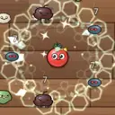</td><th colspan="2" align="left">薄荷清凉光环</th></tr>
<tr><td colspan="2"><i>清凉的薄荷气息，减速周围敌人。</i></td></tr>
<tr><td nowrap>类别 / 方式</td><td>元素 / 光环</td></tr>
<tr><td nowrap>标签</td><td>蔬果</td></tr>
<tr><td nowrap>伤害 T1~T4</td><td>3 / 5 / 7 / 11</td></tr>
<tr><td nowrap>冷却 T1~T4</td><td>0.5s / 0.5s / 0.5s / 0.5s</td></tr>
<tr><td nowrap>射程</td><td>136</td></tr>
<tr><td nowrap>属性加成</td><td>元素伤害 ×0.45</td></tr>
<tr><td nowrap>暴击倍率</td><td>×2</td></tr>
<tr><td nowrap>特效</td><td>减速 25% 0.8s，额外暴击 10%</td></tr>
<tr><td nowrap>T1 价格</td><td>31</td></tr>
<tr><td nowrap>初始携带</td><td>-</td></tr>
</table>

<a id="weapon-honey_aura"></a>

<table>
<tr><td rowspan="12" align="center" valign="middle">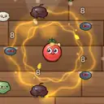</td><th colspan="2" align="left">蜂蜜光环</th></tr>
<tr><td colspan="2"><i>黏稠的蜂蜜气息，减速并吸血。</i></td></tr>
<tr><td nowrap>类别 / 方式</td><td>元素 / 光环</td></tr>
<tr><td nowrap>标签</td><td>甜点</td></tr>
<tr><td nowrap>伤害 T1~T4</td><td>3 / 5 / 8 / 11</td></tr>
<tr><td nowrap>冷却 T1~T4</td><td>0.5s / 0.5s / 0.5s / 0.5s</td></tr>
<tr><td nowrap>射程</td><td>141</td></tr>
<tr><td nowrap>属性加成</td><td>元素伤害 ×0.5</td></tr>
<tr><td nowrap>暴击倍率</td><td>×1.5</td></tr>
<tr><td nowrap>特效</td><td>减速 30% 0.8s，额外吸血概率 2%</td></tr>
<tr><td nowrap>T1 价格</td><td>31</td></tr>
<tr><td nowrap>初始携带</td><td>-</td></tr>
</table>

<a id="weapon-teapot_storm"></a>

<table>
<tr><td rowspan="12" align="center" valign="middle"></td><th colspan="2" align="left">茶壶雷暴</th></tr>
<tr><td colspan="2"><i>沸腾的茶壶放出雷电，跳跃并减速。</i></td></tr>
<tr><td nowrap>类别 / 方式</td><td>元素 / 连锁闪电</td></tr>
<tr><td nowrap>标签</td><td>厨具</td></tr>
<tr><td nowrap>伤害 T1~T4</td><td>7 / 13 / 19 / 29</td></tr>
<tr><td nowrap>冷却 T1~T4</td><td>0.95s / 0.88s / 0.8s / 0.72s</td></tr>
<tr><td nowrap>射程</td><td>440</td></tr>
<tr><td nowrap>属性加成</td><td>元素伤害 ×0.7，远程伤害 ×0.3</td></tr>
<tr><td nowrap>暴击倍率</td><td>×1.5</td></tr>
<tr><td nowrap>特效</td><td>减速 25% 1s，连锁 2/3/4/6 次</td></tr>
<tr><td nowrap>T1 价格</td><td>29</td></tr>
<tr><td nowrap>初始携带</td><td>-</td></tr>
</table>

<a id="weapon-jelly_bounce"></a>

<table>
<tr><td rowspan="12" align="center" valign="middle"></td><th colspan="2" align="left">果冻弹</th></tr>
<tr><td colspan="2"><i>弹来弹去的果冻弹，减速敌人。</i></td></tr>
<tr><td nowrap>类别 / 方式</td><td>元素 / 子弹</td></tr>
<tr><td nowrap>标签</td><td>甜点</td></tr>
<tr><td nowrap>伤害 T1~T4</td><td>7 / 11 / 17 / 26</td></tr>
<tr><td nowrap>冷却 T1~T4</td><td>1s / 0.95s / 0.88s / 0.8s</td></tr>
<tr><td nowrap>射程</td><td>400</td></tr>
<tr><td nowrap>属性加成</td><td>元素伤害 ×0.8</td></tr>
<tr><td nowrap>暴击倍率</td><td>×1.5</td></tr>
<tr><td nowrap>特效</td><td>减速 20% 1s，弹射 1/2/2/3</td></tr>
<tr><td nowrap>T1 价格</td><td>29</td></tr>
<tr><td nowrap>初始携带</td><td>-</td></tr>
</table>

<a id="weapon-syrup_sprayer"></a>

<table>
<tr><td rowspan="12" align="center" valign="middle">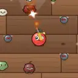</td><th colspan="2" align="left">糖浆喷枪</th></tr>
<tr><td colspan="2"><i>喷出滚烫的糖浆，灼烧并减速。</i></td></tr>
<tr><td nowrap>类别 / 方式</td><td>元素 / 喷火</td></tr>
<tr><td nowrap>标签</td><td>甜点</td></tr>
<tr><td nowrap>伤害 T1~T4</td><td>2 / 3 / 5 / 7</td></tr>
<tr><td nowrap>冷却 T1~T4</td><td>0.2s / 0.18s / 0.16s / 0.14s</td></tr>
<tr><td nowrap>射程</td><td>200</td></tr>
<tr><td nowrap>属性加成</td><td>元素伤害 ×0.25</td></tr>
<tr><td nowrap>暴击倍率</td><td>×1.5</td></tr>
<tr><td nowrap>特效</td><td>灼烧 2/秒 1.5s，减速 20% 0.8s</td></tr>
<tr><td nowrap>T1 价格</td><td>29</td></tr>
<tr><td nowrap>初始携带</td><td>-</td></tr>
</table>

<a id="weapon-curry_garlic_field"></a>

<table>
<tr><td rowspan="12" align="center" valign="middle"></td><th colspan="2" align="left">咖喱蒜香结界</th></tr>
<tr><td colspan="2"><i>两种光环交织，灼烧并吸取周围敌人的生命。</i></td></tr>
<tr><td nowrap>类别 / 方式</td><td>元素 / 光环</td></tr>
<tr><td nowrap>标签</td><td>酱料、元素、蔬果</td></tr>
<tr><td nowrap>伤害 T1~T4</td><td>4 / 7 / 10 / 14</td></tr>
<tr><td nowrap>冷却 T1~T4</td><td>0.5s / 0.5s / 0.5s / 0.5s</td></tr>
<tr><td nowrap>射程</td><td>147</td></tr>
<tr><td nowrap>属性加成</td><td>元素伤害 ×0.54</td></tr>
<tr><td nowrap>暴击倍率</td><td>×1.5</td></tr>
<tr><td nowrap>特效</td><td>灼烧 3/秒 2s，额外吸血概率 4%</td></tr>
<tr><td nowrap>T1 价格</td><td>42</td></tr>
<tr><td nowrap>初始携带</td><td>-</td></tr>
</table>

<a id="weapon-thunder_orchard"></a>

<table>
<tr><td rowspan="12" align="center" valign="middle"></td><th colspan="2" align="left">雷霆果园</th></tr>
<tr><td colspan="2"><i>西兰花与柠檬电池串联，闪电跳得更远还会眩晕。</i></td></tr>
<tr><td nowrap>类别 / 方式</td><td>元素 / 连锁闪电</td></tr>
<tr><td nowrap>标签</td><td>蔬果、元素</td></tr>
<tr><td nowrap>伤害 T1~T4</td><td>13 / 22 / 34 / 52</td></tr>
<tr><td nowrap>冷却 T1~T4</td><td>1.1s / 1s / 0.92s / 0.84s</td></tr>
<tr><td nowrap>射程</td><td>441</td></tr>
<tr><td nowrap>属性加成</td><td>元素伤害 ×1.26</td></tr>
<tr><td nowrap>暴击倍率</td><td>×1.5</td></tr>
<tr><td nowrap>特效</td><td>眩晕 0.3s，连锁 3/4/5/7 次</td></tr>
<tr><td nowrap>T1 价格</td><td>39</td></tr>
<tr><td nowrap>初始携带</td><td>-</td></tr>
</table>

<a id="weapon-honey_frost_aura"></a>

<table>
<tr><td rowspan="12" align="center" valign="middle">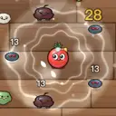</td><th colspan="2" align="left">蜜霜结界</th></tr>
<tr><td colspan="2"><i>蜂蜜与寒霜混成的黏腻结界，敌人又慢又虚。</i></td></tr>
<tr><td nowrap>类别 / 方式</td><td>元素 / 光环</td></tr>
<tr><td nowrap>标签</td><td>甜点</td></tr>
<tr><td nowrap>伤害 T1~T4</td><td>3 / 6 / 9 / 12</td></tr>
<tr><td nowrap>冷却 T1~T4</td><td>0.5s / 0.5s / 0.5s / 0.5s</td></tr>
<tr><td nowrap>射程</td><td>148</td></tr>
<tr><td nowrap>属性加成</td><td>元素伤害 ×0.57</td></tr>
<tr><td nowrap>暴击倍率</td><td>×2</td></tr>
<tr><td nowrap>特效</td><td>减速 45% 1.2s，额外暴击 10%</td></tr>
<tr><td nowrap>T1 价格</td><td>40</td></tr>
<tr><td nowrap>初始携带</td><td>-</td></tr>
</table>

<a id="weapon-spore_minefield"></a>

<table>
<tr><td rowspan="12" align="center" valign="middle"></td><th colspan="2" align="left">孢子雷区</th></tr>
<tr><td colspan="2"><i>毒蘑菇雷与胡椒雷混埋，炸开一地毒雾。</i></td></tr>
<tr><td nowrap>类别 / 方式</td><td>元素 / 地雷</td></tr>
<tr><td nowrap>标签</td><td>蔬果、元素、爆破</td></tr>
<tr><td nowrap>伤害 T1~T4</td><td>22 / 37 / 57 / 88</td></tr>
<tr><td nowrap>冷却 T1~T4</td><td>2.5s / 2.3s / 2.1s / 1.8s</td></tr>
<tr><td nowrap>射程</td><td>210</td></tr>
<tr><td nowrap>属性加成</td><td>元素伤害 ×1.2</td></tr>
<tr><td nowrap>暴击倍率</td><td>×1.5</td></tr>
<tr><td nowrap>特效</td><td>爆炸半径 165</td></tr>
<tr><td nowrap>T1 价格</td><td>34</td></tr>
<tr><td nowrap>初始携带</td><td>-</td></tr>
</table>

<a id="weapon-dragon_breath_flame"></a>

<table>
<tr><td rowspan="12" align="center" valign="middle"></td><th colspan="2" align="left">龙息喷流</th></tr>
<tr><td colspan="2"><i>火锅吐息混进芥末，喷出又远又烫的烈焰。</i></td></tr>
<tr><td nowrap>类别 / 方式</td><td>元素 / 喷火</td></tr>
<tr><td nowrap>标签</td><td>酱料、元素</td></tr>
<tr><td nowrap>伤害 T1~T4</td><td>3 / 4 / 7 / 11</td></tr>
<tr><td nowrap>冷却 T1~T4</td><td>0.2s / 0.18s / 0.16s / 0.14s</td></tr>
<tr><td nowrap>射程</td><td>210</td></tr>
<tr><td nowrap>属性加成</td><td>元素伤害 ×0.33</td></tr>
<tr><td nowrap>暴击倍率</td><td>×1.5</td></tr>
<tr><td nowrap>特效</td><td>灼烧 6/秒 3s</td></tr>
<tr><td nowrap>T1 价格</td><td>39</td></tr>
<tr><td nowrap>初始携带</td><td>-</td></tr>
</table>

<a id="weapon-anise_frost_storm"></a>

<table>
<tr><td rowspan="12" align="center" valign="middle"></td><th colspan="2" align="left">霜星八角</th></tr>
<tr><td colspan="2"><i>八角飞镖裹上冰霜，绕场一圈冻住所有人。</i></td></tr>
<tr><td nowrap>类别 / 方式</td><td>元素 / 回旋镖</td></tr>
<tr><td nowrap>标签</td><td>锋利、元素</td></tr>
<tr><td nowrap>伤害 T1~T4</td><td>10 / 17 / 25 / 39</td></tr>
<tr><td nowrap>冷却 T1~T4</td><td>1s / 0.95s / 0.88s / 0.8s</td></tr>
<tr><td nowrap>射程</td><td>357</td></tr>
<tr><td nowrap>属性加成</td><td>元素伤害 ×0.84</td></tr>
<tr><td nowrap>暴击倍率</td><td>×2</td></tr>
<tr><td nowrap>特效</td><td>减速 40% 1.5s，弹丸 2/2/3/3</td></tr>
<tr><td nowrap>T1 价格</td><td>36</td></tr>
<tr><td nowrap>初始携带</td><td>-</td></tr>
</table>

<a id="weapon-holy_salt_barrier"></a>

<table>
<tr><td rowspan="12" align="center" valign="middle">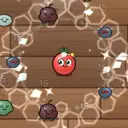</td><th colspan="2" align="left">圣盐结界</th></tr>
<tr><td colspan="2"><i>海盐与薄荷交织的锋利结界，切割并减速周身敌人。</i></td></tr>
<tr><td nowrap>类别 / 方式</td><td>元素 / 光环</td></tr>
<tr><td nowrap>标签</td><td>锋利、元素、蔬果</td></tr>
<tr><td nowrap>伤害 T1~T4</td><td>3 / 6 / 9 / 13</td></tr>
<tr><td nowrap>冷却 T1~T4</td><td>0.5s / 0.5s / 0.5s / 0.5s</td></tr>
<tr><td nowrap>射程</td><td>160</td></tr>
<tr><td nowrap>属性加成</td><td>元素伤害 ×0.54</td></tr>
<tr><td nowrap>暴击倍率</td><td>×2</td></tr>
<tr><td nowrap>特效</td><td>减速 30% 1s，额外暴击 12%</td></tr>
<tr><td nowrap>T1 价格</td><td>40</td></tr>
<tr><td nowrap>初始携带</td><td>-</td></tr>
</table>

<a id="weapon-fz_thunder_durian_volt_fork"></a>

<table>
<tr><td rowspan="12" align="center" valign="middle"></td><th colspan="2" align="left">贯穿雷霆榴莲</th></tr>
<tr><td colspan="2"><i>把高压电叉熔进雷霆榴莲：保留雷霆榴莲的攻击方式，同时带上两把武器的特效。</i></td></tr>
<tr><td nowrap>类别 / 方式</td><td>元素 / 爆炸弹</td></tr>
<tr><td nowrap>标签</td><td>蔬果、元素、爆破</td></tr>
<tr><td nowrap>伤害 T1~T4</td><td>18 / 30 / 46 / 70</td></tr>
<tr><td nowrap>冷却 T1~T4</td><td>0.9s / 0.85s / 0.78s / 0.7s</td></tr>
<tr><td nowrap>射程</td><td>420</td></tr>
<tr><td nowrap>属性加成</td><td>元素伤害 ×0.6，近战伤害 ×0.6</td></tr>
<tr><td nowrap>暴击倍率</td><td>×2</td></tr>
<tr><td nowrap>特效</td><td>眩晕 0.25s，爆炸半径 100</td></tr>
<tr><td nowrap>T1 价格</td><td>42</td></tr>
<tr><td nowrap>初始携带</td><td>-</td></tr>
</table>

<a id="weapon-fz_jelly_bounce_chili_shuriken"></a>

<table>
<tr><td rowspan="12" align="center" valign="middle"></td><th colspan="2" align="left">烈焰果冻弹</th></tr>
<tr><td colspan="2"><i>把剁椒飞轮熔进果冻弹：保留果冻弹的攻击方式，同时带上两把武器的特效。</i></td></tr>
<tr><td nowrap>类别 / 方式</td><td>元素 / 子弹</td></tr>
<tr><td nowrap>标签</td><td>甜点、锋利、酱料</td></tr>
<tr><td nowrap>伤害 T1~T4</td><td>9 / 14 / 22 / 34</td></tr>
<tr><td nowrap>冷却 T1~T4</td><td>1s / 0.95s / 0.88s / 0.8s</td></tr>
<tr><td nowrap>射程</td><td>420</td></tr>
<tr><td nowrap>属性加成</td><td>元素伤害 ×0.48，近战伤害 ×0.48</td></tr>
<tr><td nowrap>暴击倍率</td><td>×2.1</td></tr>
<tr><td nowrap>特效</td><td>灼烧 2/秒 1.5s，减速 20% 1s，弹射 1/2/2/3</td></tr>
<tr><td nowrap>T1 价格</td><td>38</td></tr>
<tr><td nowrap>初始携带</td><td>-</td></tr>
</table>

<a id="weapon-fz_slush_spray_caramel_aura"></a>

<table>
<tr><td rowspan="12" align="center" valign="middle"></td><th colspan="2" align="left">蚀骨冰沙喷雾</th></tr>
<tr><td colspan="2"><i>把焦糖光环熔进冰沙喷雾：保留冰沙喷雾的攻击方式，同时带上两把武器的特效。</i></td></tr>
<tr><td nowrap>类别 / 方式</td><td>元素 / 喷火</td></tr>
<tr><td nowrap>标签</td><td>甜点</td></tr>
<tr><td nowrap>伤害 T1~T4</td><td>3 / 6 / 8 / 12</td></tr>
<tr><td nowrap>冷却 T1~T4</td><td>0.26s / 0.24s / 0.21s / 0.18s</td></tr>
<tr><td nowrap>射程</td><td>179</td></tr>
<tr><td nowrap>属性加成</td><td>元素伤害 ×0.42</td></tr>
<tr><td nowrap>暴击倍率</td><td>×1.5</td></tr>
<tr><td nowrap>特效</td><td>灼烧 2/秒 2s，减速 15% 0.6s，击退 4</td></tr>
<tr><td nowrap>T1 价格</td><td>43</td></tr>
<tr><td nowrap>初始携带</td><td>-</td></tr>
</table>

<a id="weapon-fz_grill_arc_pepper_storm_aura"></a>

<table>
<tr><td rowspan="12" align="center" valign="middle">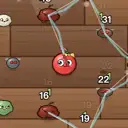</td><th colspan="2" align="left">酱爆电烤架</th></tr>
<tr><td colspan="2"><i>把胡椒风暴熔进电烤架：保留电烤架的攻击方式，同时带上两把武器的特效。</i></td></tr>
<tr><td nowrap>类别 / 方式</td><td>元素 / 连锁闪电</td></tr>
<tr><td nowrap>标签</td><td>厨具、酱料</td></tr>
<tr><td nowrap>伤害 T1~T4</td><td>10 / 15 / 24 / 37</td></tr>
<tr><td nowrap>冷却 T1~T4</td><td>0.45s / 0.45s / 0.42s / 0.4s</td></tr>
<tr><td nowrap>射程</td><td>441</td></tr>
<tr><td nowrap>属性加成</td><td>元素伤害 ×0.6，近战伤害 ×0.24</td></tr>
<tr><td nowrap>暴击倍率</td><td>×1.5</td></tr>
<tr><td nowrap>特效</td><td>灼烧 2/秒 1.5s，连锁 2/3/4/6 次</td></tr>
<tr><td nowrap>T1 价格</td><td>40</td></tr>
<tr><td nowrap>初始携带</td><td>-</td></tr>
</table>

<a id="weapon-fz_teapot_storm_charcoal_aura"></a>

<table>
<tr><td rowspan="12" align="center" valign="middle"></td><th colspan="2" align="left">烈焰茶壶雷暴</th></tr>
<tr><td colspan="2"><i>把炭烤光环熔进茶壶雷暴：保留茶壶雷暴的攻击方式，同时带上两把武器的特效。</i></td></tr>
<tr><td nowrap>类别 / 方式</td><td>元素 / 连锁闪电</td></tr>
<tr><td nowrap>标签</td><td>厨具、酱料</td></tr>
<tr><td nowrap>伤害 T1~T4</td><td>8 / 14 / 21 / 32</td></tr>
<tr><td nowrap>冷却 T1~T4</td><td>0.5s / 0.5s / 0.5s / 0.5s</td></tr>
<tr><td nowrap>射程</td><td>462</td></tr>
<tr><td nowrap>属性加成</td><td>元素伤害 ×0.66，远程伤害 ×0.18</td></tr>
<tr><td nowrap>暴击倍率</td><td>×1.5</td></tr>
<tr><td nowrap>特效</td><td>灼烧 3/秒 2s，减速 25% 1s，连锁 2/3/4/6 次</td></tr>
<tr><td nowrap>T1 价格</td><td>43</td></tr>
<tr><td nowrap>初始携带</td><td>-</td></tr>
</table>

<a id="weapon-fz_cola_zapper_mixer_storm"></a>

<table>
<tr><td rowspan="12" align="center" valign="middle"></td><th colspan="2" align="left">主厨可乐电击枪</th></tr>
<tr><td colspan="2"><i>把电动打蛋机熔进可乐电击枪：保留可乐电击枪的攻击方式，同时带上两把武器的特效。</i></td></tr>
<tr><td nowrap>类别 / 方式</td><td>元素 / 连锁闪电</td></tr>
<tr><td nowrap>标签</td><td>枪械、元素、厨具</td></tr>
<tr><td nowrap>伤害 T1~T4</td><td>9 / 15 / 23 / 35</td></tr>
<tr><td nowrap>冷却 T1~T4</td><td>0.95s / 0.88s / 0.8s / 0.72s</td></tr>
<tr><td nowrap>射程</td><td>462</td></tr>
<tr><td nowrap>属性加成</td><td>元素伤害 ×0.9，远程伤害 ×0.18</td></tr>
<tr><td nowrap>暴击倍率</td><td>×1.5</td></tr>
<tr><td nowrap>特效</td><td>减速 20% 1s，连锁 4/5/6/8 次</td></tr>
<tr><td nowrap>T1 价格</td><td>40</td></tr>
<tr><td nowrap>初始携带</td><td>-</td></tr>
</table>

<a id="weapon-fz_steam_kettle_asparagus_bow"></a>

<table>
<tr><td rowspan="12" align="center" valign="middle"></td><th colspan="2" align="left">贯穿蒸汽水壶</th></tr>
<tr><td colspan="2"><i>把芦笋长弓熔进蒸汽水壶：保留蒸汽水壶的攻击方式，同时带上两把武器的特效。</i></td></tr>
<tr><td nowrap>类别 / 方式</td><td>元素 / 喷火</td></tr>
<tr><td nowrap>标签</td><td>厨具、元素、蔬果</td></tr>
<tr><td nowrap>伤害 T1~T4</td><td>15 / 26 / 41 / 62</td></tr>
<tr><td nowrap>冷却 T1~T4</td><td>0.26s / 0.24s / 0.21s / 0.18s</td></tr>
<tr><td nowrap>射程</td><td>546</td></tr>
<tr><td nowrap>属性加成</td><td>元素伤害 ×0.18，远程伤害 ×0.66</td></tr>
<tr><td nowrap>暴击倍率</td><td>×2.2</td></tr>
<tr><td nowrap>特效</td><td>减速 20% 1s，击退 4，额外暴击 5%</td></tr>
<tr><td nowrap>T1 价格</td><td>36</td></tr>
<tr><td nowrap>初始携带</td><td>-</td></tr>
</table>

<a id="weapon-fz_lightning_whisk_pepper_grinder"></a>

<table>
<tr><td rowspan="12" align="center" valign="middle"></td><th colspan="2" align="left">贯穿闪电打蛋器</th></tr>
<tr><td colspan="2"><i>把胡椒研磨枪熔进闪电打蛋器：保留闪电打蛋器的攻击方式，同时带上两把武器的特效。</i></td></tr>
<tr><td nowrap>类别 / 方式</td><td>元素 / 连锁闪电</td></tr>
<tr><td nowrap>标签</td><td>厨具、元素、枪械</td></tr>
<tr><td nowrap>伤害 T1~T4</td><td>8 / 13 / 20 / 30</td></tr>
<tr><td nowrap>冷却 T1~T4</td><td>0.5s / 0.46s / 0.42s / 0.38s</td></tr>
<tr><td nowrap>射程</td><td>420</td></tr>
<tr><td nowrap>属性加成</td><td>元素伤害 ×0.48，远程伤害 ×0.42</td></tr>
<tr><td nowrap>暴击倍率</td><td>×2.2</td></tr>
<tr><td nowrap>特效</td><td>连锁 3/4/5/7 次，额外暴击 8%</td></tr>
<tr><td nowrap>T1 价格</td><td>39</td></tr>
<tr><td nowrap>初始携带</td><td>-</td></tr>
</table>

<a id="weapon-fz_spore_sprayer_shaved_ice_gun"></a>

<table>
<tr><td rowspan="12" align="center" valign="middle"></td><th colspan="2" align="left">霜寒孢子喷壶</th></tr>
<tr><td colspan="2"><i>把刨冰机枪熔进孢子喷壶：保留孢子喷壶的攻击方式，同时带上两把武器的特效。</i></td></tr>
<tr><td nowrap>类别 / 方式</td><td>元素 / 子弹</td></tr>
<tr><td nowrap>标签</td><td>蔬果、元素、枪械</td></tr>
<tr><td nowrap>伤害 T1~T4</td><td>6 / 9 / 14 / 22</td></tr>
<tr><td nowrap>冷却 T1~T4</td><td>0.22s / 0.2s / 0.18s / 0.16s</td></tr>
<tr><td nowrap>射程</td><td>378</td></tr>
<tr><td nowrap>属性加成</td><td>元素伤害 ×0.42，远程伤害 ×0.27</td></tr>
<tr><td nowrap>暴击倍率</td><td>×1.5</td></tr>
<tr><td nowrap>特效</td><td>减速 20% 0.8s</td></tr>
<tr><td nowrap>T1 价格</td><td>35</td></tr>
<tr><td nowrap>初始携带</td><td>-</td></tr>
</table>

<a id="weapon-fz_toaster_zap_hot_sauce_gun"></a>

<table>
<tr><td rowspan="12" align="center" valign="middle">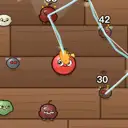</td><th colspan="2" align="left">烈焰吐司闪电</th></tr>
<tr><td colspan="2"><i>把辣酱手枪熔进吐司闪电：保留吐司闪电的攻击方式，同时带上两把武器的特效。</i></td></tr>
<tr><td nowrap>类别 / 方式</td><td>元素 / 连锁闪电</td></tr>
<tr><td nowrap>标签</td><td>厨具、甜点、酱料</td></tr>
<tr><td nowrap>伤害 T1~T4</td><td>12 / 21 / 32 / 50</td></tr>
<tr><td nowrap>冷却 T1~T4</td><td>0.55s / 0.5s / 0.46s / 0.42s</td></tr>
<tr><td nowrap>射程</td><td>399</td></tr>
<tr><td nowrap>属性加成</td><td>元素伤害 ×0.66，远程伤害 ×0.42</td></tr>
<tr><td nowrap>暴击倍率</td><td>×1.5</td></tr>
<tr><td nowrap>特效</td><td>灼烧 2/秒 2s，眩晕 0.25s，连锁 2/2/3/4 次</td></tr>
<tr><td nowrap>T1 价格</td><td>40</td></tr>
<tr><td nowrap>初始携带</td><td>-</td></tr>
</table>

<a id="weapon-fz_mint_frost_mine_blender_aura"></a>

<table>
<tr><td rowspan="12" align="center" valign="middle">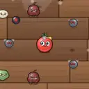</td><th colspan="2" align="left">致命薄荷冰雷</th></tr>
<tr><td colspan="2"><i>把破壁机熔进薄荷冰雷：保留薄荷冰雷的攻击方式，同时带上两把武器的特效。</i></td></tr>
<tr><td nowrap>类别 / 方式</td><td>元素 / 地雷</td></tr>
<tr><td nowrap>标签</td><td>蔬果、元素、爆破</td></tr>
<tr><td nowrap>伤害 T1~T4</td><td>18 / 30 / 46 / 70</td></tr>
<tr><td nowrap>冷却 T1~T4</td><td>0.45s / 0.43s / 0.41s / 0.38s</td></tr>
<tr><td nowrap>射程</td><td>231</td></tr>
<tr><td nowrap>属性加成</td><td>元素伤害 ×0.54，近战伤害 ×0.3</td></tr>
<tr><td nowrap>暴击倍率</td><td>×2</td></tr>
<tr><td nowrap>特效</td><td>减速 50% 2s，爆炸半径 160，额外暴击 5%</td></tr>
<tr><td nowrap>T1 价格</td><td>36</td></tr>
<tr><td nowrap>初始携带</td><td>-</td></tr>
</table>

<a id="weapon-fz_popping_candy_rolling_pin"></a>

<table>
<tr><td rowspan="12" align="center" valign="middle"></td><th colspan="2" align="left">重击跳跳糖电击</th></tr>
<tr><td colspan="2"><i>把擀面杖熔进跳跳糖电击：保留跳跳糖电击的攻击方式，同时带上两把武器的特效。</i></td></tr>
<tr><td nowrap>类别 / 方式</td><td>元素 / 连锁闪电</td></tr>
<tr><td nowrap>标签</td><td>甜点、厨具</td></tr>
<tr><td nowrap>伤害 T1~T4</td><td>13 / 22 / 35 / 53</td></tr>
<tr><td nowrap>冷却 T1~T4</td><td>0.95s / 0.88s / 0.8s / 0.72s</td></tr>
<tr><td nowrap>射程</td><td>462</td></tr>
<tr><td nowrap>属性加成</td><td>元素伤害 ×0.42，远程伤害 ×0.18，近战伤害 ×0.6</td></tr>
<tr><td nowrap>暴击倍率</td><td>×1.5</td></tr>
<tr><td nowrap>特效</td><td>眩晕 0.15s，连锁 2/3/4/5 次</td></tr>
<tr><td nowrap>T1 价格</td><td>38</td></tr>
<tr><td nowrap>初始携带</td><td>-</td></tr>
</table>

<a id="weapon-fz_cumin_star_mandoline"></a>

<table>
<tr><td rowspan="12" align="center" valign="middle"></td><th colspan="2" align="left">贯穿孜然飞镖</th></tr>
<tr><td colspan="2"><i>把切片器熔进孜然飞镖：保留孜然飞镖的攻击方式，同时带上两把武器的特效。</i></td></tr>
<tr><td nowrap>类别 / 方式</td><td>元素 / 回旋镖</td></tr>
<tr><td nowrap>标签</td><td>酱料、锋利、厨具</td></tr>
<tr><td nowrap>伤害 T1~T4</td><td>8 / 13 / 20 / 31</td></tr>
<tr><td nowrap>冷却 T1~T4</td><td>0.5s / 0.46s / 0.42s / 0.38s</td></tr>
<tr><td nowrap>射程</td><td>336</td></tr>
<tr><td nowrap>属性加成</td><td>元素伤害 ×0.48，近战伤害 ×0.42</td></tr>
<tr><td nowrap>暴击倍率</td><td>×2</td></tr>
<tr><td nowrap>特效</td><td>灼烧 3/秒 2s，弹丸 2/2/2/3，额外暴击 10%</td></tr>
<tr><td nowrap>T1 价格</td><td>38</td></tr>
<tr><td nowrap>初始携带</td><td>-</td></tr>
</table>

<a id="craft-graph"></a>

## 合成关系图

箭头从材料指向成品：两把 T3 武器 → T4，两把 T4 武器 → 超武（各配方还需要指定道具，见商店合成表）。T1~T3 同名两把可直接合成升一级，图中省略。

<a id="craft-graph-melee"></a>

### 近战（65 条配方）

```mermaid
flowchart LR
  classDef t2 fill:#f3e8ff,stroke:#8a4fd0
  classDef t3 fill:#fff3d6,stroke:#d09a1f
  classDef t4 fill:#ffe1e1,stroke:#d04a4a,stroke-width:2px
  fork_3["<br/>番茄叉 T4"]:::t3
  fork_2["<br/>番茄叉 T3"]:::t2
  rolling_pin_3["<br/>擀面杖 T4"]:::t3
  rolling_pin_2["<br/>擀面杖 T3"]:::t2
  knife_3["<br/>菜刀 T4"]:::t3
  knife_2["<br/>菜刀 T3"]:::t2
  pan_3["<br/>平底锅 T4"]:::t3
  pan_2["<br/>平底锅 T3"]:::t2
  watermelon_hammer_3["<br/>西瓜锤 T4"]:::t3
  watermelon_hammer_2["<br/>西瓜锤 T3"]:::t2
  cleaver_3["<br/>剁骨刀 T4"]:::t3
  cleaver_2["<br/>剁骨刀 T3"]:::t2
  spatula_3["<br/>锅铲 T4"]:::t3
  spatula_2["<br/>锅铲 T3"]:::t2
  whisk_spin_3["<br/>旋风打蛋器 T4"]:::t3
  whisk_spin_2["<br/>旋风打蛋器 T3"]:::t2
  meat_tenderizer_3["<br/>松肉锤 T4"]:::t3
  meat_tenderizer_2["<br/>松肉锤 T3"]:::t2
  skewer_3["<br/>烤串签 T4"]:::t3
  skewer_2["<br/>烤串签 T3"]:::t2
  ladle_3["<br/>汤勺 T4"]:::t3
  ladle_2["<br/>汤勺 T3"]:::t2
  baguette_sword_3["<br/>法棍剑 T4"]:::t3
  baguette_sword_2["<br/>法棍剑 T3"]:::t2
  cucumber_katana_3["<br/>黄瓜武士刀 T4"]:::t3
  cucumber_katana_2["<br/>黄瓜武士刀 T3"]:::t2
  pizza_cutter_3["<br/>披萨滚刀 T4"]:::t3
  pizza_cutter_2["<br/>披萨滚刀 T3"]:::t2
  chopsticks_3["<br/>竹筷 T4"]:::t3
  chopsticks_2["<br/>竹筷 T3"]:::t2
  bamboo_spear_3["<br/>竹笋长矛 T4"]:::t3
  bamboo_spear_2["<br/>竹笋长矛 T3"]:::t2
  pineapple_mace_3["<br/>菠萝流星锤 T4"]:::t3
  pineapple_mace_2["<br/>菠萝流星锤 T3"]:::t2
  wasabi_katana_3["<br/>芥末太刀 T4"]:::t3
  wasabi_katana_2["<br/>芥末太刀 T3"]:::t2
  kitchen_scissors_3["<br/>厨房剪刀 T4"]:::t3
  kitchen_scissors_2["<br/>厨房剪刀 T3"]:::t2
  blender_aura_3["<br/>破壁机 T4"]:::t3
  blender_aura_2["<br/>破壁机 T3"]:::t2
  dynamite_drumstick_3["<br/>炸药鸡腿 T4"]:::t3
  dynamite_drumstick_2["<br/>炸药鸡腿 T3"]:::t2
  coconut_gloves_3["<br/>椰壳拳套 T4"]:::t3
  coconut_gloves_2["<br/>椰壳拳套 T3"]:::t2
  candy_cane_3["<br/>拐杖糖锤 T4"]:::t3
  candy_cane_2["<br/>拐杖糖锤 T3"]:::t2
  popsicle_blade_3["<br/>冰棍刺剑 T4"]:::t3
  popsicle_blade_2["<br/>冰棍刺剑 T3"]:::t2
  icecream_hammer_3["<br/>雪糕大锤 T4"]:::t3
  icecream_hammer_2["<br/>雪糕大锤 T3"]:::t2
  shock_wok_3["<br/>电磁炒锅 T4"]:::t3
  shock_wok_2["<br/>电磁炒锅 T3"]:::t2
  volt_fork_3["<br/>高压电叉 T4"]:::t3
  volt_fork_2["<br/>高压电叉 T3"]:::t2
  toxic_spike_3["<br/>毒菇刺 T4"]:::t3
  toxic_spike_2["<br/>毒菇刺 T3"]:::t2
  bbq_skewer_3["<br/>烤肉长签 T4"]:::t3
  bbq_skewer_2["<br/>烤肉长签 T3"]:::t2
  coal_tongs_3["<br/>炭火钳 T4"]:::t3
  coal_tongs_2["<br/>炭火钳 T3"]:::t2
  sushi_blade_3["<br/>寿司刀 T4"]:::t3
  sushi_blade_2["<br/>寿司刀 T3"]:::t2
  twin_cleavers_3["<br/>双持菜刀 T4"]:::t3
  twin_cleavers_2["<br/>双持菜刀 T3"]:::t2
  blade_aura_3["<br/>刃风光环 T4"]:::t3
  blade_aura_2["<br/>刃风光环 T3"]:::t2
  grater_sweep_3["<br/>刨丝刀 T4"]:::t3
  grater_sweep_2["<br/>刨丝刀 T3"]:::t2
  chili_shuriken_3["<br/>剁椒飞轮 T4"]:::t3
  chili_shuriken_2["<br/>剁椒飞轮 T3"]:::t2
  mandoline_3["<br/>切片器 T4"]:::t3
  mandoline_2["<br/>切片器 T3"]:::t2
  pepper_storm_aura_3["<br/>胡椒风暴 T4"]:::t3
  pepper_storm_aura_2["<br/>胡椒风暴 T3"]:::t2
  sushi_twin_blade_3["<br/>双刃寿司刀 T4"]:::t3
  frost_cleaver_3["<br/>霜刃剁骨刀 T4"]:::t3
  storm_whisk_pan_3["<br/>雷霆铁壁锅 T4"]:::t3
  coconut_quake_mace_3["<br/>椰雷流星锤 T4"]:::t3
  coconut_cannon_2["<br/>椰子炮 T3"]:::t2
  fz_knife_ember_mine_3["<br/>烈焰菜刀 T4"]:::t3
  ember_mine_2["<br/>火炭雷 T3"]:::t2
  fz_candy_cane_glacier_mortar_3["<br/>霜寒拐杖糖锤 T4"]:::t3
  glacier_mortar_2["<br/>冰川迫击炮 T3"]:::t2
  fz_twin_cleavers_ketchup_3["<br/>散射双持菜刀 T4"]:::t3
  ketchup_2["<br/>番茄酱瓶 T3"]:::t2
  fz_skewer_soy_pistol_3["<br/>酱爆烤串签 T4"]:::t3
  soy_pistol_2["<br/>酱油手枪 T3"]:::t2
  fz_cucumber_katana_soda_3["<br/>霜寒黄瓜武士刀 T4"]:::t3
  soda_2["<br/>冰镇汽水 T3"]:::t2
  fz_spatula_slingshot_3["<br/>连环锅铲 T4"]:::t3
  slingshot_2["<br/>番茄弹弓 T3"]:::t2
  fz_kitchen_scissors_toxic_spike_3["<br/>剧毒厨房剪刀 T4"]:::t3
  fz_popsicle_blade_olive_launcher_3["<br/>连环冰棍刺剑 T4"]:::t3
  olive_launcher_2["<br/>橄榄发射器 T3"]:::t2
  fz_bbq_skewer_cream_torch_3["<br/>霜寒烤肉长签 T4"]:::t3
  cream_torch_2["<br/>奶油喷枪 T3"]:::t2
  fz_coconut_gloves_ice_cube_tray_3["<br/>霜寒椰壳拳套 T4"]:::t3
  ice_cube_tray_2["<br/>冰块格 T3"]:::t2
  fz_coal_tongs_whisk_spin_3["<br/>霜寒炭火钳 T4"]:::t3
  fz_ladle_watermelon_hammer_3["<br/>爆裂汤勺 T4"]:::t3
  fz_chopsticks_pepper_spray_3["<br/>烈焰竹筷 T4"]:::t3
  pepper_spray_2["<br/>胡椒喷雾 T3"]:::t2
  fz_pizza_cutter_potato_mine_3["<br/>爆裂披萨滚刀 T4"]:::t3
  potato_mine_2["<br/>土豆地雷 T3"]:::t2
  fz_baguette_sword_spore_cannon_3["<br/>剧毒法棍剑 T4"]:::t3
  spore_cannon_2["<br/>孢子炮 T3"]:::t2
  fz_meat_tenderizer_seed_spitter_3["<br/>鲜果松肉锤 T4"]:::t3
  seed_spitter_2["<br/>瓜子机枪 T3"]:::t2
  hell_trident_4["<br/>地狱三叉戟 超武"]:::t4
  titan_pin_4["<br/>擎天擀面柱 超武"]:::t4
  paoding_blade_4["<br/>庖丁神刀 超武"]:::t4
  dragon_cleaver_4["<br/>屠龙菜刀 超武"]:::t4
  iron_bastion_pan_4["<br/>铸铁壁垒锅 超武"]:::t4
  melon_quake_4["<br/>西瓜震地锤 超武"]:::t4
  coconut_cannon_3["<br/>椰子炮 T4"]:::t3
  tsunami_katana_4["<br/>怒涛芥末刀 超武"]:::t4
  tornado_blender_4["<br/>龙卷破壁机 超武"]:::t4
  fork_2 --> fork_3
  rolling_pin_2 --> rolling_pin_3
  knife_2 --> knife_3
  pan_2 --> pan_3
  watermelon_hammer_2 --> watermelon_hammer_3
  cleaver_2 --> cleaver_3
  spatula_2 --> spatula_3
  whisk_spin_2 --> whisk_spin_3
  meat_tenderizer_2 --> meat_tenderizer_3
  skewer_2 --> skewer_3
  ladle_2 --> ladle_3
  baguette_sword_2 --> baguette_sword_3
  cucumber_katana_2 --> cucumber_katana_3
  pizza_cutter_2 --> pizza_cutter_3
  chopsticks_2 --> chopsticks_3
  bamboo_spear_2 --> bamboo_spear_3
  pineapple_mace_2 --> pineapple_mace_3
  wasabi_katana_2 --> wasabi_katana_3
  kitchen_scissors_2 --> kitchen_scissors_3
  blender_aura_2 --> blender_aura_3
  dynamite_drumstick_2 --> dynamite_drumstick_3
  coconut_gloves_2 --> coconut_gloves_3
  candy_cane_2 --> candy_cane_3
  popsicle_blade_2 --> popsicle_blade_3
  icecream_hammer_2 --> icecream_hammer_3
  shock_wok_2 --> shock_wok_3
  volt_fork_2 --> volt_fork_3
  toxic_spike_2 --> toxic_spike_3
  bbq_skewer_2 --> bbq_skewer_3
  coal_tongs_2 --> coal_tongs_3
  sushi_blade_2 --> sushi_blade_3
  twin_cleavers_2 --> twin_cleavers_3
  blade_aura_2 --> blade_aura_3
  grater_sweep_2 --> grater_sweep_3
  chili_shuriken_2 --> chili_shuriken_3
  mandoline_2 --> mandoline_3
  pepper_storm_aura_2 --> pepper_storm_aura_3
  wasabi_katana_2 --> sushi_twin_blade_3
  sushi_blade_2 --> sushi_twin_blade_3
  cleaver_2 --> frost_cleaver_3
  icecream_hammer_2 --> frost_cleaver_3
  pan_2 --> storm_whisk_pan_3
  shock_wok_2 --> storm_whisk_pan_3
  pineapple_mace_2 --> coconut_quake_mace_3
  coconut_cannon_2 --> coconut_quake_mace_3
  knife_2 --> fz_knife_ember_mine_3
  ember_mine_2 --> fz_knife_ember_mine_3
  candy_cane_2 --> fz_candy_cane_glacier_mortar_3
  glacier_mortar_2 --> fz_candy_cane_glacier_mortar_3
  twin_cleavers_2 --> fz_twin_cleavers_ketchup_3
  ketchup_2 --> fz_twin_cleavers_ketchup_3
  skewer_2 --> fz_skewer_soy_pistol_3
  soy_pistol_2 --> fz_skewer_soy_pistol_3
  cucumber_katana_2 --> fz_cucumber_katana_soda_3
  soda_2 --> fz_cucumber_katana_soda_3
  spatula_2 --> fz_spatula_slingshot_3
  slingshot_2 --> fz_spatula_slingshot_3
  kitchen_scissors_2 --> fz_kitchen_scissors_toxic_spike_3
  toxic_spike_2 --> fz_kitchen_scissors_toxic_spike_3
  popsicle_blade_2 --> fz_popsicle_blade_olive_launcher_3
  olive_launcher_2 --> fz_popsicle_blade_olive_launcher_3
  bbq_skewer_2 --> fz_bbq_skewer_cream_torch_3
  cream_torch_2 --> fz_bbq_skewer_cream_torch_3
  coconut_gloves_2 --> fz_coconut_gloves_ice_cube_tray_3
  ice_cube_tray_2 --> fz_coconut_gloves_ice_cube_tray_3
  coal_tongs_2 --> fz_coal_tongs_whisk_spin_3
  whisk_spin_2 --> fz_coal_tongs_whisk_spin_3
  ladle_2 --> fz_ladle_watermelon_hammer_3
  watermelon_hammer_2 --> fz_ladle_watermelon_hammer_3
  chopsticks_2 --> fz_chopsticks_pepper_spray_3
  pepper_spray_2 --> fz_chopsticks_pepper_spray_3
  pizza_cutter_2 --> fz_pizza_cutter_potato_mine_3
  potato_mine_2 --> fz_pizza_cutter_potato_mine_3
  baguette_sword_2 --> fz_baguette_sword_spore_cannon_3
  spore_cannon_2 --> fz_baguette_sword_spore_cannon_3
  meat_tenderizer_2 --> fz_meat_tenderizer_seed_spitter_3
  seed_spitter_2 --> fz_meat_tenderizer_seed_spitter_3
  fork_3 --> hell_trident_4
  volt_fork_3 --> hell_trident_4
  rolling_pin_3 --> titan_pin_4
  candy_cane_3 --> titan_pin_4
  knife_3 --> paoding_blade_4
  sushi_blade_3 --> paoding_blade_4
  cleaver_3 --> dragon_cleaver_4
  pan_3 --> iron_bastion_pan_4
  shock_wok_3 --> iron_bastion_pan_4
  watermelon_hammer_3 --> melon_quake_4
  coconut_cannon_3 --> melon_quake_4
  wasabi_katana_3 --> tsunami_katana_4
  sushi_twin_blade_3 --> tsunami_katana_4
  blender_aura_3 --> tornado_blender_4
  blade_aura_3 --> tornado_blender_4
```

<a id="craft-graph-ranged"></a>

### 远程（67 条配方）

```mermaid
flowchart LR
  classDef t2 fill:#f3e8ff,stroke:#8a4fd0
  classDef t3 fill:#fff3d6,stroke:#d09a1f
  classDef t4 fill:#ffe1e1,stroke:#d04a4a,stroke-width:2px
  slingshot_3["<br/>番茄弹弓 T4"]:::t3
  slingshot_2["<br/>番茄弹弓 T3"]:::t2
  pea_shooter_3["<br/>豌豆枪 T4"]:::t3
  pea_shooter_2["<br/>豌豆枪 T3"]:::t2
  chili_rocket_3["<br/>辣椒火箭 T4"]:::t3
  chili_rocket_2["<br/>辣椒火箭 T3"]:::t2
  corn_cannon_3["<br/>玉米加农 T4"]:::t3
  corn_cannon_2["<br/>玉米加农 T3"]:::t2
  ketchup_3["<br/>番茄酱瓶 T4"]:::t3
  ketchup_2["<br/>番茄酱瓶 T3"]:::t2
  onion_boomerang_3["<br/>洋葱回旋镖 T4"]:::t3
  onion_boomerang_2["<br/>洋葱回旋镖 T3"]:::t2
  olive_launcher_3["<br/>橄榄发射器 T4"]:::t3
  olive_launcher_2["<br/>橄榄发射器 T3"]:::t2
  popcorn_machine_3["<br/>爆米花机 T4"]:::t3
  popcorn_machine_2["<br/>爆米花机 T3"]:::t2
  grape_shotgun_3["<br/>葡萄霰弹枪 T4"]:::t3
  grape_shotgun_2["<br/>葡萄霰弹枪 T3"]:::t2
  bean_bazooka_3["<br/>豆子火箭筒 T4"]:::t3
  bean_bazooka_2["<br/>豆子火箭筒 T3"]:::t2
  cherry_bomb_3["<br/>樱桃炸弹 T4"]:::t3
  cherry_bomb_2["<br/>樱桃炸弹 T3"]:::t2
  blueberry_sniper_3["<br/>蓝莓狙击枪 T4"]:::t3
  blueberry_sniper_2["<br/>蓝莓狙击枪 T3"]:::t2
  plate_frisbee_3["<br/>餐盘飞碟 T4"]:::t3
  plate_frisbee_2["<br/>餐盘飞碟 T3"]:::t2
  seed_spitter_3["<br/>瓜子机枪 T4"]:::t3
  seed_spitter_2["<br/>瓜子机枪 T3"]:::t2
  carrot_crossbow_3["<br/>胡萝卜弩 T4"]:::t3
  carrot_crossbow_2["<br/>胡萝卜弩 T3"]:::t2
  honey_blaster_3["<br/>蜂蜜喷枪 T4"]:::t3
  honey_blaster_2["<br/>蜂蜜喷枪 T3"]:::t2
  soy_pistol_3["<br/>酱油手枪 T4"]:::t3
  soy_pistol_2["<br/>酱油手枪 T3"]:::t2
  pepper_grinder_3["<br/>胡椒研磨枪 T4"]:::t3
  pepper_grinder_2["<br/>胡椒研磨枪 T3"]:::t2
  soy_bomb_3["<br/>酱油炸弹 T4"]:::t3
  soy_bomb_2["<br/>酱油炸弹 T3"]:::t2
  bbq_torch_3["<br/>烧烤喷枪 T4"]:::t3
  bbq_torch_2["<br/>烧烤喷枪 T3"]:::t2
  jam_mortar_3["<br/>果酱迫击炮 T4"]:::t3
  jam_mortar_2["<br/>果酱迫击炮 T3"]:::t2
  sea_urchin_mine_3["<br/>海胆雷 T4"]:::t3
  sea_urchin_mine_2["<br/>海胆雷 T3"]:::t2
  asparagus_bow_3["<br/>芦笋长弓 T4"]:::t3
  asparagus_bow_2["<br/>芦笋长弓 T3"]:::t2
  macaron_gun_3["<br/>马卡龙连发 T4"]:::t3
  macaron_gun_2["<br/>马卡龙连发 T3"]:::t2
  donut_ring_3["<br/>甜甜圈飞环 T4"]:::t3
  donut_ring_2["<br/>甜甜圈飞环 T3"]:::t2
  choco_mine_3["<br/>巧克力地雷 T4"]:::t3
  choco_mine_2["<br/>巧克力地雷 T3"]:::t2
  shaved_ice_gun_3["<br/>刨冰机枪 T4"]:::t3
  shaved_ice_gun_2["<br/>刨冰机枪 T3"]:::t2
  glacier_mortar_3["<br/>冰川迫击炮 T4"]:::t3
  glacier_mortar_2["<br/>冰川迫击炮 T3"]:::t2
  microwave_cannon_3["<br/>微波炉炮 T4"]:::t3
  microwave_cannon_2["<br/>微波炉炮 T3"]:::t2
  spore_cannon_3["<br/>孢子炮 T4"]:::t3
  spore_cannon_2["<br/>孢子炮 T3"]:::t2
  mycelium_boomerang_3["<br/>菌丝回旋镖 T4"]:::t3
  mycelium_boomerang_2["<br/>菌丝回旋镖 T3"]:::t2
  blowpipe_3["<br/>毒刺吹管 T4"]:::t3
  blowpipe_2["<br/>毒刺吹管 T3"]:::t2
  bbq_sauce_cannon_3["<br/>烧烤酱炮 T4"]:::t3
  bbq_sauce_cannon_2["<br/>烧烤酱炮 T3"]:::t2
  hot_sauce_gun_3["<br/>辣酱手枪 T4"]:::t3
  hot_sauce_gun_2["<br/>辣酱手枪 T3"]:::t2
  knife_case_3["<br/>飞刀匣 T4"]:::t3
  knife_case_2["<br/>飞刀匣 T3"]:::t2
  coconut_cannon_3["<br/>椰子炮 T4"]:::t3
  coconut_cannon_2["<br/>椰子炮 T3"]:::t2
  pumpkin_mortar_3["<br/>南瓜迫击炮 T4"]:::t3
  pumpkin_mortar_2["<br/>南瓜迫击炮 T3"]:::t2
  melon_grenade_3["<br/>西瓜榴弹 T4"]:::t3
  melon_grenade_2["<br/>西瓜榴弹 T3"]:::t2
  potato_mine_3["<br/>土豆地雷 T4"]:::t3
  potato_mine_2["<br/>土豆地雷 T3"]:::t2
  corn_scatter_3["<br/>玉米散弹 T4"]:::t3
  corn_scatter_2["<br/>玉米散弹 T3"]:::t2
  pea_sniper_3["<br/>豆荚狙击 T4"]:::t3
  pea_sniper_2["<br/>豆荚狙击 T3"]:::t2
  blast_pea_cannon_3["<br/>爆裂豌豆炮 T4"]:::t3
  toxic_gatling_3["<br/>毒雾加特林 T4"]:::t3
  sauce_gatling_2["<br/>酱料加特林 T3"]:::t2
  miasma_sprayer_2["<br/>毒雾喷壶 T3"]:::t2
  inferno_mortar_3["<br/>炎狱迫击炮 T4"]:::t3
  railgun_sniper_3["<br/>电磁蓝莓狙 T4"]:::t3
  candy_shotgun_3["<br/>糖果霰弹枪 T4"]:::t3
  fz_plate_frisbee_onion_boomerang_3["<br/>鲜果餐盘飞碟 T4"]:::t3
  fz_corn_scatter_grater_sweep_3["<br/>致命玉米散弹 T4"]:::t3
  grater_sweep_2["<br/>刨丝刀 T3"]:::t2
  fz_sea_urchin_mine_dragonfruit_orb_3["<br/>烈焰海胆雷 T4"]:::t3
  dragonfruit_orb_2["<br/>火龙果法球 T3"]:::t2
  fz_corn_cannon_blade_aura_3["<br/>锐锋玉米加农 T4"]:::t3
  blade_aura_2["<br/>刃风光环 T3"]:::t2
  fz_honey_blaster_pumpkin_mortar_3["<br/>烈焰蜂蜜喷枪 T4"]:::t3
  fz_popcorn_machine_rot_aura_3["<br/>剧毒爆米花机 T4"]:::t3
  rot_aura_2["<br/>腐菌光环 T3"]:::t2
  fz_donut_ring_dynamite_drumstick_3["<br/>爆裂甜甜圈飞环 T4"]:::t3
  dynamite_drumstick_2["<br/>炸药鸡腿 T3"]:::t2
  fz_bean_bazooka_soy_bomb_3["<br/>酱爆豆子火箭筒 T4"]:::t3
  fz_choco_mine_bbq_torch_3["<br/>烈焰巧克力地雷 T4"]:::t3
  fz_cherry_bomb_bamboo_spear_3["<br/>致命樱桃炸弹 T4"]:::t3
  bamboo_spear_2["<br/>竹笋长矛 T3"]:::t2
  fz_carrot_crossbow_fork_3["<br/>主厨胡萝卜弩 T4"]:::t3
  fork_2["<br/>番茄叉 T3"]:::t2
  fz_knife_case_microwave_cannon_3["<br/>爆裂飞刀匣 T4"]:::t3
  fz_melon_grenade_pumpkin_lantern_3["<br/>贯穿西瓜榴弹 T4"]:::t3
  pumpkin_lantern_2["<br/>南瓜鬼火灯 T3"]:::t2
  fz_blowpipe_syrup_sprayer_3["<br/>烈焰毒刺吹管 T4"]:::t3
  syrup_sprayer_2["<br/>糖浆喷枪 T3"]:::t2
  fz_mycelium_boomerang_rice_cooker_aura_3["<br/>霜寒菌丝回旋镖 T4"]:::t3
  rice_cooker_aura_2["<br/>电饭煲光环 T3"]:::t2
  pea_gatling_4["<br/>豌豆加特林 超武"]:::t4
  ketchup_flood_4["<br/>番茄酱洪流 超武"]:::t4
  devil_missile_4["<br/>魔鬼椒导弹 超武"]:::t4
  blueberry_railgun_4["<br/>蓝莓电磁炮 超武"]:::t4
  golden_corn_4["<br/>黄金爆米花炮 超武"]:::t4
  umami_bomb_4["<br/>鲜味核弹 超武"]:::t4
  ember_mine_3["<br/>火炭雷 T4"]:::t3
  slingshot_2 --> slingshot_3
  pea_shooter_2 --> pea_shooter_3
  chili_rocket_2 --> chili_rocket_3
  corn_cannon_2 --> corn_cannon_3
  ketchup_2 --> ketchup_3
  onion_boomerang_2 --> onion_boomerang_3
  olive_launcher_2 --> olive_launcher_3
  popcorn_machine_2 --> popcorn_machine_3
  grape_shotgun_2 --> grape_shotgun_3
  bean_bazooka_2 --> bean_bazooka_3
  cherry_bomb_2 --> cherry_bomb_3
  blueberry_sniper_2 --> blueberry_sniper_3
  plate_frisbee_2 --> plate_frisbee_3
  seed_spitter_2 --> seed_spitter_3
  carrot_crossbow_2 --> carrot_crossbow_3
  honey_blaster_2 --> honey_blaster_3
  soy_pistol_2 --> soy_pistol_3
  pepper_grinder_2 --> pepper_grinder_3
  soy_bomb_2 --> soy_bomb_3
  bbq_torch_2 --> bbq_torch_3
  jam_mortar_2 --> jam_mortar_3
  sea_urchin_mine_2 --> sea_urchin_mine_3
  asparagus_bow_2 --> asparagus_bow_3
  macaron_gun_2 --> macaron_gun_3
  donut_ring_2 --> donut_ring_3
  choco_mine_2 --> choco_mine_3
  shaved_ice_gun_2 --> shaved_ice_gun_3
  glacier_mortar_2 --> glacier_mortar_3
  microwave_cannon_2 --> microwave_cannon_3
  spore_cannon_2 --> spore_cannon_3
  mycelium_boomerang_2 --> mycelium_boomerang_3
  blowpipe_2 --> blowpipe_3
  bbq_sauce_cannon_2 --> bbq_sauce_cannon_3
  hot_sauce_gun_2 --> hot_sauce_gun_3
  knife_case_2 --> knife_case_3
  coconut_cannon_2 --> coconut_cannon_3
  pumpkin_mortar_2 --> pumpkin_mortar_3
  melon_grenade_2 --> melon_grenade_3
  potato_mine_2 --> potato_mine_3
  corn_scatter_2 --> corn_scatter_3
  pea_sniper_2 --> pea_sniper_3
  pea_shooter_2 --> blast_pea_cannon_3
  chili_rocket_2 --> blast_pea_cannon_3
  sauce_gatling_2 --> toxic_gatling_3
  miasma_sprayer_2 --> toxic_gatling_3
  jam_mortar_2 --> inferno_mortar_3
  bbq_sauce_cannon_2 --> inferno_mortar_3
  blueberry_sniper_2 --> railgun_sniper_3
  pea_sniper_2 --> railgun_sniper_3
  grape_shotgun_2 --> candy_shotgun_3
  macaron_gun_2 --> candy_shotgun_3
  plate_frisbee_2 --> fz_plate_frisbee_onion_boomerang_3
  onion_boomerang_2 --> fz_plate_frisbee_onion_boomerang_3
  corn_scatter_2 --> fz_corn_scatter_grater_sweep_3
  grater_sweep_2 --> fz_corn_scatter_grater_sweep_3
  sea_urchin_mine_2 --> fz_sea_urchin_mine_dragonfruit_orb_3
  dragonfruit_orb_2 --> fz_sea_urchin_mine_dragonfruit_orb_3
  corn_cannon_2 --> fz_corn_cannon_blade_aura_3
  blade_aura_2 --> fz_corn_cannon_blade_aura_3
  honey_blaster_2 --> fz_honey_blaster_pumpkin_mortar_3
  pumpkin_mortar_2 --> fz_honey_blaster_pumpkin_mortar_3
  popcorn_machine_2 --> fz_popcorn_machine_rot_aura_3
  rot_aura_2 --> fz_popcorn_machine_rot_aura_3
  donut_ring_2 --> fz_donut_ring_dynamite_drumstick_3
  dynamite_drumstick_2 --> fz_donut_ring_dynamite_drumstick_3
  bean_bazooka_2 --> fz_bean_bazooka_soy_bomb_3
  soy_bomb_2 --> fz_bean_bazooka_soy_bomb_3
  choco_mine_2 --> fz_choco_mine_bbq_torch_3
  bbq_torch_2 --> fz_choco_mine_bbq_torch_3
  cherry_bomb_2 --> fz_cherry_bomb_bamboo_spear_3
  bamboo_spear_2 --> fz_cherry_bomb_bamboo_spear_3
  carrot_crossbow_2 --> fz_carrot_crossbow_fork_3
  fork_2 --> fz_carrot_crossbow_fork_3
  knife_case_2 --> fz_knife_case_microwave_cannon_3
  microwave_cannon_2 --> fz_knife_case_microwave_cannon_3
  melon_grenade_2 --> fz_melon_grenade_pumpkin_lantern_3
  pumpkin_lantern_2 --> fz_melon_grenade_pumpkin_lantern_3
  blowpipe_2 --> fz_blowpipe_syrup_sprayer_3
  syrup_sprayer_2 --> fz_blowpipe_syrup_sprayer_3
  mycelium_boomerang_2 --> fz_mycelium_boomerang_rice_cooker_aura_3
  rice_cooker_aura_2 --> fz_mycelium_boomerang_rice_cooker_aura_3
  pea_shooter_3 --> pea_gatling_4
  blast_pea_cannon_3 --> pea_gatling_4
  ketchup_3 --> ketchup_flood_4
  hot_sauce_gun_3 --> ketchup_flood_4
  chili_rocket_3 --> devil_missile_4
  inferno_mortar_3 --> devil_missile_4
  blueberry_sniper_3 --> blueberry_railgun_4
  railgun_sniper_3 --> blueberry_railgun_4
  corn_cannon_3 --> golden_corn_4
  corn_scatter_3 --> golden_corn_4
  soy_bomb_3 --> umami_bomb_4
  ember_mine_3 --> umami_bomb_4
```

<a id="craft-graph-elemental"></a>

### 元素（67 条配方）

```mermaid
flowchart LR
  classDef t2 fill:#f3e8ff,stroke:#8a4fd0
  classDef t3 fill:#fff3d6,stroke:#d09a1f
  classDef t4 fill:#ffe1e1,stroke:#d04a4a,stroke-width:2px
  mustard_flamer_3["<br/>芥末喷枪 T4"]:::t3
  mustard_flamer_2["<br/>芥末喷枪 T3"]:::t2
  soda_3["<br/>冰镇汽水 T4"]:::t3
  soda_2["<br/>冰镇汽水 T3"]:::t2
  garlic_aura_3["<br/>大蒜光环 T4"]:::t3
  garlic_aura_2["<br/>大蒜光环 T3"]:::t2
  pepper_mine_3["<br/>胡椒雷 T4"]:::t3
  pepper_mine_2["<br/>胡椒雷 T3"]:::t2
  broccoli_staff_3["<br/>西兰花法杖 T4"]:::t3
  broccoli_staff_2["<br/>西兰花法杖 T3"]:::t2
  ice_cube_tray_3["<br/>冰块格 T4"]:::t3
  ice_cube_tray_2["<br/>冰块格 T3"]:::t2
  lightning_whisk_3["<br/>闪电打蛋器 T4"]:::t3
  lightning_whisk_2["<br/>闪电打蛋器 T3"]:::t2
  steam_kettle_3["<br/>蒸汽水壶 T4"]:::t3
  steam_kettle_2["<br/>蒸汽水壶 T3"]:::t2
  curry_aura_3["<br/>咖喱光环 T4"]:::t3
  curry_aura_2["<br/>咖喱光环 T3"]:::t2
  pepper_spray_3["<br/>胡椒喷雾 T4"]:::t3
  pepper_spray_2["<br/>胡椒喷雾 T3"]:::t2
  mint_frost_mine_3["<br/>薄荷冰雷 T4"]:::t3
  mint_frost_mine_2["<br/>薄荷冰雷 T3"]:::t2
  thunder_durian_3["<br/>雷霆榴莲 T4"]:::t3
  thunder_durian_2["<br/>雷霆榴莲 T3"]:::t2
  dragonfruit_orb_3["<br/>火龙果法球 T4"]:::t3
  dragonfruit_orb_2["<br/>火龙果法球 T3"]:::t2
  star_anise_shuriken_3["<br/>八角飞镖 T4"]:::t3
  star_anise_shuriken_2["<br/>八角飞镖 T3"]:::t2
  lemon_battery_3["<br/>柠檬电池 T4"]:::t3
  lemon_battery_2["<br/>柠檬电池 T3"]:::t2
  salt_aura_3["<br/>海盐结界 T4"]:::t3
  salt_aura_2["<br/>海盐结界 T3"]:::t2
  cola_zapper_3["<br/>可乐电击枪 T4"]:::t3
  cola_zapper_2["<br/>可乐电击枪 T3"]:::t2
  hotpot_breath_3["<br/>火锅吐息 T4"]:::t3
  hotpot_breath_2["<br/>火锅吐息 T3"]:::t2
  pumpkin_lantern_3["<br/>南瓜鬼火灯 T4"]:::t3
  pumpkin_lantern_2["<br/>南瓜鬼火灯 T3"]:::t2
  spore_sprayer_3["<br/>孢子喷壶 T4"]:::t3
  spore_sprayer_2["<br/>孢子喷壶 T3"]:::t2
  cream_torch_3["<br/>奶油喷枪 T4"]:::t3
  cream_torch_2["<br/>奶油喷枪 T3"]:::t2
  caramel_aura_3["<br/>焦糖光环 T4"]:::t3
  caramel_aura_2["<br/>焦糖光环 T3"]:::t2
  popping_candy_3["<br/>跳跳糖电击 T4"]:::t3
  popping_candy_2["<br/>跳跳糖电击 T3"]:::t2
  slush_spray_3["<br/>冰沙喷雾 T4"]:::t3
  slush_spray_2["<br/>冰沙喷雾 T3"]:::t2
  frost_aura_3["<br/>寒霜光环 T4"]:::t3
  frost_aura_2["<br/>寒霜光环 T3"]:::t2
  icicle_volley_3["<br/>冰锥连射 T4"]:::t3
  icicle_volley_2["<br/>冰锥连射 T3"]:::t2
  rice_cooker_aura_3["<br/>电饭煲光环 T4"]:::t3
  rice_cooker_aura_2["<br/>电饭煲光环 T3"]:::t2
  grill_arc_3["<br/>电烤架 T4"]:::t3
  grill_arc_2["<br/>电烤架 T3"]:::t2
  mixer_storm_3["<br/>电动打蛋机 T4"]:::t3
  mixer_storm_2["<br/>电动打蛋机 T3"]:::t2
  toaster_zap_3["<br/>吐司闪电 T4"]:::t3
  toaster_zap_2["<br/>吐司闪电 T3"]:::t2
  miasma_sprayer_3["<br/>毒雾喷壶 T4"]:::t3
  miasma_sprayer_2["<br/>毒雾喷壶 T3"]:::t2
  rot_aura_3["<br/>腐菌光环 T4"]:::t3
  rot_aura_2["<br/>腐菌光环 T3"]:::t2
  toadstool_mine_3["<br/>毒蘑菇雷 T4"]:::t3
  toadstool_mine_2["<br/>毒蘑菇雷 T3"]:::t2
  charcoal_aura_3["<br/>炭烤光环 T4"]:::t3
  charcoal_aura_2["<br/>炭烤光环 T3"]:::t2
  ember_mine_3["<br/>火炭雷 T4"]:::t3
  ember_mine_2["<br/>火炭雷 T3"]:::t2
  cumin_star_3["<br/>孜然飞镖 T4"]:::t3
  cumin_star_2["<br/>孜然飞镖 T3"]:::t2
  mint_aura_3["<br/>薄荷清凉光环 T4"]:::t3
  mint_aura_2["<br/>薄荷清凉光环 T3"]:::t2
  honey_aura_3["<br/>蜂蜜光环 T4"]:::t3
  honey_aura_2["<br/>蜂蜜光环 T3"]:::t2
  teapot_storm_3["<br/>茶壶雷暴 T4"]:::t3
  teapot_storm_2["<br/>茶壶雷暴 T3"]:::t2
  jelly_bounce_3["<br/>果冻弹 T4"]:::t3
  jelly_bounce_2["<br/>果冻弹 T3"]:::t2
  syrup_sprayer_3["<br/>糖浆喷枪 T4"]:::t3
  syrup_sprayer_2["<br/>糖浆喷枪 T3"]:::t2
  curry_garlic_field_3["<br/>咖喱蒜香结界 T4"]:::t3
  thunder_orchard_3["<br/>雷霆果园 T4"]:::t3
  honey_frost_aura_3["<br/>蜜霜结界 T4"]:::t3
  spore_minefield_3["<br/>孢子雷区 T4"]:::t3
  dragon_breath_flame_3["<br/>龙息喷流 T4"]:::t3
  anise_frost_storm_3["<br/>霜星八角 T4"]:::t3
  holy_salt_barrier_3["<br/>圣盐结界 T4"]:::t3
  fz_thunder_durian_volt_fork_3["<br/>贯穿雷霆榴莲 T4"]:::t3
  volt_fork_2["<br/>高压电叉 T3"]:::t2
  fz_jelly_bounce_chili_shuriken_3["<br/>烈焰果冻弹 T4"]:::t3
  chili_shuriken_2["<br/>剁椒飞轮 T3"]:::t2
  fz_slush_spray_caramel_aura_3["<br/>蚀骨冰沙喷雾 T4"]:::t3
  fz_grill_arc_pepper_storm_aura_3["<br/>酱爆电烤架 T4"]:::t3
  pepper_storm_aura_2["<br/>胡椒风暴 T3"]:::t2
  fz_teapot_storm_charcoal_aura_3["<br/>烈焰茶壶雷暴 T4"]:::t3
  fz_cola_zapper_mixer_storm_3["<br/>主厨可乐电击枪 T4"]:::t3
  fz_steam_kettle_asparagus_bow_3["<br/>贯穿蒸汽水壶 T4"]:::t3
  asparagus_bow_2["<br/>芦笋长弓 T3"]:::t2
  fz_lightning_whisk_pepper_grinder_3["<br/>贯穿闪电打蛋器 T4"]:::t3
  pepper_grinder_2["<br/>胡椒研磨枪 T3"]:::t2
  fz_spore_sprayer_shaved_ice_gun_3["<br/>霜寒孢子喷壶 T4"]:::t3
  shaved_ice_gun_2["<br/>刨冰机枪 T3"]:::t2
  fz_toaster_zap_hot_sauce_gun_3["<br/>烈焰吐司闪电 T4"]:::t3
  hot_sauce_gun_2["<br/>辣酱手枪 T3"]:::t2
  fz_mint_frost_mine_blender_aura_3["<br/>致命薄荷冰雷 T4"]:::t3
  blender_aura_2["<br/>破壁机 T3"]:::t2
  fz_popping_candy_rolling_pin_3["<br/>重击跳跳糖电击 T4"]:::t3
  rolling_pin_2["<br/>擀面杖 T3"]:::t2
  fz_cumin_star_mandoline_3["<br/>贯穿孜然飞镖 T4"]:::t3
  mandoline_2["<br/>切片器 T3"]:::t2
  thor_whisk_4["<br/>雷神打蛋器 超武"]:::t4
  vampire_garlic_4["<br/>吸血鬼大蒜 超武"]:::t4
  anise_storm_4["<br/>八角风暴 超武"]:::t4
  storm_broccoli_4["<br/>风暴西兰花 超武"]:::t4
  mustard_dragon_4["<br/>芥末龙息 超武"]:::t4
  pepper_minefield_4["<br/>胡椒雷区 超武"]:::t4
  mustard_flamer_2 --> mustard_flamer_3
  soda_2 --> soda_3
  garlic_aura_2 --> garlic_aura_3
  pepper_mine_2 --> pepper_mine_3
  broccoli_staff_2 --> broccoli_staff_3
  ice_cube_tray_2 --> ice_cube_tray_3
  lightning_whisk_2 --> lightning_whisk_3
  steam_kettle_2 --> steam_kettle_3
  curry_aura_2 --> curry_aura_3
  pepper_spray_2 --> pepper_spray_3
  mint_frost_mine_2 --> mint_frost_mine_3
  thunder_durian_2 --> thunder_durian_3
  dragonfruit_orb_2 --> dragonfruit_orb_3
  star_anise_shuriken_2 --> star_anise_shuriken_3
  lemon_battery_2 --> lemon_battery_3
  salt_aura_2 --> salt_aura_3
  cola_zapper_2 --> cola_zapper_3
  hotpot_breath_2 --> hotpot_breath_3
  pumpkin_lantern_2 --> pumpkin_lantern_3
  spore_sprayer_2 --> spore_sprayer_3
  cream_torch_2 --> cream_torch_3
  caramel_aura_2 --> caramel_aura_3
  popping_candy_2 --> popping_candy_3
  slush_spray_2 --> slush_spray_3
  frost_aura_2 --> frost_aura_3
  icicle_volley_2 --> icicle_volley_3
  rice_cooker_aura_2 --> rice_cooker_aura_3
  grill_arc_2 --> grill_arc_3
  mixer_storm_2 --> mixer_storm_3
  toaster_zap_2 --> toaster_zap_3
  miasma_sprayer_2 --> miasma_sprayer_3
  rot_aura_2 --> rot_aura_3
  toadstool_mine_2 --> toadstool_mine_3
  charcoal_aura_2 --> charcoal_aura_3
  ember_mine_2 --> ember_mine_3
  cumin_star_2 --> cumin_star_3
  mint_aura_2 --> mint_aura_3
  honey_aura_2 --> honey_aura_3
  teapot_storm_2 --> teapot_storm_3
  jelly_bounce_2 --> jelly_bounce_3
  syrup_sprayer_2 --> syrup_sprayer_3
  curry_aura_2 --> curry_garlic_field_3
  garlic_aura_2 --> curry_garlic_field_3
  broccoli_staff_2 --> thunder_orchard_3
  lemon_battery_2 --> thunder_orchard_3
  honey_aura_2 --> honey_frost_aura_3
  frost_aura_2 --> honey_frost_aura_3
  toadstool_mine_2 --> spore_minefield_3
  pepper_mine_2 --> spore_minefield_3
  hotpot_breath_2 --> dragon_breath_flame_3
  mustard_flamer_2 --> dragon_breath_flame_3
  star_anise_shuriken_2 --> anise_frost_storm_3
  icicle_volley_2 --> anise_frost_storm_3
  salt_aura_2 --> holy_salt_barrier_3
  mint_aura_2 --> holy_salt_barrier_3
  thunder_durian_2 --> fz_thunder_durian_volt_fork_3
  volt_fork_2 --> fz_thunder_durian_volt_fork_3
  jelly_bounce_2 --> fz_jelly_bounce_chili_shuriken_3
  chili_shuriken_2 --> fz_jelly_bounce_chili_shuriken_3
  slush_spray_2 --> fz_slush_spray_caramel_aura_3
  caramel_aura_2 --> fz_slush_spray_caramel_aura_3
  grill_arc_2 --> fz_grill_arc_pepper_storm_aura_3
  pepper_storm_aura_2 --> fz_grill_arc_pepper_storm_aura_3
  teapot_storm_2 --> fz_teapot_storm_charcoal_aura_3
  charcoal_aura_2 --> fz_teapot_storm_charcoal_aura_3
  cola_zapper_2 --> fz_cola_zapper_mixer_storm_3
  mixer_storm_2 --> fz_cola_zapper_mixer_storm_3
  steam_kettle_2 --> fz_steam_kettle_asparagus_bow_3
  asparagus_bow_2 --> fz_steam_kettle_asparagus_bow_3
  lightning_whisk_2 --> fz_lightning_whisk_pepper_grinder_3
  pepper_grinder_2 --> fz_lightning_whisk_pepper_grinder_3
  spore_sprayer_2 --> fz_spore_sprayer_shaved_ice_gun_3
  shaved_ice_gun_2 --> fz_spore_sprayer_shaved_ice_gun_3
  toaster_zap_2 --> fz_toaster_zap_hot_sauce_gun_3
  hot_sauce_gun_2 --> fz_toaster_zap_hot_sauce_gun_3
  mint_frost_mine_2 --> fz_mint_frost_mine_blender_aura_3
  blender_aura_2 --> fz_mint_frost_mine_blender_aura_3
  popping_candy_2 --> fz_popping_candy_rolling_pin_3
  rolling_pin_2 --> fz_popping_candy_rolling_pin_3
  cumin_star_2 --> fz_cumin_star_mandoline_3
  mandoline_2 --> fz_cumin_star_mandoline_3
  lightning_whisk_3 --> thor_whisk_4
  mixer_storm_3 --> thor_whisk_4
  garlic_aura_3 --> vampire_garlic_4
  curry_garlic_field_3 --> vampire_garlic_4
  star_anise_shuriken_3 --> anise_storm_4
  anise_frost_storm_3 --> anise_storm_4
  broccoli_staff_3 --> storm_broccoli_4
  thunder_orchard_3 --> storm_broccoli_4
  mustard_flamer_3 --> mustard_dragon_4
  dragon_breath_flame_3 --> mustard_dragon_4
  pepper_mine_3 --> pepper_minefield_4
  spore_minefield_3 --> pepper_minefield_4
```

<a id="evolution"></a>

## 超武（20 把）

超武只能合成：两把指定的 T4 武器 + 原催化道具 + 1 件指定的 T4（传说）道具，在商店的合成表里合成。超武伤害、冷却、射程整体强化并获得专属效果，不进商店池。

| 原武器 | 催化道具 | 超武 | T4 伤害 / 冷却 / 射程 | 说明 |
| --- | --- | --- | --- | --- |
|  [番茄叉](#weapon-fork) |  辣酱包 |  **地狱三叉戟** | 34→**58** / 0.7s→**0.6s** / 150→**173** | 浸过辣酱的三叉戟，刺中即燃。 |
|  [擀面杖](#weapon-rolling_pin) |  铁锅盾 |  **擎天擀面柱** | 48→**82** / 1s→**0.85s** / 130→**176** | 铁锅做的配重，绕身横扫一整圈，震晕四周一片。 |
|  [菜刀](#weapon-knife) |  磨刀石 |  **庖丁神刀** | 25→**40** / 0.44s→**0.33s** / 130→**150** | 游刃有余，刀刀致命。 |
|  [剁骨刀](#weapon-cleaver) |  大厨刀具套装 |  **屠龙菜刀** | 54→**103** / 0.9s→**0.77s** / 125→**163** | 整套刀具熔铸而成，交叉双斩后劈出贯穿一线的屠龙刀气。 |
|  [豌豆枪](#weapon-pea_shooter) |  种子袋 |  **豌豆加特林** | 13→**18** / 0.22s→**0.12s** / 400→**460** | 一整袋豌豆，扫射不停。 |
|  [番茄酱瓶](#weapon-ketchup) |  番茄汁 |  **番茄酱洪流** | 17→**26** / 0.6s→**0.36s** / 280→**322** | 源源不断的番茄酱，淹没一切。 |
|  [辣椒火箭](#weapon-chili_rocket) |  魔鬼椒 |  **魔鬼椒导弹** | 58→**104** / 1.4s→**1.19s** / 450→**518** | 辣度破表，爆炸范围翻倍。 |
|  [闪电打蛋器](#weapon-lightning_whisk) |  特斯拉线圈 |  **雷神打蛋器** | 27→**46** / 0.74s→**0.63s** / 380→**437** | 特斯拉线圈加持，雷电在怪群里跳个不停，最后从天上砸下必定暴击的雷神之锤。 |
|  [大蒜光环](#weapon-garlic_aura) |  吸血鬼披风 |  **吸血鬼大蒜** | 13→**23** / 0.5s→**0.43s** / 133→**173** | 吸血鬼也爱上了大蒜：光环吸取生命。 |
|  [蓝莓狙击枪](#weapon-blueberry_sniper) |  电磁核心 |  **蓝莓电磁炮** | 100→**200** / 1.5s→**1.2s** / 650→**910** | 电磁加速的蓝莓，贯穿整列敌人。 |
|  [玉米加农](#weapon-corn_cannon) |  黄金番茄 |  **黄金爆米花炮** | 68→**116** / 0.84s→**0.71s** / 520→**598** | 金色爆米花四散炸开。 |
|  [八角飞镖](#weapon-star_anise_shuriken) |  羽毛 |  **八角风暴** | 35→**53** / 1s→**0.7s** / 320→**368** | 轻如羽毛的八角，飞到远处连转三圈椭圆才回来，每圈都能再打一次。 |
|  [平底锅](#weapon-pan) |  锅盖头盔 |  **铸铁壁垒锅** | 70→**119** / 1.3s→**1.11s** / 120→**150** | 锅盖头盔焊成的重锅，一拍震晕一片，还能拍碎面前的敌方子弹，护甲越高越疼。 |
|  [西瓜锤](#weapon-watermelon_hammer) |  火药桶 |  **西瓜震地锤** | 120→**216** / 1.8s→**1.53s** / 140→**161** | 塞满火药的西瓜，抡起砸地引发超大爆炸，地面开裂并连震两圈余震，震倒外围敌人。 |
|  [西兰花法杖](#weapon-broccoli_staff) |  电池 |  **风暴西兰花** | 40→**64** / 0.84s→**0.67s** / 420→**483** | 电池充满的西兰花，闪电跳得更远还会眩晕，劈完后再落下三道眩晕的小闪电。 |
|  [芥末喷枪](#weapon-mustard_flamer) |  高压锅 |  **芥末龙息** | 8→**14** / 0.14s→**0.12s** / 200→**260** | 高压喷射的芥末烈焰，射程更远、灼烧更狠。 |
|  [胡椒雷](#weapon-pepper_mine) |  泡打粉 |  **胡椒雷区** | 80→**136** / 1.8s→**1.17s** / 200→**230** | 泡打粉让胡椒雷膨胀，布雷更快、炸得更大还会灼烧。 |
|  [芥末太刀](#weapon-wasabi_katana) |  寿司竹帘 |  **怒涛芥末刀** | 41→**74** / 0.67s→**0.54s** / 150→**195** | 寿司大师的终极一刀，暴击伤害与灼烧大幅提升。 |
|  [破壁机](#weapon-blender_aura) |  涡轮马达 |  **龙卷破壁机** | 14→**25** / 0.38s→**0.32s** / 121→**163** | 涡轮全开，刀片卷起龙卷风，切割并减速周围敌人。 |
|  [酱油炸弹](#weapon-soy_bomb) |  发酵酱坛 |  **鲜味核弹** | 60→**114** / 1.7s→**1.44s** / 210→**241** | 发酵百年的酱油炸弹，爆炸巨大并大幅提高吸血概率。 |

---

[README](../README.md) · [角色](CHARACTERS.md) · [技能](SKILLS.md) · **武器** · [道具](ITEMS.md) · [怪物](MONSTERS.md) · [关卡](CHAPTERS.md) · [成就](ACHIEVEMENTS.md) · [天赋](TALENTS.md) · [遗物](RELICS.md) · [危机](DANGER.md) · [任务](QUESTS.md) · [设计文档](GDD.md) · [数值表](DATA_TABLES.md) · [更新日志](CHANGELOG.md)
