# Chapters (7)

[中文](../CHAPTERS.md) · **English**

[README](../../README.en.md) · [Characters](CHARACTERS.md) · [Skills](SKILLS.md) · [Weapons](WEAPONS.md) · [Items](ITEMS.md) · [Monsters](MONSTERS.md) · **Chapters** · [Achievements](ACHIEVEMENTS.md) · [Talents](TALENTS.md) · [Relics](RELICS.md) · [Danger](DANGER.md) · [Quests](QUESTS.md) · [Design Doc](GDD.md) · [Data Tables](DATA_TABLES.md) · [Changelog](CHANGELOG.md)

> Generated by `npm run docs` from `src/data/*.ts`. Do not edit by hand.

Chapters 1–4 have 15 waves each; from chapter 5 on a chapter has 20 waves, +5 per later chapter, up to 50 (waves per chapter 1:15 / 2:15 / 3:15 / 4:15 / 5:20 / 6:25 / 7:30). An [elite](MONSTERS.md#elites) appears every 5 waves and the [boss](MONSTERS.md#bosses) on the last wave. Clearing a chapter unlocks the next one and new [characters](CHARACTERS.md).

## Contents

- [Wave Rules](#waves)
- [Chapters](#chapters)
  - [Chapter 1 · Midnight Kitchen](#chapter-1)
  - [Chapter 2 · Wild Garden](#chapter-2)
  - [Chapter 3 · Frozen Fridge](#chapter-3)
  - [Chapter 4 · City Junkyard](#chapter-4)
  - [Chapter 5 · Ketchup Factory](#chapter-5)
  - [Chapter 6 · Rotting Greenhouse](#chapter-6)
  - [Chapter 7 · Rot Garden](#chapter-7)
- [Endless Mode](#endless)
- [Daily / Weekly Challenges](#challenges)

## Wave Rules

- Monster HP `base × (1 + growth × w^0.9) × chapter factor` (w = wave−1) grows fast early and slower later, matching player growth; elites/bosses use their own chapter multiplier
- Every chapter starts at level 0, so chapter multipliers ramp in: `1 + (mult−1) × (0.1 + 0.9 × (wave−1)/14)`
- Wave length `min(20 + 5×(wave−1), 60)` seconds, boss wave 90 seconds; HP refills at the start of each wave
- After each wave: harvest & interest → level-up choices → open crates → shop (buy, sell, combine, reroll, lock)

| Wave | Length (s) | Spawn interval (s) | Batch size | XP to level |
| --- | --- | --- | --- | --- |
| 1 | 20 | 2.40 | 2 | 16 |
| 2 | 25 | 2.40 | 2 | 25 |
| 3 | 30 | 1.88 | 3 | 36 |
| 4 | 35 | 1.80 | 4 | 49 |
| 5 | 40 | 1.73 | 5 | 64 |
| 6 | 45 | 1.65 | 5 | 81 |
| 7 | 50 | 1.58 | 5 | 100 |
| 8 | 55 | 1.50 | 6 | 121 |
| 9 | 60 | 1.43 | 6 | 144 |
| 10 | 60 | 1.35 | 7 | 169 |
| 11 | 60 | 1.28 | 7 | 196 |
| 12 | 60 | 1.20 | 7 | 225 |
| 13 | 60 | 1.13 | 8 | 256 |
| 14 | 60 | 1.05 | 8 | 289 |
| 15 | 90 | 1.00 | 9 | 324 |

## Chapters

### Chapter 1 · Midnight Kitchen

> The kitchen is overgrown with mold. Tomato Sister's adventure begins here.

| Field | Value |
| --- | --- |
| Difficulty | HP ×1 · damage ×1 · speed ×1 |
| Terrain | Hot Oil Splash: The floor spatters burning oil pools Drain Grate: Small monsters crawl out periodically Fresh tomatoes occasionally fall from the sky |
| Elite pool | 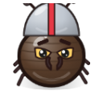 [General Roach](MONSTERS.md#boss-roach_general), 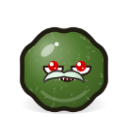 [Mold Elder](MONSTERS.md#boss-mold_elder),  [Greasy Pan](MONSTERS.md#boss-greasy_pan),  [Fork Knight](MONSTERS.md#boss-fork_knight),  [Lord of the Flies](MONSTERS.md#boss-fly_swarm_king),  [Rotten Onion](MONSTERS.md#boss-rotten_onion) |
| Boss pool | 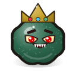 [Mold King](MONSTERS.md#boss-mold_king),  [Grease Chef](MONSTERS.md#boss-grease_chef), 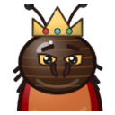 [Roach Emperor](MONSTERS.md#boss-cockroach_emperor) |

**Monster pool**

| Monster | Waves | Weight |
| --- | --- | --- |
| 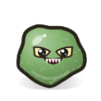 [Mold Blob](MONSTERS.md#enemy-mold) | 1+ | 10 (16%) |
| 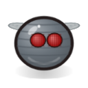 [Fruit Fly](MONSTERS.md#enemy-fly) | 2+ | 5 (8%) |
| 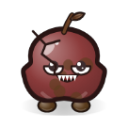 [Rotten Apple](MONSTERS.md#enemy-rotten_apple) | 3+ | 4 (7%) |
| 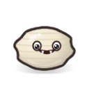 [Maggot](MONSTERS.md#enemy-maggot) | 4+ | 4 (7%) |
| 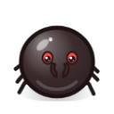 [Army Ant](MONSTERS.md#enemy-ant) | 6+ | 3 (5%) |
| 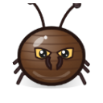 [Cockroach](MONSTERS.md#enemy-cockroach) | 7+ | 3 (5%) |
| 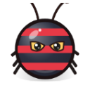 [Bomb Beetle](MONSTERS.md#enemy-beetle) | 9+ | 3 (5%) |
| 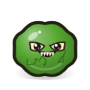 [Split Mold](MONSTERS.md#enemy-splitter) | 11+ | 2 (3%) |
| 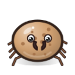 [Crumb Mite](MONSTERS.md#enemy-crumb_mite) | 2+ | 3 (5%) |
| 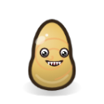 [Grease Drop](MONSTERS.md#enemy-grease_drop) | 2+ | 3 (5%) |
|  [Burnt Toast](MONSTERS.md#enemy-burnt_toast) | 3+ | 3 (5%) |
|  [Dust Bunny](MONSTERS.md#enemy-dust_bunny) | 3+ | 3 (5%) |
|  [Sour Milk Carton](MONSTERS.md#enemy-sour_milk) | 4+ | 3 (5%) |
| 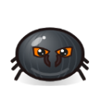 [Pan Beetle](MONSTERS.md#enemy-pan_beetle) | 5+ | 3 (5%) |
|  [Dish Sponge](MONSTERS.md#enemy-sponge_slug) | 6+ | 2 (3%) |
|  [Stink Egg](MONSTERS.md#enemy-stink_egg) | 8+ | 3 (5%) |
| 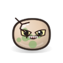 [Moldy Bread](MONSTERS.md#enemy-moldy_bread) | 9+ | 2 (3%) |
| 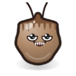 [Teabag Ghost](MONSTERS.md#enemy-teabag_ghost) | 10+ | 2 (3%) |

### Chapter 2 · Wild Garden

> Bugs have overrun the garden. Watch out for the healing toadstools.

| Field | Value |
| --- | --- |
| Difficulty | HP ×1.36 · damage ×1.14 · speed ×1.05 |
| Terrain | Rabbit Holes: Rabbits scurry around; defeat them for Seeds and fruit Gophers: Pop out of burrows to throw rocks Sprinklers: Periodically spray water, Soaking players and monsters in range (Move and Attack Speed reduced) |
| Elite pool |  [Captain Rat](MONSTERS.md#boss-rat_captain),  [Tank Snail](MONSTERS.md#boss-snail_tank),  [Queen Bee](MONSTERS.md#boss-queen_bee), 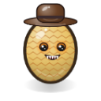 [Evil Scarecrow](MONSTERS.md#boss-scarecrow), 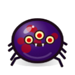 [Spider Matron](MONSTERS.md#boss-spider_matron),  [Shroom King](MONSTERS.md#boss-mushroom_king) |
| Boss pool | 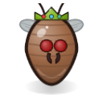 [Locust Queen](MONSTERS.md#boss-locust_queen),  [Rotten Pumpkin King](MONSTERS.md#boss-rotten_pumpkin),  [General Mole](MONSTERS.md#boss-mole_general) |

**Monster pool**

| Monster | Waves | Weight |
| --- | --- | --- |
|  [Mold Blob](MONSTERS.md#enemy-mold) | 1~8 | 8 (12%) |
|  [Army Ant](MONSTERS.md#enemy-ant) | 3+ | 4 (6%) |
|  [Fruit Fly](MONSTERS.md#enemy-fly) | 1+ | 5 (7%) |
|  [Snot Snail](MONSTERS.md#enemy-snail) | 2+ | 4 (6%) |
| 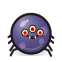 [Venom Spider](MONSTERS.md#enemy-spider) | 5+ | 3 (4%) |
|  [Toxic Shroom](MONSTERS.md#enemy-mushroom) | 5+ | 2 (3%) |
|  [Split Mold](MONSTERS.md#enemy-splitter) | 6+ | 3 (4%) |
| 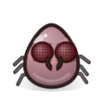 [Brood Mother](MONSTERS.md#enemy-brood) | 8+ | 2 (3%) |
|  [Bomb Beetle](MONSTERS.md#enemy-beetle) | 10+ | 3 (4%) |
| 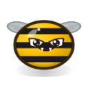 [Venom Bee](MONSTERS.md#enemy-bee) | 4+ | 3 (4%) |
| 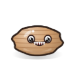 [Mud Worm](MONSTERS.md#enemy-worm) | 4+ | 3 (4%) |
| 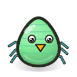 [Aphid](MONSTERS.md#enemy-aphid) | 2+ | 4 (6%) |
|  [Cabbage Worm](MONSTERS.md#enemy-caterpillar) | 2+ | 3 (4%) |
| 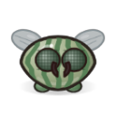 [Locust](MONSTERS.md#enemy-locust) | 3+ | 3 (4%) |
| 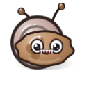 [Garden Slug](MONSTERS.md#enemy-garden_slug) | 4+ | 3 (4%) |
| 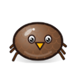 [Weevil](MONSTERS.md#enemy-weevil) | 5+ | 3 (4%) |
| 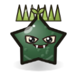 [Thorn Weed](MONSTERS.md#enemy-thorn_weed) | 6+ | 3 (4%) |
| 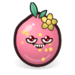 [Toxic Bloom](MONSTERS.md#enemy-pollen_bloom) | 7+ | 2 (3%) |
| 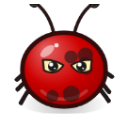 [Boom Ladybug](MONSTERS.md#enemy-ladybug_bomb) | 8+ | 3 (4%) |
| 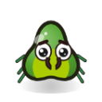 [Blade Mantis](MONSTERS.md#enemy-mantis) | 9+ | 3 (4%) |
| 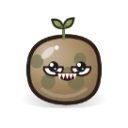 [Rotten Potato](MONSTERS.md#enemy-rotten_potato) | 10+ | 2 (3%) |

### Chapter 3 · Frozen Fridge

> Inside the chilly fridge, ice crystals will slow you down.

| Field | Value |
| --- | --- |
| Difficulty | HP ×1.84 · damage ×1.3 · speed ×1.1 |
| Terrain | Ice Floor: Slippery on ice, but you move faster Cold Wind: Periodic gusts push all units and slow them |
| Elite pool | 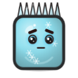 [Ice Golem](MONSTERS.md#boss-ice_golem), 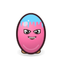 [Popsicle Twins](MONSTERS.md#boss-popsicle_twins),  [Frozen Fish Samurai](MONSTERS.md#boss-frozen_fish),  [Snow Rat Assassin](MONSTERS.md#boss-snow_rat), 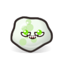 [Spoiled Milk Slime](MONSTERS.md#boss-milk_slime),  [Frost Penguin](MONSTERS.md#boss-frost_penguin) |
| Boss pool |  [Frost Rat King](MONSTERS.md#boss-frost_rat_king), 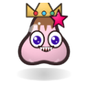 [Ice Cream Tyrant](MONSTERS.md#boss-ice_cream_tyrant),  [Freezer Heart](MONSTERS.md#boss-freezer_heart) |

**Monster pool**

| Monster | Waves | Weight |
| --- | --- | --- |
|  [Mold Blob](MONSTERS.md#enemy-mold) | 1~6 | 8 (12%) |
|  [Fruit Fly](MONSTERS.md#enemy-fly) | 1+ | 4 (6%) |
|  [Ice Cube](MONSTERS.md#enemy-ice_cube) | 3+ | 3 (4%) |
|  [Sewer Rat](MONSTERS.md#enemy-rat) | 7+ | 3 (4%) |
|  [Maggot](MONSTERS.md#enemy-maggot) | 3+ | 4 (6%) |
|  [Venom Spider](MONSTERS.md#enemy-spider) | 6+ | 3 (4%) |
|  [Cockroach](MONSTERS.md#enemy-cockroach) | 5+ | 3 (4%) |
|  [Toxic Shroom](MONSTERS.md#enemy-mushroom) | 7+ | 2 (3%) |
|  [Split Mold](MONSTERS.md#enemy-splitter) | 9+ | 3 (4%) |
| 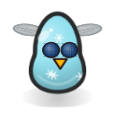 [Frost Mosquito](MONSTERS.md#enemy-frost_mosquito) | 4+ | 3 (4%) |
|  [Frozen Shrimp](MONSTERS.md#enemy-frozen_shrimp) | 6+ | 3 (4%) |
| 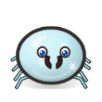 [Frost Mite](MONSTERS.md#enemy-frost_mite) | 2+ | 4 (6%) |
| 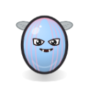 [Popsicle Bat](MONSTERS.md#enemy-popsicle_bat) | 2+ | 3 (4%) |
|  [Frozen Pea](MONSTERS.md#enemy-frozen_pea) | 3+ | 3 (4%) |
|  [Jelly Cube](MONSTERS.md#enemy-jelly_cube) | 4+ | 3 (4%) |
| 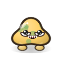 [Moldy Cheese](MONSTERS.md#enemy-moldy_cheese) | 5+ | 3 (4%) |
| 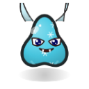 [Icicle Imp](MONSTERS.md#enemy-icicle_imp) | 6+ | 3 (4%) |
| 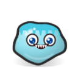 [Ice Slime](MONSTERS.md#enemy-ice_slime) | 7+ | 3 (4%) |
| 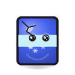 [Frozen Soda](MONSTERS.md#enemy-frozen_soda) | 8+ | 3 (4%) |
| 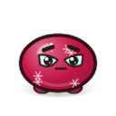 [Freezer Burn](MONSTERS.md#enemy-freezer_burn) | 9+ | 2 (3%) |
|  [Leftover Box](MONSTERS.md#enemy-leftover_box) | 10+ | 2 (3%) |

### Chapter 4 · City Junkyard

> Among mountains of garbage, the most disgusting monsters are born.

| Field | Value |
| --- | --- |
| Difficulty | HP ×2.5 · damage ×1.49 · speed ×1.15 |
| Terrain | Quicksand Pit: Pulls players and monsters toward the center and deals damage Falling Trash: Watch for warning circles on the ground Acid Leak: Acid pools bubble up near you, dealing damage and inflicting Corrode |
| Elite pool |  [Tire Beast](MONSTERS.md#boss-tire_beast), 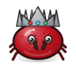 [Can King](MONSTERS.md#boss-can_king),  [Rag Wraith](MONSTERS.md#boss-rag_wraith),  [Leaky Battery Bug](MONSTERS.md#boss-battery_bug), 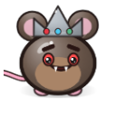 [Garbage Rat King](MONSTERS.md#boss-garbage_rat),  [Oil Titan](MONSTERS.md#boss-oil_titan) |
| Boss pool | 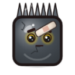 [Trash Colossus](MONSTERS.md#boss-trash_golem),  [Toxic Barrel Fiend](MONSTERS.md#boss-toxic_barrel), 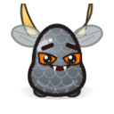 [Scrap Dragon](MONSTERS.md#boss-scrap_dragon) |

**Monster pool**

| Monster | Waves | Weight |
| --- | --- | --- |
|  [Mold Blob](MONSTERS.md#enemy-mold) | 1~5 | 8 (11%) |
|  [Sewer Rat](MONSTERS.md#enemy-rat) | 5+ | 5 (7%) |
|  [Cockroach](MONSTERS.md#enemy-cockroach) | 3+ | 4 (5%) |
|  [Trash Bag](MONSTERS.md#enemy-trash_bag) | 5+ | 4 (5%) |
|  [Bomb Beetle](MONSTERS.md#enemy-beetle) | 6+ | 4 (5%) |
|  [Brood Mother](MONSTERS.md#enemy-brood) | 5+ | 2 (3%) |
|  [Rotten Apple](MONSTERS.md#enemy-rotten_apple) | 2+ | 3 (4%) |
|  [Snot Snail](MONSTERS.md#enemy-snail) | 6+ | 3 (4%) |
|  [Toxic Shroom](MONSTERS.md#enemy-mushroom) | 8+ | 2 (3%) |
| 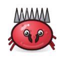 [Can Crab](MONSTERS.md#enemy-can_crab) | 7+ | 3 (4%) |
|  [Rag Ghost](MONSTERS.md#enemy-rag_ghost) | 5+ | 3 (4%) |
|  [Grease Blob](MONSTERS.md#enemy-oil_blob) | 6+ | 3 (4%) |
|  [Rusty Nail](MONSTERS.md#enemy-rusty_nail) | 2+ | 4 (5%) |
|  [Bag Ghost](MONSTERS.md#enemy-bag_ghost) | 3+ | 3 (4%) |
|  [Glass Shard](MONSTERS.md#enemy-glass_shard) | 3+ | 3 (4%) |
|  [Scrap Drone](MONSTERS.md#enemy-scrap_drone) | 4+ | 3 (4%) |
|  [Oil Slick](MONSTERS.md#enemy-oil_slick) | 5+ | 3 (4%) |
|  [Leaky Battery](MONSTERS.md#enemy-battery_mite) | 6+ | 3 (4%) |
|  [Rust Crab](MONSTERS.md#enemy-rust_crab) | 7+ | 3 (4%) |
|  [Tire Roller](MONSTERS.md#enemy-tire_roller) | 8+ | 3 (4%) |
|  [Busted Radio](MONSTERS.md#enemy-junk_radio) | 9+ | 2 (3%) |
|  [Junk Heap](MONSTERS.md#enemy-junk_heap) | 11+ | 2 (3%) |

### Chapter 5 · Ketchup Factory

> The source of all rot. Defeat the Rotten Chef and save Ketchup Town!

| Field | Value |
| --- | --- |
| Difficulty | HP ×3.4 · damage ×1.7 · speed ×1.2 |
| Terrain | Conveyor Belts: Push all units standing on them Steam Valves: Periodically blast scalding steam Air Vents: Stand on a vent to gain Tailwind (more Move Speed and Dodge); monsters get blown away |
| Elite pool |  [Conveyor Worm](MONSTERS.md#boss-conveyor_worm),  [Ketchup Golem](MONSTERS.md#boss-ketchup_golem),  [Security Bot](MONSTERS.md#boss-security_bot),  [Stamping Press](MONSTERS.md#boss-press_machine),  [Rotten Sous Chef](MONSTERS.md#boss-chef_minion),  [Furnace Imp](MONSTERS.md#boss-furnace_imp) |
| Boss pool |  [Rotten Chef](MONSTERS.md#boss-rotten_chef),  [Factory Core](MONSTERS.md#boss-factory_core),  [Ketchup Leviathan](MONSTERS.md#boss-ketchup_leviathan) |

**Monster pool**

| Monster | Waves | Weight |
| --- | --- | --- |
|  [Mold Blob](MONSTERS.md#enemy-mold) | 1~4 | 8 (10%) |
|  [Fruit Fly](MONSTERS.md#enemy-fly) | 1~6 | 4 (5%) |
|  [Can Bot](MONSTERS.md#enemy-robot_can) | 3+ | 4 (5%) |
|  [Sewer Rat](MONSTERS.md#enemy-rat) | 5+ | 5 (6%) |
|  [Bomb Beetle](MONSTERS.md#enemy-beetle) | 6+ | 4 (5%) |
|  [Venom Spider](MONSTERS.md#enemy-spider) | 5+ | 3 (4%) |
|  [Trash Bag](MONSTERS.md#enemy-trash_bag) | 5+ | 3 (4%) |
|  [Ice Cube](MONSTERS.md#enemy-ice_cube) | 4+ | 3 (4%) |
|  [Toxic Shroom](MONSTERS.md#enemy-mushroom) | 5+ | 2 (3%) |
|  [Brood Mother](MONSTERS.md#enemy-brood) | 6+ | 2 (3%) |
|  [Split Mold](MONSTERS.md#enemy-splitter) | 7+ | 3 (4%) |
|  [Gear Bug](MONSTERS.md#enemy-gear_bug) | 4+ | 3 (4%) |
|  [Curse Doll](MONSTERS.md#enemy-curse_doll) | 5+ | 3 (4%) |
|  [Sauce Drip](MONSTERS.md#enemy-sauce_drip) | 2+ | 4 (5%) |
|  [Belt Gremlin](MONSTERS.md#enemy-conveyor_gremlin) | 2+ | 3 (4%) |
|  [Cap Drone](MONSTERS.md#enemy-cap_drone) | 3+ | 3 (4%) |
|  [Steam Imp](MONSTERS.md#enemy-steam_imp) | 4+ | 3 (4%) |
|  [Label Ghost](MONSTERS.md#enemy-label_ghost) | 5+ | 3 (4%) |
|  [Welder Bug](MONSTERS.md#enemy-welder_bug) | 6+ | 3 (4%) |
|  [Rivet Bot](MONSTERS.md#enemy-rivet_bot) | 7+ | 3 (4%) |
|  [Ketchup Slime](MONSTERS.md#enemy-ketchup_slime) | 8+ | 3 (4%) |
|  [Press Piston](MONSTERS.md#enemy-press_piston) | 9+ | 3 (4%) |
|  [Bottling Bot](MONSTERS.md#enemy-bottling_bot) | 11+ | 2 (3%) |

### Chapter 6 · Rotting Greenhouse

> In the steamy glass greenhouse, the veggies are rotting one by one. Only Danger 5 veterans may enter.

| Field | Value |
| --- | --- |
| Difficulty | HP ×4.62 · damage ×1.94 · speed ×1.25 |
| Terrain | Spore Vents: The ground periodically puffs Poison spore clouds Compost Pits: Blight Sprouts crawl out periodically Grow Lamps: Players and monsters in the light become Hardened (more Armor, less damage taken); lamps move periodically |
| Elite pool |  [Pumpkin Brute](MONSTERS.md#boss-pumpkin_brute),  [Spore Matron](MONSTERS.md#boss-spore_matron) |
| Boss pool |  [Blight Gardener](MONSTERS.md#boss-blight_gardener) |

**Monster pool**

| Monster | Waves | Weight |
| --- | --- | --- |
|  [Blight Sprout](MONSTERS.md#enemy-blight_sprout) | 1~5 | 8 (12%) |
|  [Fruit Fly](MONSTERS.md#enemy-fly) | 1~6 | 4 (6%) |
|  [Aphid](MONSTERS.md#enemy-aphid) | 1~7 | 3 (5%) |
|  [Fungus Gnat](MONSTERS.md#enemy-fungus_gnat) | 2+ | 4 (6%) |
|  [Sweaty Cucumber](MONSTERS.md#enemy-slime_cucumber) | 3+ | 3 (5%) |
|  [Rotten Chili](MONSTERS.md#enemy-rot_chili) | 3+ | 3 (5%) |
|  [Garden Slug](MONSTERS.md#enemy-garden_slug) | 3+ | 3 (5%) |
|  [Spore Puffball](MONSTERS.md#enemy-spore_puff) | 4+ | 3 (5%) |
|  [Thorn Weed](MONSTERS.md#enemy-thorn_weed) | 4+ | 3 (5%) |
|  [Rot Vine](MONSTERS.md#enemy-vine_lasher) | 5+ | 3 (5%) |
|  [Venom Spider](MONSTERS.md#enemy-spider) | 5+ | 3 (5%) |
|  [Toxic Shroom](MONSTERS.md#enemy-mushroom) | 5+ | 2 (3%) |
|  [Bomb Beetle](MONSTERS.md#enemy-beetle) | 6+ | 3 (5%) |
|  [Toxic Bloom](MONSTERS.md#enemy-pollen_bloom) | 6+ | 2 (3%) |
|  [Sewer Rat](MONSTERS.md#enemy-rat) | 6+ | 3 (5%) |
|  [Moldy Pumpkin](MONSTERS.md#enemy-moldy_pumpkin) | 7+ | 3 (5%) |
|  [Split Mold](MONSTERS.md#enemy-splitter) | 7+ | 2 (3%) |
|  [Blade Mantis](MONSTERS.md#enemy-mantis) | 8+ | 3 (5%) |
|  [Rivet Bot](MONSTERS.md#enemy-rivet_bot) | 8+ | 2 (3%) |
|  [Compost Bin](MONSTERS.md#enemy-compost_heap) | 9+ | 2 (3%) |
|  [Ketchup Slime](MONSTERS.md#enemy-ketchup_slime) | 10+ | 2 (3%) |
|  [Press Piston](MONSTERS.md#enemy-press_piston) | 11+ | 2 (3%) |

### Chapter 7 · Rot Garden

> [Hidden Chapter] Where all rot truly began. Break through to face the Rot King.

| Field | Value |
| --- | --- |
| Difficulty | HP ×6.27 · damage ×2.22 · speed ×1.3 |
| Terrain | Rot Mire: Pulls players and monsters toward the center and spreads Rot Falling Rotten Fruit: Watch for warning circles on the ground Brambles: Thorns burst from under your feet, dealing damage and inflicting Bleed and Corrode |
| Elite pool |  [Carrot Revenant](MONSTERS.md#boss-carrot_knight),  [Onion Witch](MONSTERS.md#boss-onion_witch) |
| Boss pool |  [Mother of Rot](MONSTERS.md#boss-rot_mother),  [Rot King](MONSTERS.md#boss-rot_king) |

**Monster pool**

| Monster | Waves | Weight |
| --- | --- | --- |
|  [Blight Sprout](MONSTERS.md#enemy-blight_sprout) | 1~5 | 8 (13%) |
|  [Fungus Gnat](MONSTERS.md#enemy-fungus_gnat) | 1+ | 4 (7%) |
|  [Cabbage Worm](MONSTERS.md#enemy-caterpillar) | 1~8 | 3 (5%) |
|  [Rotheart Cabbage](MONSTERS.md#enemy-rot_cabbage) | 2+ | 4 (7%) |
|  [Zombie Carrot](MONSTERS.md#enemy-zombie_carrot) | 3+ | 3 (5%) |
|  [Spore Puffball](MONSTERS.md#enemy-spore_puff) | 3+ | 3 (5%) |
|  [Sweaty Cucumber](MONSTERS.md#enemy-slime_cucumber) | 3+ | 2 (3%) |
|  [Blight Onion](MONSTERS.md#enemy-blight_onion) | 4+ | 3 (5%) |
|  [Rotten Chili](MONSTERS.md#enemy-rot_chili) | 4+ | 3 (5%) |
|  [Rot Vine](MONSTERS.md#enemy-vine_lasher) | 4+ | 3 (5%) |
|  [Weevil](MONSTERS.md#enemy-weevil) | 5+ | 3 (5%) |
|  [Blade Mantis](MONSTERS.md#enemy-mantis) | 5+ | 3 (5%) |
|  [Rot Sprinkler](MONSTERS.md#enemy-rot_sprinkler) | 6+ | 2 (3%) |
|  [Moldy Pumpkin](MONSTERS.md#enemy-moldy_pumpkin) | 6+ | 3 (5%) |
|  [Boom Ladybug](MONSTERS.md#enemy-ladybug_bomb) | 6+ | 2 (3%) |
|  [Toxic Shroom](MONSTERS.md#enemy-mushroom) | 6+ | 2 (3%) |
|  [Rotten Potato](MONSTERS.md#enemy-rotten_potato) | 7+ | 2 (3%) |
|  [Compost Bin](MONSTERS.md#enemy-compost_heap) | 8+ | 2 (3%) |
|  [Ketchup Slime](MONSTERS.md#enemy-ketchup_slime) | 9+ | 2 (3%) |
|  [Rivet Bot](MONSTERS.md#enemy-rivet_bot) | 9+ | 2 (3%) |
|  [Press Piston](MONSTERS.md#enemy-press_piston) | 10+ | 2 (3%) |

## Endless Mode

After clearing a chapter, its Endless mode can be turned on from the character screen: after the chapter's last wave there is no limit, in 15-wave cycles (elites on waves 5/10, a boss on 15), elites and bosses rerolled every cycle, bosses from every chapter from the second endless cycle. After the chapter's last wave, monster HP ×1.12 and damage ×1.09 per wave (compounding); income keeps pace with shop prices. It ends when you fall.

## Daily / Weekly Challenges

A date seed decides the character, chapter and rule modifiers, and also the shops, level-up choices, crates, elites and bosses — everyone faces the same rolls on the same day (week). Characters are lent for the challenge; your personal best is recorded.

- **Daily**: a random chapter 1–3 · 15 waves · 2 modifiers; score = wave×200 + kills + level×20, plus 3000 and a time bonus on a clear
- **Weekly**: a random chapter 2–5 · Endless · 3 modifiers; score = wave×500 + kills

| Modifier | Effect |
| --- | --- |
| 💨 Swift Horde | Monsters move 25% faster |
| 🍷 Glass Cannon | +40% all damage, -40% max HP |
| 🥊 Melee Day | The shop only sells melee weapons |
| 🏹 Ranged Day | The shop only sells ranged weapons |
| 🔮 Elemental Day | The shop only sells elemental weapons |
| 💰 Silver Spoon | Start with +150 Seeds, shop prices +25% |
| ✨ Champion Rush | Affixed champions appear 3× as often |
| 🗿 Land of Giants | Monsters have +50% HP and move 15% slower |
| 🐜 Swarm | +40% spawns, -25% monster HP |
| 🧛 Night of Fangs | +10% Life Steal Chance, but HP Regen does nothing |
| 🎯 One Shot | One reroll per shop, but it is free |
| 🍀 Lucky Day | +60 Luck |
| 📚 Scholar | +100% XP gain |
| 👹 Tough Foes | Elites and bosses have +50% HP |
| 🌟 Skill Party | -50% skill cooldown |

---

[README](../../README.en.md) · [Characters](CHARACTERS.md) · [Skills](SKILLS.md) · [Weapons](WEAPONS.md) · [Items](ITEMS.md) · [Monsters](MONSTERS.md) · **Chapters** · [Achievements](ACHIEVEMENTS.md) · [Talents](TALENTS.md) · [Relics](RELICS.md) · [Danger](DANGER.md) · [Quests](QUESTS.md) · [Design Doc](GDD.md) · [Data Tables](DATA_TABLES.md) · [Changelog](CHANGELOG.md)
