# Skills & Status Effects

[中文](../SKILLS.md) · **English**

[README](../../README.en.md) · [Characters](CHARACTERS.md) · **Skills** · [Weapons](WEAPONS.md) · [Items](ITEMS.md) · [Monsters](MONSTERS.md) · [Chapters](CHAPTERS.md) · [Achievements](ACHIEVEMENTS.md) · [Talents](TALENTS.md) · [Relics](RELICS.md) · [Danger](DANGER.md) · [Quests](QUESTS.md) · [Design Doc](GDD.md) · [Data Tables](DATA_TABLES.md) · [Changelog](CHANGELOG.md)

> Generated by `npm run docs` from `src/data/*.ts`. Do not edit by hand.

Every [character](CHARACTERS.md) has one active skill (Space on PC / bottom-right button on mobile). Skills come in 13 forms; cooldowns are computed automatically from their power.

Buffs and debuffs from monsters, items and weapons share the same [status effects](#statuses) as skills.

## Contents

- [Rules](#rules)
- [Skill Forms](#forms)
- [Character Skills](#skills)
  - [Ketchup Burst (Tomato Sister)](#skill-tomato)
  - [Knight Charge (Carrot Knight)](#skill-carrot)
  - [Flame Nova (Chili Sis)](#skill-chili)
  - [Popcorn Barrage (Corn Gunner)](#skill-corn)
  - [Melon Roll (Chubby Melon)](#skill-watermelon)
  - [Sour Mist (Lemon Assassin)](#skill-lemon)
  - [Purple Thunder (Eggplant Mage)](#skill-eggplant)
  - [Blood Domain (Count Garlic)](#skill-garlic)
  - [Twin Clone (Blueberry Twins)](#skill-blueberry)
  - [Golden Cannon (Captain Pineapple)](#skill-pineapple)
  - [Spirit Form (Pumpkin Ghost)](#skill-pumpkin)
  - [Fan Cheer (Strawberry Idol)](#skill-strawberry)
  - [Shadow Slash (Ginger Ninja)](#skill-ginger)
  - [Core Overload (Dr. Avocado)](#skill-avocado)
  - [Tear Gas Zone (Uncle Onion)](#skill-onion)
  - [Spore Cloud (Mushroom Shaman)](#skill-mushroom)
  - [Ground Pound (Coconut Boxer)](#skill-coconut)
  - [Grape Clone (Grape Magician)](#skill-grape)
  - [Dual Barrage (Cherry Gunslinger)](#skill-cherry)
  - [Pea Turret (Pea Soldier)](#skill-pea)
  - [Angel’s Blessing (Peach Angel)](#skill-peach)
  - [Dragonflame Charge (Dragonfruit Rider)](#skill-dragonfruit)
  - [Frenzy (Beet Berserker)](#skill-beet)
  - [Heartpiercer (Asparagus Archer)](#skill-asparagus)
  - [Roast Yam Feast (Chef Yam)](#skill-sweetpotato)
  - [One Truth (Kiwi Detective)](#skill-kiwi)
  - [Princess’s Luck (Lychee Princess)](#skill-lychee)
  - [Stink Bomb (Durian Overlord)](#skill-durian)
  - [Drone Support (Pepper Mech)](#skill-bellpepper)
  - [Golden Bell (Monk Gourd)](#skill-wintermelon)
  - [Frozen Domain (Bitter Melon Mage)](#skill-bittermelon)
  - [Growth Spurt (Sprout Apprentice)](#skill-sprout)
  - [Wasabi Nuke (Wasabi Bomber)](#skill-wasabi)
  - [Bean Troops (Strategist Soy)](#skill-soybean)
  - [Thousand Spikes (Jackfruit Guard)](#skill-jackfruit)
  - [Seed Burst (Pomegranate Gunner)](#skill-pomegranate)
  - [Taro Paste Field (Taro Mystic)](#skill-taro)
  - [Steadfast Body (Cabbage Veteran)](#skill-cabbage)
  - [Withering Hex (Blackberry Witch)](#skill-blackberry)
- [Status Effects (32)](#statuses)
  - [Debuffs](#statuses-debuff)
  - [Buffs](#statuses-buff)

## Rules

- Damage = average hit damage of all current weapons × skill multiplier × (1 + Skill Damage%)
- Area = base radius × (1 + Range/600, clamped 0.8–1.4) × (1 + Skill Area%)
- Durations (fields, buffs, invulnerability, clones, applied statuses) × (1 + Skill Duration%)
- Cooldown × (1 − Skill Cooldown%, at most −70%); cooldowns reset at the start of every wave
- Cooldown is computed from power: `cooldown = (8 + 0.9×damage score + control score + buff score) × 0.65`, clamped to 8–30s (`src/data/skills.ts`)
- Skills auto-cast by default, timed by form (area skills when enemies cluster, heals when hurt, defensive skills in danger); switch to manual in Settings — you can still cast manually in auto mode
- Skill stats (Skill Damage / Area / Duration / Cooldown) come from [items](ITEMS.md) (the skill book and skill talisman series) and level-up choices

## Skill Forms

| Form | Characters |
| --- | --- |
| Nova Burst `nova` | [Ketchup Burst](#skill-tomato), [Flame Nova](#skill-chili), [Ground Pound](#skill-coconut) |
| Dash `dash` | [Knight Charge](#skill-carrot), [Melon Roll](#skill-watermelon), [Shadow Slash](#skill-ginger), [Dragonflame Charge](#skill-dragonfruit) |
| Self Buff `buff` | [Fan Cheer](#skill-strawberry), [Frenzy](#skill-beet), [Princess’s Luck](#skill-lychee), [Growth Spurt](#skill-sprout), [Thousand Spikes](#skill-jackfruit), [Steadfast Body](#skill-cabbage) |
| Stealth `ghost` | [Sour Mist](#skill-lemon), [Spirit Form](#skill-pumpkin), [Golden Bell](#skill-wintermelon) |
| Ring Barrage `ring` | [Popcorn Barrage](#skill-corn), [Seed Burst](#skill-pomegranate) |
| Drain Heal `heal` | [Blood Domain](#skill-garlic), [Angel’s Blessing](#skill-peach), [Roast Yam Feast](#skill-sweetpotato) |
| Multi-Strike `strikes` | [Core Overload](#skill-avocado) |
| Summon Clone `clone` | [Twin Clone](#skill-blueberry), [Grape Clone](#skill-grape), [Drone Support](#skill-bellpepper), [Bean Troops](#skill-soybean) |
| Focused Barrage `barrage` | [Dual Barrage](#skill-cherry), [Pea Turret](#skill-pea), [Heartpiercer](#skill-asparagus) |
| AOE Missile `missile` | [Golden Cannon](#skill-pineapple), [Wasabi Nuke](#skill-wasabi) |
| Screen Clear `screen` | [Purple Thunder](#skill-eggplant) |
| Binding Field `field` | [Tear Gas Zone](#skill-onion), [Frozen Domain](#skill-bittermelon), [Taro Paste Field](#skill-taro) |
| Mass Debuff `curse` | [Spore Cloud](#skill-mushroom), [One Truth](#skill-kiwi), [Stink Bomb](#skill-durian), [Withering Hex](#skill-blackberry) |

## Character Skills

<table>
<tr><td rowspan="8" align="center" valign="middle">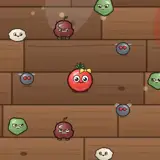</td><th colspan="2" align="left">Ketchup Burst (Tomato Sister)</th></tr>
<tr><td colspan="2"><i>Splatter ketchup everywhere, damaging and slowing enemies.</i></td></tr>
<tr><td nowrap>Character</td><td><a href="CHARACTERS.md#char-tomato">Tomato Sister</a></td></tr>
<tr><td nowrap>Form</td><td>Nova Burst</td></tr>
<tr><td nowrap>Cooldown</td><td>17s</td></tr>
<tr><td nowrap>Damage multiplier</td><td>×2.2</td></tr>
<tr><td nowrap>Radius</td><td>180</td></tr>
<tr><td nowrap>Inflicts</td><td>3× <a href="#status-slow">Slow</a> 3s</td></tr>
</table>

<table>
<tr><td rowspan="8" align="center" valign="middle"></td><th colspan="2" align="left">Knight Charge (Carrot Knight)</th></tr>
<tr><td colspan="2"><i>An invulnerable charge that stuns every enemy in its path.</i></td></tr>
<tr><td nowrap>Character</td><td><a href="CHARACTERS.md#char-carrot">Carrot Knight</a></td></tr>
<tr><td nowrap>Form</td><td>Dash</td></tr>
<tr><td nowrap>Cooldown</td><td>11s</td></tr>
<tr><td nowrap>Damage multiplier</td><td>×2</td></tr>
<tr><td nowrap>Dash distance</td><td>320</td></tr>
<tr><td nowrap>Inflicts</td><td><a href="#status-stun">Stun</a> 0.8s</td></tr>
</table>

<table>
<tr><td rowspan="8" align="center" valign="middle">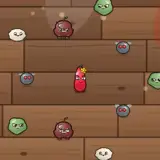</td><th colspan="2" align="left">Flame Nova (Chili Sis)</th></tr>
<tr><td colspan="2"><i>A fiery shockwave that applies 3 stacks of Burn.</i></td></tr>
<tr><td nowrap>Character</td><td><a href="CHARACTERS.md#char-chili">Chili Sis</a></td></tr>
<tr><td nowrap>Form</td><td>Nova Burst</td></tr>
<tr><td nowrap>Cooldown</td><td>20s</td></tr>
<tr><td nowrap>Damage multiplier</td><td>×2.2</td></tr>
<tr><td nowrap>Radius</td><td>200</td></tr>
<tr><td nowrap>Inflicts</td><td>3× <a href="#status-burn">Burn</a> 4s</td></tr>
</table>

<table>
<tr><td rowspan="7" align="center" valign="middle">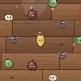</td><th colspan="2" align="left">Popcorn Barrage (Corn Gunner)</th></tr>
<tr><td colspan="2"><i>Fire 18 popcorn shots in all directions.</i></td></tr>
<tr><td nowrap>Character</td><td><a href="CHARACTERS.md#char-corn">Corn Gunner</a></td></tr>
<tr><td nowrap>Form</td><td>Ring Barrage</td></tr>
<tr><td nowrap>Cooldown</td><td>8s</td></tr>
<tr><td nowrap>Damage multiplier</td><td>×0.7</td></tr>
<tr><td nowrap>Count</td><td>18</td></tr>
</table>

<table>
<tr><td rowspan="8" align="center" valign="middle">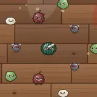</td><th colspan="2" align="left">Melon Roll (Chubby Melon)</th></tr>
<tr><td colspan="2"><i>Roll into enemies and restore 4.5% Max HP.</i></td></tr>
<tr><td nowrap>Character</td><td><a href="CHARACTERS.md#char-watermelon">Chubby Melon</a></td></tr>
<tr><td nowrap>Form</td><td>Dash</td></tr>
<tr><td nowrap>Cooldown</td><td>13s</td></tr>
<tr><td nowrap>Damage multiplier</td><td>×2</td></tr>
<tr><td nowrap>Dash distance</td><td>260</td></tr>
<tr><td nowrap>Heal</td><td>4.5% Max HP</td></tr>
</table>

<table>
<tr><td rowspan="7" align="center" valign="middle">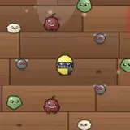</td><th colspan="2" align="left">Sour Mist (Lemon Assassin)</th></tr>
<tr><td colspan="2"><i>Turn invisible for 3s (Invulnerable) and gain +50% Crit Chance.</i></td></tr>
<tr><td nowrap>Character</td><td><a href="CHARACTERS.md#char-lemon">Lemon Assassin</a></td></tr>
<tr><td nowrap>Form</td><td>Stealth</td></tr>
<tr><td nowrap>Cooldown</td><td>11s</td></tr>
<tr><td nowrap>Duration</td><td>2.5s</td></tr>
<tr><td nowrap>Stat boost</td><td>+50% Crit Chance, +10 Move Speed</td></tr>
</table>

<table>
<tr><td rowspan="7" align="center" valign="middle"></td><th colspan="2" align="left">Purple Thunder (Eggplant Mage)</th></tr>
<tr><td colspan="2"><i>Lightning blankets the screen, striking every enemy and briefly Stunning them.</i></td></tr>
<tr><td nowrap>Character</td><td><a href="CHARACTERS.md#char-eggplant">Eggplant Mage</a></td></tr>
<tr><td nowrap>Form</td><td>Screen Clear</td></tr>
<tr><td nowrap>Cooldown</td><td>14s</td></tr>
<tr><td nowrap>Damage multiplier</td><td>×0.9</td></tr>
<tr><td nowrap>Inflicts</td><td><a href="#status-stun">Stun</a> 0.4s</td></tr>
</table>

<table>
<tr><td rowspan="9" align="center" valign="middle"></td><th colspan="2" align="left">Blood Domain (Count Garlic)</th></tr>
<tr><td colspan="2"><i>Drain life from nearby enemies and inflict Bleed.</i></td></tr>
<tr><td nowrap>Character</td><td><a href="CHARACTERS.md#char-garlic">Count Garlic</a></td></tr>
<tr><td nowrap>Form</td><td>Drain Heal</td></tr>
<tr><td nowrap>Cooldown</td><td>14s</td></tr>
<tr><td nowrap>Damage multiplier</td><td>×1</td></tr>
<tr><td nowrap>Radius</td><td>200</td></tr>
<tr><td nowrap>Inflicts</td><td>3× <a href="#status-bleed">Bleed</a> 4s</td></tr>
<tr><td nowrap>Drain</td><td>+0.5 HP per enemy hit (max 6% Max HP)</td></tr>
</table>

<table>
<tr><td rowspan="7" align="center" valign="middle"></td><th colspan="2" align="left">Twin Clone (Blueberry Twins)</th></tr>
<tr><td colspan="2"><i>Summon 2 clones for 8s that attack with all your weapons (50% damage) and block bullets; clones explode when destroyed or expired.</i></td></tr>
<tr><td nowrap>Character</td><td><a href="CHARACTERS.md#char-blueberry">Blueberry Twins</a></td></tr>
<tr><td nowrap>Form</td><td>Summon Clone</td></tr>
<tr><td nowrap>Cooldown</td><td>10s</td></tr>
<tr><td nowrap>Damage multiplier</td><td>×0.45</td></tr>
<tr><td nowrap>Duration</td><td>8s</td></tr>
</table>

<table>
<tr><td rowspan="7" align="center" valign="middle"></td><th colspan="2" align="left">Golden Cannon (Captain Pineapple)</th></tr>
<tr><td colspan="2"><i>Fire a golden cannonball at the densest enemy cluster for a huge explosion. Kills always drop Seeds.</i></td></tr>
<tr><td nowrap>Character</td><td><a href="CHARACTERS.md#char-pineapple">Captain Pineapple</a></td></tr>
<tr><td nowrap>Form</td><td>AOE Missile</td></tr>
<tr><td nowrap>Cooldown</td><td>16s</td></tr>
<tr><td nowrap>Damage multiplier</td><td>×3.2</td></tr>
<tr><td nowrap>Radius</td><td>150</td></tr>
</table>

<table>
<tr><td rowspan="7" align="center" valign="middle"></td><th colspan="2" align="left">Spirit Form (Pumpkin Ghost)</th></tr>
<tr><td colspan="2"><i>Become Invulnerable for 2.5s and gain a big speed boost.</i></td></tr>
<tr><td nowrap>Character</td><td><a href="CHARACTERS.md#char-pumpkin">Pumpkin Ghost</a></td></tr>
<tr><td nowrap>Form</td><td>Stealth</td></tr>
<tr><td nowrap>Cooldown</td><td>11s</td></tr>
<tr><td nowrap>Duration</td><td>2.5s</td></tr>
<tr><td nowrap>Stat boost</td><td>+30 Move Speed</td></tr>
</table>

<table>
<tr><td rowspan="7" align="center" valign="middle">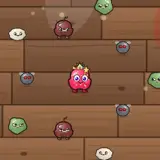</td><th colspan="2" align="left">Fan Cheer (Strawberry Idol)</th></tr>
<tr><td colspan="2"><i>Gain 3 stacks of Haste + 5 stacks of Rage for 6s.</i></td></tr>
<tr><td nowrap>Character</td><td><a href="CHARACTERS.md#char-strawberry">Strawberry Idol</a></td></tr>
<tr><td nowrap>Form</td><td>Self Buff</td></tr>
<tr><td nowrap>Cooldown</td><td>13s</td></tr>
<tr><td nowrap>Duration</td><td>6s</td></tr>
<tr><td nowrap>Self gains</td><td>3× <a href="#status-haste">Haste</a> 6s, 5× <a href="#status-rage">Rage</a> 6s</td></tr>
</table>

<table>
<tr><td rowspan="8" align="center" valign="middle">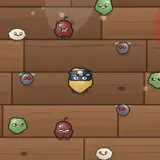</td><th colspan="2" align="left">Shadow Slash (Ginger Ninja)</th></tr>
<tr><td colspan="2"><i>Dash forward with a slash that inflicts Bleed.</i></td></tr>
<tr><td nowrap>Character</td><td><a href="CHARACTERS.md#char-ginger">Ginger Ninja</a></td></tr>
<tr><td nowrap>Form</td><td>Dash</td></tr>
<tr><td nowrap>Cooldown</td><td>11s</td></tr>
<tr><td nowrap>Damage multiplier</td><td>×2</td></tr>
<tr><td nowrap>Dash distance</td><td>360</td></tr>
<tr><td nowrap>Inflicts</td><td>2× <a href="#status-bleed">Bleed</a> 4s</td></tr>
</table>

<table>
<tr><td rowspan="8" align="center" valign="middle"></td><th colspan="2" align="left">Core Overload (Dr. Avocado)</th></tr>
<tr><td colspan="2"><i>Trigger 5 chain explosions.</i></td></tr>
<tr><td nowrap>Character</td><td><a href="CHARACTERS.md#char-avocado">Dr. Avocado</a></td></tr>
<tr><td nowrap>Form</td><td>Multi-Strike</td></tr>
<tr><td nowrap>Cooldown</td><td>11s</td></tr>
<tr><td nowrap>Damage multiplier</td><td>×1.6</td></tr>
<tr><td nowrap>Radius</td><td>90</td></tr>
<tr><td nowrap>Count</td><td>5</td></tr>
</table>

<table>
<tr><td rowspan="9" align="center" valign="middle"></td><th colspan="2" align="left">Tear Gas Zone (Uncle Onion)</th></tr>
<tr><td colspan="2"><i>Release a tear gas zone for 5s that heavily Slows and Blinds enemies inside.</i></td></tr>
<tr><td nowrap>Character</td><td><a href="CHARACTERS.md#char-onion">Uncle Onion</a></td></tr>
<tr><td nowrap>Form</td><td>Binding Field</td></tr>
<tr><td nowrap>Cooldown</td><td>12s</td></tr>
<tr><td nowrap>Damage multiplier</td><td>×0.4</td></tr>
<tr><td nowrap>Radius</td><td>180</td></tr>
<tr><td nowrap>Duration</td><td>5s</td></tr>
<tr><td nowrap>Inflicts</td><td>3× <a href="#status-slow">Slow</a> 1s, <a href="#status-blind">Blind</a> 1s</td></tr>
</table>

<table>
<tr><td rowspan="8" align="center" valign="middle"></td><th colspan="2" align="left">Spore Cloud (Mushroom Shaman)</th></tr>
<tr><td colspan="2"><i>Apply 5 stacks of Poison and 2 stacks of Weaken to enemies in a wide area.</i></td></tr>
<tr><td nowrap>Character</td><td><a href="CHARACTERS.md#char-mushroom">Mushroom Shaman</a></td></tr>
<tr><td nowrap>Form</td><td>Mass Debuff</td></tr>
<tr><td nowrap>Cooldown</td><td>19s</td></tr>
<tr><td nowrap>Damage multiplier</td><td>×0.3</td></tr>
<tr><td nowrap>Radius</td><td>320</td></tr>
<tr><td nowrap>Inflicts</td><td>5× <a href="#status-poison">Poison</a> 6s, 2× <a href="#status-weaken">Weaken</a> 5s</td></tr>
</table>

<table>
<tr><td rowspan="8" align="center" valign="middle"></td><th colspan="2" align="left">Ground Pound (Coconut Boxer)</th></tr>
<tr><td colspan="2"><i>Slam the ground to Stun enemies and inflict Armor Break.</i></td></tr>
<tr><td nowrap>Character</td><td><a href="CHARACTERS.md#char-coconut">Coconut Boxer</a></td></tr>
<tr><td nowrap>Form</td><td>Nova Burst</td></tr>
<tr><td nowrap>Cooldown</td><td>21s</td></tr>
<tr><td nowrap>Damage multiplier</td><td>×2.2</td></tr>
<tr><td nowrap>Radius</td><td>170</td></tr>
<tr><td nowrap>Inflicts</td><td><a href="#status-stun">Stun</a> 1.2s, 3× <a href="#status-armorBreak">Armor Break</a> 6s</td></tr>
</table>

<table>
<tr><td rowspan="7" align="center" valign="middle">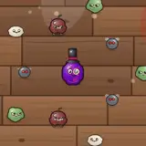</td><th colspan="2" align="left">Grape Clone (Grape Magician)</th></tr>
<tr><td colspan="2"><i>Summon a clone that auto-fires for 8s.</i></td></tr>
<tr><td nowrap>Character</td><td><a href="CHARACTERS.md#char-grape">Grape Magician</a></td></tr>
<tr><td nowrap>Form</td><td>Summon Clone</td></tr>
<tr><td nowrap>Cooldown</td><td>10s</td></tr>
<tr><td nowrap>Damage multiplier</td><td>×0.45</td></tr>
<tr><td nowrap>Duration</td><td>8s</td></tr>
</table>

<table>
<tr><td rowspan="7" align="center" valign="middle">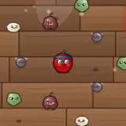</td><th colspan="2" align="left">Dual Barrage (Cherry Gunslinger)</th></tr>
<tr><td colspan="2"><i>Fire 12 bullets in a row at the nearest enemy.</i></td></tr>
<tr><td nowrap>Character</td><td><a href="CHARACTERS.md#char-cherry">Cherry Gunslinger</a></td></tr>
<tr><td nowrap>Form</td><td>Focused Barrage</td></tr>
<tr><td nowrap>Cooldown</td><td>11s</td></tr>
<tr><td nowrap>Damage multiplier</td><td>×0.9</td></tr>
<tr><td nowrap>Count</td><td>12</td></tr>
</table>

<table>
<tr><td rowspan="7" align="center" valign="middle">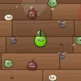</td><th colspan="2" align="left">Pea Turret (Pea Soldier)</th></tr>
<tr><td colspan="2"><i>Rapid-fire 16 peas at the nearest enemy.</i></td></tr>
<tr><td nowrap>Character</td><td><a href="CHARACTERS.md#char-pea">Pea Soldier</a></td></tr>
<tr><td nowrap>Form</td><td>Focused Barrage</td></tr>
<tr><td nowrap>Cooldown</td><td>10s</td></tr>
<tr><td nowrap>Damage multiplier</td><td>×0.6</td></tr>
<tr><td nowrap>Count</td><td>16</td></tr>
</table>

<table>
<tr><td rowspan="10" align="center" valign="middle">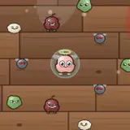</td><th colspan="2" align="left">Angel’s Blessing (Peach Angel)</th></tr>
<tr><td colspan="2"><i>Drain life from nearby enemies, restore 9% Max HP and become Invulnerable for 1.5s.</i></td></tr>
<tr><td nowrap>Character</td><td><a href="CHARACTERS.md#char-peach">Peach Angel</a></td></tr>
<tr><td nowrap>Form</td><td>Drain Heal</td></tr>
<tr><td nowrap>Cooldown</td><td>21s</td></tr>
<tr><td nowrap>Damage multiplier</td><td>×1</td></tr>
<tr><td nowrap>Radius</td><td>150</td></tr>
<tr><td nowrap>Self gains</td><td><a href="#status-invuln">Invulnerable</a> 1.5s</td></tr>
<tr><td nowrap>Heal</td><td>9% Max HP</td></tr>
<tr><td nowrap>Drain</td><td>+0.5 HP per enemy hit (max 6% Max HP)</td></tr>
</table>

<table>
<tr><td rowspan="8" align="center" valign="middle">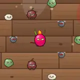</td><th colspan="2" align="left">Dragonflame Charge (Dragonfruit Rider)</th></tr>
<tr><td colspan="2"><i>Charge forward, applying 4 stacks of Burn for 5s along the path.</i></td></tr>
<tr><td nowrap>Character</td><td><a href="CHARACTERS.md#char-dragonfruit">Dragonfruit Rider</a></td></tr>
<tr><td nowrap>Form</td><td>Dash</td></tr>
<tr><td nowrap>Cooldown</td><td>12s</td></tr>
<tr><td nowrap>Damage multiplier</td><td>×2</td></tr>
<tr><td nowrap>Dash distance</td><td>330</td></tr>
<tr><td nowrap>Inflicts</td><td>4× <a href="#status-burn">Burn</a> 5s</td></tr>
</table>

<table>
<tr><td rowspan="7" align="center" valign="middle">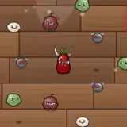</td><th colspan="2" align="left">Frenzy (Beet Berserker)</th></tr>
<tr><td colspan="2"><i>Gain Enrage (+30% Move Speed and Damage) and Bloodlust for 6s.</i></td></tr>
<tr><td nowrap>Character</td><td><a href="CHARACTERS.md#char-beet">Beet Berserker</a></td></tr>
<tr><td nowrap>Form</td><td>Self Buff</td></tr>
<tr><td nowrap>Cooldown</td><td>13s</td></tr>
<tr><td nowrap>Duration</td><td>6s</td></tr>
<tr><td nowrap>Self gains</td><td><a href="#status-enrage">Enrage</a> 6s, 3× <a href="#status-vampiric">Bloodlust</a> 6s</td></tr>
</table>

<table>
<tr><td rowspan="8" align="center" valign="middle">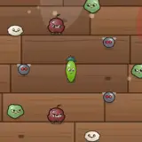</td><th colspan="2" align="left">Heartpiercer (Asparagus Archer)</th></tr>
<tr><td colspan="2"><i>Fire 8 piercing arrows at the enemy with the highest HP and Mark the target.</i></td></tr>
<tr><td nowrap>Character</td><td><a href="CHARACTERS.md#char-asparagus">Asparagus Archer</a></td></tr>
<tr><td nowrap>Form</td><td>Focused Barrage</td></tr>
<tr><td nowrap>Cooldown</td><td>12s</td></tr>
<tr><td nowrap>Damage multiplier</td><td>×1.3</td></tr>
<tr><td nowrap>Count</td><td>8</td></tr>
<tr><td nowrap>Inflicts</td><td><a href="#status-mark">Mark</a> 4s</td></tr>
</table>

<table>
<tr><td rowspan="10" align="center" valign="middle"></td><th colspan="2" align="left">Roast Yam Feast (Chef Yam)</th></tr>
<tr><td colspan="2"><i>Drain life from nearby enemies, restore 9% Max HP and gain 5 stacks of Regen.</i></td></tr>
<tr><td nowrap>Character</td><td><a href="CHARACTERS.md#char-sweetpotato">Chef Yam</a></td></tr>
<tr><td nowrap>Form</td><td>Drain Heal</td></tr>
<tr><td nowrap>Cooldown</td><td>24s</td></tr>
<tr><td nowrap>Damage multiplier</td><td>×1</td></tr>
<tr><td nowrap>Radius</td><td>160</td></tr>
<tr><td nowrap>Self gains</td><td>5× <a href="#status-regen">Regen</a> 6s</td></tr>
<tr><td nowrap>Heal</td><td>9% Max HP</td></tr>
<tr><td nowrap>Drain</td><td>+0.5 HP per enemy hit (max 6% Max HP)</td></tr>
</table>

<table>
<tr><td rowspan="8" align="center" valign="middle">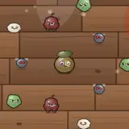</td><th colspan="2" align="left">One Truth (Kiwi Detective)</th></tr>
<tr><td colspan="2"><i>See through every enemy on screen: apply Mark and 2 stacks of Vulnerable.</i></td></tr>
<tr><td nowrap>Character</td><td><a href="CHARACTERS.md#char-kiwi">Kiwi Detective</a></td></tr>
<tr><td nowrap>Form</td><td>Mass Debuff</td></tr>
<tr><td nowrap>Cooldown</td><td>15s</td></tr>
<tr><td nowrap>Damage multiplier</td><td>×0.2</td></tr>
<tr><td nowrap>Radius</td><td>900</td></tr>
<tr><td nowrap>Inflicts</td><td><a href="#status-mark">Mark</a> 6s, 2× <a href="#status-vulnerable">Vulnerable</a> 6s</td></tr>
</table>

<table>
<tr><td rowspan="7" align="center" valign="middle">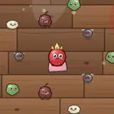</td><th colspan="2" align="left">Princess’s Luck (Lychee Princess)</th></tr>
<tr><td colspan="2"><i>Gain 5 stacks of Lucky + 3 stacks of Focus for 6s.</i></td></tr>
<tr><td nowrap>Character</td><td><a href="CHARACTERS.md#char-lychee">Lychee Princess</a></td></tr>
<tr><td nowrap>Form</td><td>Self Buff</td></tr>
<tr><td nowrap>Cooldown</td><td>10s</td></tr>
<tr><td nowrap>Duration</td><td>6s</td></tr>
<tr><td nowrap>Self gains</td><td>5× <a href="#status-lucky">Lucky</a> 6s, 3× <a href="#status-focus">Focus</a> 6s</td></tr>
</table>

<table>
<tr><td rowspan="8" align="center" valign="middle">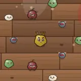</td><th colspan="2" align="left">Stink Bomb (Durian Overlord)</th></tr>
<tr><td colspan="2"><i>Inflict Poison, 3 stacks of Weaken, and Confuse on nearby enemies.</i></td></tr>
<tr><td nowrap>Character</td><td><a href="CHARACTERS.md#char-durian">Durian Overlord</a></td></tr>
<tr><td nowrap>Form</td><td>Mass Debuff</td></tr>
<tr><td nowrap>Cooldown</td><td>21s</td></tr>
<tr><td nowrap>Damage multiplier</td><td>×0.4</td></tr>
<tr><td nowrap>Radius</td><td>240</td></tr>
<tr><td nowrap>Inflicts</td><td>4× <a href="#status-poison">Poison</a> 5s, 3× <a href="#status-weaken">Weaken</a> 5s, <a href="#status-confuse">Confuse</a> 3s</td></tr>
</table>

<table>
<tr><td rowspan="7" align="center" valign="middle">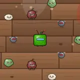</td><th colspan="2" align="left">Drone Support (Pepper Mech)</th></tr>
<tr><td colspan="2"><i>Deploy a drone for 8s.</i></td></tr>
<tr><td nowrap>Character</td><td><a href="CHARACTERS.md#char-bellpepper">Pepper Mech</a></td></tr>
<tr><td nowrap>Form</td><td>Summon Clone</td></tr>
<tr><td nowrap>Cooldown</td><td>10s</td></tr>
<tr><td nowrap>Damage multiplier</td><td>×0.45</td></tr>
<tr><td nowrap>Duration</td><td>8s</td></tr>
</table>

<table>
<tr><td rowspan="7" align="center" valign="middle">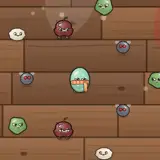</td><th colspan="2" align="left">Golden Bell (Monk Gourd)</th></tr>
<tr><td colspan="2"><i>Meditate for 2s while Invulnerable, gaining 5 stacks of Fortify.</i></td></tr>
<tr><td nowrap>Character</td><td><a href="CHARACTERS.md#char-wintermelon">Monk Gourd</a></td></tr>
<tr><td nowrap>Form</td><td>Stealth</td></tr>
<tr><td nowrap>Cooldown</td><td>16s</td></tr>
<tr><td nowrap>Duration</td><td>2s</td></tr>
<tr><td nowrap>Self gains</td><td>5× <a href="#status-fortify">Fortify</a> 8s</td></tr>
</table>

<table>
<tr><td rowspan="9" align="center" valign="middle">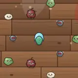</td><th colspan="2" align="left">Frozen Domain (Bitter Melon Mage)</th></tr>
<tr><td colspan="2"><i>Unleash a 5s frost field around you that Slows and Freezes enemies who enter.</i></td></tr>
<tr><td nowrap>Character</td><td><a href="CHARACTERS.md#char-bittermelon">Bitter Melon Mage</a></td></tr>
<tr><td nowrap>Form</td><td>Binding Field</td></tr>
<tr><td nowrap>Cooldown</td><td>16s</td></tr>
<tr><td nowrap>Damage multiplier</td><td>×0.5</td></tr>
<tr><td nowrap>Radius</td><td>170</td></tr>
<tr><td nowrap>Duration</td><td>5s</td></tr>
<tr><td nowrap>Inflicts</td><td>3× <a href="#status-slow">Slow</a> 1s, <a href="#status-freeze">Freeze</a> 0.8s (25%)</td></tr>
</table>

<table>
<tr><td rowspan="8" align="center" valign="middle"></td><th colspan="2" align="left">Growth Spurt (Sprout Apprentice)</th></tr>
<tr><td colspan="2"><i>Gain 12 XP and 5s of Haste.</i></td></tr>
<tr><td nowrap>Character</td><td><a href="CHARACTERS.md#char-sprout">Sprout Apprentice</a></td></tr>
<tr><td nowrap>Form</td><td>Self Buff</td></tr>
<tr><td nowrap>Cooldown</td><td>10s</td></tr>
<tr><td nowrap>Duration</td><td>5s</td></tr>
<tr><td nowrap>Self gains</td><td>2× <a href="#status-haste">Haste</a> 5s</td></tr>
<tr><td nowrap>XP</td><td>+12</td></tr>
</table>

<table>
<tr><td rowspan="8" align="center" valign="middle">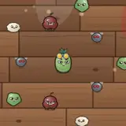</td><th colspan="2" align="left">Wasabi Nuke (Wasabi Bomber)</th></tr>
<tr><td colspan="2"><i>Launch a wasabi nuke at the enemy horde for a massive, burning explosion.</i></td></tr>
<tr><td nowrap>Character</td><td><a href="CHARACTERS.md#char-wasabi">Wasabi Bomber</a></td></tr>
<tr><td nowrap>Form</td><td>AOE Missile</td></tr>
<tr><td nowrap>Cooldown</td><td>23s</td></tr>
<tr><td nowrap>Damage multiplier</td><td>×2.8</td></tr>
<tr><td nowrap>Radius</td><td>190</td></tr>
<tr><td nowrap>Inflicts</td><td>3× <a href="#status-burn">Burn</a> 4s</td></tr>
</table>

<table>
<tr><td rowspan="7" align="center" valign="middle"></td><th colspan="2" align="left">Bean Troops (Strategist Soy)</th></tr>
<tr><td colspan="2"><i>Summon a bean clone that auto-fires for 10s.</i></td></tr>
<tr><td nowrap>Character</td><td><a href="CHARACTERS.md#char-soybean">Strategist Soy</a></td></tr>
<tr><td nowrap>Form</td><td>Summon Clone</td></tr>
<tr><td nowrap>Cooldown</td><td>14s</td></tr>
<tr><td nowrap>Damage multiplier</td><td>×0.6</td></tr>
<tr><td nowrap>Duration</td><td>10s</td></tr>
</table>

<table>
<tr><td rowspan="7" align="center" valign="middle">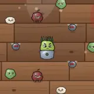</td><th colspan="2" align="left">Thousand Spikes (Jackfruit Guard)</th></tr>
<tr><td colspan="2"><i>Gain 5 stacks of Thorns and 3 stacks of Fortify for 6s.</i></td></tr>
<tr><td nowrap>Character</td><td><a href="CHARACTERS.md#char-jackfruit">Jackfruit Guard</a></td></tr>
<tr><td nowrap>Form</td><td>Self Buff</td></tr>
<tr><td nowrap>Cooldown</td><td>12s</td></tr>
<tr><td nowrap>Duration</td><td>6s</td></tr>
<tr><td nowrap>Self gains</td><td>5× <a href="#status-thorns">Thorns</a> 6s, 3× <a href="#status-fortify">Fortify</a> 6s</td></tr>
</table>

<table>
<tr><td rowspan="7" align="center" valign="middle">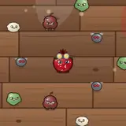</td><th colspan="2" align="left">Seed Burst (Pomegranate Gunner)</th></tr>
<tr><td colspan="2"><i>Spray 30 pomegranate seeds in all directions.</i></td></tr>
<tr><td nowrap>Character</td><td><a href="CHARACTERS.md#char-pomegranate">Pomegranate Gunner</a></td></tr>
<tr><td nowrap>Form</td><td>Ring Barrage</td></tr>
<tr><td nowrap>Cooldown</td><td>8s</td></tr>
<tr><td nowrap>Damage multiplier</td><td>×0.5</td></tr>
<tr><td nowrap>Count</td><td>30</td></tr>
</table>

<table>
<tr><td rowspan="9" align="center" valign="middle">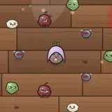</td><th colspan="2" align="left">Taro Paste Field (Taro Mystic)</th></tr>
<tr><td colspan="2"><i>Create a 6s taro field that Burns and Slows enemies inside and blocks enemy bullets entering it.</i></td></tr>
<tr><td nowrap>Character</td><td><a href="CHARACTERS.md#char-taro">Taro Mystic</a></td></tr>
<tr><td nowrap>Form</td><td>Binding Field</td></tr>
<tr><td nowrap>Cooldown</td><td>30s</td></tr>
<tr><td nowrap>Damage multiplier</td><td>×1.6</td></tr>
<tr><td nowrap>Radius</td><td>230</td></tr>
<tr><td nowrap>Duration</td><td>6s</td></tr>
<tr><td nowrap>Inflicts</td><td>2× <a href="#status-burn">Burn</a> 2s, 2× <a href="#status-slow">Slow</a> 1s</td></tr>
</table>

<table>
<tr><td rowspan="7" align="center" valign="middle">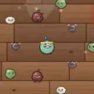</td><th colspan="2" align="left">Steadfast Body (Cabbage Veteran)</th></tr>
<tr><td colspan="2"><i>5s Barrier (-40% damage taken), 5 stacks of Fortify and 3 stacks of Regen.</i></td></tr>
<tr><td nowrap>Character</td><td><a href="CHARACTERS.md#char-cabbage">Cabbage Veteran</a></td></tr>
<tr><td nowrap>Form</td><td>Self Buff</td></tr>
<tr><td nowrap>Cooldown</td><td>15s</td></tr>
<tr><td nowrap>Duration</td><td>5s</td></tr>
<tr><td nowrap>Self gains</td><td><a href="#status-barrier">Barrier</a> 5s, 5× <a href="#status-fortify">Fortify</a> 5s, 3× <a href="#status-regen">Regen</a> 5s</td></tr>
</table>

<table>
<tr><td rowspan="8" align="center" valign="middle"></td><th colspan="2" align="left">Withering Hex (Blackberry Witch)</th></tr>
<tr><td colspan="2"><i>Curse nearby enemies, apply 3 stacks of Rot and Silence them for 3s.</i></td></tr>
<tr><td nowrap>Character</td><td><a href="CHARACTERS.md#char-blackberry">Blackberry Witch</a></td></tr>
<tr><td nowrap>Form</td><td>Mass Debuff</td></tr>
<tr><td nowrap>Cooldown</td><td>16s</td></tr>
<tr><td nowrap>Damage multiplier</td><td>×0.3</td></tr>
<tr><td nowrap>Radius</td><td>280</td></tr>
<tr><td nowrap>Inflicts</td><td><a href="#status-curse">Curse</a> 6s, 3× <a href="#status-rot">Rot</a> 6s, <a href="#status-silence">Silence</a> 3s</td></tr>
</table>

## Status Effects (32)

Shared by players and enemies. Bosses resist crowd-control debuffs by 75% (elites 50%); Stun/Freeze on the player lasts at most 0.8s, followed by 1.5s of immunity.

### Debuffs

| Status | Max stacks | Effect |
| --- | --- | --- |
| Burn | 5 | Takes fire damage per stack every second |
| Poison | 8 | Takes toxin damage per stack every second. Stacks up to 8 |
| Bleed | 5 | Loses HP per stack every second |
| Slow | 3 | Move Speed reduced |
| Freeze | 1 | Cannot act. Damage taken +20% |
| Stun | 1 | Cannot act |
| Weaken | 3 | Damage dealt reduced |
| Vulnerable | 3 | Damage taken increased |
| Armor Break | 5 | Armor reduced |
| Curse | 1 | Cannot heal. Damage taken +10% |
| Blind | 1 | Range -30% (enemies cannot shoot) |
| Confuse | 1 | Movement direction scrambled |
| Sticky | 1 | Move Speed greatly reduced |
| Mark | 1 | The next hit taken is a guaranteed crit |
| Silence | 1 | Cannot use skills |
| Rot | 3 | Max HP effects reduced. Attack Speed -10% |
| Soaked | 3 | Move Speed -10% and Attack Speed -8% per stack. Stacks up to 3 |
| Corrode | 4 | Takes acid damage per stack every second. Damage taken +6% per stack. Stacks up to 4 |

### Buffs

| Status | Max stacks | Effect |
| --- | --- | --- |
| Haste | 3 | Move Speed and Attack Speed increased |
| Rage | 10 | Damage dealt increased |
| Shield | 1 | Absorbs an equal amount of damage |
| Regen | 5 | Restores 1 HP per second per stack |
| Fortify | 5 | Armor increased |
| Invulnerable | 1 | Immune to all damage |
| Thorns | 5 | Reflects melee damage |
| Focus | 5 | Crit Chance increased |
| Barrier | 1 | Damage taken reduced by 40% |
| Enrage | 1 | Move Speed +30%, Damage +30% |
| Lucky | 5 | Luck increased |
| Bloodlust | 5 | Life Steal Chance +4% per stack |
| Tailwind | 3 | Move Speed +12% and Dodge +4% per stack. Stacks up to 3 |
| Hardened | 2 | Armor +3 and Damage taken -10% per stack. Stacks up to 2 |

---

[README](../../README.en.md) · [Characters](CHARACTERS.md) · **Skills** · [Weapons](WEAPONS.md) · [Items](ITEMS.md) · [Monsters](MONSTERS.md) · [Chapters](CHAPTERS.md) · [Achievements](ACHIEVEMENTS.md) · [Talents](TALENTS.md) · [Relics](RELICS.md) · [Danger](DANGER.md) · [Quests](QUESTS.md) · [Design Doc](GDD.md) · [Data Tables](DATA_TABLES.md) · [Changelog](CHANGELOG.md)
