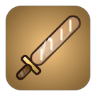
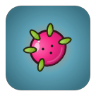
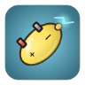
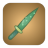
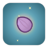

# Weapons (66)

[中文](../WEAPONS.md) · **English**

[README](../../README.en.md) · [Characters](CHARACTERS.md) · [Skills](SKILLS.md) · **Weapons** · [Items](ITEMS.md) · [Monsters](MONSTERS.md) · [Chapters](CHAPTERS.md) · [Achievements](ACHIEVEMENTS.md) · [Talents](TALENTS.md) · [Relics](RELICS.md) · [Danger](DANGER.md) · [Quests](QUESTS.md) · [Design Doc](GDD.md) · [Data Tables](DATA_TABLES.md) · [Changelog](CHANGELOG.md)

> Generated by `npm run docs` from `src/data/*.ts`. Do not edit by hand.

Weapons aim and attack automatically; each character carries up to 6 (some [characters](CHARACTERS.md) differ). Every weapon has tiers T1–T4; two identical weapons of the same tier combine into the next tier in the shop.

Price: T1 base price × [1, 2.1, 4, 7.5], rising with waves. Damage = (base + Σ stat × scaling) × (1 + Damage%) × class multiplier.

## Contents

- [Overview](#overview)
- [Affixes & Forging](#affixes)
- [Melee Weapons](#class-melee)
  - [Tomato Fork](#weapon-fork)
  - [Rolling Pin](#weapon-rolling_pin)
  - [Chef's Knife](#weapon-knife)
  - [Frying Pan](#weapon-pan)
  - [Melon Hammer](#weapon-watermelon_hammer)
  - [Meat Cleaver](#weapon-cleaver)
  - [Spatula](#weapon-spatula)
  - [Whirl Whisk](#weapon-whisk_spin)
  - [Meat Tenderizer](#weapon-meat_tenderizer)
  - [BBQ Skewer](#weapon-skewer)
  - [Soup Ladle](#weapon-ladle)
  - [Baguette Blade](#weapon-baguette_sword)
  - [Cucumber Katana](#weapon-cucumber_katana)
  - [Pizza Cutter](#weapon-pizza_cutter)
  - [Chopsticks](#weapon-chopsticks)
  - [Bamboo Spear](#weapon-bamboo_spear)
  - [Pineapple Mace](#weapon-pineapple_mace)
  - [Wasabi Katana](#weapon-wasabi_katana)
  - [Kitchen Shears](#weapon-kitchen_scissors)
  - [Blender](#weapon-blender_aura)
  - [Dynamite Drumstick](#weapon-dynamite_drumstick)
  - [Coconut Gloves](#weapon-coconut_gloves)
- [Ranged Weapons](#class-ranged)
  - [Tomato Slingshot](#weapon-slingshot)
  - [Pea Shooter](#weapon-pea_shooter)
  - [Chili Rocket](#weapon-chili_rocket)
  - [Corn Cannon](#weapon-corn_cannon)
  - [Ketchup Bottle](#weapon-ketchup)
  - [Onion Boomerang](#weapon-onion_boomerang)
  - [Sauce Gatling](#weapon-sauce_gatling)
  - [Olive Launcher](#weapon-olive_launcher)
  - [Popcorn Popper](#weapon-popcorn_machine)
  - [Grape Shotgun](#weapon-grape_shotgun)
  - [Bean Bazooka](#weapon-bean_bazooka)
  - [Cherry Bombs](#weapon-cherry_bomb)
  - [Blueberry Sniper](#weapon-blueberry_sniper)
  - [Plate Frisbee](#weapon-plate_frisbee)
  - [Seed Spitter](#weapon-seed_spitter)
  - [Carrot Crossbow](#weapon-carrot_crossbow)
  - [Honey Blaster](#weapon-honey_blaster)
  - [Soy Pistol](#weapon-soy_pistol)
  - [Pepper Grinder Gun](#weapon-pepper_grinder)
  - [Soy Bomb](#weapon-soy_bomb)
  - [BBQ Torch](#weapon-bbq_torch)
  - [Jam Mortar](#weapon-jam_mortar)
  - [Sea Urchin Mine](#weapon-sea_urchin_mine)
  - [Asparagus Longbow](#weapon-asparagus_bow)
- [Elemental Weapons](#class-elemental)
  - [Mustard Flamer](#weapon-mustard_flamer)
  - [Iced Soda](#weapon-soda)
  - [Garlic Aura](#weapon-garlic_aura)
  - [Pepper Mine](#weapon-pepper_mine)
  - [Broccoli Staff](#weapon-broccoli_staff)
  - [Ice Cube Tray](#weapon-ice_cube_tray)
  - [Zap Whisk](#weapon-lightning_whisk)
  - [Steam Kettle](#weapon-steam_kettle)
  - [Curry Aura](#weapon-curry_aura)
  - [Pepper Spray](#weapon-pepper_spray)
  - [Mint Frost Mine](#weapon-mint_frost_mine)
  - [Thunder Durian](#weapon-thunder_durian)
  - [Dragonfruit Orb](#weapon-dragonfruit_orb)
  - [Star Anise Star](#weapon-star_anise_shuriken)
  - [Lemon Battery](#weapon-lemon_battery)
  - [Sea Salt Ward](#weapon-salt_aura)
  - [Cola Zapper](#weapon-cola_zapper)
  - [Hotpot Breath](#weapon-hotpot_breath)
  - [Pumpkin Lantern](#weapon-pumpkin_lantern)
  - [Spore Sprayer](#weapon-spore_sprayer)
- [Weapon Evolution (20 super weapons)](#evolution)

## Overview

| Weapon | Class | Attack | Tags | Damage T1–T4 | Cooldown T1–T4 | Range | Price |
| --- | --- | --- | --- | --- | --- | --- | --- |
|  [Tomato Fork](#weapon-fork) | Melee | Thrust | Kitchenware | 8 / 14 / 22 / 34 | 0.9 / 0.85 / 0.78 / 0.7 | 150 | 15 |
|  [Rolling Pin](#weapon-rolling_pin) | Melee | Sweep | Kitchenware | 12 / 20 / 32 / 48 | 1.25 / 1.18 / 1.1 / 1 | 130 | 18 |
|  [Chef's Knife](#weapon-knife) | Melee | Thrust | Kitchenware/Sharp | 6 / 10 / 16 / 25 | 0.6 / 0.55 / 0.5 / 0.44 | 130 | 20 |
|  [Frying Pan](#weapon-pan) | Melee | Sweep | Kitchenware | 18 / 30 / 46 / 70 | 1.6 / 1.5 / 1.4 / 1.3 | 120 | 25 |
|  [Melon Hammer](#weapon-watermelon_hammer) | Melee | Sweep | Produce/Demolition | 30 / 50 / 80 / 120 | 2.2 / 2.1 / 2 / 1.8 | 140 | 35 |
|  [Tomato Slingshot](#weapon-slingshot) | Ranged | Bullet | Produce | 8 / 13 / 20 / 30 | 0.95 / 0.9 / 0.83 / 0.75 | 380 | 15 |
|  [Pea Shooter](#weapon-pea_shooter) | Ranged | Bullet | Firearm/Produce | 4 / 6 / 9 / 13 | 0.32 / 0.29 / 0.26 / 0.22 | 400 | 22 |
|  [Chili Rocket](#weapon-chili_rocket) | Ranged | Rocket | Firearm/Elemental/Demolition | 14 / 24 / 38 / 58 | 1.8 / 1.7 / 1.6 / 1.4 | 450 | 30 |
|  [Corn Cannon](#weapon-corn_cannon) | Ranged | Bullet | Firearm | 16 / 28 / 44 / 68 | 1.1 / 1 / 0.92 / 0.84 | 520 | 28 |
|  [Ketchup Bottle](#weapon-ketchup) | Ranged | Bullet | Sauce | 5 / 8 / 12 / 17 | 0.75 / 0.7 / 0.65 / 0.6 | 280 | 20 |
|  [Mustard Flamer](#weapon-mustard_flamer) | Elemental | Flame | Sauce/Elemental | 2 / 3 / 5 / 8 | 0.2 / 0.18 / 0.16 / 0.14 | 200 | 28 |
|  [Iced Soda](#weapon-soda) | Elemental | Bullet | Elemental | 9 / 15 / 22 / 32 | 0.75 / 0.7 / 0.65 / 0.58 | 400 | 22 |
|  [Garlic Aura](#weapon-garlic_aura) | Elemental | Aura | Produce/Elemental | 4 / 6 / 9 / 13 | 0.5 / 0.5 / 0.5 / 0.5 | 133 | 30 |
|  [Pepper Mine](#weapon-pepper_mine) | Elemental | Mine | Elemental/Demolition | 20 / 34 / 52 / 80 | 2.5 / 2.3 / 2.1 / 1.8 | 200 | 25 |
|  [Onion Boomerang](#weapon-onion_boomerang) | Ranged | Boomerang | Produce | 10 / 17 / 26 / 40 | 1.4 / 1.3 / 1.2 / 1.1 | 360 | 24 |
|  [Broccoli Staff](#weapon-broccoli_staff) | Elemental | Chain Lightning | Produce/Elemental | 10 / 17 / 26 / 40 | 1.1 / 1 / 0.92 / 0.84 | 420 | 30 |
|  [Sauce Gatling](#weapon-sauce_gatling) | Ranged | Bullet | Firearm/Sauce | 4 / 6 / 8 / 11 | 0.16 / 0.14 / 0.12 / 0.1 | 420 | 40 |
|  [Meat Cleaver](#weapon-cleaver) | Melee | Sweep | Kitchenware/Sharp | 13 / 22 / 35 / 54 | 1.1 / 1.05 / 1 / 0.9 | 125 | 26 |
|  [Spatula](#weapon-spatula) | Melee | Sweep | Kitchenware | 9 / 16 / 25 / 38 | 1.05 / 1 / 0.92 / 0.84 | 115 | 16 |
|  [Whirl Whisk](#weapon-whisk_spin) | Melee | Aura | Kitchenware | 3 / 5 / 8 / 12 | 0.45 / 0.45 / 0.42 / 0.4 | 137 | 22 |
|  [Meat Tenderizer](#weapon-meat_tenderizer) | Melee | Sweep | Kitchenware | 22 / 36 / 56 / 84 | 1.9 / 1.8 / 1.7 / 1.55 | 110 | 30 |
|  [BBQ Skewer](#weapon-skewer) | Melee | Thrust | Kitchenware/Sharp | 12 / 21 / 33 / 51 | 1.05 / 1 / 0.92 / 0.84 | 185 | 24 |
|  [Soup Ladle](#weapon-ladle) | Melee | Sweep | Kitchenware/Sauce | 10 / 17 / 27 / 41 | 1.15 / 1.1 / 1.02 / 0.94 | 120 | 20 |
|  [Baguette Blade](#weapon-baguette_sword) | Melee | Sweep | Produce | 11 / 19 / 30 / 46 | 1.3 / 1.22 / 1.14 / 1.04 | 140 | 22 |
|  [Cucumber Katana](#weapon-cucumber_katana) | Melee | Thrust | Produce/Sharp | 9 / 15 / 24 / 36 | 0.8 / 0.75 / 0.69 / 0.62 | 140 | 24 |
|  [Pizza Cutter](#weapon-pizza_cutter) | Melee | Boomerang | Kitchenware/Sharp | 9 / 15 / 24 / 36 | 1.3 / 1.2 / 1.1 / 1 | 230 | 26 |
|  [Chopsticks](#weapon-chopsticks) | Melee | Thrust | Kitchenware | 5 / 9 / 14 / 21 | 0.5 / 0.46 / 0.42 / 0.38 | 155 | 18 |
|  [Bamboo Spear](#weapon-bamboo_spear) | Melee | Thrust | Produce | 19 / 32 / 50 / 77 | 1.5 / 1.42 / 1.32 / 1.2 | 200 | 28 |
|  [Pineapple Mace](#weapon-pineapple_mace) | Melee | Sweep | Produce/Demolition | 20 / 34 / 53 / 80 | 1.8 / 1.7 / 1.6 / 1.45 | 130 | 32 |
|  [Olive Launcher](#weapon-olive_launcher) | Ranged | Bullet | Firearm/Produce | 6 / 10 / 15 / 23 | 0.8 / 0.75 / 0.7 / 0.62 | 400 | 22 |
|  [Popcorn Popper](#weapon-popcorn_machine) | Ranged | Mine | Firearm/Demolition | 14 / 24 / 37 / 56 | 2 / 1.9 / 1.75 / 1.6 | 220 | 24 |
|  [Grape Shotgun](#weapon-grape_shotgun) | Ranged | Bullet | Firearm/Produce | 4 / 7 / 10 / 15 | 1 / 0.95 / 0.88 / 0.8 | 240 | 26 |
|  [Bean Bazooka](#weapon-bean_bazooka) | Ranged | Rocket | Firearm/Demolition | 22 / 36 / 56 / 84 | 2.4 / 2.25 / 2.1 / 1.9 | 480 | 34 |
|  [Cherry Bombs](#weapon-cherry_bomb) | Ranged | Rocket | Produce/Demolition | 10 / 17 / 26 / 40 | 1.6 / 1.5 / 1.4 / 1.3 | 360 | 28 |
|  [Blueberry Sniper](#weapon-blueberry_sniper) | Ranged | Bullet | Firearm/Produce | 26 / 44 / 68 / 100 | 1.9 / 1.8 / 1.65 / 1.5 | 650 | 32 |
|  [Plate Frisbee](#weapon-plate_frisbee) | Ranged | Boomerang | Kitchenware | 12 / 20 / 31 / 47 | 1.5 / 1.4 / 1.3 / 1.2 | 330 | 24 |
|  [Seed Spitter](#weapon-seed_spitter) | Ranged | Bullet | Firearm/Produce | 3 / 5 / 7 / 10 | 0.22 / 0.2 / 0.18 / 0.16 | 360 | 26 |
|  [Carrot Crossbow](#weapon-carrot_crossbow) | Ranged | Bullet | Produce | 12 / 20 / 31 / 47 | 1.05 / 1 / 0.92 / 0.84 | 460 | 25 |
|  [Honey Blaster](#weapon-honey_blaster) | Ranged | Bullet | Sauce | 6 / 10 / 15 / 22 | 0.7 / 0.66 / 0.6 / 0.54 | 360 | 22 |
|  [Soy Pistol](#weapon-soy_pistol) | Ranged | Bullet | Firearm/Sauce | 7 / 12 / 18 / 27 | 0.55 / 0.5 / 0.46 / 0.42 | 380 | 20 |
|  [Ice Cube Tray](#weapon-ice_cube_tray) | Elemental | Bullet | Kitchenware/Elemental | 5 / 8 / 12 / 18 | 1 / 0.95 / 0.88 / 0.8 | 340 | 26 |
|  [Zap Whisk](#weapon-lightning_whisk) | Elemental | Chain Lightning | Kitchenware/Elemental | 7 / 12 / 18 / 27 | 0.95 / 0.9 / 0.82 / 0.74 | 380 | 30 |
|  [Steam Kettle](#weapon-steam_kettle) | Elemental | Flame | Kitchenware/Elemental | 3 / 5 / 7 / 11 | 0.26 / 0.24 / 0.21 / 0.18 | 170 | 28 |
|  [Curry Aura](#weapon-curry_aura) | Elemental | Aura | Sauce/Elemental | 3 / 5 / 7 / 11 | 0.5 / 0.5 / 0.5 / 0.5 | 140 | 32 |
|  [Pepper Spray](#weapon-pepper_spray) | Elemental | Flame | Elemental | 2 / 4 / 6 / 9 | 0.18 / 0.16 / 0.14 / 0.12 | 150 | 26 |
|  [Mint Frost Mine](#weapon-mint_frost_mine) | Elemental | Mine | Produce/Elemental/Demolition | 16 / 27 / 42 / 64 | 2.6 / 2.4 / 2.2 / 1.9 | 220 | 26 |
|  [Thunder Durian](#weapon-thunder_durian) | Elemental | Rocket | Produce/Elemental/Demolition | 16 / 27 / 42 / 64 | 2.2 / 2.1 / 1.95 / 1.75 | 400 | 32 |
|  [Dragonfruit Orb](#weapon-dragonfruit_orb) | Elemental | Bullet | Produce/Elemental | 8 / 13 / 20 / 30 | 1 / 0.95 / 0.88 / 0.8 | 400 | 28 |
|  [Star Anise Star](#weapon-star_anise_shuriken) | Elemental | Boomerang | Sharp/Elemental | 9 / 15 / 23 / 35 | 1.3 / 1.2 / 1.1 / 1 | 320 | 28 |
|  [Lemon Battery](#weapon-lemon_battery) | Elemental | Chain Lightning | Produce/Elemental | 12 / 20 / 31 / 47 | 1.3 / 1.2 / 1.1 / 1 | 360 | 30 |
|  [Wasabi Katana](#weapon-wasabi_katana) | Melee | Thrust | Sharp/Sauce | 10 / 17 / 27 / 41 | 0.85 / 0.8 / 0.74 / 0.67 | 150 | 26 |
|  [Kitchen Shears](#weapon-kitchen_scissors) | Melee | Sweep | Kitchenware/Sharp | 8 / 14 / 22 / 33 | 0.85 / 0.8 / 0.74 / 0.68 | 105 | 22 |
|  [Blender](#weapon-blender_aura) | Melee | Aura | Kitchenware/Sharp | 4 / 6 / 9 / 14 | 0.45 / 0.43 / 0.41 / 0.38 | 121 | 28 |
|  [Dynamite Drumstick](#weapon-dynamite_drumstick) | Melee | Sweep | Demolition | 17 / 29 / 45 / 68 | 1.7 / 1.6 / 1.5 / 1.36 | 120 | 30 |
|  [Pepper Grinder Gun](#weapon-pepper_grinder) | Ranged | Bullet | Firearm/Sharp | 6 / 10 / 15 / 22 | 0.5 / 0.46 / 0.42 / 0.38 | 400 | 26 |
|  [Soy Bomb](#weapon-soy_bomb) | Ranged | Mine | Sauce/Demolition | 15 / 25 / 39 / 60 | 2.2 / 2.05 / 1.9 / 1.7 | 210 | 26 |
|  [BBQ Torch](#weapon-bbq_torch) | Ranged | Flame | Firearm/Sauce | 2 / 3 / 5 / 8 | 0.2 / 0.18 / 0.16 / 0.14 | 190 | 30 |
|  [Jam Mortar](#weapon-jam_mortar) | Ranged | Rocket | Sauce/Demolition | 16 / 27 / 42 / 64 | 2 / 1.9 / 1.78 / 1.6 | 460 | 32 |
|  [Sea Urchin Mine](#weapon-sea_urchin_mine) | Ranged | Mine | Sharp/Demolition | 13 / 22 / 34 / 52 | 1.9 / 1.8 / 1.65 / 1.5 | 230 | 26 |
|  [Sea Salt Ward](#weapon-salt_aura) | Elemental | Aura | Sharp/Elemental | 3 / 5 / 8 / 12 | 0.5 / 0.5 / 0.5 / 0.5 | 152 | 30 |
|  [Cola Zapper](#weapon-cola_zapper) | Elemental | Chain Lightning | Firearm/Elemental | 8 / 14 / 21 / 32 | 0.95 / 0.88 / 0.8 / 0.72 | 440 | 28 |
|  [Hotpot Breath](#weapon-hotpot_breath) | Elemental | Flame | Sauce/Elemental | 3 / 4 / 6 / 10 | 0.22 / 0.2 / 0.18 / 0.16 | 165 | 30 |
|  [Pumpkin Lantern](#weapon-pumpkin_lantern) | Elemental | Bullet | Produce/Elemental | 9 / 15 / 24 / 37 | 0.8 / 0.75 / 0.7 / 0.62 | 420 | 24 |
|  [Spore Sprayer](#weapon-spore_sprayer) | Elemental | Bullet | Produce/Elemental | 5 / 8 / 13 / 20 | 0.7 / 0.65 / 0.6 / 0.54 | 330 | 22 |
|  [Coconut Gloves](#weapon-coconut_gloves) | Melee | Thrust | Produce | 5 / 9 / 14 / 22 | 0.42 / 0.4 / 0.37 / 0.34 | 95 | 20 |
|  [Asparagus Longbow](#weapon-asparagus_bow) | Ranged | Bullet | Produce | 14 / 24 / 37 / 56 | 1.1 / 1.04 / 0.97 / 0.88 | 520 | 26 |

## Affixes & Forging

- T3 weapons roll 1 random affix and T4 weapons roll 2; affixes have tiers I–IV (I common, IV rare; higher Luck favours higher tiers)
- Reroll affixes in the shop: all at once costs `8 + 2×wave`, a single affix costs 2.5× that
- T4 weapons can be forged for +8% damage per level, up to +10; each level costs 1.45× more, and a failed forge only costs the fee

| Affix | I | II | III | IV |
| --- | --- | --- | --- | --- |
| Damage +N% | 8 | 14 | 22 | 32 |
| Attack Speed +N% | 6 | 10 | 15 | 22 |
| Crit Chance +N% | 4 | 7 | 11 | 16 |
| Crit Damage +N% | 15 | 25 | 40 | 60 |
| Range +N | 20 | 35 | 55 | 80 |
| Life Steal Chance +N% | 1 | 2 | 3 | 5 |
| N% chance to Burn | 8 | 14 | 22 | 32 |
| N% chance to Poison | 8 | 14 | 22 | 32 |
| N% chance to Slow | 10 | 18 | 28 | 40 |

| Forge level | +1 | +2 | +3 | +4 | +5 | +6 | +7 | +8 | +9 | +10 |
| --- | --- | --- | --- | --- | --- | --- | --- | --- | --- | --- |
| Success | 95% | 90% | 82% | 74% | 65% | 56% | 48% | 40% | 34% | 30% |

## Melee Weapons

### Tomato Fork

> A humble three-pronged fork. Thrusts forward.

| Field | Value |
| --- | --- |
| Class / attack | Melee / Thrust |
| Tags | Kitchenware |
| Damage T1–T4 | 8 / 14 / 22 / 34 |
| Cooldown T1–T4 | 0.9s / 0.85s / 0.78s / 0.7s |
| Range | 150 |
| Scaling | Melee Damage ×1 |
| Crit multiplier | ×2 |
| Effects | Knockback 10 |
| T1 price | 15 |
| Starting weapon of | [Tomato Sister](CHARACTERS.md#char-tomato), [Sprout Apprentice](CHARACTERS.md#char-sprout) |

### Rolling Pin

> Sweeps a wide area and knocks enemies back.

| Field | Value |
| --- | --- |
| Class / attack | Melee / Sweep |
| Tags | Kitchenware |
| Damage T1–T4 | 12 / 20 / 32 / 48 |
| Cooldown T1–T4 | 1.25s / 1.18s / 1.1s / 1s |
| Range | 130 |
| Scaling | Melee Damage ×1 |
| Crit multiplier | ×1.5 |
| Effects | Knockback 30 |
| T1 price | 18 |
| Starting weapon of | [Carrot Knight](CHARACTERS.md#char-carrot), [Dragonfruit Rider](CHARACTERS.md#char-dragonfruit), [Chef Yam](CHARACTERS.md#char-sweetpotato), [Monk Gourd](CHARACTERS.md#char-wintermelon) |

### Chef's Knife

> Fast thrusts with high crit.

| Field | Value |
| --- | --- |
| Class / attack | Melee / Thrust |
| Tags | Kitchenware, Sharp |
| Damage T1–T4 | 6 / 10 / 16 / 25 |
| Cooldown T1–T4 | 0.6s / 0.55s / 0.5s / 0.44s |
| Range | 130 |
| Scaling | Melee Damage ×0.8 |
| Crit multiplier | ×2.5 |
| Effects | +15% Crit Chance |
| T1 price | 20 |
| Starting weapon of | [Lemon Assassin](CHARACTERS.md#char-lemon), [Blueberry Twins](CHARACTERS.md#char-blueberry), [Kiwi Detective](CHARACTERS.md#char-kiwi) |

### Frying Pan

> Heavy sweep that stuns enemies for 0.4s. Damage scales with Armor.

| Field | Value |
| --- | --- |
| Class / attack | Melee / Sweep |
| Tags | Kitchenware |
| Damage T1–T4 | 18 / 30 / 46 / 70 |
| Cooldown T1–T4 | 1.6s / 1.5s / 1.4s / 1.3s |
| Range | 120 |
| Scaling | Melee Damage ×1.2, Armor ×1 |
| Crit multiplier | ×1.5 |
| Effects | Stun 0.4s, Knockback 20 |
| T1 price | 25 |
| Starting weapon of | [Uncle Onion](CHARACTERS.md#char-onion), [Coconut Boxer](CHARACTERS.md#char-coconut) |

### Melon Hammer

> Smashes the ground for a huge explosion.

| Field | Value |
| --- | --- |
| Class / attack | Melee / Sweep |
| Tags | Produce, Demolition |
| Damage T1–T4 | 30 / 50 / 80 / 120 |
| Cooldown T1–T4 | 2.2s / 2.1s / 2s / 1.8s |
| Range | 140 |
| Scaling | Melee Damage ×1.5, Max HP ×0.1 |
| Crit multiplier | ×1.5 |
| Effects | Explosion radius 100, Knockback 40 |
| T1 price | 35 |
| Starting weapon of | [Chubby Melon](CHARACTERS.md#char-watermelon) |

### Meat Cleaver

> Mighty sweep. Kills have a 20% chance to drop extra Seeds.

| Field | Value |
| --- | --- |
| Class / attack | Melee / Sweep |
| Tags | Kitchenware, Sharp |
| Damage T1–T4 | 13 / 22 / 35 / 54 |
| Cooldown T1–T4 | 1.1s / 1.05s / 1s / 0.9s |
| Range | 125 |
| Scaling | Melee Damage ×1 |
| Crit multiplier | ×2 |
| Effects | Knockback 15, +5% Crit Chance |
| T1 price | 26 |
| Starting weapon of | [Beet Berserker](CHARACTERS.md#char-beet) |

### Spatula

> Quick, light sweep that flips enemies far away.

| Field | Value |
| --- | --- |
| Class / attack | Melee / Sweep |
| Tags | Kitchenware |
| Damage T1–T4 | 9 / 16 / 25 / 38 |
| Cooldown T1–T4 | 1.05s / 1s / 0.92s / 0.84s |
| Range | 115 |
| Scaling | Melee Damage ×0.8 |
| Crit multiplier | ×1.5 |
| Effects | Knockback 38 |
| T1 price | 16 |
| Starting weapon of | - |

### Whirl Whisk

> Whisks around you, damaging and slowing nearby enemies.

| Field | Value |
| --- | --- |
| Class / attack | Melee / Aura |
| Tags | Kitchenware |
| Damage T1–T4 | 3 / 5 / 8 / 12 |
| Cooldown T1–T4 | 0.45s / 0.45s / 0.42s / 0.4s |
| Range | 137 |
| Scaling | Melee Damage ×0.4 |
| Crit multiplier | ×1.5 |
| Effects | Slow 20% for 0.6s |
| T1 price | 22 |
| Starting weapon of | [Jackfruit Guard](CHARACTERS.md#char-jackfruit) |

### Meat Tenderizer

> Heavy smash that stuns for 0.6s. Scales with Armor.

| Field | Value |
| --- | --- |
| Class / attack | Melee / Sweep |
| Tags | Kitchenware |
| Damage T1–T4 | 22 / 36 / 56 / 84 |
| Cooldown T1–T4 | 1.9s / 1.8s / 1.7s / 1.55s |
| Range | 110 |
| Scaling | Melee Damage ×1.3, Armor ×0.5 |
| Crit multiplier | ×1.5 |
| Effects | Stun 0.6s, Knockback 25 |
| T1 price | 30 |
| Starting weapon of | - |

### BBQ Skewer

> Long-reach thrust that leaves enemies sizzling.

| Field | Value |
| --- | --- |
| Class / attack | Melee / Thrust |
| Tags | Kitchenware, Sharp |
| Damage T1–T4 | 12 / 21 / 33 / 51 |
| Cooldown T1–T4 | 1.05s / 1s / 0.92s / 0.84s |
| Range | 185 |
| Scaling | Melee Damage ×0.9 |
| Crit multiplier | ×2 |
| Effects | Burn 2/s for 2s |
| T1 price | 24 |
| Starting weapon of | - |

### Soup Ladle

> A sweep of hot soup. Hits grant extra Life Steal Chance.

| Field | Value |
| --- | --- |
| Class / attack | Melee / Sweep |
| Tags | Kitchenware, Sauce |
| Damage T1–T4 | 10 / 17 / 27 / 41 |
| Cooldown T1–T4 | 1.15s / 1.1s / 1.02s / 0.94s |
| Range | 120 |
| Scaling | Melee Damage ×0.9, Max HP ×0.05 |
| Crit multiplier | ×1.5 |
| Effects | +3% Life Steal Chance, Knockback 20 |
| T1 price | 20 |
| Starting weapon of | [Cabbage Veteran](CHARACTERS.md#char-cabbage) |

### Baguette Blade

> Huge-reach bread sweep. Scales with Max HP.

| Field | Value |
| --- | --- |
| Class / attack | Melee / Sweep |
| Tags | Produce |
| Damage T1–T4 | 11 / 19 / 30 / 46 |
| Cooldown T1–T4 | 1.3s / 1.22s / 1.14s / 1.04s |
| Range | 140 |
| Scaling | Melee Damage ×1, Max HP ×0.15 |
| Crit multiplier | ×1.5 |
| Effects | Knockback 25 |
| T1 price | 22 |
| Starting weapon of | - |

### Cucumber Katana

> A crisp slash with very high crit.

| Field | Value |
| --- | --- |
| Class / attack | Melee / Thrust |
| Tags | Produce, Sharp |
| Damage T1–T4 | 9 / 15 / 24 / 36 |
| Cooldown T1–T4 | 0.8s / 0.75s / 0.69s / 0.62s |
| Range | 140 |
| Scaling | Melee Damage ×0.9 |
| Crit multiplier | ×2.5 |
| Effects | +10% Crit Chance |
| T1 price | 24 |
| Starting weapon of | - |

### Pizza Cutter

> Rolls out in a zigzag and back, slicing everything en route.

| Field | Value |
| --- | --- |
| Class / attack | Melee / Boomerang |
| Tags | Kitchenware, Sharp |
| Damage T1–T4 | 9 / 15 / 24 / 36 |
| Cooldown T1–T4 | 1.3s / 1.2s / 1.1s / 1s |
| Range | 230 |
| Scaling | Melee Damage ×0.8 |
| Crit multiplier | ×2 |
| Effects | - |
| T1 price | 26 |
| Starting weapon of | - |

### Chopsticks

> Lightning-fast pokes. Quick and precise.

| Field | Value |
| --- | --- |
| Class / attack | Melee / Thrust |
| Tags | Kitchenware |
| Damage T1–T4 | 5 / 9 / 14 / 21 |
| Cooldown T1–T4 | 0.5s / 0.46s / 0.42s / 0.38s |
| Range | 155 |
| Scaling | Melee Damage ×0.7 |
| Crit multiplier | ×2 |
| Effects | +5% Crit Chance |
| T1 price | 18 |
| Starting weapon of | - |

### Bamboo Spear

> Slow but mighty thrust with extra-long reach.

| Field | Value |
| --- | --- |
| Class / attack | Melee / Thrust |
| Tags | Produce |
| Damage T1–T4 | 19 / 32 / 50 / 77 |
| Cooldown T1–T4 | 1.5s / 1.42s / 1.32s / 1.2s |
| Range | 200 |
| Scaling | Melee Damage ×1.2 |
| Crit multiplier | ×2 |
| Effects | Knockback 20 |
| T1 price | 28 |
| Starting weapon of | - |

### Pineapple Mace

> A spiky pineapple slam that sets off a small blast.

| Field | Value |
| --- | --- |
| Class / attack | Melee / Sweep |
| Tags | Produce, Demolition |
| Damage T1–T4 | 20 / 34 / 53 / 80 |
| Cooldown T1–T4 | 1.8s / 1.7s / 1.6s / 1.45s |
| Range | 130 |
| Scaling | Melee Damage ×1.3 |
| Crit multiplier | ×1.5 |
| Effects | Explosion radius 75, Knockback 30 |
| T1 price | 32 |
| Starting weapon of | - |

### Wasabi Katana

> A wasabi-smeared blade: thrusts burn and crit often.

| Field | Value |
| --- | --- |
| Class / attack | Melee / Thrust |
| Tags | Sharp, Sauce |
| Damage T1–T4 | 10 / 17 / 27 / 41 |
| Cooldown T1–T4 | 0.85s / 0.8s / 0.74s / 0.67s |
| Range | 150 |
| Scaling | Melee Damage ×0.9 |
| Crit multiplier | ×2.2 |
| Effects | Burn 2/s for 1.5s, +8% Crit Chance |
| T1 price | 26 |
| Starting weapon of | - |

### Kitchen Shears

> Snip-snip! Fast sweeping cuts with high crit.

| Field | Value |
| --- | --- |
| Class / attack | Melee / Sweep |
| Tags | Kitchenware, Sharp |
| Damage T1–T4 | 8 / 14 / 22 / 33 |
| Cooldown T1–T4 | 0.85s / 0.8s / 0.74s / 0.68s |
| Range | 105 |
| Scaling | Melee Damage ×0.8 |
| Crit multiplier | ×2.2 |
| Effects | Knockback 8, +10% Crit Chance |
| T1 price | 22 |
| Starting weapon of | - |

### Blender

> Spinning blades around you keep slicing nearby enemies.

| Field | Value |
| --- | --- |
| Class / attack | Melee / Aura |
| Tags | Kitchenware, Sharp |
| Damage T1–T4 | 4 / 6 / 9 / 14 |
| Cooldown T1–T4 | 0.45s / 0.43s / 0.41s / 0.38s |
| Range | 121 |
| Scaling | Melee Damage ×0.5 |
| Crit multiplier | ×2 |
| Effects | +5% Crit Chance |
| T1 price | 28 |
| Starting weapon of | - |

### Dynamite Drumstick

> A drumstick strapped with dynamite — every swing blows up a crowd. Scales with Max HP.

| Field | Value |
| --- | --- |
| Class / attack | Melee / Sweep |
| Tags | Demolition |
| Damage T1–T4 | 17 / 29 / 45 / 68 |
| Cooldown T1–T4 | 1.7s / 1.6s / 1.5s / 1.36s |
| Range | 120 |
| Scaling | Melee Damage ×1.1, Max HP ×0.1 |
| Crit multiplier | ×1.5 |
| Effects | Explosion radius 85, Knockback 30 |
| T1 price | 30 |
| Starting weapon of | - |

### Coconut Gloves

> Coconut-shell gloves: rapid short-range punches that knock enemies back.

| Field | Value |
| --- | --- |
| Class / attack | Melee / Thrust |
| Tags | Produce |
| Damage T1–T4 | 5 / 9 / 14 / 22 |
| Cooldown T1–T4 | 0.42s / 0.4s / 0.37s / 0.34s |
| Range | 95 |
| Scaling | Melee Damage ×0.85 |
| Crit multiplier | ×1.8 |
| Effects | Knockback 14 |
| T1 price | 20 |
| Starting weapon of | - |

## Ranged Weapons

### Tomato Slingshot

> Launches tomatoes that bounce to the next enemy on hit.

| Field | Value |
| --- | --- |
| Class / attack | Ranged / Bullet |
| Tags | Produce |
| Damage T1–T4 | 8 / 13 / 20 / 30 |
| Cooldown T1–T4 | 0.95s / 0.9s / 0.83s / 0.75s |
| Range | 380 |
| Scaling | Ranged Damage ×0.9 |
| Crit multiplier | ×1.5 |
| Effects | Bounce 1/1/2/3 |
| T1 price | 15 |
| Starting weapon of | [Captain Pineapple](CHARACTERS.md#char-pineapple), [Peach Angel](CHARACTERS.md#char-peach), [Lychee Princess](CHARACTERS.md#char-lychee) |

### Pea Shooter

> Rapid-fire pea barrage.

| Field | Value |
| --- | --- |
| Class / attack | Ranged / Bullet |
| Tags | Firearm, Produce |
| Damage T1–T4 | 4 / 6 / 9 / 13 |
| Cooldown T1–T4 | 0.32s / 0.29s / 0.26s / 0.22s |
| Range | 400 |
| Scaling | Ranged Damage ×0.6 |
| Crit multiplier | ×1.5 |
| Effects | - |
| T1 price | 22 |
| Starting weapon of | [Blueberry Twins](CHARACTERS.md#char-blueberry), [Cherry Gunslinger](CHARACTERS.md#char-cherry), [Pea Soldier](CHARACTERS.md#char-pea) |

### Chili Rocket

> Explodes on hit and burns enemies.

| Field | Value |
| --- | --- |
| Class / attack | Ranged / Rocket |
| Tags | Firearm, Elemental, Demolition |
| Damage T1–T4 | 14 / 24 / 38 / 58 |
| Cooldown T1–T4 | 1.8s / 1.7s / 1.6s / 1.4s |
| Range | 450 |
| Scaling | Ranged Damage ×1, Elemental Damage ×0.5 |
| Crit multiplier | ×1.5 |
| Effects | Burn 3/s for 2s, Explosion radius 90 |
| T1 price | 30 |
| Starting weapon of | [Dr. Avocado](CHARACTERS.md#char-avocado), [Wasabi Bomber](CHARACTERS.md#char-wasabi) |

### Corn Cannon

> Fires corn kernel shells that pierce multiple enemies.

| Field | Value |
| --- | --- |
| Class / attack | Ranged / Bullet |
| Tags | Firearm |
| Damage T1–T4 | 16 / 28 / 44 / 68 |
| Cooldown T1–T4 | 1.1s / 1s / 0.92s / 0.84s |
| Range | 520 |
| Scaling | Ranged Damage ×1.2 |
| Crit multiplier | ×2 |
| Effects | Pierce 3/4/5/6, Knockback 15 |
| T1 price | 28 |
| Starting weapon of | [Corn Gunner](CHARACTERS.md#char-corn), [Asparagus Archer](CHARACTERS.md#char-asparagus) |

### Ketchup Bottle

> Sprays ketchup in a cone. Hits grant extra Life Steal Chance.

| Field | Value |
| --- | --- |
| Class / attack | Ranged / Bullet |
| Tags | Sauce |
| Damage T1–T4 | 5 / 8 / 12 / 17 |
| Cooldown T1–T4 | 0.75s / 0.7s / 0.65s / 0.6s |
| Range | 280 |
| Scaling | Ranged Damage ×0.6 |
| Crit multiplier | ×1.5 |
| Effects | +5% Life Steal Chance, Projectiles 3/3/4/5 |
| T1 price | 20 |
| Starting weapon of | [Strawberry Idol](CHARACTERS.md#char-strawberry), [Grape Magician](CHARACTERS.md#char-grape) |

### Onion Boomerang

> Curves out in an arc and loops back, piercing everything in its path.

| Field | Value |
| --- | --- |
| Class / attack | Ranged / Boomerang |
| Tags | Produce |
| Damage T1–T4 | 10 / 17 / 26 / 40 |
| Cooldown T1–T4 | 1.4s / 1.3s / 1.2s / 1.1s |
| Range | 360 |
| Scaling | Ranged Damage ×0.9 |
| Crit multiplier | ×1.5 |
| Effects | - |
| T1 price | 24 |
| Starting weapon of | [Ginger Ninja](CHARACTERS.md#char-ginger) |

### Sauce Gatling

> A sauce machine gun that sprays like crazy.

| Field | Value |
| --- | --- |
| Class / attack | Ranged / Bullet |
| Tags | Firearm, Sauce |
| Damage T1–T4 | 4 / 6 / 8 / 11 |
| Cooldown T1–T4 | 0.16s / 0.14s / 0.12s / 0.1s |
| Range | 420 |
| Scaling | Ranged Damage ×0.4 |
| Crit multiplier | ×1.5 |
| Effects | +1% Life Steal Chance |
| T1 price | 40 |
| Starting weapon of | [Pepper Mech](CHARACTERS.md#char-bellpepper) |

### Olive Launcher

> Slippery olives bounce between enemies again and again.

| Field | Value |
| --- | --- |
| Class / attack | Ranged / Bullet |
| Tags | Firearm, Produce |
| Damage T1–T4 | 6 / 10 / 15 / 23 |
| Cooldown T1–T4 | 0.8s / 0.75s / 0.7s / 0.62s |
| Range | 400 |
| Scaling | Ranged Damage ×0.8 |
| Crit multiplier | ×1.5 |
| Effects | Bounce 2/2/3/4 |
| T1 price | 22 |
| Starting weapon of | [Pomegranate Gunner](CHARACTERS.md#char-pomegranate) |

### Popcorn Popper

> Scatters kernels that POP when enemies get close.

| Field | Value |
| --- | --- |
| Class / attack | Ranged / Mine |
| Tags | Firearm, Demolition |
| Damage T1–T4 | 14 / 24 / 37 / 56 |
| Cooldown T1–T4 | 2s / 1.9s / 1.75s / 1.6s |
| Range | 220 |
| Scaling | Ranged Damage ×0.9 |
| Crit multiplier | ×1.5 |
| Effects | Explosion radius 100 |
| T1 price | 24 |
| Starting weapon of | [Strategist Soy](CHARACTERS.md#char-soybean) |

### Grape Shotgun

> Blasts a close-range bunch of grapes with knockback.

| Field | Value |
| --- | --- |
| Class / attack | Ranged / Bullet |
| Tags | Firearm, Produce |
| Damage T1–T4 | 4 / 7 / 10 / 15 |
| Cooldown T1–T4 | 1s / 0.95s / 0.88s / 0.8s |
| Range | 240 |
| Scaling | Ranged Damage ×0.5 |
| Crit multiplier | ×1.5 |
| Effects | Projectiles 5/5/6/7, Knockback 12 |
| T1 price | 26 |
| Starting weapon of | - |

### Bean Bazooka

> Fires a giant bean pod for a massive explosion.

| Field | Value |
| --- | --- |
| Class / attack | Ranged / Rocket |
| Tags | Firearm, Demolition |
| Damage T1–T4 | 22 / 36 / 56 / 84 |
| Cooldown T1–T4 | 2.4s / 2.25s / 2.1s / 1.9s |
| Range | 480 |
| Scaling | Ranged Damage ×1.3 |
| Crit multiplier | ×1.5 |
| Effects | Explosion radius 115, Knockback 30 |
| T1 price | 34 |
| Starting weapon of | - |

### Cherry Bombs

> Lobs cherries in pairs, each one exploding.

| Field | Value |
| --- | --- |
| Class / attack | Ranged / Rocket |
| Tags | Produce, Demolition |
| Damage T1–T4 | 10 / 17 / 26 / 40 |
| Cooldown T1–T4 | 1.6s / 1.5s / 1.4s / 1.3s |
| Range | 360 |
| Scaling | Ranged Damage ×0.8 |
| Crit multiplier | ×1.5 |
| Effects | Explosion radius 70, Projectiles 2/2/2/3 |
| T1 price | 28 |
| Starting weapon of | - |

### Blueberry Sniper

> Ultra-long-range precision shots with high crit.

| Field | Value |
| --- | --- |
| Class / attack | Ranged / Bullet |
| Tags | Firearm, Produce |
| Damage T1–T4 | 26 / 44 / 68 / 100 |
| Cooldown T1–T4 | 1.9s / 1.8s / 1.65s / 1.5s |
| Range | 650 |
| Scaling | Ranged Damage ×1.5 |
| Crit multiplier | ×2.5 |
| Effects | Pierce 1/1/2/2, +10% Crit Chance |
| T1 price | 32 |
| Starting weapon of | - |

### Plate Frisbee

> A thrown plate that swings wide at the far end and smacks enemies again on the way back.

| Field | Value |
| --- | --- |
| Class / attack | Ranged / Boomerang |
| Tags | Kitchenware |
| Damage T1–T4 | 12 / 20 / 31 / 47 |
| Cooldown T1–T4 | 1.5s / 1.4s / 1.3s / 1.2s |
| Range | 330 |
| Scaling | Ranged Damage ×1 |
| Crit multiplier | ×1.5 |
| Effects | Knockback 15 |
| T1 price | 24 |
| Starting weapon of | - |

### Seed Spitter

> Pew-pew-pew! Rapid-fire melon seeds.

| Field | Value |
| --- | --- |
| Class / attack | Ranged / Bullet |
| Tags | Firearm, Produce |
| Damage T1–T4 | 3 / 5 / 7 / 10 |
| Cooldown T1–T4 | 0.22s / 0.2s / 0.18s / 0.16s |
| Range | 360 |
| Scaling | Ranged Damage ×0.45 |
| Crit multiplier | ×1.5 |
| Effects | - |
| T1 price | 26 |
| Starting weapon of | [Pomegranate Gunner](CHARACTERS.md#char-pomegranate) |

### Carrot Crossbow

> Pointy carrot bolts pierce a whole line of enemies.

| Field | Value |
| --- | --- |
| Class / attack | Ranged / Bullet |
| Tags | Produce |
| Damage T1–T4 | 12 / 20 / 31 / 47 |
| Cooldown T1–T4 | 1.05s / 1s / 0.92s / 0.84s |
| Range | 460 |
| Scaling | Ranged Damage ×1 |
| Crit multiplier | ×2 |
| Effects | Pierce 2/3/3/4 |
| T1 price | 25 |
| Starting weapon of | - |

### Honey Blaster

> Sticky honey shots slow enemies by 35%.

| Field | Value |
| --- | --- |
| Class / attack | Ranged / Bullet |
| Tags | Sauce |
| Damage T1–T4 | 6 / 10 / 15 / 22 |
| Cooldown T1–T4 | 0.7s / 0.66s / 0.6s / 0.54s |
| Range | 360 |
| Scaling | Ranged Damage ×0.7 |
| Crit multiplier | ×1.5 |
| Effects | Slow 35% for 1.5s |
| T1 price | 22 |
| Starting weapon of | - |

### Soy Pistol

> Steady sidearm. Hits grant extra Life Steal Chance.

| Field | Value |
| --- | --- |
| Class / attack | Ranged / Bullet |
| Tags | Firearm, Sauce |
| Damage T1–T4 | 7 / 12 / 18 / 27 |
| Cooldown T1–T4 | 0.55s / 0.5s / 0.46s / 0.42s |
| Range | 380 |
| Scaling | Ranged Damage ×0.7 |
| Crit multiplier | ×1.5 |
| Effects | +2% Life Steal Chance |
| T1 price | 20 |
| Starting weapon of | - |

### Pepper Grinder Gun

> Fires sharp peppercorns at high speed that pierce and crit often.

| Field | Value |
| --- | --- |
| Class / attack | Ranged / Bullet |
| Tags | Firearm, Sharp |
| Damage T1–T4 | 6 / 10 / 15 / 22 |
| Cooldown T1–T4 | 0.5s / 0.46s / 0.42s / 0.38s |
| Range | 400 |
| Scaling | Ranged Damage ×0.7 |
| Crit multiplier | ×2.2 |
| Effects | Pierce 1/1/1/2, +8% Crit Chance |
| T1 price | 26 |
| Starting weapon of | - |

### Soy Bomb

> Lays soy sauce bombs that explode. Hits grant extra Life Steal Chance.

| Field | Value |
| --- | --- |
| Class / attack | Ranged / Mine |
| Tags | Sauce, Demolition |
| Damage T1–T4 | 15 / 25 / 39 / 60 |
| Cooldown T1–T4 | 2.2s / 2.05s / 1.9s / 1.7s |
| Range | 210 |
| Scaling | Ranged Damage ×0.9 |
| Crit multiplier | ×1.5 |
| Effects | Explosion radius 120, +3% Life Steal Chance |
| T1 price | 26 |
| Starting weapon of | - |

### BBQ Torch

> Saucy flames with infinite pierce that burn. Hits grant extra Life Steal Chance.

| Field | Value |
| --- | --- |
| Class / attack | Ranged / Flame |
| Tags | Firearm, Sauce |
| Damage T1–T4 | 2 / 3 / 5 / 8 |
| Cooldown T1–T4 | 0.2s / 0.18s / 0.16s / 0.14s |
| Range | 190 |
| Scaling | Ranged Damage ×0.25 |
| Crit multiplier | ×1.5 |
| Effects | Burn 2/s for 2s, +1% Life Steal Chance |
| T1 price | 30 |
| Starting weapon of | - |

### Jam Mortar

> Lobs a glob of jam that explodes and sticks enemies (30% slow).

| Field | Value |
| --- | --- |
| Class / attack | Ranged / Rocket |
| Tags | Sauce, Demolition |
| Damage T1–T4 | 16 / 27 / 42 / 64 |
| Cooldown T1–T4 | 2s / 1.9s / 1.78s / 1.6s |
| Range | 460 |
| Scaling | Ranged Damage ×1.1 |
| Crit multiplier | ×1.5 |
| Effects | Slow 30% for 1.5s, Explosion radius 95, Knockback 15 |
| T1 price | 32 |
| Starting weapon of | - |

### Sea Urchin Mine

> Spiky urchin mines whose blasts crit easily.

| Field | Value |
| --- | --- |
| Class / attack | Ranged / Mine |
| Tags | Sharp, Demolition |
| Damage T1–T4 | 13 / 22 / 34 / 52 |
| Cooldown T1–T4 | 1.9s / 1.8s / 1.65s / 1.5s |
| Range | 230 |
| Scaling | Ranged Damage ×0.8 |
| Crit multiplier | ×2.5 |
| Effects | Explosion radius 95, +10% Crit Chance |
| T1 price | 26 |
| Starting weapon of | - |

### Asparagus Longbow

> A long, slender asparagus bow with great range; arrows pierce several enemies.

| Field | Value |
| --- | --- |
| Class / attack | Ranged / Bullet |
| Tags | Produce |
| Damage T1–T4 | 14 / 24 / 37 / 56 |
| Cooldown T1–T4 | 1.1s / 1.04s / 0.97s / 0.88s |
| Range | 520 |
| Scaling | Ranged Damage ×1.1 |
| Crit multiplier | ×2.2 |
| Effects | Pierce 2/3/3/4, +5% Crit Chance |
| T1 price | 26 |
| Starting weapon of | - |

## Elemental Weapons

### Mustard Flamer

> Short-range flames with infinite pierce that burn enemies.

| Field | Value |
| --- | --- |
| Class / attack | Elemental / Flame |
| Tags | Sauce, Elemental |
| Damage T1–T4 | 2 / 3 / 5 / 8 |
| Cooldown T1–T4 | 0.2s / 0.18s / 0.16s / 0.14s |
| Range | 200 |
| Scaling | Elemental Damage ×0.25 |
| Crit multiplier | ×1.5 |
| Effects | Burn 2/s for 2s |
| T1 price | 28 |
| Starting weapon of | [Chili Sis](CHARACTERS.md#char-chili) |

### Iced Soda

> Icy bubbles pierce enemies and slow them by 40%.

| Field | Value |
| --- | --- |
| Class / attack | Elemental / Bullet |
| Tags | Elemental |
| Damage T1–T4 | 9 / 15 / 22 / 32 |
| Cooldown T1–T4 | 0.75s / 0.7s / 0.65s / 0.58s |
| Range | 400 |
| Scaling | Elemental Damage ×0.9 |
| Crit multiplier | ×1.5 |
| Effects | Slow 40% for 1.5s, Pierce 1/1/2/2 |
| T1 price | 22 |
| Starting weapon of | [Pumpkin Ghost](CHARACTERS.md#char-pumpkin), [Mushroom Shaman](CHARACTERS.md#char-mushroom), [Bitter Melon Mage](CHARACTERS.md#char-bittermelon) |

### Garlic Aura

> Continuously damages nearby enemies (every 0.5s).

| Field | Value |
| --- | --- |
| Class / attack | Elemental / Aura |
| Tags | Produce, Elemental |
| Damage T1–T4 | 4 / 6 / 9 / 13 |
| Cooldown T1–T4 | 0.5s / 0.5s / 0.5s / 0.5s |
| Range | 133 |
| Scaling | Elemental Damage ×0.5 |
| Crit multiplier | ×1.5 |
| Effects | - |
| T1 price | 30 |
| Starting weapon of | [Count Garlic](CHARACTERS.md#char-garlic), [Durian Overlord](CHARACTERS.md#char-durian) |

### Pepper Mine

> Lays mines around you that explode when enemies step on them.

| Field | Value |
| --- | --- |
| Class / attack | Elemental / Mine |
| Tags | Elemental, Demolition |
| Damage T1–T4 | 20 / 34 / 52 / 80 |
| Cooldown T1–T4 | 2.5s / 2.3s / 2.1s / 1.8s |
| Range | 200 |
| Scaling | Elemental Damage ×1 |
| Crit multiplier | ×1.5 |
| Effects | Explosion radius 150 |
| T1 price | 25 |
| Starting weapon of | [Dr. Avocado](CHARACTERS.md#char-avocado) |

### Broccoli Staff

> Unleashes chain lightning that jumps between enemies.

| Field | Value |
| --- | --- |
| Class / attack | Elemental / Chain Lightning |
| Tags | Produce, Elemental |
| Damage T1–T4 | 10 / 17 / 26 / 40 |
| Cooldown T1–T4 | 1.1s / 1s / 0.92s / 0.84s |
| Range | 420 |
| Scaling | Elemental Damage ×1 |
| Crit multiplier | ×1.5 |
| Effects | Chains 2/3/4/6 times |
| T1 price | 30 |
| Starting weapon of | [Eggplant Mage](CHARACTERS.md#char-eggplant) |

### Ice Cube Tray

> Flings a row of ice cubes that heavily slow enemies.

| Field | Value |
| --- | --- |
| Class / attack | Elemental / Bullet |
| Tags | Kitchenware, Elemental |
| Damage T1–T4 | 5 / 8 / 12 / 18 |
| Cooldown T1–T4 | 1s / 0.95s / 0.88s / 0.8s |
| Range | 340 |
| Scaling | Elemental Damage ×0.6 |
| Crit multiplier | ×1.5 |
| Effects | Slow 50% for 1.2s, Projectiles 3/3/4/4 |
| T1 price | 26 |
| Starting weapon of | - |

### Zap Whisk

> Whips up current that jumps between even more enemies.

| Field | Value |
| --- | --- |
| Class / attack | Elemental / Chain Lightning |
| Tags | Kitchenware, Elemental |
| Damage T1–T4 | 7 / 12 / 18 / 27 |
| Cooldown T1–T4 | 0.95s / 0.9s / 0.82s / 0.74s |
| Range | 380 |
| Scaling | Elemental Damage ×0.8 |
| Crit multiplier | ×1.5 |
| Effects | Chains 3/4/5/7 times |
| T1 price | 30 |
| Starting weapon of | - |

### Steam Kettle

> A wide blast of steam that pierces and slows.

| Field | Value |
| --- | --- |
| Class / attack | Elemental / Flame |
| Tags | Kitchenware, Elemental |
| Damage T1–T4 | 3 / 5 / 7 / 11 |
| Cooldown T1–T4 | 0.26s / 0.24s / 0.21s / 0.18s |
| Range | 170 |
| Scaling | Elemental Damage ×0.3 |
| Crit multiplier | ×1.5 |
| Effects | Slow 20% for 1s, Knockback 4 |
| T1 price | 28 |
| Starting weapon of | - |

### Curry Aura

> Rich curry fumes burn all nearby enemies.

| Field | Value |
| --- | --- |
| Class / attack | Elemental / Aura |
| Tags | Sauce, Elemental |
| Damage T1–T4 | 3 / 5 / 7 / 11 |
| Cooldown T1–T4 | 0.5s / 0.5s / 0.5s / 0.5s |
| Range | 140 |
| Scaling | Elemental Damage ×0.4 |
| Crit multiplier | ×1.5 |
| Effects | Burn 2/s for 2s |
| T1 price | 32 |
| Starting weapon of | [Taro Mystic](CHARACTERS.md#char-taro) |

### Pepper Spray

> Point-blank spicy powder that burns hard.

| Field | Value |
| --- | --- |
| Class / attack | Elemental / Flame |
| Tags | Elemental |
| Damage T1–T4 | 2 / 4 / 6 / 9 |
| Cooldown T1–T4 | 0.18s / 0.16s / 0.14s / 0.12s |
| Range | 150 |
| Scaling | Elemental Damage ×0.25 |
| Crit multiplier | ×1.5 |
| Effects | Burn 3/s for 1.5s |
| T1 price | 26 |
| Starting weapon of | - |

### Mint Frost Mine

> Cool minty mines whose blast leaves enemies crawling.

| Field | Value |
| --- | --- |
| Class / attack | Elemental / Mine |
| Tags | Produce, Elemental, Demolition |
| Damage T1–T4 | 16 / 27 / 42 / 64 |
| Cooldown T1–T4 | 2.6s / 2.4s / 2.2s / 1.9s |
| Range | 220 |
| Scaling | Elemental Damage ×0.9 |
| Crit multiplier | ×1.5 |
| Effects | Slow 50% for 2s, Explosion radius 160 |
| T1 price | 26 |
| Starting weapon of | - |

### Thunder Durian

> Hurls a charged durian that explodes and stuns.

| Field | Value |
| --- | --- |
| Class / attack | Elemental / Rocket |
| Tags | Produce, Elemental, Demolition |
| Damage T1–T4 | 16 / 27 / 42 / 64 |
| Cooldown T1–T4 | 2.2s / 2.1s / 1.95s / 1.75s |
| Range | 400 |
| Scaling | Elemental Damage ×1 |
| Crit multiplier | ×1.5 |
| Effects | Stun 0.35s, Explosion radius 100 |
| T1 price | 32 |
| Starting weapon of | - |

### Dragonfruit Orb

> A blazing dragonfruit that bounces and ignites enemies.

| Field | Value |
| --- | --- |
| Class / attack | Elemental / Bullet |
| Tags | Produce, Elemental |
| Damage T1–T4 | 8 / 13 / 20 / 30 |
| Cooldown T1–T4 | 1s / 0.95s / 0.88s / 0.8s |
| Range | 400 |
| Scaling | Elemental Damage ×0.8 |
| Crit multiplier | ×1.5 |
| Effects | Burn 3/s for 2s, Bounce 1/2/2/3 |
| T1 price | 28 |
| Starting weapon of | [Blackberry Witch](CHARACTERS.md#char-blackberry) |

### Star Anise Star

> A spice shuriken that spirals across the front and boomerangs back, burning foes.

| Field | Value |
| --- | --- |
| Class / attack | Elemental / Boomerang |
| Tags | Sharp, Elemental |
| Damage T1–T4 | 9 / 15 / 23 / 35 |
| Cooldown T1–T4 | 1.3s / 1.2s / 1.1s / 1s |
| Range | 320 |
| Scaling | Elemental Damage ×0.8 |
| Crit multiplier | ×2 |
| Effects | Burn 2/s for 1.5s |
| T1 price | 28 |
| Starting weapon of | - |

### Lemon Battery

> Powerful shock with fewer jumps, but it stuns.

| Field | Value |
| --- | --- |
| Class / attack | Elemental / Chain Lightning |
| Tags | Produce, Elemental |
| Damage T1–T4 | 12 / 20 / 31 / 47 |
| Cooldown T1–T4 | 1.3s / 1.2s / 1.1s / 1s |
| Range | 360 |
| Scaling | Elemental Damage ×1.1 |
| Crit multiplier | ×1.5 |
| Effects | Stun 0.25s, Chains 1/2/2/3 times |
| T1 price | 30 |
| Starting weapon of | - |

### Sea Salt Ward

> Sharp salt crystals orbit you, slicing nearby enemies with high crit.

| Field | Value |
| --- | --- |
| Class / attack | Elemental / Aura |
| Tags | Sharp, Elemental |
| Damage T1–T4 | 3 / 5 / 8 / 12 |
| Cooldown T1–T4 | 0.5s / 0.5s / 0.5s / 0.5s |
| Range | 152 |
| Scaling | Elemental Damage ×0.45 |
| Crit multiplier | ×2 |
| Effects | +10% Crit Chance |
| T1 price | 30 |
| Starting weapon of | - |

### Cola Zapper

> Charged cola bubbles jump between enemies and slow them. Slightly scales with Ranged Damage.

| Field | Value |
| --- | --- |
| Class / attack | Elemental / Chain Lightning |
| Tags | Firearm, Elemental |
| Damage T1–T4 | 8 / 14 / 21 / 32 |
| Cooldown T1–T4 | 0.95s / 0.88s / 0.8s / 0.72s |
| Range | 440 |
| Scaling | Elemental Damage ×0.7, Ranged Damage ×0.3 |
| Crit multiplier | ×1.5 |
| Effects | Slow 20% for 1s, Chains 2/3/4/5 times |
| T1 price | 28 |
| Starting weapon of | - |

### Hotpot Breath

> Spews scalding chili oil that burns hard. Hits grant extra Life Steal Chance.

| Field | Value |
| --- | --- |
| Class / attack | Elemental / Flame |
| Tags | Sauce, Elemental |
| Damage T1–T4 | 3 / 4 / 6 / 10 |
| Cooldown T1–T4 | 0.22s / 0.2s / 0.18s / 0.16s |
| Range | 165 |
| Scaling | Elemental Damage ×0.3 |
| Crit multiplier | ×1.5 |
| Effects | Burn 3/s for 2s, +1% Life Steal Chance |
| T1 price | 30 |
| Starting weapon of | - |

### Pumpkin Lantern

> Releases slow will-o-wisps from a jack-o-lantern. They home in on enemies and pass through them.

| Field | Value |
| --- | --- |
| Class / attack | Elemental / Bullet |
| Tags | Produce, Elemental |
| Damage T1–T4 | 9 / 15 / 24 / 37 |
| Cooldown T1–T4 | 0.8s / 0.75s / 0.7s / 0.62s |
| Range | 420 |
| Scaling | Elemental Damage ×0.85 |
| Crit multiplier | ×1.8 |
| Effects | Pierce 1/1/2/3 |
| T1 price | 24 |
| Starting weapon of | - |

### Spore Sprayer

> Sprays toxic spore clumps that Poison on hit and burst into two smaller spores.

| Field | Value |
| --- | --- |
| Class / attack | Elemental / Bullet |
| Tags | Produce, Elemental |
| Damage T1–T4 | 5 / 8 / 13 / 20 |
| Cooldown T1–T4 | 0.7s / 0.65s / 0.6s / 0.54s |
| Range | 330 |
| Scaling | Elemental Damage ×0.7 |
| Crit multiplier | ×1.5 |
| Effects | - |
| T1 price | 22 |
| Starting weapon of | - |

## Weapon Evolution (20 super weapons)

A T4 weapon plus a specific classic item can evolve in the shop (tap the weapon): damage, cooldown and range improve and it gains a signature effect, keeping its affixes and forge level; the item is not consumed. Super weapons never appear in the shop; while you hold an evolvable weapon without its item, each shop roll has a 20% chance to offer that item.

| Base | Item | Super weapon | T4 dmg / cd / range | Description |
| --- | --- | --- | --- | --- |
|  [Tomato Fork](#weapon-fork) |  Hot Sauce Packet |  **Hell Trident** | 34→**58** / 0.7s→**0.6s** / 150→**173** | A trident soaked in hot sauce — it sets whatever it pierces ablaze. |
|  [Rolling Pin](#weapon-rolling_pin) |  Iron Wok Shield |  **Titan Pin** | 48→**82** / 1s→**0.85s** / 130→**176** | Weighted with an iron wok; it spins a full circle around you and stuns everything nearby. |
|  [Chef's Knife](#weapon-knife) |  Whetstone |  **Master Chef Blade** | 25→**40** / 0.44s→**0.33s** / 130→**150** | Cuts through effortlessly — every slice is lethal. |
|  [Meat Cleaver](#weapon-cleaver) |  Master Knife Set |  **Dragon Cleaver** | 54→**103** / 0.9s→**0.77s** / 125→**163** | Forged from a whole knife set: an X-shaped double slash, then a dragon-slaying blade wave that pierces a whole line. |
|  [Pea Shooter](#weapon-pea_shooter) |  Seed Pouch |  **Pea Gatling** | 13→**18** / 0.22s→**0.12s** / 400→**460** | A whole sack of peas, fired nonstop. |
|  [Ketchup Bottle](#weapon-ketchup) |  Tomato Juice |  **Ketchup Flood** | 17→**26** / 0.6s→**0.36s** / 280→**322** | An endless torrent of ketchup that drowns everything. |
|  [Chili Rocket](#weapon-chili_rocket) |  Ghost Pepper |  **Devil Pepper Missile** | 58→**104** / 1.4s→**1.19s** / 450→**518** | Off the heat scale — double the blast radius. |
|  [Zap Whisk](#weapon-lightning_whisk) |  Tesla Coil |  **Thunder Whisk** | 27→**46** / 0.74s→**0.63s** / 380→**437** | Tesla-charged lightning that keeps jumping through the horde, finished by a guaranteed-crit Thor's hammer bolt from the sky. |
|  [Garlic Aura](#weapon-garlic_aura) |  Vampire Cape |  **Vampire Garlic** | 13→**23** / 0.5s→**0.43s** / 133→**173** | Even vampires love garlic now: the aura drains life. |
|  [Blueberry Sniper](#weapon-blueberry_sniper) |  Railgun Core |  **Blueberry Railgun** | 100→**200** / 1.5s→**1.2s** / 650→**910** | Magnetically accelerated blueberries pierce whole lines of enemies. |
|  [Corn Cannon](#weapon-corn_cannon) |  Golden Tomato |  **Golden Popcorn Cannon** | 68→**116** / 0.84s→**0.71s** / 520→**598** | Golden popcorn that bursts in every direction. |
|  [Star Anise Star](#weapon-star_anise_shuriken) |  Feather |  **Anise Storm** | 35→**53** / 1s→**0.7s** / 320→**368** | Feather-light star anise that flies out, loops three ellipses and comes back, hitting again on every loop. |
|  [Frying Pan](#weapon-pan) |  Pot-Lid Helmet |  **Iron Bastion Pan** | 70→**119** / 1.3s→**1.11s** / 120→**150** | A heavy pan welded from a pot-lid helmet. Every smack stuns a crowd and shatters enemy shots in front of you; hurts more with Armor. |
|  [Melon Hammer](#weapon-watermelon_hammer) |  Powder Keg |  **Melon Quake** | 120→**216** / 1.8s→**1.53s** / 140→**161** | A gunpowder-stuffed melon slammed into the ground: a massive blast, cracks in the floor and two aftershocks that knock enemies down. |
|  [Broccoli Staff](#weapon-broccoli_staff) |  Battery |  **Storm Broccoli** | 40→**64** / 0.84s→**0.67s** / 420→**483** | Fully charged broccoli: lightning jumps farther and stuns, then three small sky bolts drop and stun again. |
|  [Mustard Flamer](#weapon-mustard_flamer) |  Pressure Cooker |  **Mustard Dragon** | 8→**14** / 0.14s→**0.12s** / 200→**260** | High-pressure mustard flames with longer reach and fiercer burns. |
|  [Pepper Mine](#weapon-pepper_mine) |  Baking Powder |  **Pepper Minefield** | 80→**136** / 1.8s→**1.17s** / 200→**230** | Baking powder puffs up the mines: faster laying, bigger blasts, and burns. |
|  [Wasabi Katana](#weapon-wasabi_katana) |  Sushi Mat |  **Tsunami Katana** | 41→**74** / 0.67s→**0.54s** / 150→**195** | A sushi master's ultimate cut — far higher crit damage and burns. |
|  [Blender](#weapon-blender_aura) |  Turbo Motor |  **Tornado Blender** | 14→**25** / 0.38s→**0.32s** / 121→**163** | Turbo on full: the blades whip up a tornado that slices and slows. |
|  [Soy Bomb](#weapon-soy_bomb) |  Fermentation Crock |  **Umami Nuke** | 60→**114** / 1.7s→**1.44s** / 210→**241** | Century-fermented soy bombs: huge blasts and much higher Life Steal Chance. |

---

[README](../../README.en.md) · [Characters](CHARACTERS.md) · [Skills](SKILLS.md) · **Weapons** · [Items](ITEMS.md) · [Monsters](MONSTERS.md) · [Chapters](CHAPTERS.md) · [Achievements](ACHIEVEMENTS.md) · [Talents](TALENTS.md) · [Relics](RELICS.md) · [Danger](DANGER.md) · [Quests](QUESTS.md) · [Design Doc](GDD.md) · [Data Tables](DATA_TABLES.md) · [Changelog](CHANGELOG.md)
